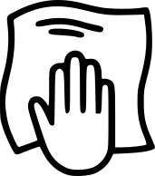

# Introduction

Welcome to the Candy Monster!

Congratulations on your new Candy Monster automated vending machine! This state-of-the-art machine is designed to provide a fun and engaging experience for customers while offering a reliable and efficient vending solution for your business. With its user-friendly touchscreen interface, diverse candy selection, and captivating delivery system, the Candy Monster is sure to be a hit.

This manual will guide you through the setup, operation, and maintenance of your Candy Monster. Please read it thoroughly to ensure safe and optimal performance.

## Brief Overview

The Candy Monster is an innovative and user-friendly vending machine designed to effortlessly dispense delicious candy with minimal effort from the user. This machine combines cutting-edge technology with engaging visual design to create an exciting candy purchasing experience. Here's a glimpse into its features:

|  | **Simple-Touch Operation** The machine boasts a user-friendly interface with intuitive controls. With just a single touch, users can initiate the candy selection and dispensing process, eliminating the need for complex manual adjustments. |
| :-----: | :----- |
|  | **Easy Cleaning** The machine's detachable parts are designed for easy cleaning and maintenance. This feature ensures that the machine can be kept in optimal working condition with minimal effort. |
|  | **Safety Features** The Candy Monster prioritizes user safety. It includes features such as an automatic collection door with sensors to prevent injuries during product retrieval. |