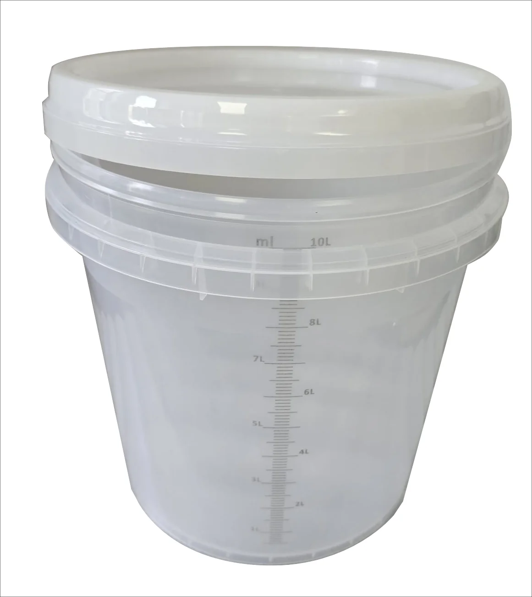
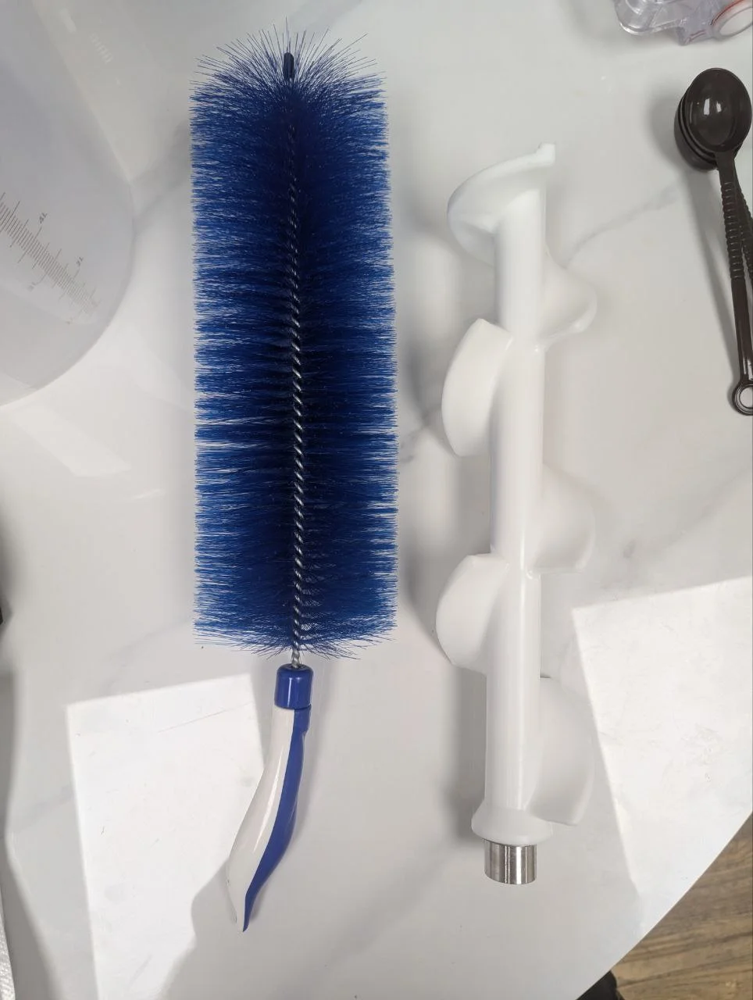

# Maintenance

Proper maintenance is critical for the Robo Ice Cream F2's food safety, functionality, and regulatory compliance. The F2 model features **dual hoppers** that must both be maintained according to the same rigorous schedule, with a **200-cup capacity** requiring frequent monitoring.

**Important**: Only trained staff should perform internal cleaning. Always shut off ice cream-related systems before starting using the main I/O switch. Never leave mix in hoppers longer than 3 days.

---

## Daily Cleaning Procedures

Perform these tasks at the end of each operating day:

#### External Cleaning
• **Wipe down machine exterior** and touch interface 
• **Sanitize touchscreen** and collection door area using food-safe sanitizer 
• **Clean viewing window** with soft, damp cloth 
• **Inspect** all customer contact points for residue or wear

#### Operational Checks
• **Check mix expiration labels** on both hoppers 
• **Verify hopper fill levels** for both Hopper A and Hopper B 
• **Inspect cup dispenser** for debris or blockages (200-cup capacity requires regular monitoring) 
• **Check topping bins and syrup lines** for residue or debris 
• **Empty drip tray** if needed 
• **Check for error messages** on both hopper systems

#### Safety Verification
• Ensure UV sanitizer area is clear of debris 
• Verify collection door closes properly 
• Check that no mix has leaked onto internal surfaces

#### Documentation
• Update cleaning log with daily tasks 
• Record any maintenance issues 
• Note inventory levels for planning

---

## 3-Day Deep Cleaning (Both Hoppers)

**Required every 3 days maximum** - sooner if mix has expired. Both hoppers must be cleaned simultaneously to maintain consistency.

Pre-Cleaning Safety

**Power Down**: Turn off the **Main I/O Power Switch**

**Leave Breaker ON** if backend access is needed for testing

### Step-by-Step Dual Hopper Cleaning

Empty Both Hoppers

• Manually drain mix from **both Hopper A and Hopper B** 
• Run **Thaw Fresh** + **Manual Discharge** on each hopper to flush residues 
• Ensure complete drainage from both systems

Water Flush System

• Fill **both hoppers** with warm water simultaneously 
• Run **Auto Discharge** multiple times on each hopper until water runs clear 
• Check that both dispensing lines are fully flushed

Sanitize Both Hoppers

• Add food-safe sanitizer to **each hopper** (dairy-approved sanitizer required) 
• Run sanitizer cycle for 1-2 cycles on both hoppers 
• Drain sanitizer from both systems completely

Clean Dispensing Nozzles

• Wipe **all ice cream nozzles** (both hopper lines) with sanitized cloth 
• Clean **syrup and topping nozzles** thoroughly 
• Use included brushes for narrow dispensing points

UV Zone & Door Area

• Wipe down dispensing door and UV sanitization zone with soft cloth 
• Avoid alcohol or abrasive cleaners 
• Ensure UV lamp housing is clean and unobstructed

Final Surface Cleaning

• Wipe down touchscreen, frame, and outer panels 
• Clean internal collection area thoroughly 
• Verify all surfaces are dry before refilling

---

## Weekly Maintenance Tasks

Perform these comprehensive maintenance tasks weekly:

Syrup Line Maintenance

• Disconnect syrup bags and flush lines with warm water 
• Use **Test Syrup 1-3** functions to verify line cleanliness 
• Reconnect and test dispensing accuracy

Topping System Cleaning

• Remove and empty all topping hoppers 
• Wash with mild soap and warm water 
• **Dry completely** before reinstalling to prevent clumping 
• Refill with fresh toppings

System Function Testing

• **Cup Sensor Test**: Insert cup manually, confirm door stays open 
• **Door Auto-Close Test**: Remove cup, ensure door closes automatically 
• **Cup Dropper Test**: Run **Manual Drop Cup** from backend interface 
• Check for jams or misalignment in 200-cup dispensing system

UV Lamp Inspection

• Use backend to activate UV lamp 
• Verify proper illumination 
• Replace if not lighting (see troubleshooting section)

Dual Hopper System Check

• Test temperature sensors in both hoppers 
• Verify automatic temperature cutoff (41°F/5°C maximum) 
• Check mix level sensors for accuracy

---

## Cleaning Supplies and Safety

#### Approved Cleaning Agents
• **Food-safe sanitizers** approved for dairy machines only 
• **Warm water** and neutral detergents 
• **Food-grade sanitizers** for hopper cleaning

#### Prohibited Substances
• Harsh or corrosive chemicals 
• Metal tools or hard brushes 
• Alcohol-based cleaners near UV components 
• Concentrated cleaning products that may corrode surfaces

#### Safety Guidelines
• Use separate tools for food-contact areas and waste zones to prevent cross-contamination 
• Never use expired cleaning solutions 
• Wear appropriate protective equipment 
• Ensure proper ventilation during cleaning

#### Cross-Contamination Prevention
• Clean Hopper A and Hopper B systems separately to prevent flavor mixing 
• Use designated cleaning tools for each hopper system 
• Label cleaning supplies to maintain separation

---

## Maintenance Logs and Compliance

### Required Documentation
Operators must maintain visible cleaning logs onsite including:

- **Task performed** (specify which hopper when applicable)
- **Date and time** of completion
- **Operator initials** and signature
- **Mix expiration dates** for both hoppers
- **Cleaning agent used** and concentration

### Regulatory Compliance
- Logs support NAMA compliance requirements
- Documentation must be available for health inspections
- Track upcoming cleaning due dates systematically
- Maintain records for minimum required retention period

### Digital Tracking
- Record each cleaning and refill of ice cream mix (both hoppers)
- Log syrup container maintenance
- Document topping container cleaning
- Track 200-cup dispenser performance and refill cycles

---

## Mix Management (Dual Hopper System)

### F2 Dual Hopper Requirements
- **Shelf life**: 3-4 days maximum after mixing (both hoppers)
- **Storage**: Keep unmixed packets in cool, dry place
- **Mixing ratio**: Always 3L water to 1 packet for each hopper
- **Temperature**: Use room temperature water for mixing
- **Capacity**: Each hopper serves 100 cups (200 total capacity)

### Expiration Management
- **3-day rule**: Mix must be discarded after 3 days in either hopper
- **Temperature monitoring**: Automatic shutoff at 41°F (5°C) for both hoppers
- **Visual inspection**: Check for any discoloration or separation in both hoppers
- **Cross-contamination prevention**: Never mix expired product with fresh mix

### Ice Cream Mix Preparation Steps

10-liter measuring bucket with graduated markings for mixing ice cream preparations

  
  

Step 1: Measure 3L water | Step 2: Add gelato packet

Step 3: Mix thoroughly

### Cleaning Supplies

Essential cleaning supplies: bottle brush, whisk, and cleaning cloths for maintenance

### Airpath System Maintenance

**IMPORTANT:** The airpath component controls air flow in the hopper system. The top opening must never be covered or blocked for proper operation.

Top view - Keep this opening clear

Proper installation in hopper

Default position: 2nd notch

Specialized cleaning brush for agitator shaft

<h3>Check Airpath Position</h3>
Verify the airpath is set to the 2nd notch (default position) for optimal air flow.

<h3>Clean Agitator Shaft</h3>
Use the blue spiral brush to thoroughly clean the agitator shaft during maintenance.

<h3>Maintain Clear Airflow</h3>
Ensure the top opening of the airpath remains unobstructed at all times.

---

## Installation Precautions

Initial Setup Safety

**Inspect upon delivery**: Check machine body, glass, and wheels for damage

**Transport upright**: Allow 2+ hours to settle before connecting power

**Professional installation**: Due to steel construction, use qualified personnel

**Level surface required**: Maximum 5% inclination (2°) on all sides

#### Environmental Requirements
• **Moisture protection**: Prevent electrical shorts and circuit board damage 
• **Ventilation clearance**: 40cm rear clearance, 20cm between multiple machines 
• **Door clearance**: Ensure 135° opening for loading access 
• **Temperature control**: Avoid direct heat sources for optimal refrigeration

#### Electrical Safety
• **Grounded power**: 220V mains with proper grounding (resistance <4Ω) 
• **Accessible disconnect**: Power socket in easily accessible location 
• **Cord inspection**: Replace damaged power cords immediately through qualified service 
• **Emergency procedures**: Know location of emergency power disconnect

#### Dual Hopper Considerations
• Ensure both hopper systems have adequate power supply 
• Verify temperature monitoring for both chambers 
• Test emergency shutoff procedures for both hoppers 
• Confirm proper drainage for both systems

#### Safety Verification
• Check all safety interlocks function properly 
• Verify emergency stop accessibility 
• Test ground fault protection 
• Confirm proper signage placement

---

## Preventive Maintenance

#### Monthly Tasks
• Check refrigeration system performance for both hoppers 
• Inspect door alignment and seals 
• Test all payment systems 
• Verify UV lamp operation 
• Check for software updates 
• Monitor 200-cup dispenser mechanism

#### Quarterly Tasks
• Professional deep cleaning recommended for dual hopper system 
• Refrigeration system service for both chambers 
• Calibrate portion controls for each hopper 
• Replace worn components 
• Comprehensive dual hopper performance testing

## Parts Replacement

Common wear items for F2 dual hopper system:
- Door seals
- Dispensing nozzles (both hopper lines)
- UV lamp (annual)
- Cup sensor alignment
- Dual hopper temperature sensors

---

## Cleaning Tips

- Always use **food-safe sanitizer** approved for dairy machines
- Never use metal tools or hard brushes inside the machine
- Leave hoppers **dry and open** after cleaning to prevent odor and mold
- Keep detailed **cleaning logs** for compliance and inspection readiness
- Clean both hoppers simultaneously to maintain system consistency
- Monitor 200-cup dispenser regularly to prevent jams
- Replace cleaning supplies before expiration dates

*After cleaning, refill both hoppers using the proper mix preparation process outlined in the Operation section.*

For parts ordering: parts@sweetrobo.com

