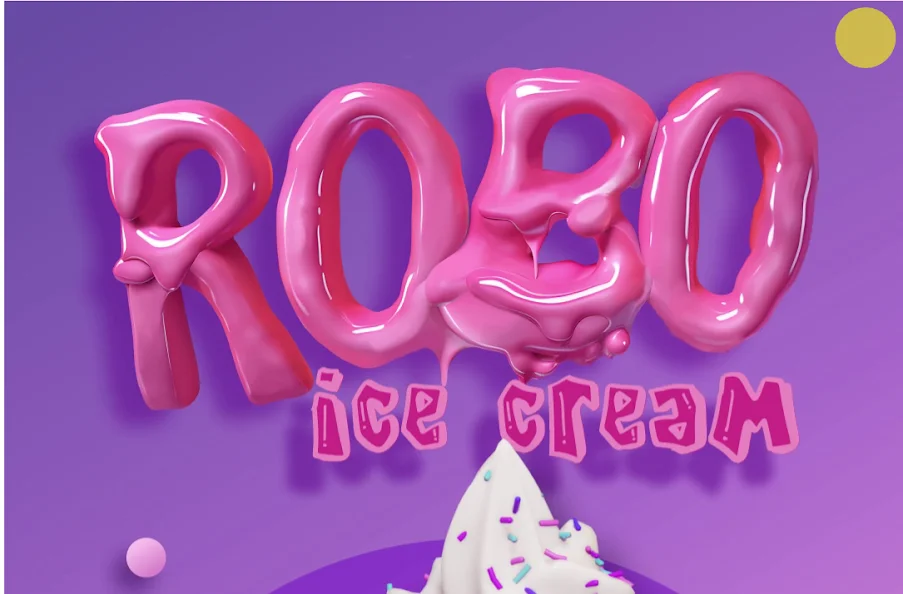
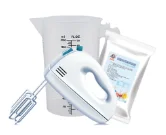
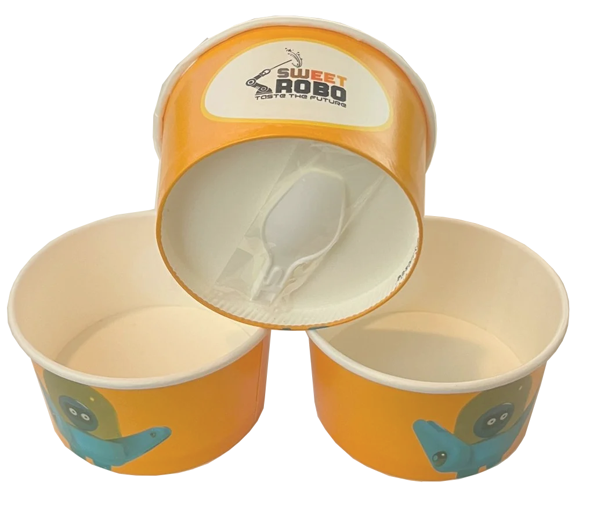

# Operation Guide

The Robo Ice Cream F2 features **dual hoppers** enabling customers to enjoy two distinct flavors simultaneously or create exciting swirl combinations. This guide covers customer operation, operator management, and the unique dual-flavor capabilities of the F2 system.

## F2 Dual-Flavor System Overview

#### Left Hopper
Primary flavor (chocolate, vanilla, etc.) with independent temperature control.

#### Right Hopper
Secondary flavor (strawberry, mint, etc.) with independent temperature control.

#### Swirl Mode
Combines both flavors for unique taste experiences with precision timing.

#### Temperature Control
Each hopper maintains optimal serving temperature independently.

## Daily Startup Procedure

Check Machine Status

• Verify power is on 
• Check <strong>L: and R:</strong> temperature displays (should show 100% when ready) 
• Ensure both hoppers are at serving temperature 
• Verify all doors are closed properly

Verify Dual-Hopper Supplies

• Check ice cream mix levels in <strong>both hoppers</strong> (minimum 2L per hopper) 
• Ensure different flavors are properly loaded in Left and Right hoppers 
• Check cup inventory in all 4 tubes 
• Verify syrup levels for flavor enhancement 
• Check topping levels for complete customization

Backend Access and System Check

• Tap and hold top-right corner for 3-5 seconds 
• Enter password: 123456 
• Check system status for both hoppers 
• Verify no alerts for either Left or Right systems

## Customer Operation - F2 Dual-Flavor Experience

The F2 provides customers with exciting flavor options through its dual-hopper system:

### Flavor Selection Process

Primary Selection Screen

Customer approaches the intuitive touchscreen interface. Machine displays available flavor combinations: 
• <strong>Left Flavor Only</strong>: Single flavor from left hopper 
• <strong>Right Flavor Only</strong>: Single flavor from right hopper 
• <strong>Swirl Combination</strong>: Both flavors blended together

Enhanced Customization

• Customer selects preferred size 
• Choose from multiple syrup options (1-3 available) 
• Add dry toppings for additional texture (1-3 available) 
• Preview final product combination

Payment and Dispensing

Customer completes payment via cash, coin, or card. F2 automatically executes the dual-flavor process: 
• Drops cup into position 
• Dispenses ice cream from selected hopper(s) 
• <strong>Swirl Mode</strong>: Alternates between left and right hoppers 
• Adds selected syrups in sequence 
• Applies chosen toppings 
• Opens collection door for pickup

## Operator Interface and Backend Management

### Accessing Backend Settings

To access the comprehensive operator interface:

Initiating Login

• Tap the screen in the <strong>top right corner 6+ times</strong> 
• Enter operator password when prompted 
• Default password: '123456' (should be changed for security)

Left: Tap and hold top-right corner | Right: Enter default password 123456

**SECURITY WARNING:** For security reasons, change the default password under Device Settings

### Management Interface Overview

*Main management screen showing device information and system controls*

The management screen provides access to six key sections:

Parameter Settings

Control temperature, timing, and dual-hopper dispense parameters

Stock Settings

Monitor and update inventory for both hoppers, cups, syrups, and toppings

Device Testing

Manually test components and perform cleaning functions

Opening Hours

Schedule vending availability based on business hours

System Settings

Configure system behavior (volume, voice, network, etc.)

Shopping Settings

Configure payment methods, timeout behavior, and alerts

### Parameter Settings - F2 Dual-Hopper Controls

Critical settings for optimal F2 operation:

**Hopper-Specific Parameters:**

| **Parameter** | **Default** | **Description** |
|:-----:|:-----:|:-----:|
| L/R Gear Position | 4 | Controls ice cream firmness for each hopper |
| L/R Discharge Time | 1.3s | Individual dispense timing per hopper |
| L/R Pre-cooling Temp | 4°C | Maintains optimal temperature per hopper |
| L/R Discharge Threshold (%) | 70% | Minimum mix % required per hopper |

**Dual-Flavor Timing:**

| **Function** | **Default** | **Description** |
|:-----:|:-----:|:-----:|
| Swirl Alternation Time | 500ms | Time between hopper switches in swirl mode |
| Syrup Dispense Time | 1500ms | Time per syrup application |
| Sprinkle Time | 2000ms | Time per dry topping |

### Stock Settings - Dual-Hopper Management

Monitor and manage inventory for both hoppers independently:

- **Cup Count**: Manually update remaining cups across all 4 tubes
- **Ice Cream Mix (Left)**: Status: Adequate / Low / Empty for left hopper
- **Ice Cream Mix (Right)**: Status: Adequate / Low / Empty for right hopper  
- **Syrups 1–3**: Update or clear individual syrup stock levels
- **Toppings 1–3**: Update or clear individual dry topping stock levels

**Important:** Use "Fill Up" to mark an item as fully restocked 
Use "Clean Up" to clear stock status and remove from customer selection

### Device Testing - Component Control

The F2 provides comprehensive testing capabilities for dual-hopper operation:

#### Cooling System Controls
• **Cooling (Left / Right)**: Activates cooling compressor for selected hopper 
• **Thaw Fresh (Left / Right)**: Warms freezing chamber for cleaning 
• **Keep Fresh (Left / Right)**: Maintains mix freshness without freezing

#### Ice Cream Dispensing
• **Manual Discharge (L / M / R)**: Manual control for Left, Middle (swirl), or Right 
• **Auto Discharge**: Automatic dispensing with preset timing 
• **Close Controls**: Individual close functions per dispenser

#### Additional Testing
• **Cup Holder**: Reset and manual cup drop functions 
• **Syrup Testing**: Test individual syrup lines (1-3) 
• **Topping Testing**: Test individual topping dispensers (1-3)

#### System Controls
• **UV Sanitizer**: Manual UV lamp control 
• **Door Controls**: Lock/unlock and raise/lower collection door 
• **System Reset**: Full system restart options

## Ice Cream Mix Preparation - F2 Dual-Hopper System

### Preparing Powder-Based Mix

For optimal F2 operation, prepare mix for each hopper independently:

**Required Tools:**
- Mixing bucket (at least 5L capacity)
- Food-safe electric mixer or whisk
- Clean stirring rod
- Fresh drinking-grade water

Required tools for preparing ice cream mix

Preparation Instructions:

<strong>Prepare Water Base</strong> 
• Pour <strong>4 liters of fresh water</strong> into clean mixing bucket 
• Ensure bucket is sanitized and dry before use

<strong>Add Ice Cream Powder</strong> 
• Slowly pour <strong>one full 1.5 kg bag</strong> of powder into water 
• Allow brief settling time for initial dissolution

<strong>Mix Thoroughly</strong> 
• Use mixer to stir solution for <strong>2–3 minutes</strong> 
• Ensure slurry is smooth and clump-free 
• Avoid over-mixing to prevent excess foaming

<strong>Transfer to Hopper</strong> 
• Slowly pour mixed slurry into designated hopper (Left or Right) 
• Avoid splashing or overfilling 
• Keep hopper lids closed after refilling

<strong>Quality Check</strong> 
• Light foam layer above liquid is normal 
• Gently stir with clean rod if excess foam develops 
• Verify proper consistency before operation

Left: Adding powder to water | Right: Proper mixing technique

Transferring prepared mix to hopper

### F2 Dual-Hopper Fill Guidelines

**Initial Setup:**
- For new startups or after full cleaning, add **at least 2 full bags per hopper** (6 kg total powder to 16 L water)
- This ensures both hoppers are properly primed for dual-flavor operation

**Ongoing Refills:**
- Maintain minimum 2L in each hopper for consistent operation
- Stir remaining mix before refilling to prevent settling
- Alternate hopper refills to maintain continuous dual-flavor availability

**Flavor Management:**
- Use different flavors in each hopper for maximum customer choice
- Popular combinations: Vanilla (Left) + Chocolate (Right)
- Consider seasonal flavors: Vanilla (Left) + Strawberry (Right)

**WARNING:** Always sanitize all equipment between flavor changes to prevent cross-contamination

## Temperature Monitoring - Dual-Hopper System

The F2's dual display system shows individual hopper status:

- **L: 100%** = Left hopper at optimal serving temperature
- **R: 100%** = Right hopper at optimal serving temperature  
- **Lower percentages** = Cooling in progress for that hopper
- **Alert conditions** = Temperature issues requiring attention

Both hoppers must reach 100% for full dual-flavor operation. Single-hopper operation possible if one hopper is offline.

## Managing Dual Flavors During Operation

### Flavor Rotation Strategy

To maximize customer satisfaction and manage inventory:

#### Popular Combinations
• Vanilla + Chocolate (classic appeal) 
• Vanilla + Strawberry (fruit combination) 
• Chocolate + Mint (premium experience)

#### Seasonal Considerations
• Summer: Light flavors (vanilla, strawberry) 
• Winter: Rich flavors (chocolate, caramel) 
• Holidays: Themed combinations

#### Inventory Management
• Monitor consumption rates per hopper 
• Adjust mix preparation based on customer preferences 
• Track swirl vs. single-flavor selections

#### Customer Analytics
• Track most popular flavor combinations 
• Identify peak usage times per flavor 
• Optimize mix preparation schedules

### Refilling During Operation

Ice Cream Mix - Dual-Hopper Process:

Check which hopper requires refilling (L: or R: display)

Prepare mix according to instructions above

Open specific hopper lid carefully

Add prepared mix without disturbing other hopper

Verify minimum 2L level maintained in both hoppers

Close lid securely and verify temperature recovery

**Coordinated Refilling:**
- Plan refills during low-traffic periods
- Never refill both hoppers simultaneously
- Maintain at least one hopper operational during refills

*Orange Sweet Robo branded ice cream serving cups used by the F2 machine*

### Syrups & Toppings for F2

The F2's enhanced customization options include:
- **3 Syrup Options**: Chocolate, strawberry, caramel (typical)
- **3 Topping Options**: Sprinkles, nuts, chocolate chips (typical)
- **Flavor Pairing**: Certain syrups complement specific hopper flavors

Replace syrup bags and refill topping containers as needed, using only approved products that complement the dual-flavor system.

## Settings and Configuration

#### Opening Hours Management
• Set daily operational hours (24-hour format) 
• Machine automatically powers down outside scheduled hours 
• Coordinate with dual-hopper cooling cycles for energy efficiency

#### System Settings
• **Volume Control**: Adjust for different time periods 
• **Voice Prompts**: Enable promotional guidance for dual-flavor options 
• **Network Configuration**: Maintain connection for sales reporting 
• **Error Logging**: Monitor dual-hopper system performance

#### Shopping Settings
Configure customer experience for dual-flavor purchasing: 
• **Payment Methods**: Enable cash, coin, and card acceptance 
• **Timeout Settings**: Manage customer interaction time 
• **Change Management**: Configure coin dispenser operation

#### Advanced Configuration
• **Language Selection**: Multiple language support 
• **Currency Settings**: Local currency configuration 
• **Receipt Options**: Digital or printed receipts 
• **Promotional Settings**: Special offers and discounts

## Daily Shutdown - F2 Protocol

Record Sales Data

• Note final sales figures for both flavors 
• Track swirl vs. single-flavor preferences 
• Monitor individual hopper performance

Inventory Assessment

• Check and record mix levels in both hoppers 
• Note consumption rates per flavor 
• Plan next day's flavor selection

System Maintenance

• Wipe down exterior surfaces 
• Ensure both hopper lids are secured 
• Verify collection door is properly closed

Overnight Operation

• Leave power on for temperature maintenance 
• Both hoppers maintain optimal overnight cooling 
• UV sanitizer continues automated cycles

## Important F2 Operating Notes

### Dual-Hopper Best Practices
- **Never turn off hopper switches** during operation
- **Maintain minimum 2L mix** in each hopper independently  
- **Monitor both L: and R: temperatures** continuously
- **Plan flavor combinations** based on customer preferences

### Safety Considerations
- **Independent cooling systems** allow single-hopper operation if needed
- **Automatic cleaning cycles** maintain hygiene in both hoppers
- **UV sanitizer** activates between all servings regardless of flavor selection
- **Temperature alarms** alert operators to hopper-specific issues

### Quality Assurance
- **Monitor expiration dates** on mix for both hoppers
- **Track flavor popularity** to optimize inventory
- **Regular taste testing** ensures quality from both hoppers
- **Customer feedback** helps refine dual-flavor offerings

The F2's dual-hopper system represents the pinnacle of automated ice cream vending, providing customers with unprecedented flavor variety while maintaining the reliability and ease of operation that Sweet Robo is known for.

