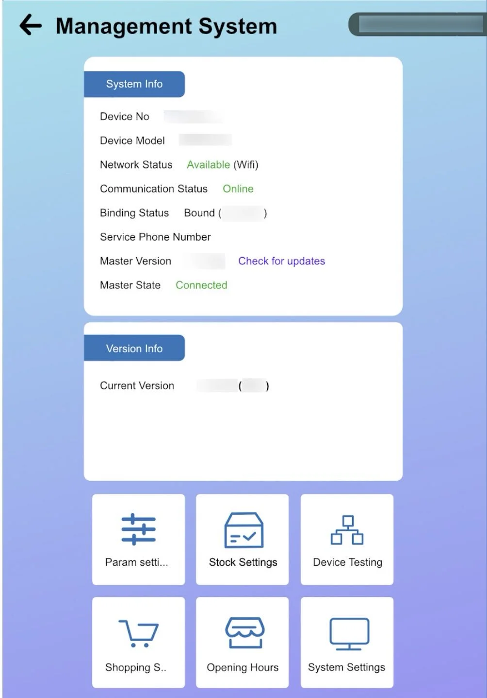

# Operation Guide

## Daily Startup Procedure

1. **Check Machine Status**
   - Verify power is on
   - Check L: and R: temperature displays (should show 100% when ready)
   - Ensure all doors are closed properly

2. **Verify Supplies**
   - Check ice cream mix levels (minimum 2L per hopper)
   - Check cup inventory in all 4 tubes
   - Verify syrup levels
   - Check topping levels

3. **Backend Access**
   - Tap and hold top-right corner for 3-5 seconds
   - Enter password: 123456
   - Check system status and alerts

## Customer Operation

The machine operates automatically once a customer makes a selection:

1. Customer selects flavor (Left, Right, or Swirl)
2. Customer selects toppings (optional)
3. Customer makes payment
4. Machine automatically:
   - Drops cup
   - Dispenses ice cream
   - Adds selected syrups/toppings
   - Opens door for pickup

## Backend Management

### Accessing Backend Settings
- Tap and hold top-right corner of screen
- Default password: 123456 (can be changed)

*Tap and hold the top-right corner of the touchscreen for 3-5 seconds*

*Enter the default password 123456 to access backend settings*

*Main management screen showing various system options*

### Key Backend Functions
- **Device Testing**: Test individual components
- **Stock Settings**: Update inventory levels
- **Parameter Settings**: Adjust machine operations
- **Product Management**: Change prices and options
- **Statistics**: View sales and usage data

## Temperature Monitoring

- **L: 100%** = Left hopper at serving temperature
- **R: 100%** = Right hopper at serving temperature
- Lower percentages indicate cooling in progress

## Refilling During Operation

### Ice Cream Mix
1. Open hopper lid
2. Add prepared mix (3L water + 1 packet)
3. Never let level drop below 2L
4. Close lid securely

### Cups
1. Open cabinet door
2. Lift cup holder lid
3. Add cups to tubes needing refill
4. Ensure proper alignment

*Orange Sweet Robo branded ice cream serving cups used by the machine*

### Syrups & Toppings
- Replace syrup bags when empty
- Refill topping containers as needed
- Only use approved products

## Daily Shutdown

1. Note final sales figures
2. Check and record mix levels
3. Wipe down exterior surfaces
4. Ensure doors are closed
5. Leave power on (machine maintains temperature overnight)

## Important Operating Notes

- Never turn off hopper switches during operation
- Maintain minimum 2L mix in each hopper
- Machine automatically runs cleaning cycles
- UV sanitizer activates between servings
- Monitor expiration dates on mix