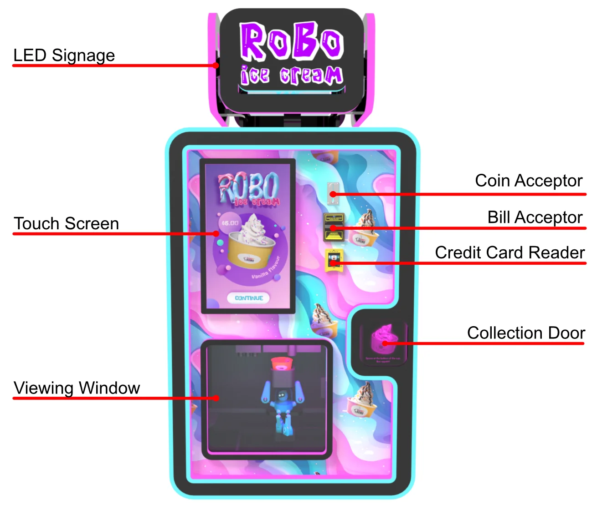
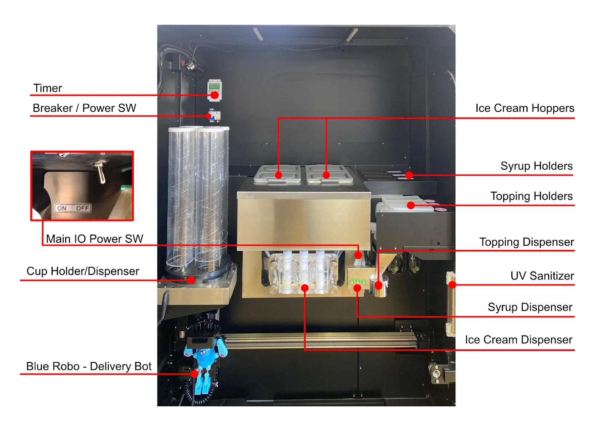

# Overview

## About the Robo Ice Cream F2

The Robo Ice Cream F2 is a fully automated soft-serve ice cream vending machine manufactured by Sweet Robo. This commercial-grade machine offers dual-flavor capability with automated dispensing, topping options, and integrated payment systems.

## Key Features

- **Dual Flavor System**: Two 12L hoppers for serving two distinct flavors plus swirl combination
- **Automated Operation**: Complete hands-free dispensing from order to delivery
- **Multiple Toppings**: 3 syrup dispensers and 3 dry topping dispensers
- **Integrated Payment**: Accepts coins, bills, and card payments
- **UV Sanitization**: Built-in UV lamp for automatic nozzle sanitization
- **Remote Management**: WiFi-enabled for remote monitoring and control
- **Large Capacity**: Holds 200 cups (4 tubes × 50 cups each)

## Technical Specifications

### Electrical & Power Requirements
- **Power Supply**: 220V
- **Rated Current**: 13A @ 220V
- **Max Power Consumption**: 2,860W

⚠️ **Important**: F2 requires a 220V power supply. It is not directly compatible with 110V circuits, but can be connected using a properly rated transformer and a dedicated power line capable of supporting the required amperage.

### Physical Specifications
- **Width**: 87 cm (34.3 in)
- **Depth**: 120 cm (47.2 in)
- **Height**: 245 cm (96.5 in)
- **Weight (Empty)**: 380 kg
- **Operational Temperature Range**: 10°C – 35°C (50°F – 95°F)
- **Relative Humidity Tolerance**: < 80% RH (non-condensing)

### Capacity
- **Ice Cream Hoppers**: 2 × 12L (dual flavor capability)
- **Minimum Mix per Hopper**: 2L
- **Cup Storage**: 200 cups (50 × 4 holders)
- **Syrup Dispensers**: 3 (liquid syrups only)
- **Topping Dispensers**: 3 × 270g each (dry toppings only)

### System Components

1. **Refrigeration System**
   - Compressor-based cooling
   - Pre-cooling tank
   - Independent temperature control for each hopper
   - Cool-down time: 5-10 minutes

2. **Dispensing System**
   - Rotary auger mechanism
   - Automated portion control
   - Anti-drip design

3. **Control System**
   - Android-based operating system
   - Touchscreen interface
   - Backend management system
   - Remote access capability

4. **Payment Systems**
   - Coin acceptor
   - Bill acceptor
   - Card reader (Nayax compatible)
   - Contactless payment support

### External Components

*External view showing LED signage, touchscreen, viewing window, coin acceptor, bill acceptor, credit card reader, and collection door*

### Internal Components (F2 Dual-Hopper System)

*Internal view showing the F2's dual ice cream hoppers, syrup holders, topping dispensers, UV sanitizer, timer, breaker, power switches, cup holder dispenser, and Blue Robo delivery bot*

## Installation Requirements

### Space Requirements
- Minimum clearance: 30cm on all sides
- Door swing clearance: 120cm front
- Level, stable surface required
- Indoor installation recommended

### Electrical Requirements
- Dedicated 220V circuit
- 20A circuit breaker minimum
- Proper grounding required
- Surge protection recommended

### Environmental Requirements
- Temperature: 10°C – 35°C (50°F – 95°F)
- Humidity: < 80% RH
- Protected from direct sunlight
- Adequate ventilation

## What's Included

- Robo Ice Cream F2 main unit
- 4 LED light panels (optional installation)
- Power cord
- Operation manual (this document)
- Initial startup supplies:
  - Sample ice cream mix packets
  - Cleaning supplies
  - 200 cups

## Model Comparison

| Feature | F1 | F2 |
|---------|----|----|
| Flavors | 1 | 2 + swirl |
| Hopper Capacity | 1 × 12L | 2 × 12L |
| Cup Capacity | 100 | 200 |
| Width | 83cm | 87cm |
| Weight | 350kg | 380kg |
| Power Requirement | 110V/220V | 220V only |