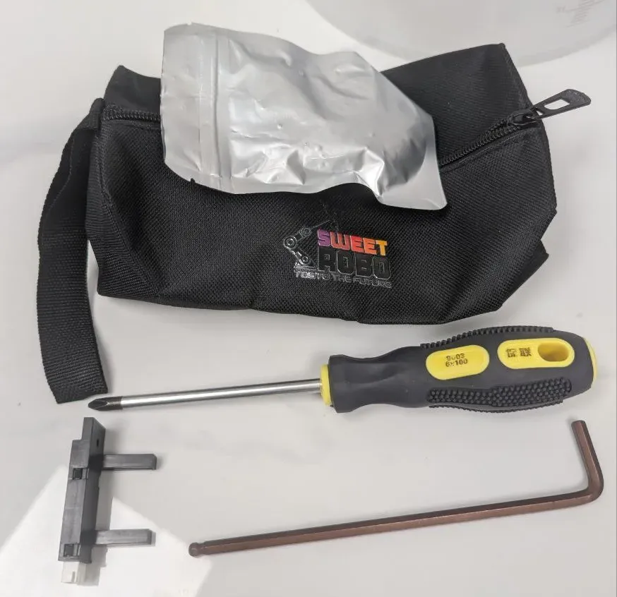
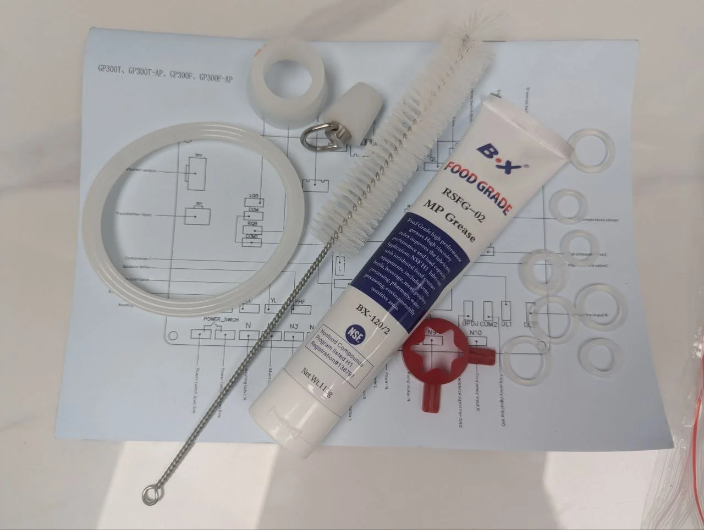

# Parts & Service

## Common Replacement Parts

#### Consumables
• Ice cream mix packets (Sweet Robo brand recommended) 
• Cups (50 per tube, 200 total capacity) 
• Syrup bags (liquid only) 
• Dry toppings (270g max per container) 
• Cleaning supplies (food-grade sanitizer)

#### Electrical Components
• Control Board: F2-CB-001 
• Touch Screen: F2-TS-001 
• Temperature Sensors: F2-TEMP-001 
• Payment Module: F2-PAY-001

### Wear Parts

| Part | Part Number | Replacement Interval |
|------|-------------|---------------------|
| UV Lamp | F2-UV-001 | Annual |
| Door Seals | F2-SEAL-001 | 2 years |
| Dispensing Nozzles | F2-NOZ-001 | As needed |
| Cup Drop Sensor | F2-SENS-001 | As needed |
| Hopper Gaskets | F2-GASX-002 | 2 years |

## Service Tools & Equipment

<h4>Digital Multimeter</h4>
Essential for electrical diagnostics. Measures voltage, current, and resistance. Can test up to 600V AC.

<h4>Installation Tool Kit</h4>
Includes Phillips screwdriver, hex keys, spare sensors, and Sweet Robo branded tool bag.

<h4>Comprehensive Spare Parts Kit</h4>
Food-grade MP grease (NSF approved), O-rings, gaskets, tubing, cleaning brush, and technical diagrams.

<h4>Dispenser Seal Kit</h4>
Complete seal replacement kit with clear housing, white shaft, orange O-rings, and gaskets.

Dispenser seal kit shown from multiple angles for proper assembly

## Ordering Parts

How to Order

Email: parts@sweetrobo.com

Phone: +1 (844) 793-3872

Include: 
• Machine model (F2) 
• Serial number 
• Part number or description 
• Quantity needed

### Expedited Shipping
- Standard: 5-7 business days
- Express: 2-3 business days
- Overnight available for critical parts

## Service Support

#### Technical Support
• **Hours**: Monday-Friday, 9AM-5PM EST 
• **Phone**: +1 (844) 793-3872 
• **Email**: support@sweetrobo.com 
• **Response Time**: Within 24 hours

#### Remote Support
Many issues can be resolved remotely: 
• Software updates 
• Configuration changes 
• Diagnostic checks 
• Price adjustments

**Required for remote support**:
- Machine ID (found in backend settings)
- Internet connection
- Current issue description

On-Site Service

Contact support for initial diagnosis

Schedule service appointment

Prepare machine area for technician access

Have purchase/warranty information ready

## Warranty Service

#### What's Covered
• Manufacturing defects 
• Component failures under normal use 
• Parts and labor (first year)

#### What's Not Covered
• Damage from misuse 
• Consumable items 
• Shipping damage 
• Unauthorized modifications

Warranty Claims

Contact support with issue description

Provide serial number and purchase date

Follow troubleshooting steps

Receive RMA if needed

## Preventive Service Plans

#### Basic Plan
• Annual inspection 
• Software updates 
• Phone support priority

#### Premium Plan
• Quarterly maintenance 
• Parts discount 
• Extended warranty option 
• Priority service

## Recommended Service Schedule

#### Annual Service
• Complete system inspection 
• Refrigeration performance test 
• Calibration check 
• Software updates 
• Replace UV lamp

#### Biannual Service
• Deep cleaning 
• Seal inspection 
• Mechanical adjustments 
• Performance optimization

## Emergency Service

For urgent issues:

Call emergency line: +1 (844) 793-3872

Have ready: 
• Machine serial number 
• Description of issue 
• Any error messages 
• Impact on operation

**Common Emergency Issues**:
- Refrigeration failure
- Complete power loss
- Payment system down
- Safety concerns

## Documentation

Keep these documents accessible:
- Purchase receipt
- Warranty certificate
- Service history
- This manual

Register your machine at: sweetrobo.com/register

