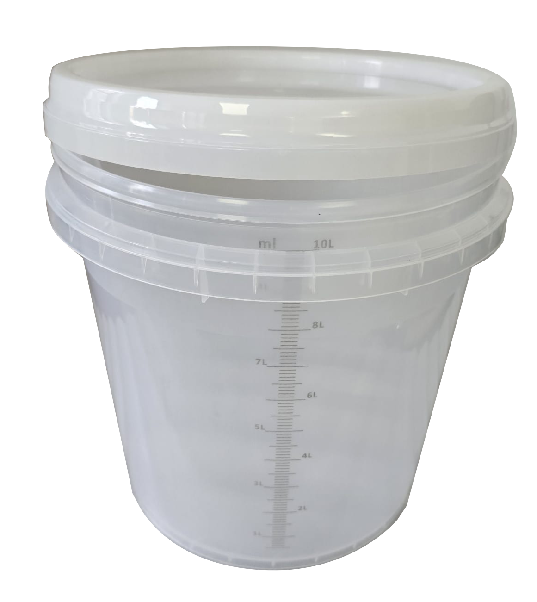
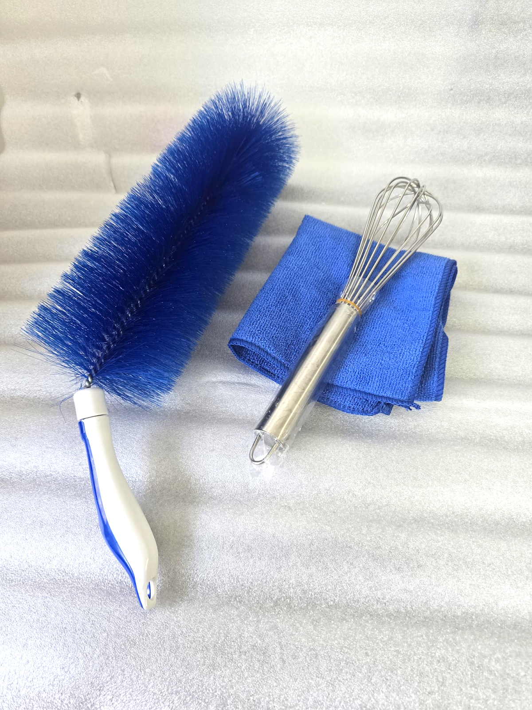
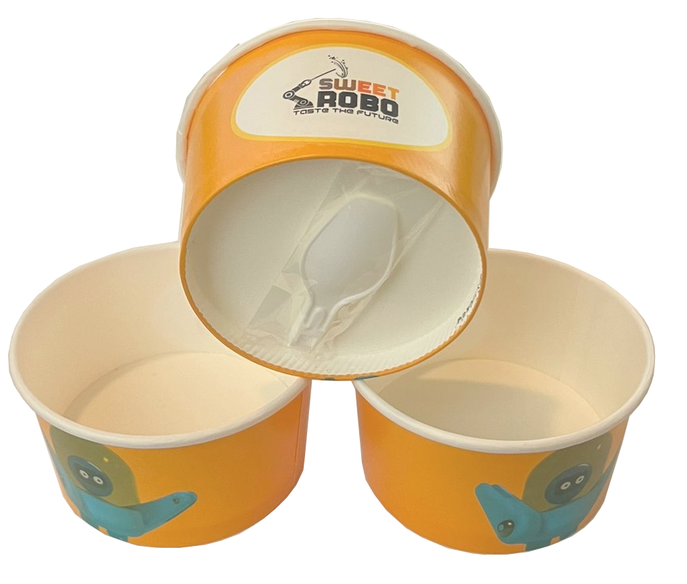

**5\. Unpacking and Installation**

Delivery and Inspection

Each Robo Ice Cream machine is packaged and factory-tested prior to shipment. Upon delivery, the operator or installer must complete the following steps **before connecting power or attempting operation**.

**Upon Receipt:**

1\.	Inspect the outer packaging for any visible damage.

2\.	Confirm the **Model**, **Serial Number**, and **Delivery Date**.

3\.	If damage or missing parts are discovered, contact **Sweet Robo support immediately**.

4\.	If damage is suspected, photograph the machine before unboxing to assist with claims.

⸻

Interior Inspection

Before powering on or installing accessories, open all access panels and inspect the interior:

•	Check for **loose parts, connectors, or tubing** that may have shifted during transit.

•	**Do not power on** the machine until all internal cables and moving components are visually verified to be in place and unobstructed.

•	Ensure no packaging materials (foam, tape, plastics, zip-ties) remain in mechanical areas such as the **cup holder assembly**, **door mechanism**, or **hopper outlets**.

•	If you have questions about any thing contact **Sweet Robo support.**

⸻

What’s Included

Your Robo Ice Cream shipment should include the following items:

•	**Robo Ice Cream Machine** (F1 or F2)

•	**Cup dispenser tubes**: 4 tubes

•	**Tool kit**: Screwdriver, mounting screws, hardware as needed

•	**Cleaning kit**: Mixing bucket and sanitizing tools

•	**Starter pack**: Paper cups with integrated spoons

•	**Power cord** (pre-installed or included separately depending on region)

•	**Printed guide** (this manual)

🔧 **Note:** Internal components such as hoppers, syrup lines, and topping containers are preinstalled at the factory. They do **not** need to be removed or repositioned unless otherwise instructed.

⚠️ **Before powering on**, verify that all internal areas are clear and nothing is obstructing motors, sensors, or mechanical parts.

⸻

Accessories

Some accessories/consumables may be packaged and stored inside the machine body. Please carefully disassemble and verify you have all that's needed and nothing is touching any moving parts before operating the machine.

| Mixing Bucket | Cleaning Tools and Supplies | Cups with Spoons | Sign |
| :-----: | :-----: | :-----: | :-----: |
|  |  |  |  |

⸻

Positioning Requirements

The machine must be installed on a stable, level surface in a clean, dry indoor environment.

**Minimum Clearance:**

| Location | Required Distance |
| :-----: | :-----: |
| Rear wall  | 50 cm (20 in) minimum  |
| Side-to-side  | 20 cm (8 in) minimum  |
| Front (door)  | Must open to 135°+  |

⸻

**Floor Requirements:**

•	Must support a weight of **at least 380 kg** (F2)

•	Surface must be hard (no soft mats or carpet)

•	Do not tilt, rock, or roll the machine once upright

•	Use proper equipment if repositioning

⸻

Power Preparation

**Robo Ice Cream F1:**

•	Connect to a grounded **110V or 220V** outlet (verify your unit’s voltage label before installation)

•	Requires a **dedicated 25A breaker** (30A recommended to allow for startup current and safety margin)

•	Do **not** share the circuit with other appliances

**Robo Ice Cream F2:**

•	Must be connected to a **dedicated 220V power source**

•	If only a 110V supply is available:

•	A **step-up transformer** can be used, but it must support:

•	**At least 2,860W continuous output**

•	A **dedicated 30A circuit** on the 110V input side (F2 draws \~26A at full load)

•	Proper grounding and isolation from other loads

•	Do **not** share the circuit with other appliances

⚠️ Using an undersized transformer or a shared circuit may result in **machine malfunction, tripped breakers, or permanent damage**. Always verify your power source before installation.

⸻

Hardware Timer Setup

The Robo Ice Cream machine includes a **physical hardware timer** that controls its daily operation hours. This timer:

•	Is located inside the cabinet

•	Must be configured manually using the physical buttons

•	Is independent of the software interface

Operators must program this timer according to the site’s business hours. Incorrect setup may prevent the machine from powering up at expected times.

⸻

Anchoring and Stabilization

•	Ensure all four adjustable feet are firmly on the ground

•	Tighten locking collars to prevent wobble

•	If required by local regulations or high-traffic environments, anchor the machine to the floor or a secured wall using optional mounting brackets (not included by default, contact Sweet Robo support for more information)

⸻

✅ **Post-Installation Checklist**

Use this checklist before turning on the machine for the first time:

✅ Power cord connected, but **breaker remains OFF**

✅ **Exterior and interior inspected** for damage or shipping issues

✅ **All packing materials removed** from inside the cabinet and moving parts

✅ **Cables, tubes, and connectors verified** to be secure

✅ **Cup dispenser tubes installed** (4 tubes)

✅ Cleaning tools and accessories stored safely

✅ **Ice cream hoppers flushed** before use (see Section 7: Startup & Loading)

✅ **Timer configured** for operating hours (see Section X: Timer Configuration)

✅ Machine placed with required clearance on all sides

✅ Door opens fully and operates smoothly

✅ Grounded power outlet confirmed and within spec

Once confirmed, proceed to **Section 6: Hardware Components** before powering on.