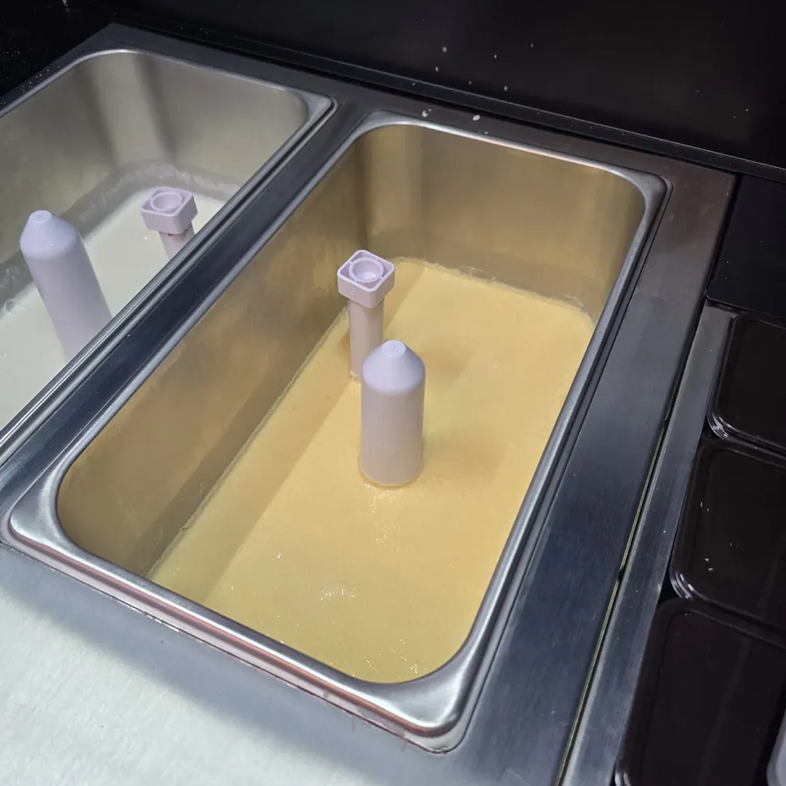

# Setup & Installation

## Pre-Installation Checklist

Before starting setup, ensure you have:
- F2 machine delivered and inspected for damage
- Required power supply: **220V dedicated circuit** (20A breaker minimum)
- All included accessories: tool kit, cleaning kit, cups, power cord
- Ice cream mix packets and 3 liters of water per hopper
- Syrups and toppings ready for installation

## Step 1: Unpacking and Initial Inspection

### 1.1 Exterior Inspection
- Check outer packaging for visible damage
- Verify Model (F2), Serial Number, and Delivery Date
- Photograph any damage before unboxing

*Cup dispenser installation inside the machine*

### 1.2 Interior Inspection
**⚠️ Important:** Do NOT power on the machine until this inspection is complete

- Open all cabinet doors
- Check for loose parts, connectors, or tubing that may have shifted during transit
- Remove ALL packaging materials (foam, tape, plastics, zip-ties) from:
  - Cup holder assembly
  - Door mechanism
  - Hopper outlets
  - Any mechanical areas
- Verify all internal cables and components are properly connected

*Hardware component assembly during setup*

*Ice cream hopper and dispenser setup configuration*

### 1.3 Positioning Requirements
- Place on stable, level surface that can support 380 kg
- Ensure minimum clearances:
  - Rear wall: 30 cm
  - Side clearance: 30 cm
  - Front: 120 cm (door swing clearance)
- Surface must be hard and level (no soft mats or carpet)

## Step 2: LED Panel Installation (Optional)

The F2 comes with 4 LED panels that can be installed on top. Installation is optional based on your preference.

**Note:** This must be done with the machine OFF

1. Locate the 4 LED panels and mounting hardware
2. Install the base mounting:
   - Attach 4 screws to secure the base
3. Connect panels together:
   - Use connection brackets to stabilize panels
   - Secure with provided screws and nuts
4. Wire connection:
   - Connect wires from panels to machine base
   - Match colors: **black to black, red to red**
5. Verify all connections are secure

## Step 3: Power Connection

### F2 Power Requirements:
- **220V dedicated power source required**
- 20A circuit breaker minimum
- Proper grounding essential
- Do NOT share circuit with other equipment

### If only 110V available:
**⚠️ Warning:** F2 is designed for 220V. Using 110V requires:
- Professional-grade step-up transformer
- Minimum 3,000W continuous output rating
- Dedicated circuit capable of supporting required amperage

## Step 4: Critical First Start - Avoiding Core Board Error

**🚨 MOST IMPORTANT STEP:** The #1 setup error is powering on without ice cream mix, causing the "core board error"

### Why This Happens:
- The auger mechanism requires liquid lubrication
- Without mix, metal grinds on metal causing damage
- Machine will display "Core board error" and make loud grinding noise

### Correct Startup Sequence:

1. **BEFORE powering on:**
   - Prepare ice cream mix: 3 liters water + 1 gelato packet per hopper
   - Fill each hopper with minimum 2 liters of prepared mix
   - Turn ON the hopper switches (located on bottom of each hopper)

2. **THEN power on the machine:**
   - Turn on main power switch
   - Machine should start normally without errors

### If Core Board Error Occurs:
1. **Immediately turn OFF the machine**
2. Fill hoppers with prepared mix (minimum 2L each)
3. Turn ON hopper switches
4. Power on machine - error should clear

## Step 5: Initial Component Setup

### 5.1 Clean Hoppers Before First Use
1. Pour 2 liters warm water into each hopper
2. Access backend (tap top-right corner, enter: 123456)
3. Run cleaning cycle to flush system
4. Drain and wipe dry with food-safe cloth

### 5.2 Load Cups
1. Open front cabinet door
2. Lift cup holder lid
3. Load cups into all 4 tubes (50 cups per tube)
4. Ensure cups are properly aligned
5. Close lid securely

### 5.3 Add Ice Cream Mix
1. Mix preparation: 3L water + 1 gelato packet
2. Open hopper lid
3. Pour minimum 2L into each hopper
4. Close lid securely
5. Ensure hopper switches are ON

### 5.4 Install Syrups
1. Open syrup compartment
2. Connect syrup bags to tubes
3. Hang bags inverted for proper flow
4. **Important:** Only liquid syrups - NO thick sauces

### 5.5 Add Toppings
1. Open topping compartments
2. Pour dry toppings (max 270g per compartment)
3. **Important:** Only dry toppings - NO liquids or chunks

## Step 6: System Configuration

### 6.1 Access Backend
1. Tap and hold top-right corner of touchscreen for 3-5 seconds
2. Enter password: **123456**
3. Main settings menu will appear

### 6.2 Start Cooling Process
1. Navigate to Parameter Settings
2. Find ice cream options: "Clean", "Cool", "Thaw"
3. Select **"Cooling"** to begin
4. Allow 5-10 minutes for proper cooling
5. Screen will show L: % and R: % (100% = ready)

### 6.3 Prime Syrup Lines
1. In Parameter Settings, find Syrup 1, 2, 3
2. Place cup under syrup nozzle
3. Press test/play for each syrup
4. Run multiple times until syrup flows smoothly
5. Air bubbles are normal initially

## Step 7: Payment System Setup

### Nayax Card Reader Installation
1. Remove zip tie behind cash box
2. Unscrew access panel
3. Install Nayax reader with marshal cover
4. Connect COM2 cable to machine
5. Complete Nayax registration online
6. Test with a card transaction

## Step 8: Network Configuration

### WiFi Setup
1. In backend, go to System Settings
2. Look at bottom-right corner (buttons may be hard to see)
3. Press **"Exit App"**
4. Android settings will open
5. Connect to your WiFi network
6. Return to the app

### Remote Management
Once connected, the machine can be managed remotely for:
- Price changes
- Product updates
- Sales monitoring
- Diagnostic checks

## Step 9: Final Configuration

### 9.1 Set Operating Hours
- Use the hardware timer inside cabinet
- Set daily on/off times
- Machine won't operate outside these hours

### 9.2 Test All Functions
Run these tests from Device Testing menu:
- Cup dispense test
- Each syrup dispenser
- Each topping dispenser
- Door open/close
- Make a test ice cream

### 9.3 Adjust Settings
- Set product prices
- Configure portion sizes
- Enable/disable payment types
- Set expiration reminders

## Installation Complete Checklist

- [ ] Machine positioned with proper clearances
- [ ] 220V power connected to dedicated circuit
- [ ] LED panels installed (if desired)
- [ ] All packaging materials removed
- [ ] Hoppers filled with mix (minimum 2L each)
- [ ] Hopper switches turned ON
- [ ] No core board error on startup
- [ ] Cooling process started (wait for 100%)
- [ ] All cups loaded
- [ ] Syrups installed and primed
- [ ] Toppings loaded
- [ ] Payment system configured
- [ ] WiFi connected
- [ ] Test ice cream successfully made

## Important Reminders

⚠️ **Never run empty hoppers** - Always maintain minimum 2L  
⚠️ **Change mix every 3-4 days** - Set expiration reminders  
⚠️ **Only liquid syrups** - No thick sauces or chunks  
⚠️ **Only dry toppings** - No wet or sticky items  

## Next Steps

1. Review [Operation Guide](./operation.md) for daily procedures
2. Set up [Maintenance Schedule](./maintenance.md)
3. Train staff on proper operation
4. Keep this manual accessible for reference

For installation support: support@sweetrobo.com or +1 (844) 793-3872