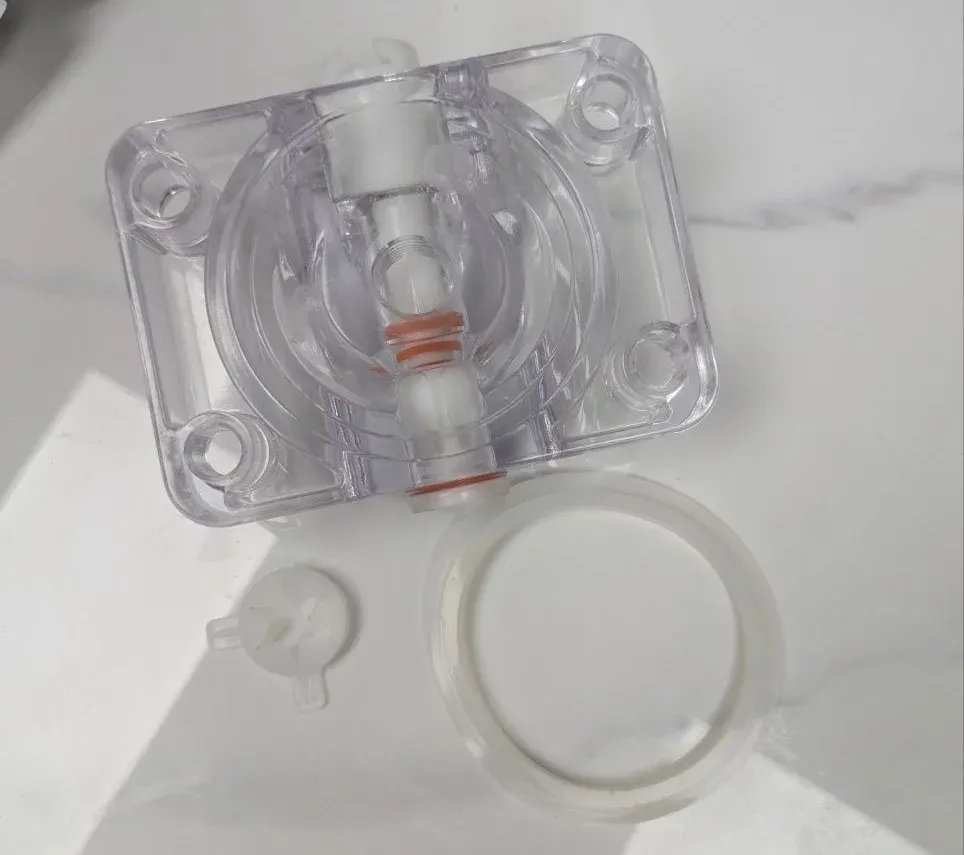

# Setup & Installation

## Machine Specifications

Model

Robo Ice Cream F2

Dimensions (W×D×H)

120 × 86.5 × 245 cm (47.2 × 34.1 × 96.5 in / 3.94 × 2.84 × 8.04 ft)

Weight

380 kg (838 lbs) empty

Power Requirements

220V only, 13A typical, 2,860W max

Electrical Connection

NEMA 6-20P plug (requires 6-20R outlet)

Hopper Configuration

Dual hopper system (Left & Right)

Cup Capacity

200 cups (4 tubes × 50 cups each)

## Pre-Installation Requirements

### Site Requirements

#### Space Requirements
- **Minimum Space Needed**: 137 × 170 × 265 cm (53.9 × 66.9 × 104.3 in)
- Includes machine dimensions plus required clearances
- Allows for door opening and servicing access

#### Clearance Requirements
- **Rear wall**: 50 cm (20 in) minimum
- **Side-to-side**: 20 cm (8 in) minimum
- **Front door**: Must open to 135°+
- **Ventilation**: Keep grilles unobstructed

#### Floor Requirements
- Flat, level, stable hard surface
- No soft mats or carpet
- Must support machine weight + mix
- Indoor use only

#### Environmental Requirements
- Indoor installation only
- Avoid direct sunlight
- Avoid excessive heat/humidity
- Internet connectivity (WiFi/Ethernet)

### Power Requirements

**⚠️ CRITICAL ELECTRICAL REQUIREMENTS**

The Robo Ice Cream F2 requires:
- **220V ONLY** - no 110V operation available
- **20A breaker required** (machine draws 13A typical, 15A breaker too close for spikes)
- **NEMA 6-20R outlet** (to match the included 6-20P plug)
- **Power consumption**: 2,860W maximum (13A @ 220V)
- **Dedicated circuit required** - do NOT share with other equipment
- **Surge protection** highly recommended

**Important:** The F2 comes with a NEMA 6-20P power cable. Ensure your facility has the matching 6-20R outlet installed by a licensed electrician before delivery.

## What's Included

Installation tool kit with screwdriver, hex key, and spare sensor

Spare parts kit with NSF-approved grease and technical manual

Sweet Robo branded cups with integrated spoons

Cleaning brush, whisk for mixing, and cleaning cloths

10L graduated mixing bucket for ice cream preparation

Specialized agitator cleaning brush with spiral bristles

Dispenser seal replacement kit with O-rings and gaskets

MT87 digital multimeter for electrical diagnostics

Long-handled slotted spoons for syrup and topping service

Your F2 shipment includes:
- Robo Ice Cream F2 Machine
- Installation tool kit: Phillips screwdriver, hex key/allen wrench, spare sensor, Sweet Robo branded tool bag
- Spare parts kit: Food-grade MP grease (NSF approved), O-rings, gaskets, tubing, cleaning brush, technical diagram
- Cup dispenser tubes: 4 tubes (50 cups each)
- Starter pack: Orange Sweet Robo cups with integrated spoons
- Power cord with NEMA 6-20P plug and keys (attached to power cord)
- Cleaning supplies: Mixing bucket (10L), whisk, cleaning cloths, agitator brush
- This operator's manual

## Step 1: Delivery and Inspection

<h3>Inspect Packaging</h3>
Check outer packaging for visible damage. Note any damage on delivery receipt before carrier leaves.

<h3>Verify Delivery</h3>
Confirm Model F2, Serial Number, and Delivery Date match your order.

<h3>Document Damage</h3>
If damage suspected, photograph machine before unboxing for insurance claims.

<h3>Contact Support</h3>
If damage or missing parts discovered, contact Sweet Robo support immediately.

## Step 2: Positioning the Machine

**CAUTION:** Two or more people required for moving. For long distances, use a pallet jack - the wheels are designed for minor position adjustments only, not extended transport.

<h3>Move to Location</h3>
Carefully move machine to final operating location using appropriate equipment.

<h3>Level the Machine</h3>
Ensure all four feet are firmly on ground and machine is level.

<h3>Lock Feet</h3>
Adjust feet as needed, then lock in place with locking collars.

<h3>Verify Clearances</h3>
Confirm all required clearances are met (see requirements above).

IMAGE: Proper machine positioning with clearance measurements

## Step 3: Interior Inspection

**WARNING:** Do NOT power on until this inspection is complete and ice cream mix is loaded.

<h3>Open Service Door</h3>
Unlock and open the service door using keys attached to power cord.

<h3>Check Components</h3>
Inspect for loose wires, plugs, pipes, or components shifted during transit.

<h3>Remove Packaging</h3>
• Remove ALL internal packaging materials 
• Clear foam, zip ties (unless securing permanent wires) 
• Check delivery bot area and all compartments 
• Locate accessory kit stored inside

<h3>Verify Connections</h3>
Ensure all cables and connectors are properly seated and secure.

IMAGE: Interior inspection points and packaging removal

## Step 4: Hardware Installation

### 4.1 Install LED Roof Panels (Optional)

**Customization Option:** The F2 comes with 4 LED panels that can be installed on top. You can choose to install 1, 2, 3, or all 4 panels based on your preference and visibility needs.

Decide how many LED panels to install (1-4 panels).

Use screws and Phillips screwdriver from tool kit to attach chosen panels to top of machine.

Connect wires from each panel to corresponding wires from machine.

Ensure all connections are secure and properly connected.

### 4.2 Install Cup Tubes

IMAGE: Loading cups into tubes

Open service door to access cup dispenser mechanism.

Install all 4 cup tubes into dispenser assembly.

Load approved cups (rim up) into each tube - 50 cups per tube = 200 total capacity.

Stack neatly to avoid crushing or misalignment that causes jams.

Close tube lids securely and service door (closing lids is recommended to prevent dust accumulation and maintain hygiene standards).

## Step 5: Initial System Preparation

### 5.1 Flush and Sanitize Hoppers

**F2 Feature:** The F2 model includes dual hoppers (Left & Right) allowing you to offer two different flavors simultaneously.

Pour approximately 2 liters of warm water into each hopper.

Wipe interior with food-grade sanitizing solution.

Rinse thoroughly with clean warm water.

Access backend system to open chambers and discharge water (see <a href="./operation.html#device-testing---component-control">operation section</a> for more info).

Wipe dry with clean, food-safe cloth and leave open to air dry.

IMAGE: Hopper cleaning process

### 5.2 Prepare Ice Cream Mix

**CRITICAL:** Never power on without mix - this causes "core board error" and potential damage!

<h3>Gather Supplies</h3>
• Food-grade bucket (7-8 liter capacity with measurement lines) 
• Ice cream mix powder (1.5kg bag) 
• Fresh drinking water 
• Electric mixer or whisk

<h3>Mix Preparation</h3>
• Pour 4 liters of fresh water into bucket 
• Slowly add entire 1.5kg powder bag 
• Let sit briefly to begin dissolving 
• Mix 2-3 minutes until smooth (avoid over-mixing)

IMAGE: Pouring powder into water and initial mixing

<h3>First Fill Requirements</h3>
• Each batch: 1 bag (1.5kg) + 4L water 
• Mix one batch at a time 
• Transfer to hopper immediately after mixing 
• Repeat process for second hopper

IMAGE: Prepared mix ready for transfer to hopper

QR CODE: Link to mix preparation video

### 5.3 Load Ice Cream Mix

Open both hopper lids (Left and Right).

Pour prepared mix slowly to avoid splashing.

Minimum fill: 2 liters per hopper (fill both hoppers).

Maximum capacity: 12 liters per hopper (do not fill above white plastic parts).

Close lid(s) securely.

### 5.4 Adjust Refill Tube

The refill tube controls mix flow into the freezing chamber:

| Setting | Opening Size | Use Case |
|---------|-------------|----------|
| 0 | Closed | Maintenance only |
| 1 | Smallest | Small portions |
| 2 | Medium | Standard servings (recommended) |
| 3 | Fully Open | Large portions |

IMAGE: Refill tube adjustment settings

QR CODE: Refill tube adjustment video

### 5.5 Add Syrups

Locate the 3 syrup containers in the machine.

Open each container lid and pour in liquid syrup.

Close lids securely after filling.

Note which syrup is in each position (1, 2, 3) - you'll need to configure this in the backend system later.

**Requirements:** Only liquid syrups - NO solids, chunks, or thick sauces

IMAGE: Syrup installation process

### 5.6 Add Toppings

Open the 3 topping container lids.

Pour dry toppings into containers (max 270g each).

Ensure toppings flow freely - no clumping.

Close lids securely.

**Requirements:** Only dry/solid toppings - NO liquids, wet, or sticky items

IMAGE: Topping container loading

## Step 6: Power Connection and Startup

### 6.1 Connect Power

**ELECTRICAL SAFETY:** Ensure hands are dry and you're not standing in water. Verify machine is OFF before connecting.

Verify Main Breaker is OFF (located behind cups area).

Connect the 6-20P power cord to your 6-20R outlet (220V with 20A breaker).

Verify the outlet is properly grounded and on a dedicated 20A+ breaker.

### 6.2 Power On Sequence

<h3>Turn ON Main Breaker</h3>
Located behind cups area, right side access door.

IMAGE: Main breaker location and position

<h3>Turn ON Main I/O Switch</h3>
Controls refrigeration and dispensing systems.

IMAGE: Main I/O switch location and position

<h3>System Initialization</h3>
• Touchscreen illuminates 
• Startup sequence begins 
• Listen for normal operation sounds 
• No grinding noises should occur

<h3>Temperature Optimization</h3>
Machine requires 2-8 minutes to reach optimal freezing temperature.

**Note:** If "Core Board Error" appears with grinding noise, immediately turn OFF and verify hoppers have mix. If error continues after verification, shut off power and contact support.

## Step 7: Backend Configuration

### 7.1 Access Backend

Tap top-right corner of touchscreen 6+ times (or hold 3-5 seconds).

Enter default password: <strong>123456</strong>

Backend management screen appears with 6 main sections:

**Management Screen Sections:**

| **Section** | **Purpose** |
|-------------|-------------|
| `Parameter Settings` | Control temperature, timing, and dispense parameters |
| `Stock Settings` | Monitor and update inventory for cups, mix, syrups, and toppings |
| `Device Testing` | Manually test components and perform cleaning functions |
| `Opening Hours` | Schedule vending availability based on business hours |
| `System Settings` | Configure system behavior (volume, voice, network, etc.) |
| `Shopping Settings` | Configure payment methods, timeout behavior, and alerts |

### 7.2 Test Functions

IMAGE: Device Testing screen showing test options

Navigate to `Device Testing` to verify:
- Cup drop test (clear one tube to verify it auto turns to use the next tube)
- Syrup flow test (prime all 3 lines)
- Topping dispense test (all 3 containers)
- Door open/close operation

### 7.3 Configure Payment Settings

IMAGE: Shopping Settings screen showing payment configuration options

In `Shopping Settings`, configure payment methods:
- Enable/disable bill acceptor
- Enable/disable coin acceptor
- Enable/disable VPOS (credit card reader)
- Set change dispenser options
- Configure timeout settings

**Note:** Other settings like product prices, portion sizes, syrup/topping names, and operating hours can be configured later through their respective menu sections. See the <a href="./operation.html#operator-interface-and-backend-management">Operation Guide</a> for detailed configuration instructions.

## Setup Complete Checklist

### Pre-Power Checklist
- [ ] Machine positioned with proper clearances
- [ ] Level surface, all feet locked
- [ ] Interior packaging removed
- [ ] All connections verified
- [ ] Hoppers cleaned and sanitized
- [ ] Mix prepared and loaded (minimum 2L per hopper)
- [ ] Cups loaded (200 capacity)
- [ ] Syrups installed (liquid only)
- [ ] Toppings loaded (dry only)
- [ ] Power requirements verified

### Post-Power Checklist
- [ ] No core board error
- [ ] Normal operation sounds
- [ ] Touchscreen functional
- [ ] Backend access successful
- [ ] All tests passed
- [ ] Temperature reached (2-8 minutes)
- [ ] Settings configured
- [ ] Test ice cream made successfully

## Important Reminders

**Daily Operations:**
- Never run hoppers empty - maintain 2L minimum
- Mix expires after 3-4 days - replace regularly
- Only liquid syrups (no solids)
- Only dry toppings (no liquids)
- Clean regularly per maintenance schedule

## Support Information

For installation assistance or questions:

<h4>Sweet Robo Support</h4>

**Email:** support@sweetrobo.com  
**Phone:** +1 (844) 793-3872  
**Hours:** 24/7 assistance available

## Next Steps

1. Review the [Operation Guide](operation.md) for daily use
2. Set up your [Maintenance Schedule](maintenance.md)
3. Train all staff on proper procedures
4. Keep this manual accessible

Your Robo Ice Cream machine is now ready for operation!