# POP\_CART\_MANUAL\_COMPLETE

## Pop Cart Manual - Complete Edition

_Combined manual for team review and editing_

***

### 📝 Notes for Editing

**👥 Team Editors:** See `TEAM_EDITING_GUIDE.md` for detailed instructions!

#### Key Points:

* **Images**: Image references appear as ``
  * This is normal - images are local files and won't display in Google Docs
  * You CAN edit the description (text in brackets)
  * DON'T delete the file paths
* **Section Markers**: Comments like `<!-- SECTION: filename.md -->` must stay!
  * These help us split the document back into individual files
* **Focus**: Edit the text content - fix typos, clarify instructions, improve wording

***

Pop Cart - User Manual


## Pop Cart

### User Manual

```
    <p>Revision & Date:</p>
    <p>Rev 1. 10.2025</p>


    

        <a href="https://manuals.sweetrobo.com/pop-cart/">
            View Online Manual
            
            
```

Scan for latest online manual

```
        </a>
    

```

***

## Overview

## Overview

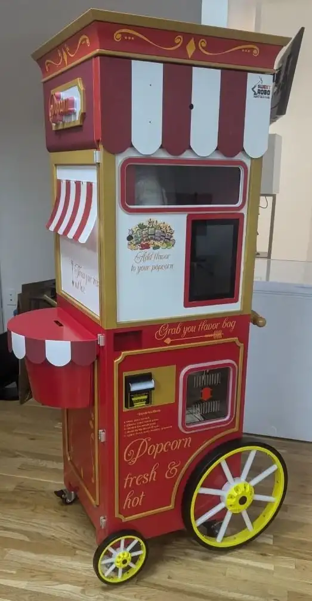 _Pop Cart - Vintage carnival-style automated popcorn vending machine_

### About the Pop Cart

The Pop Cart is Sweet Robo's automated popcorn vending machine that combines nostalgic carnival aesthetics with modern automated technology. Designed to produce fresh, hot popcorn on demand, the Pop Cart delivers a delightful customer experience while maintaining reliable, hands-off operation for venue operators.

This manual provides comprehensive information for operators, maintenance personnel, and technicians to ensure optimal performance and longevity of your Pop Cart system.

***

### Machine Purpose

The Pop Cart produces fresh popcorn on-demand using fully automated popping, flavoring, and dispensing systems. Customers interact with an intuitive touchscreen interface to select their preferred popcorn variety and toppings, make payment, and receive freshly popped popcorn in branded containers.

#### Ideal Venues

* Movie theaters and entertainment centers
* Shopping malls and retail spaces
* Amusement parks and recreational facilities
* Office buildings and corporate campuses
* Educational institutions
* Transportation hubs

***

### Key Features

**Fresh Popping System**

Advanced dual-cylinder popping mechanism creates fresh popcorn on demand with optimal kernel-to-pop ratios and consistent quality batch after batch.

**Multiple Flavor Options**

Support for various seasoning dispensers allowing diverse flavor combinations including butter, garlic, chipotle, jalapeño, and truffle options.

**Touchscreen Interface**

Intuitive customer-facing touchscreen interface with vintage carnival theming guides users through popcorn selection, topping choices, and payment processing.

**Automated Dispensing**

Precise portion control and automated dispensing ensure consistent servings and minimize waste while maximizing profitability.

**Payment Flexibility**

Integrated payment system supports credit/debit cards, cash payments, and optional loyalty credits for seamless customer transactions.

**Vintage Aesthetic**

Eye-catching carnival cart design with red and white striped awning, decorative wheels, and nostalgic styling attracts customers and enhances venue ambiance.

***

### Technical Specifications

Machine Name

Pop Cart

Machine Type

Automated Popcorn Vending Machine

Manufacturer

Sweet Robo

Dimensions (W×D×H)

520 × 450 × 1720 mm (20.5 × 17.7 × 67.7 in)

Net Weight

140 kg (approx. 309 lbs)

Power Voltage

110-125V AC (US variant) or 220-240V AC (International variant)

Power Consumption

Max 2200 W (20A @ 110V, 10A @ 220V)

Popcorn Capacity

Dual cylinder system (\~3 kg per tube, 60-70 servings each)

Kernel Storage

6 kg total capacity (3 kg per cylinder)

Seasoning Options

5 flavor lanes (customizable selection)

User Interface

Touchscreen display with customer-facing operation

Payment Methods

Credit/Debit Card, Cash, Loyalty Credits

Operating Environment

Indoor use, 15-30°C (59-86°F), humidity 20-80% non-condensing

The Pop Cart requires adequate ventilation and climate-controlled indoor environments for optimal performance. Consult the Setup section for detailed site requirements and environmental specifications.

***

### System Components

#### External Features

The Pop Cart features a distinctive vintage carnival cart aesthetic designed to attract customers and complement entertainment venues. The red and white striped canopy, decorative yellow wheels, and classic popcorn branding create an inviting presence.

 _Front dispensing window showing internal popping chamber with heating elements_

**Customer Interaction Points:**

* **Touchscreen Display**: Primary customer interface for selections and payment
* **Dispensing Window**: Collection point for finished popcorn containers
* **Payment Area**: Integrated card reader and cash acceptance
* **Security Lock**: Keyed access for operator maintenance and restocking

#### Internal Component Layout

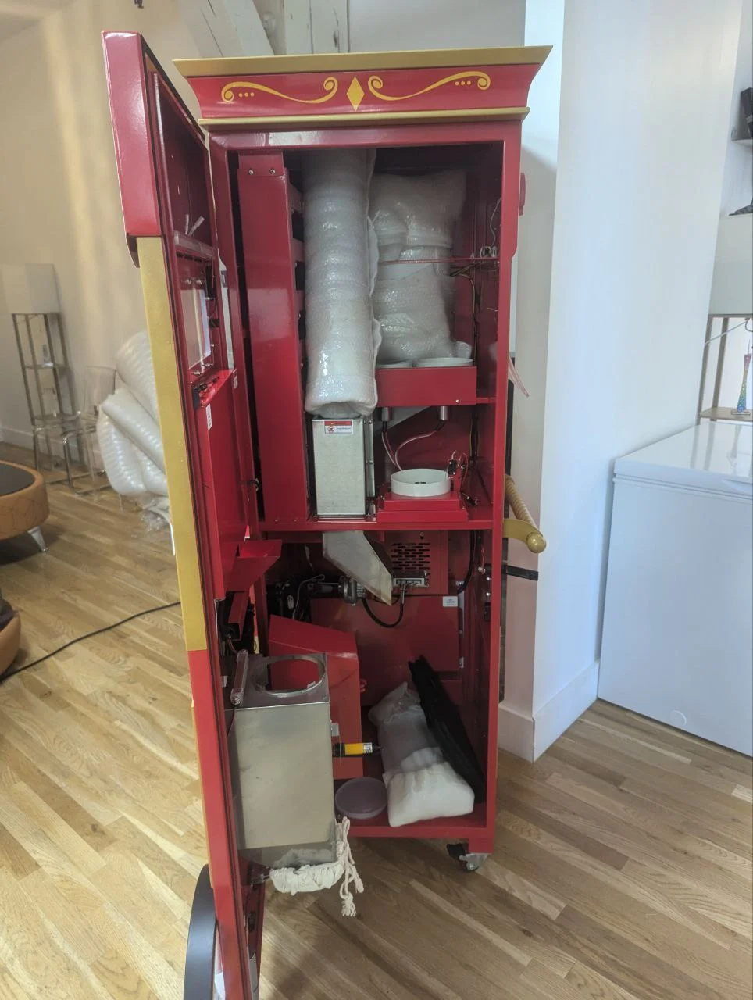 

_Complete interior layout showing multi-level component organization_

The Pop Cart interior is organized into distinct functional zones for efficient operation and maintenance:

**Upper Level - Storage & Supply**

* Kernel hopper with top-loading access
* Seasoning dispensers (5 positions)
* Supply monitoring systems

**Middle Level - Production**

* Dual-cylinder popping chambers (A & B)
* Heating element arrays
* Temperature monitoring

**Lower Level - Dispensing & Collection**

* Stainless steel dispensing chute
* Cup positioning mechanism
* Waste collection bin
* Service access panels

 _Dual popcorn dispensing cylinders labeled A and B_

#### Dual Dispensing System

The Pop Cart features two independent popcorn cylinders (A and B) that allow operators to offer customers a choice:

* **Cylinder A (Option 1)**: Can contain any popcorn variety selected by the operator
* **Cylinder B (Option 2)**: Can contain a different variety, the same variety, or custom-mixed kernels
* **Flexible Configuration**: Operators decide whether to offer two distinct options or use both cylinders for the same variety
* **Customer Choice**: Software interface allows customers to select which cylinder option they prefer
* **Independent Operation**: Each cylinder operates separately for reliability and continuous service
* **Transparent Design**: Visible popcorn display creates customer excitement

***

### Machine Architecture

#### 1. Production System

The Pop Cart's production system handles the complete popping process from kernel storage through finished product:

* **Kernel Metering**: Precise measurement ensures consistent batch sizes
* **Heat Management**: Controlled heating elements maintain ideal popping temperatures
* **Quality Monitoring**: Sensors detect pop completion and prevent burning

#### 2. Dispensing Mechanism

Once popping is complete, the automated dispensing system delivers popcorn to customers:

* **Gravity Feed**: Dual cylinders use gravity to move popcorn downward
* **Portion Control**: Measured dispensing ensures consistent serving sizes
* **Cup Positioning**: Sensors detect proper cup placement before dispensing
* **Chute Design**: Stainless steel curved chute guides popcorn smoothly

#### 3. Control System

An integrated electronic control system manages all machine functions:

* **Customer Interface**: Android-based touchscreen for intuitive operation
* **Payment Processing**: Secure transaction handling and receipt generation
* **Inventory Tracking**: Monitors kernel and seasoning levels
* **Error Detection**: Real-time monitoring and diagnostic alerts
* **Remote Management**: Optional network connectivity for remote monitoring

#### 4. Safety Systems

Multiple safety features protect customers, operators, and the machine:

* **Temperature Limits**: Automatic shutdown prevents overheating
* **Door Interlocks**: Safety switches disable operation when doors open
* **Emergency Stop**: Accessible emergency shutdown capability
* **Component Protection**: Thermal and electrical protection circuits

***

### Next Steps

Now that you understand the Pop Cart's capabilities and components, proceed to:

* [**Setup & Installation**](setup.md) - Learn how to unpack, position, and configure your Pop Cart
* [**Operation Guide**](operation.md) - Master daily operations and customer service procedures
* [**Maintenance**](maintenance.md) - Establish cleaning schedules and preventive maintenance routines

For immediate assistance or technical support, see [Company Information](../shared/company-info.md).

***

## Setup & Installation

## Setup & Installation

This section guides you through unpacking, positioning, and configuring your Pop Cart for first-time operation.

**IMPORTANT**

Some accessories or consumables may be packaged and stored inside the machine body for secure transit. Before powering on the machine, carefully open all access doors and inspect the interior.

***

### Pre-Installation Checklist

Before beginning installation, ensure you have:

* [ ] Verified delivery contents against packing list
* [ ] Inspected exterior for shipping damage
* [ ] Confirmed site meets requirements (see below)
* [ ] Arranged for 2+ people for positioning
* [ ] Verified power requirements match your facility
* [ ] Prepared network connection (if using remote management)

***

### Site Requirements

**Space:** Machine footprint 520×450mm. Minimum clearances: 60cm service side, 120cm front (customer access), 15cm around ventilation.

**Environment:** Indoor use only, level floor. Operating temperature 15-30°C (59-86°F), humidity 20-80% non-condensing. Adequate air circulation required.

**Power:** 110-125V or 220-240V AC, 50/60Hz, 2200W max. Dedicated circuit recommended. Standard grounded plug for region.

**Network:** WiFi or Ethernet for remote management and backend data sync.

**WARNING**: Do not install in damp, wet, or outdoor environments. Exposure to moisture may cause electrical hazards and equipment damage.

_For complete technical specifications, see_ [_Overview_](overview.md#technical-specifications)

***

### Unpacking Instructions

The Pop Cart ships with protective packaging to prevent damage during transport. Follow these steps to safely unpack your machine.

#### 1. Inspect Shipping Container

Visually inspect the exterior packaging for obvious damage (crushed corners, punctures, or water damage).

Document any damage with photographs before unpacking.

If significant damage is observed, contact the carrier and Sweet Robo support before proceeding.

#### 2. Remove Protective Wrapping

 _Pop Cart as delivered with shipping protection and labels_

Carefully cut and remove exterior strapping or tape.

Peel away bubble wrap protective covering, being careful not to damage the machine exterior or decorative elements.

Keep protective materials until installation is complete in case return shipping is needed.

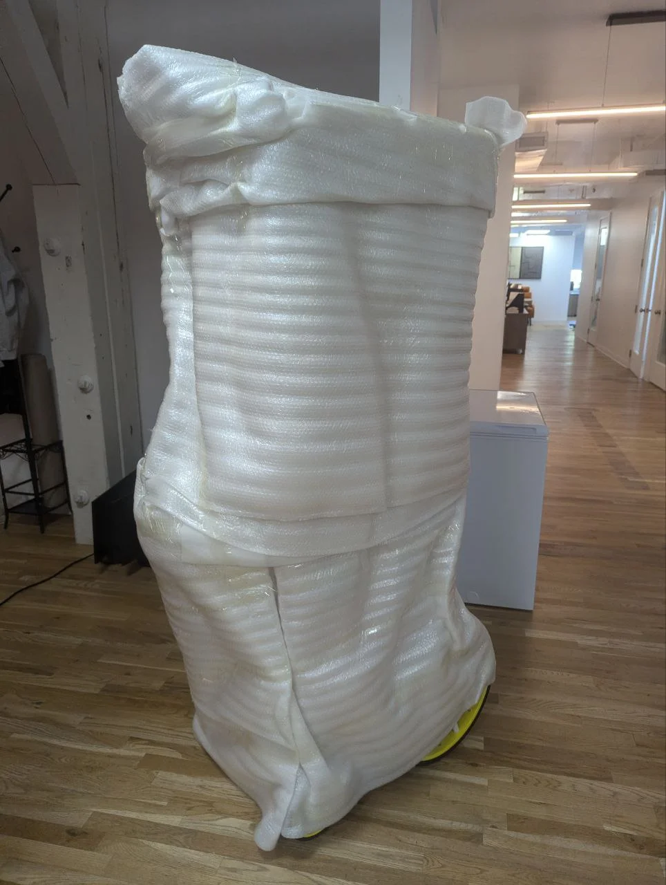 

_Unpacking sequence: fully protected (left) and partially unwrapped (right)_

#### 3. Remove Interior Packing Materials

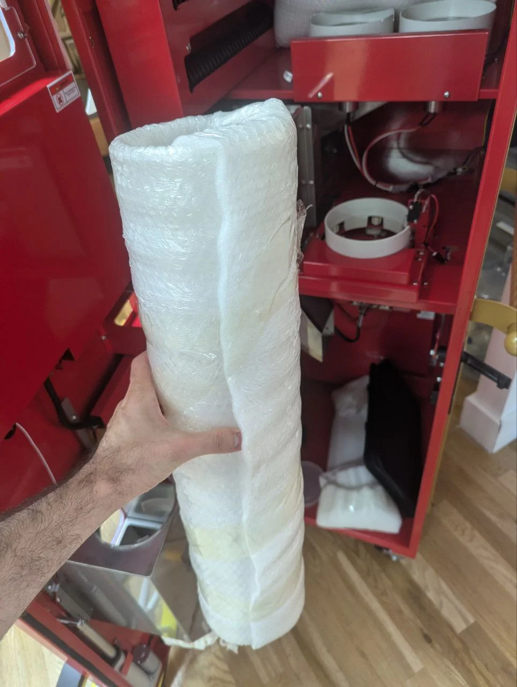 _Interior protective materials that must be removed before operation_

Unlock and open all service access doors using the provided keys.

Remove all interior protective materials including foam inserts, bubble wrap, and cardboard spacers.

Verify that internal components move freely and are not obstructed by packing materials.

Check for accessory boxes or consumables packed inside the machine (cups, kernel samples, cleaning supplies, etc.).

**CAUTION**: Failure to remove all packing materials before operation may cause equipment malfunction, jamming, or damage. Thoroughly inspect all interior compartments.

***

### Positioning the Machine

**CAUTION**: Two or more people may be required for safely moving and positioning the machine. Use appropriate lifting equipment if necessary. The Pop Cart weighs approximately 140 kg (309 lbs).

1. Move to Final Location

Carefully move the Pop Cart to its final operating location, ensuring it meets all site requirements.

Position the machine to allow adequate service access on the door side and customer access on the front.

Ensure the machine is not blocking emergency exits, fire equipment, or facility traffic flow.

2. Level the Machine

Use a bubble level to check that the machine is level front-to-back and side-to-side.

Adjust leveling feet as needed to compensate for floor irregularities.

Verify the machine does not rock or wobble when gently pushed.

Lock leveling feet in position once the machine is level and stable.

Proper leveling is critical for accurate popcorn dispensing and prevents uneven wear on internal components. Take time to ensure the machine is perfectly level.

***

### Power Connection

**WARNING: Electrical Shock Hazard.** Ensure your hands are dry and you are not standing in water when connecting the power cord. Have a qualified electrician verify proper grounding before operation.

Verify that the power outlet voltage and type match the machine requirements printed on the data plate.

Confirm the circuit breaker is OFF before plugging in the machine.

Fully insert the power plug into a properly grounded outlet.

Turn ON the circuit breaker and verify no faults or tripped breakers.

**IMPORTANT**

Use a dedicated circuit for the Pop Cart when possible. Sharing circuits with other high-power equipment may cause voltage fluctuations and affect machine performance.

***

### Network Connection (Optional)

If using remote management features:

Access the operator settings menu on the touchscreen (see Operation section for menu access).

Navigate to Network Settings and select your connection type (Wi-Fi or Ethernet).

For Wi-Fi: Select your network SSID and enter the password.

For Ethernet: Connect network cable to the RJ45 port on the rear of the machine.

Verify network connection status shows "Connected" in settings.

Contact Sweet Robo support for remote management portal setup and credentials.

***

### Initial Configuration

#### System Check

After powering on for the first time:

The machine will perform a self-test sequence. Observe for any error messages or unusual sounds.

Allow the touchscreen to fully boot (approximately 30-60 seconds).

Verify the customer interface displays the welcome screen correctly.

Access the operator menu to configure initial settings (see Operation section).

#### Load Initial Supplies

Before operation, the machine requires:

**Popcorn Kernels**

Fill kernel hopper with approved popcorn kernels. Recommended: Amish Country Popcorn Blue variety or equivalent.

**Seasonings**

Stock seasoning dispensers with desired flavors (Butter, Chipotle, Garlic, Jalapeño, Truffle, etc.).

**Cups**

Load branded popcorn cups into the cup dispenser mechanism.

Refer to the [Maintenance](maintenance.md) section for detailed loading procedures and approved consumables.

***

### First Start Checklist

Before allowing customer use, verify:

* [ ] All packing materials removed from interior
* [ ] Machine is level and stable
* [ ] Power connection is secure and grounded
* [ ] Network connection established (if applicable)
* [ ] Kernel hopper is filled
* [ ] Seasoning dispensers are stocked
* [ ] Cups are loaded
* [ ] Customer interface is responsive
* [ ] Payment system is configured and tested
* [ ] Test transaction completed successfully
* [ ] Operator familiar with [Operation Guide](operation.md)
* [ ] Emergency shutdown procedure understood
* [ ] Support contact information posted

**Test Transaction Required**

Perform at least one complete test transaction before opening for customer use. This verifies proper operation of the entire system including popcorn selection, topping dispensing, payment processing, and product delivery.

***

### Installation Complete

Your Pop Cart is now ready for operation! Proceed to the [Operation Guide](operation.md) to learn daily operation procedures, or refer to [Maintenance](maintenance.md) for cleaning and restocking information.

For setup assistance or questions, contact Sweet Robo support:

**Support Contact**: Please use Sweet Robo Tracking App to get support from us

***

## Operation Guide

## Operation Guide

This section covers daily operations, customer service procedures, and operator controls for the Pop Cart popcorn vending machine.

***

### Daily Startup Procedure

Perform these steps at the beginning of each operating day:

**Verify Supply Levels**

• Check both kernel hoppers are adequately filled

• Confirm all 5 seasoning dispensers are stocked

• Verify cup supply is sufficient

**Inspect Machine Condition**

• Visually inspect exterior for damage or tampering

• Verify dispensing window is clean and clear

• Check for any error messages on screen

• Ensure no obstructions in customer access area

**Power On System**

• Turn on main power if switched off overnight

• Allow 30-60 seconds for system boot

• Verify touchscreen displays welcome screen

• Check that all LEDs indicate normal operation

**Perform Test Cycle (Optional)**

Run a test transaction to verify proper operation (see Testing & Diagnostics section)

***

### Customer Operation Flow

The Pop Cart provides an intuitive touchscreen interface guiding customers through the purchasing process. Understanding this flow helps operators assist customers and troubleshoot issues.

#### Step 1: Popcorn Selection


Customers select their preferred popcorn variety. Available options are configurable and may vary. Pricing displays next to each option and can be configured through the admin Inventory section.

#### Step 2: Topping Selection

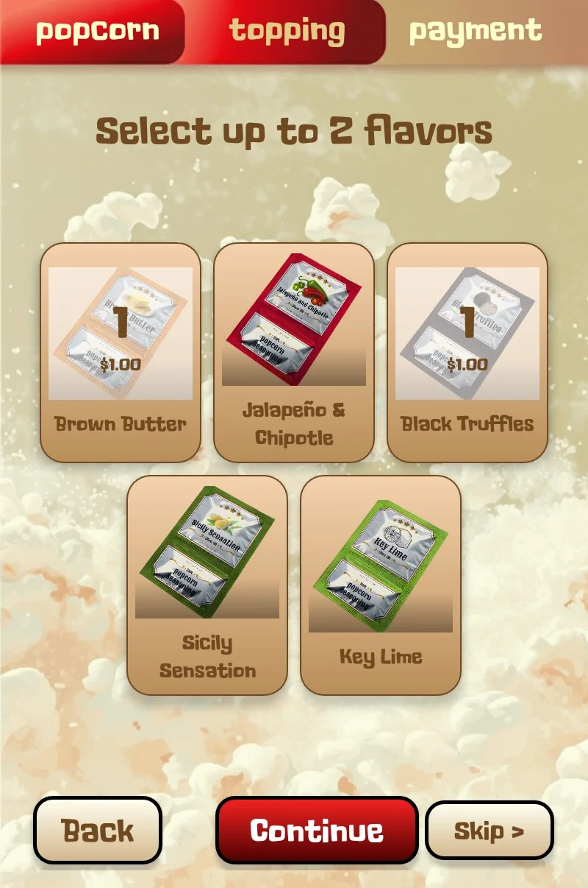

Customers choose up to 2 flavor toppings from 5 available lanes. Available topping options may vary (e.g., Butter, Chipotle, Garlic, Jalapeño, Truffle). Pricing and availability are configured in the admin Inventory section and require physical seasoning stock.

#### Step 3: Payment


The payment screen shows the complete order summary with itemized selections and total. Customers pay via credit card, cash, or loyalty credits (if available/installed). Payment must complete successfully before production begins; failed payments allow retry.

#### Step 4: Production & Dispensing

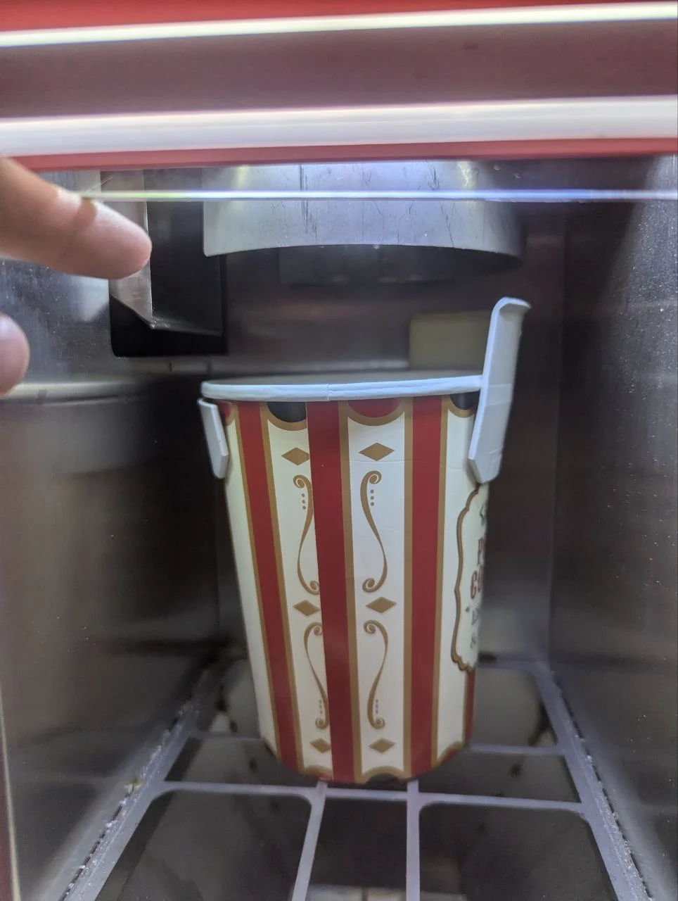

After payment, the machine begins the automated production cycle (\~90-120 seconds):

1. Cup drops into holder
2. Kernels drop into air oven
3. Oven heats and pops the kernels
4. Blower pushes popcorn down the chute into the cup
5. Door opens
6. Seasoning toppings drop onto the side (customer manually applies desired amount)

**CAUTION**: Popcorn and internal components may be hot during production.

**Customer Assistance:**

* Back button allows customers to change selections before payment
* Screen timeout resets to welcome after 60 seconds of inactivity
* Manual topping additions (like blue popcorn kernels) can be offered as premium add-ons by extending dispensing window access time in settings

***

### Admin Interface

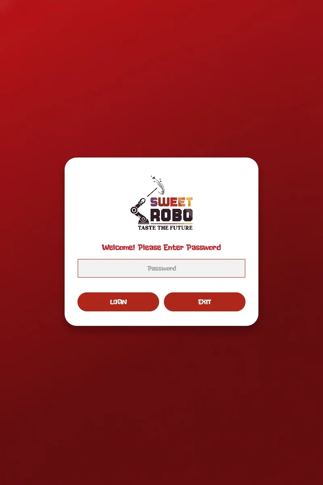

Access the admin interface by tapping 3-5 times in the top left corner of the screen, then entering your operator PIN. All management functions are performed locally on the touchscreen; WiFi is only required for backend data sync.

#### Management Dashboard


The dashboard provides access to **Device** (WiFi, payment methods, popcorn parameters), **Testing** (diagnostics, sensors, dispensers), **Statistics** (sales, revenue, reports), and **Inventory** (stock, pricing).

**Key Configuration Screens:**

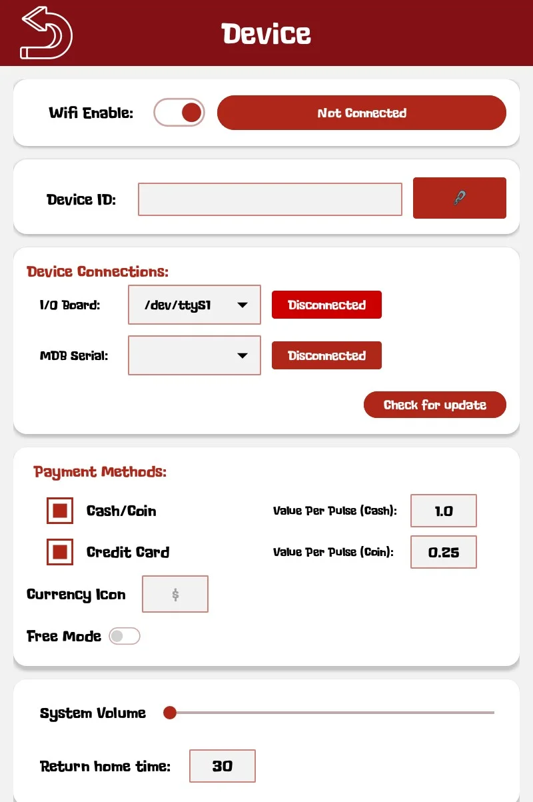

* **Device Settings**: WiFi setup (only external configuration required), payment methods, device ID, system settings
* **Popcorn Parameters**: Temperature, speed, and timing controls for both chambers

#### Inventory & Pricing

 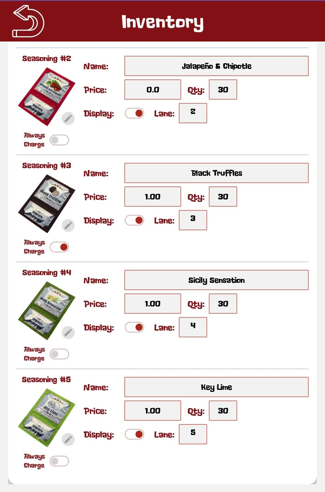

Manage stock levels, configure pricing, and assign seasonings to the 5 dispenser lanes. Track cup count, popcorn varieties, and seasoning quantities. All pricing changes take effect immediately on the customer interface.

#### Statistics & Sales


View sales count, total income, and transaction history. Backend syncing (requires WiFi connection) enables remote monitoring and data export through the Sweet Robo tracking system.

**IMPORTANT**

Keep operator PIN codes secure and confidential. Unauthorized access to operator settings can disrupt machine operation or compromise payment security.

***

### Testing & Diagnostics

 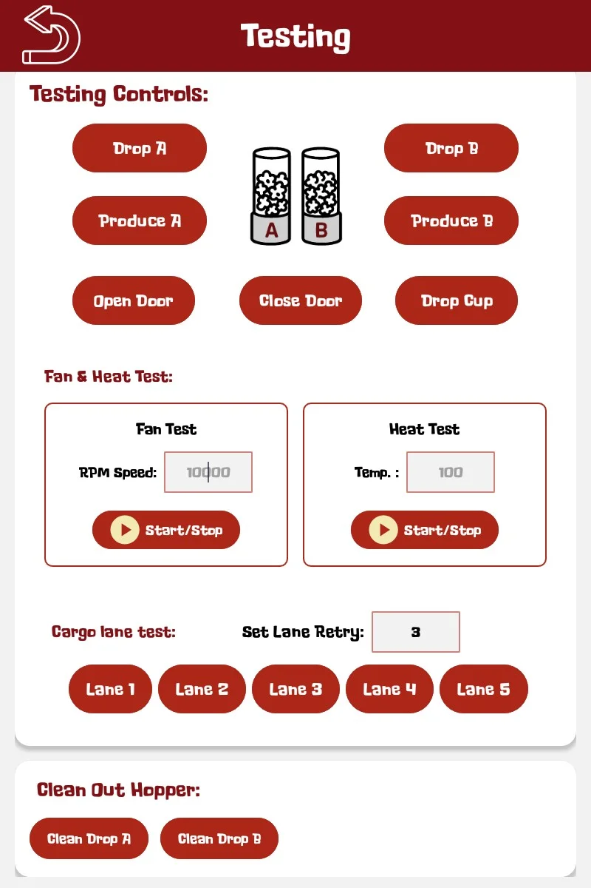

Access Testing from the management dashboard to run diagnostics without charging customers. Test sensors, temperature, chamber speed, and all 5 seasoning dispensers individually. Run hopper cleaning cycles and clear jams.

**Test Schedule:** Daily (quick dispense test), Weekly (complete popping cycle), Monthly (full system diagnostic)

***

### Daily Operations

**Startup:** Verify supply levels (both hoppers, 5 seasoning lanes, cups), check for errors, run test cycle.

**Customer Assistance:** Process takes 90-120 seconds. Back button allows selection changes before payment. For errors or issues, see [Troubleshooting](troubleshooting.md).

**End of Day:** Run sales report, empty cash box (if applicable), check supply levels, basic cleaning (see [Maintenance](maintenance.md)), secure machine.

**Best Practices:** Keep supplies stocked for peak hours, clean surfaces regularly, run diagnostics daily, use sales data to optimize inventory.

***

For support, see [Company Information](../shared/company-info.md) | Learn more: [Maintenance](maintenance.md) · [Troubleshooting](troubleshooting.md) · [Parts & Service](parts-service.md)

***

## Maintenance

## Maintenance

Proper maintenance ensures optimal performance, longevity, and food safety for your Pop Cart. This section covers cleaning procedures, supply restocking, and preventive maintenance schedules.

**IMPORTANT**

Always disconnect power before performing any internal cleaning or maintenance. Allow heating elements to cool completely before touching internal components.

***

### Maintenance Schedule

Daily

Exterior wipe-down, touchscreen cleaning, dispensing window cleaning, visual supply check

Weekly

Interior cleaning, deep clean of dispensing chute, restock supplies, waste bin emptying

Monthly

Component inspection, calibration check, deep cleaning of popping chambers, filter cleaning

Quarterly

Professional service inspection, system diagnostics, component replacement if needed

Annually

Comprehensive service, electrical inspection, safety system verification

***

### Daily Maintenance

**Cleaning:** Wipe touchscreen with microfiber cloth, clean exterior panels with damp cloth and mild detergent, clean dispensing window, dust decorative elements.

**Supplies:** Check kernel hoppers (refill if below 25%), verify 5 seasoning dispensers, confirm cup stock.

***

### Weekly Maintenance

**WARNING**: Disconnect power and wait 30 minutes for cooling before interior cleaning.

**Interior Cleaning:** Remove unpopped kernels from both chambers, wipe interior walls with food-safe cleaner, clean heating elements with dry brush (never wet), wash dispensing chute with hot soapy water, clean sensors with dry cloth.

**Waste Collection:** Empty and wash waste bin.

Reinstall clean bin in proper position

***

### Supply Restocking

#### Popcorn Kernels

 _Recommended popcorn kernels: Amish Country Popcorn Blue variety_

**Approved Kernel Types:**

* **Amish Country Popcorn - Blue Variety**: Premium kernels with slightly sweet flavor
* **Amish Country Popcorn - Yellow Variety**: Classic yellow popcorn
* **Other Premium Brands**: Contact Sweet Robo for approved alternatives

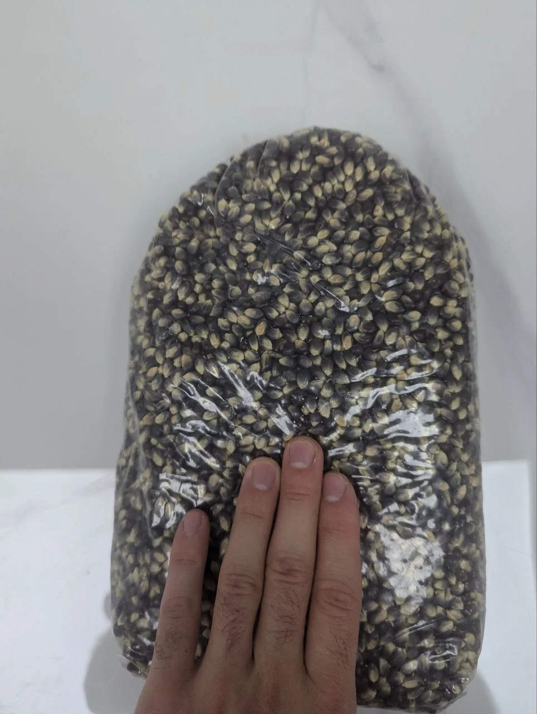 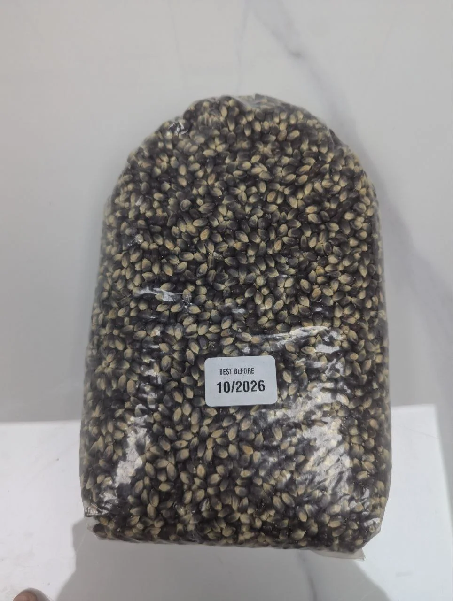

_Typical 6-pound bag size (left) and expiration date tracking (right)_

**Loading Procedure:**

**Check Expiration Date**

Verify kernels are within best-before date. Amish Country Popcorn typically has 18-24 month shelf life.

**Access Hoppers**

Open top access panel to reach both kernel hoppers

**Pour Kernels**

Carefully pour kernels into both hopper openings. Use funnel if needed to avoid spillage. Each cylinder holds up to 3 kg (6 kg total capacity).

**Verify Level**

Check hopper fill levels on screen or through inspection window. Maintain minimum 1 kg (2.2 lbs) in each cylinder at all times for continuous operation.

**Close Access Panel**

Secure top panel and verify proper seal

**IMPORTANT - Kernel Storage**

Store unopened kernel bags in cool, dry location away from moisture. Once opened, use within 60 days for optimal freshness and popping performance. Always check expiration dates and rotate stock (first in, first out).

#### Seasoning Dispensers

The Pop Cart has 5 seasoning stations that require regular refilling:

**Butter Seasoning**

Classic butter flavor powder

**Chipotle Seasoning**

Smoky spice blend

**Garlic Seasoning**

Savory garlic powder

**Jalapeño Seasoning**

Spicy pepper seasoning

**Truffle Seasoning**

Gourmet truffle blend

**Refilling Procedure:**

Access seasoning compartment through top service panel

Remove empty seasoning container by unscrewing cap

Refill with approved seasoning powder - do not overfill

Replace cap and ensure secure seal to prevent moisture contamination

Verify dispensing mechanism operates smoothly after refilling

**CAUTION**: Use only food-grade seasonings approved for popcorn vending machines. Non-approved seasonings may cause clogging, contamination, or equipment damage.

#### Cups and Containers

Open cup dispenser access (location varies by model)

Load branded popcorn cups into dispenser stack

Ensure cups are oriented correctly for proper dispensing

Do not overload - follow manufacturer maximum capacity

Test dispenser operation to verify smooth cup delivery

***

### Monthly Maintenance

#### Component Inspection

**Heating Elements**

Inspect for discoloration, damage, or excessive buildup. Clean with soft brush. Replace if damaged.

**Sensors**

Test all sensors (cup detection, level sensors, temperature probes). Clean sensor lenses with dry cloth.

**Door Seals**

Check gaskets and seals for wear, cracks, or gaps. Replace if damaged to maintain proper temperature.

**Electrical Connections**

Visually inspect wiring for wear, loose connections, or damage. Tighten connections as needed.

**Dispensing Mechanism**

Lubricate moving parts per manufacturer specifications. Check for wear or binding.

**Ventilation**

Clean air intake and exhaust filters. Replace filters per schedule or if visibly dirty.

#### Calibration Check

Enter operator menu and access diagnostic mode

Run calibration test for portion control

Verify dispensed portions match configured settings

Adjust calibration if portions are under/over target

Document calibration results for tracking

#### Deep Cleaning

Perform comprehensive deep cleaning of entire machine:

* Remove and wash all removable components
* Clean behind and under machine (if accessible)
* Detail clean all interior surfaces
* Sanitize food-contact surfaces
* Clean and organize cable management
* Inspect for any pest activity

***

### Preventive Maintenance

#### Recommended Service Intervals

Heating Element Replacement

Every 12-18 months or as needed

Door Seal Replacement

Every 12 months or if damaged

Filter Replacement

Every 3-6 months depending on environment

Sensor Calibration

Every 6 months

Professional Service

Every 3-6 months recommended

Safety Inspection

Annually by certified technician

#### Professional Service

Schedule professional service when:

* Machine displays persistent error codes
* Performance degrades despite proper cleaning
* Annual safety inspection is due
* Major component replacement is needed
* You notice unusual sounds, smells, or behavior

**Service Contact**

For professional service scheduling, parts ordering, or technical support, contact Sweet Robo Support. See [Company Information](../shared/company-info.md) for contact details.

***

### Food Safety Guidelines

#### Handling Consumables

* Store all food products in clean, dry environments
* Check expiration dates regularly and rotate stock
* Never use expired kernels or seasonings
* Keep consumables away from chemicals or cleaning supplies
* Use dedicated scoops or containers for each seasoning type

#### Sanitization

Wash hands thoroughly before handling food products

Use food-safe cleaning products and sanitizers

Allow proper contact time for sanitizers (per product instructions)

Rinse food-contact surfaces with potable water after sanitizing

Air dry or use clean towels - do not reuse contaminated cloths

#### Temperature Monitoring

* Verify ambient temperature stays within operating range (15-30°C / 59-86°F)
* Monitor internal component temperatures through diagnostics
* Address any overheating issues immediately
* Ensure adequate ventilation around machine

***

### Maintenance Log

Keep a maintenance log documenting:

* Date and type of maintenance performed
* Consumables restocked and quantities
* Any issues observed or repairs made
* Component replacements with part numbers
* Professional service visits and findings
* Cleaning schedule completion

Regular documentation helps identify patterns, track component lifespan, and maintain warranty compliance. Many issues can be prevented by consistent maintenance tracking.

***

### Troubleshooting Maintenance Issues

If you encounter problems during maintenance:

* **Difficult to clean buildup**: May indicate operating temperature issues or need for more frequent cleaning
* **Excessive waste**: Check portion calibration and popping temperature settings
* **Rapid seasoning depletion**: Verify dispensing mechanism isn't over-dispensing
* **Frequent supply alerts**: Adjust alert thresholds in operator menu or increase restocking frequency

For persistent issues, refer to the [Troubleshooting](troubleshooting.md) section or contact Sweet Robo support.

***

### Next Steps

* [**Troubleshooting**](troubleshooting.md) - Diagnose and resolve operational issues
* [**Parts & Service**](parts-service.md) - Component identification and replacement procedures
* [**Operation Guide**](operation.md) - Return to daily operation procedures

For maintenance support, contact Sweet Robo: [Company Information](../shared/company-info.md)

***

## Troubleshooting

## Troubleshooting

This section helps diagnose and resolve common issues with the Pop Cart. For problems not covered here, contact Sweet Robo support.

**IMPORTANT**

Before troubleshooting, ensure the machine is powered on, properly connected, and has adequate supplies (kernels, seasonings, cups). Many issues are resolved by checking these basics first.

***

### Quick Diagnostic Checklist

When experiencing issues, check these items first:

* [ ] Machine is plugged in and power is ON
* [ ] Circuit breaker has not tripped
* [ ] All service doors are properly closed
* [ ] Kernel hopper has adequate supply
* [ ] Seasonings are stocked
* [ ] Cups are loaded
* [ ] No obstructions in dispensing path
* [ ] Touchscreen is responsive
* [ ] No error messages displayed

***

### Error Messages

The Pop Cart displays error messages when it detects issues requiring attention.

#### Dispenser Jam Error

 _Error message indicating popcorn dispenser 2/B is jammed_

**Error**: "Popcorn Dispenser 2/B is jammed"

**Cause**: Popcorn or debris blocking dispensing mechanism in cylinder B

**Solution:**

Press OK to acknowledge error (do not attempt to clear while system is active)

Power off machine and wait 5 minutes for components to cool

Open service access door using provided key

Locate cylinder B dispenser and visually inspect for blockage

Carefully remove any visible popcorn, kernels, or debris obstructing the path

Verify dispensing mechanism moves freely (rotate manually if accessible)

Close service door and power machine back on

Run test cycle through operator menu to verify jam is cleared

**CAUTION**: Do not force stuck mechanisms. If blockage cannot be easily removed, or if error persists after clearing, contact Sweet Robo support for professional service.

#### Common Error Codes

**ERR-001**

Temperature Sensor Fault

**ERR-002**

Heating Element Failure

**ERR-003**

Cup Detection Error

**ERR-004**

Payment System Fault

**ERR-005**

Low Kernel Level

**ERR-006**

Seasoning Dispenser Fault

**ERR-007**

Door Interlock Open

**ERR-008**

Network Connection Lost

***

### Common Issues and Solutions

#### Power and Electrical

**Machine Won't Power On**

**Symptoms**: No lights, screen dark, no response

**Possible Causes**:

* Power cord unplugged or loose
* Circuit breaker tripped
* Electrical outlet not working
* Internal fuse blown

**Solutions**:

1. Verify power cord is securely plugged in
2. Check circuit breaker and reset if tripped
3. Test outlet with another device
4. Contact electrician if outlet is faulty
5. Contact Sweet Robo if internal fuse issue suspected

**Intermittent Power Loss**

**Symptoms**: Machine randomly shuts off or reboots

**Possible Causes**:

* Loose power connection
* Overloaded circuit
* Voltage fluctuations
* Internal electrical fault

**Solutions**:

1. Ensure power plug is fully seated
2. Verify circuit is not shared with high-power equipment
3. Have electrician test voltage stability
4. Contact Sweet Robo for internal diagnostics

#### Touchscreen Issues

**Screen Not Responding**

**Symptoms**: Touch inputs ignored, screen frozen

**Possible Causes**:

* Software freeze
* Touchscreen calibration needed
* Hardware malfunction

**Solutions**:

1. Perform soft reset: power off, wait 30 seconds, power on
2. Access operator menu and run touchscreen calibration
3. Clean screen with microfiber cloth (dirt can affect sensitivity)
4. If persistent, contact Sweet Robo for service

**Display Flickering or Distorted**

**Symptoms**: Screen flashes, colors wrong, lines visible

**Possible Causes**:

* Loose display cable
* Graphics hardware issue
* Power supply problem

**Solutions**:

1. Power cycle machine
2. Check for any loose connections (if accessible)
3. Contact Sweet Robo for hardware repair

#### Popping and Dispensing

**No Popcorn Popping**

**Symptoms**: Machine accepts payment but no popcorn produced

**Possible Causes**:

* Empty kernel hopper
* Heating element failure
* Kernel metering mechanism jammed
* Temperature sensor fault

**Solutions**:

1. Verify kernel hopper has adequate supply (check through inspection window)
2. Check for error codes related to heating or temperature
3. Run diagnostic test through operator menu
4. Inspect kernel metering mechanism for jams
5. Contact Sweet Robo if heating elements need replacement

**Insufficient Popping / Many Unpopped Kernels**

**Symptoms**: Lots of unpopped kernels in finished product

**Possible Causes**:

* Old or poor quality kernels
* Incorrect popping temperature
* Heating element degraded

**Solutions**:

1. Check kernel expiration date and freshness
2. Run temperature calibration through operator menu
3. Replace with fresh, approved kernels
4. Contact Sweet Robo if heating elements need inspection

**Popcorn Burns or Smokes**

**Symptoms**: Burnt smell, dark popcorn, smoke visible

**Possible Causes**:

* Temperature set too high
* Cycle time too long
* Sensor malfunction

**Solutions**:

1. Immediately stop operation and power off
2. Allow machine to cool completely
3. Access operator menu and reduce temperature settings
4. Run diagnostic to check temperature sensors
5. Contact Sweet Robo if issue persists

**Dispensing Jams Frequently**

**Symptoms**: Popcorn gets stuck, won't dispense smoothly

**Possible Causes**:

* Buildup in chute or cylinder
* Mechanical wear on dispensing mechanism
* Overfilling portions
* Moisture in system

**Solutions**:

1. Perform thorough cleaning of dispensing chute and cylinders
2. Check portion size calibration (may be dispensing too much)
3. Inspect for worn or damaged parts in dispensing mechanism
4. Ensure proper ambient humidity (not too high)
5. Contact Sweet Robo for parts replacement if needed

#### Seasoning System

**Seasonings Not Dispensing**

**Symptoms**: Customer selects topping but none applied

**Possible Causes**:

* Empty seasoning container
* Clogged dispenser
* Mechanical failure
* Software configuration issue

**Solutions**:

1. Check seasoning container is adequately filled
2. Inspect dispenser opening for clogs or hardened seasoning
3. Run dispenser test through operator menu
4. Verify seasoning is enabled in system settings
5. Contact Sweet Robo if mechanical repair needed

**Excessive Seasoning Dispensed**

**Symptoms**: Too much seasoning on popcorn, waste

**Possible Causes**:

* Calibration incorrect
* Dispenser mechanism worn
* Software settings wrong

**Solutions**:

1. Access operator menu and adjust seasoning portion sizes
2. Run calibration procedure for affected dispensers
3. Inspect dispenser mechanism for wear
4. Document settings before and after adjustment
5. Contact Sweet Robo if calibration doesn't resolve issue

#### Payment System

**Card Reader Not Working**

**Symptoms**: Cards declined, reader unresponsive, errors

**Possible Causes**:

* Reader needs cleaning
* Network connection issue
* Reader hardware malfunction
* Payment processor issue

**Solutions**:

1. Clean card reader slot with approved cleaning card
2. Verify network connection is active
3. Restart payment system through operator menu
4. Test with different card (ensure it's not card-specific issue)
5. Contact payment processor support
6. Contact Sweet Robo for hardware replacement if needed

**Cash Acceptor Rejects Bills**

**Symptoms**: Bills returned, not accepted

**Possible Causes**:

* Bill acceptor needs cleaning
* Bills damaged or counterfeit
* Cash box full
* Acceptor calibration issue

**Solutions**:

1. Clean bill acceptor per manufacturer instructions
2. Empty cash box if full
3. Try crisp, undamaged bills
4. Run cash system diagnostic
5. Contact Sweet Robo for calibration or repair

#### Supply and Sensor Issues

**False "Empty Supply" Warnings**

**Symptoms**: Error says empty but supply is adequate

**Possible Causes**:

* Sensor dirty or misaligned
* Supply not properly loaded
* Sensor malfunction

**Solutions**:

1. Remove and reload supply (kernels, cups, etc.)
2. Clean sensors with dry microfiber cloth
3. Check sensor alignment
4. Run sensor diagnostic through operator menu
5. Temporarily disable problematic sensor alerts if necessary
6. Contact Sweet Robo for sensor replacement

**Cup Detection Errors**

**Symptoms**: Machine says no cup when cup is present

**Possible Causes**:

* Cup not properly positioned
* Sensor blocked or dirty
* Wrong cup type or size
* Sensor failure

**Solutions**:

1. Ensure cup is fully inserted in dispensing slot
2. Clean cup detection sensor
3. Verify using approved cup type and size
4. Test sensor in operator diagnostic mode
5. Contact Sweet Robo if sensor needs replacement

***

### Maintenance-Related Problems

#### Performance Degradation

If machine performance gradually declines:

* Review maintenance log to ensure schedule is followed
* Perform deep cleaning of all components
* Check for worn parts requiring replacement
* Verify consumable quality (fresh kernels)
* Run full system diagnostic through operator menu

#### Unusual Noises

**Grinding or Scraping**

**Possible Causes**: Worn bearings, foreign object, mechanical binding

**Action**: Stop use immediately, inspect mechanism, remove debris, lubricate as needed, replace worn parts

**Clicking or Rattling**

**Possible Causes**: Loose component, worn motor mount, loose fastener

**Action**: Inspect for loose parts, tighten fasteners, verify all components properly secured

**Buzzing or Humming**

**Possible Causes**: Electrical issue, failing motor, loose electrical connection

**Action**: Check electrical connections, run diagnostic, contact Sweet Robo if electrical problem

**Excessive Fan Noise**

**Possible Causes**: Dirty fan, failing bearing, blocked airflow

**Action**: Clean fan and vents, verify proper ventilation clearance, replace fan if bearing failing

***

### Diagnostic Mode

Access advanced diagnostics through the operator menu:

Enter operator menu (tap 3-5 times top left corner, enter PIN)

Navigate to "System Diagnostics" or "Device Testing"

Select component to test (heating, dispensing, sensors, etc.)

Run test and observe results

Document any failures or error codes

**Available Diagnostic Tests:**

* **Heating Elements**: Test heating cycle and temperature sensors
* **Dispensing Mechanism**: Verify smooth operation and alignment
* **Cup Detection**: Test all cup position sensors
* **Seasoning Dispensers**: Individual dispenser function tests
* **Payment System**: Card reader and cash acceptor tests
* **Network**: Connectivity and remote management tests
* **Sensors**: All level, position, and safety sensors

**Error Code Logging**

The system automatically logs all error codes with timestamps. Access error history through operator menu > System Diagnostics > Error Log to review recent issues and patterns.

***

### When to Contact Support

Contact Sweet Robo support immediately if:

* **Safety concerns**: Smoke, sparks, burning smell, electrical shock risk
* **Repeated failures**: Same error occurs multiple times despite troubleshooting
* **Hardware damage**: Broken components, cracked displays, physical damage
* **Payment issues**: Cannot resolve payment system problems
* **Software errors**: System won't boot, severe software malfunction
* **Professional service needed**: Component replacement, calibration beyond operator capability

**IMPORTANT - Safety First**

Never attempt repairs beyond your skill level. Some repairs require certified technicians to maintain safety and warranty coverage. When in doubt, contact Sweet Robo support.

***

### Support Contact Information

**Sweet Robo Technical Support**

For troubleshooting assistance, see complete contact information including phone, email, and business hours: [Company Information](../shared/company-info.md)

**When Contacting Support, Have Ready:**

* Machine serial number (located on data plate)
* Error codes and messages (take photos if possible)
* Description of problem and when it started
* Recent maintenance performed
* Software version (found in operator menu)

***

### Preventive Troubleshooting

Avoid problems before they occur:

✅ **Follow Maintenance Schedule** - Regular cleaning prevents 90% of issues

✅ **Use Quality Supplies** - Approved kernels, seasonings, and consumables ensure reliable operation

✅ **Monitor Performance** - Use remote management to track trends and catch issues early

✅ **Train Staff** - Ensure multiple people understand basic troubleshooting

✅ **Document Issues** - Keep log of problems and solutions for pattern identification

✅ **Respond Quickly** - Address small issues before they become major problems

***

### Next Steps

* [**Maintenance**](maintenance.md) - Return to maintenance procedures
* [**Parts & Service**](parts-service.md) - Component identification and replacement
* [**Operation Guide**](operation.md) - Review proper operation procedures

For technical support, contact Sweet Robo: [Company Information](../shared/company-info.md)

***

## Parts & Service

## Parts & Service

This section provides component identification, parts ordering information, and service contact details for the Pop Cart.

**IMPORTANT**

Only use genuine Sweet Robo replacement parts. Third-party or unapproved parts may compromise safety, void warranty, and cause equipment damage. Always consult Sweet Robo before performing component replacements.

***

### Component Identification

#### Control System Components

 _Main control board assembly showing circuit board, connectors, and power cables_

**Control Board Assembly**

The main control board manages all machine functions including heating, dispensing, payment processing, and user interface. This critical component requires professional service for replacement.

**Key Features:**

* Central processing unit for all machine operations
* Multiple white connectors for component interfaces
* Power distribution to all subsystems
* Mounted on red chassis for easy identification
* Contains diagnostic LED indicators

**Service Notes:**

* Replacement requires certified technician
* Settings and calibration must be transferred or reconfigured
* Always disconnect power before inspection
* Document all connector positions before removal

#### Dispensing System Components

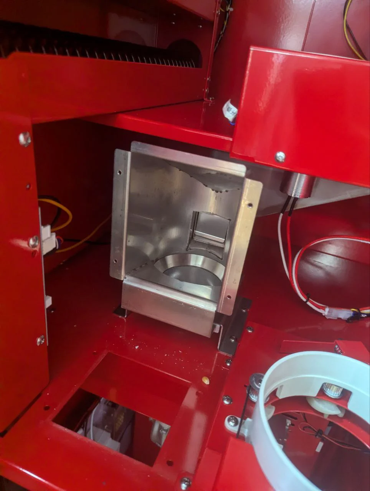 

_Dispensing chute assembly (left) and interior chamber mechanism (right)_

**Dispensing Chute Assembly**

The stainless steel dispensing chute guides popcorn from the production cylinders to the customer collection point. This food-contact surface requires regular cleaning and occasional replacement.

**Components:**

* Curved stainless steel chute
* Interior chamber with funnel design
* Central roller mechanism for smooth dispensing
* Mounting brackets and seals
* Sensor mounting points

**Maintenance Requirements:**

* Clean weekly with hot soapy water
* Inspect for wear, scratches, or damage monthly
* Replace if coating damaged or severe scratches present
* Verify smooth operation after reinstallation

**Replacement Procedure:**

1. Power off machine and allow cooling period
2. Remove mounting screws securing chute
3. Disconnect any sensor wiring
4. Carefully lift out old chute
5. Install new chute ensuring proper alignment
6. Reconnect sensors and secure mounting screws
7. Run test cycle to verify operation

#### Kernel Storage System

 _Top-down view of kernel hopper assembly and loading access point_

**Kernel Hopper Assembly**

The kernel hopper stores popcorn kernels and feeds them to the metering system. The assembly includes loading access, level sensors, and distribution mechanism.

**Components:**

* White rim guide for loading
* Dark interior storage chamber
* Mounting hardware for secure installation
* Level sensor brackets
* Feed mechanism connection point

**Capacity**: TBD kg of kernels

**Service Notes:**

* Inspect seal integrity monthly
* Clean interior quarterly to prevent oil buildup
* Verify level sensors functioning properly
* Check for kernel bridging or jamming
* Replace seals if leaking or damaged

#### Access and Security Components

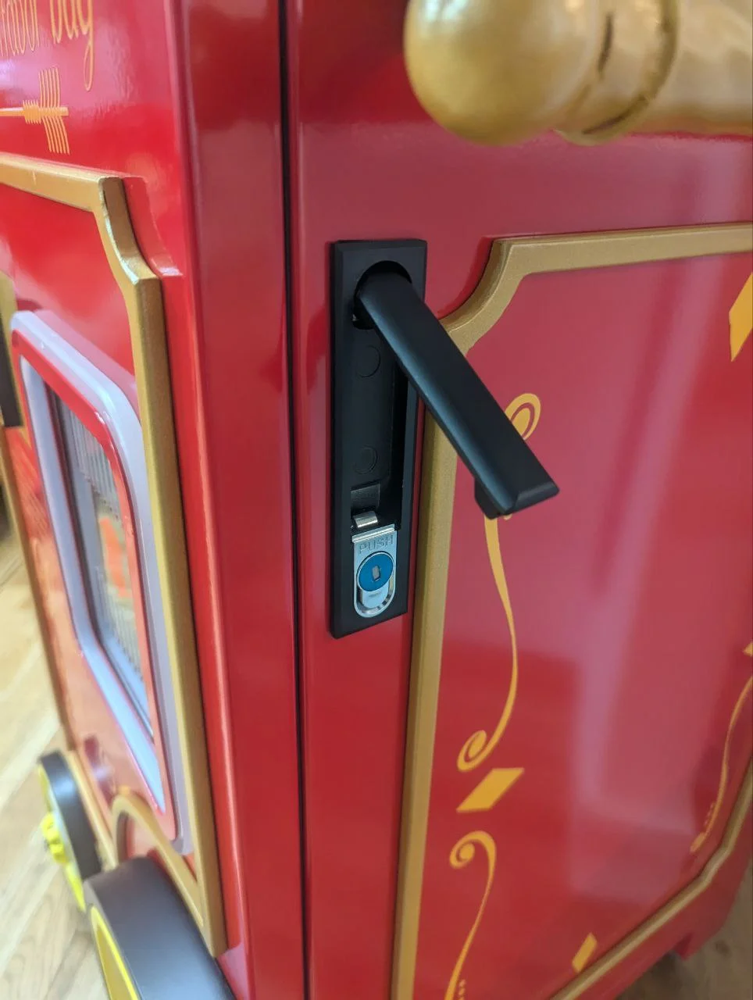 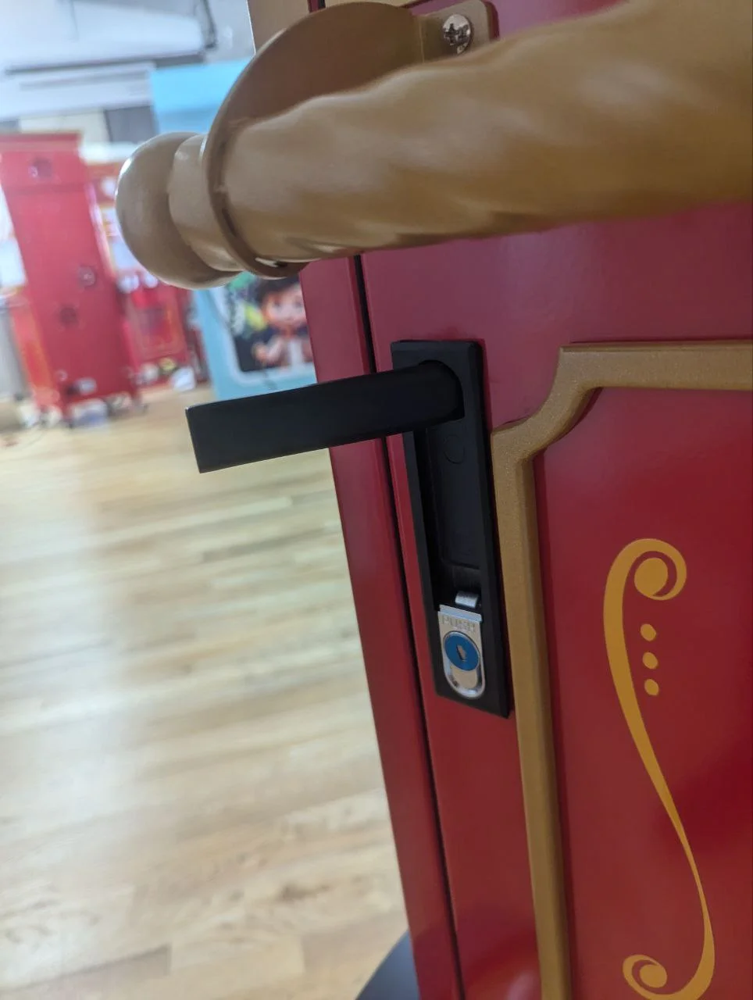

_Front door lock assembly (left) and internal lock mechanism with status indicator (right)_

**Door Lock System**

The Pop Cart features keyed lock access for operator service and security. The lock mechanism includes visual status indicators showing locked/unlocked state.

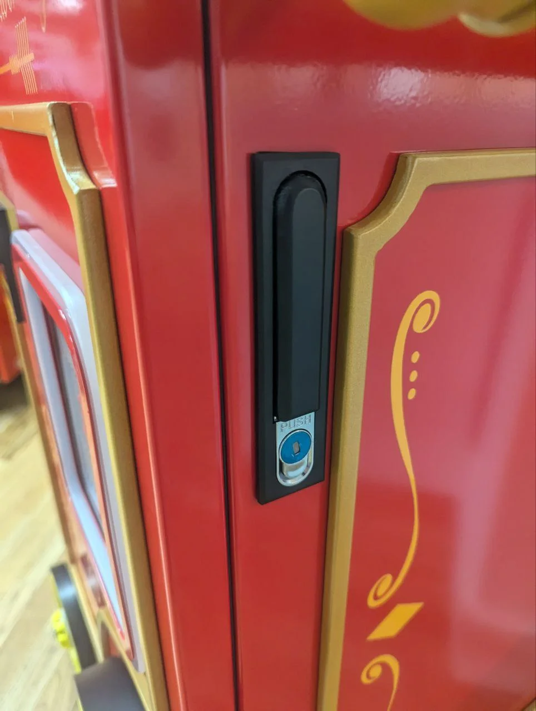 _Detailed view of lock mechanism showing blue locked status indicator_

**Lock Components:**

* Black exterior lock handle with keyhole
* Blue indicator shows lock status
* Internal locking mechanism
* Mounting hardware on red chassis
* Interlock safety switch

**Key Management:**

* Store spare keys in secure location
* Document key holders and access permissions
* Replace locks if keys lost or security compromised
* Test interlock switch function monthly

**Replacement Procedure:**

1. Obtain replacement lock and new keys from Sweet Robo
2. Power off machine completely
3. Remove interior access panel to reach lock mounting
4. Disconnect interlock switch wiring (document connections)
5. Remove mounting screws and extract old lock
6. Install new lock and reconnect interlock switch
7. Test lock operation and interlock function
8. Update key log with new key numbers

***

### Parts Categories

#### Consumables (Regular Replacement)

**Filters**

* Air intake filters
* Exhaust filters
* Replace every 3-6 months

**Seals and Gaskets**

* Door seals
* Component gaskets
* Replace annually or if damaged

**Cleaning Supplies**

* Food-safe cleaners
* Microfiber cloths
* Approved sanitizers

**Branded Consumables**

* Popcorn cups
* Receipt paper
* Packaging materials

#### Wear Components (Periodic Replacement)

**Heating Elements**

* Typically last 12-18 months
* Professional replacement recommended
* Signs of wear: uneven heating, slow cycles

**Sensors**

* Cup detection sensors
* Level sensors
* Temperature probes
* Calibrate every 6 months, replace as needed

**Mechanical Components**

* Dispensing mechanism parts
* Motor brushes
* Bearings
* Lubricate regularly, replace if worn

**Display Components**

* Touchscreen (impact damage)
* LED indicators
* Display cables

#### Critical Components (Professional Service Required)

**Control Board**

Main processor - requires certified tech

**Power Supply**

Electrical safety critical component

**Payment System**

PCI compliance requires certified service

**Safety Interlocks**

Must maintain proper function

**Motor Assemblies**

Professional diagnosis and replacement

***

### Parts Ordering

#### Information Required

When ordering replacement parts, provide:

* **Machine Serial Number**: Located on data plate (record here: \_\_\_\_\_\_\_\_\_\_\_\_\_\_)
* **Part Number**: Found in parts list or service documentation
* **Part Description**: Name and function of component
* **Quantity Needed**: Number of units to order
* **Installation Date Needed**: Lead time for delivery
* **Contact Information**: Your name, facility, phone, email

#### Ordering Methods

**Direct from Sweet Robo**

**Online**: \[Sweet Robo Parts Portal] **Phone**: Please contact for technical support via Sweet Robo Tracking App

Benefits: Guaranteed genuine parts, technical support, warranty coverage

**Authorized Distributors**

Contact Sweet Robo for list of authorized distributors in your region.

Benefits: Local stock, faster delivery, regional support

#### Lead Times

Consumables (filters, seals)

1-3 business days

Common Wear Parts

3-5 business days

Electronic Components

5-10 business days

Custom or Special Order

2-4 weeks

Emergency/Expedited

Overnight available (additional fees apply)

Stock common replacement parts on-site to minimize downtime. Recommended spare parts inventory: filters (2 sets), door seals (1 set), heating elements (1 set), sensors (cup detection, level).

***

### Service Contact Information

#### Sweet Robo Technical Support

For parts ordering, technical support, and service scheduling, see complete contact information:

[**Company Information**](../shared/company-info.md)

#### Service Types

**Warranty Service**

Covers manufacturing defects and component failures during warranty period. Registration required.

**Preventive Maintenance**

Scheduled service visits for cleaning, calibration, and inspection. Recommended quarterly.

**Emergency Repair**

Same-day or next-day service for critical failures. Premium rates may apply.

**Component Upgrade**

Installation of improved components or new features. Scheduled service.

#### Service Request Information

When requesting service, provide:

1. **Contact Details**: Name, phone, email, facility address
2. **Machine Information**: Serial number, model, installation date
3. **Problem Description**: Symptoms, error codes, when started
4. **Urgency Level**: Routine, priority, or emergency
5. **Access Details**: Facility hours, access requirements, parking

***

### Warranty Information

#### Standard Warranty Coverage

* **Duration**: 12 months from installation date (verify with purchase documentation)
* **Covered**: Manufacturing defects, component failures under normal use
* **Not Covered**: Damage from misuse, unauthorized modifications, lack of maintenance

#### Warranty Registration

Register your Pop Cart within 30 days of installation:

1. Visit Sweet Robo warranty registration portal
2. Provide serial number and installation date
3. Complete facility and contact information
4. Submit proof of purchase
5. Retain confirmation for records

**IMPORTANT - Warranty Requirements**

To maintain warranty coverage:

* Follow recommended maintenance schedules
* Use only genuine Sweet Robo parts
* Have service performed by authorized technicians
* Keep records of all maintenance and service
* Do not modify or alter machine components

#### Extended Warranty Options

Contact Sweet Robo for extended warranty and service contract options:

* **Extended Coverage**: Additional 12-24 months beyond standard warranty
* **Service Contracts**: Includes preventive maintenance visits
* **Parts & Labor**: Comprehensive coverage with priority service
* **Remote Monitoring**: Proactive issue detection and support

***

### Service Records

#### Recommended Documentation

Maintain a service log including:

* **Installation Date**: \_\_\_\_\_\_\_\_\_\_\_\_
* **Serial Number**: \_\_\_\_\_\_\_\_\_\_\_\_
* **Warranty Expiration**: \_\_\_\_\_\_\_\_\_\_\_\_
* **Last Service Date**: \_\_\_\_\_\_\_\_\_\_\_\_
* **Next Scheduled Service**: \_\_\_\_\_\_\_\_\_\_\_\_

#### Service History Log

| Date | Service Type | Parts Replaced | Technician | Notes |
| ---- | ------------ | -------------- | ---------- | ----- |
|      |              |                |            |       |
|      |              |                |            |       |
|      |              |                |            |       |

**Digital Service Records**

If your Pop Cart is connected to Sweet Robo's remote management system, service records are automatically maintained in your online portal. Access your account to view complete service history and schedule future maintenance.

***

### Common Part Numbers

_Note: This is a general reference. Always verify current part numbers with Sweet Robo before ordering._

#### Consumables

| Part Description  | Typical Part Number | Replacement Interval |
| ----------------- | ------------------- | -------------------- |
| Air Intake Filter | PC-FILT-001         | 3-6 months           |
| Exhaust Filter    | PC-FILT-002         | 3-6 months           |
| Door Seal Kit     | PC-SEAL-100         | 12 months            |
| Hopper Gasket     | PC-SEAL-110         | 12 months            |

#### Wear Components

| Part Description     | Typical Part Number | Replacement Interval |
| -------------------- | ------------------- | -------------------- |
| Heating Element Set  | PC-HEAT-200         | 12-18 months         |
| Cup Detection Sensor | PC-SENS-301         | As needed            |
| Level Sensor         | PC-SENS-302         | As needed            |
| Temperature Probe    | PC-SENS-310         | As needed            |

#### Structural Components

| Part Description   | Typical Part Number | Replacement Interval |
| ------------------ | ------------------- | -------------------- |
| Dispensing Chute   | PC-DISP-400         | As needed            |
| Door Lock Assembly | PC-LOCK-500         | As needed            |
| Hopper Assembly    | PC-HOPR-600         | As needed            |

**CAUTION**: Part numbers shown are examples only. Always obtain current part numbers from Sweet Robo before placing orders. Using incorrect parts may cause damage or safety hazards.

***

### Installation and Replacement Guidelines

#### General Replacement Procedure

For any component replacement:

**Document Current State**

Take photos of component before removal, note wire positions, document settings

**Power Off and Lockout**

Disconnect power and prevent accidental reconnection during service

**Allow Cooling Period**

Wait appropriate time for hot components to cool (minimum 30 minutes)

**Follow Proper Procedure**

Consult service manual or Sweet Robo support for specific component instructions

**Use Correct Tools**

Employ appropriate tools and avoid forcing components

**Test After Installation**

Run diagnostic tests to verify proper installation and operation

**Document Service**

Record part numbers, installation date, and any configuration changes

#### Professional Service Required

The following components require certified technician installation:

* Control board and electronics
* Heating element assemblies
* Payment system components
* Safety interlock systems
* Power supply and distribution
* Motor assemblies
* Touchscreen replacement
* Software updates or reconfiguration

**WARNING**: Attempting unauthorized repairs on electrical components may result in electric shock, fire hazard, equipment damage, voided warranty, and personal injury. Contact Sweet Robo for professional service.

***

### Technical Support Resources

#### Available Support Channels

**Phone Support**

Speak directly with technical support specialists during business hours. Fastest resolution for urgent issues.

**Email Support**

Detailed technical questions with documentation or photos. Response within 1 business day.

**Online Portal**

Access service history, download manuals, track service requests, order parts online 24/7.

**Remote Diagnostics**

For network-connected machines, technicians can access diagnostic data remotely for faster troubleshooting.

#### Support Documentation

Available resources:

* **Service Manuals**: Component-specific repair procedures
* **Parts Diagrams**: Exploded views and part identification
* **Video Tutorials**: Common maintenance and replacement procedures
* **Technical Bulletins**: Updates, modifications, and important notices
* **FAQ Database**: Answers to common technical questions

***

### Safety Recalls and Updates

Sweet Robo will notify registered owners of any safety recalls, critical updates, or recommended modifications. Ensure your contact information is current in the warranty registration system.

**Check for Updates**: Contact Sweet Robo or visit the support portal to verify your Pop Cart has all current safety updates and modifications installed.

***

### Decommissioning and Disposal

When retiring a Pop Cart from service:

1. **Data Removal**: Clear all payment data and customer information
2. **Consumables**: Remove and properly dispose of food products
3. **Environmental**: Follow local regulations for electronic waste disposal
4. **Recycling**: Contact Sweet Robo for component recycling programs
5. **Documentation**: Retain service records per regulatory requirements

***

### Next Steps

* [**Maintenance**](maintenance.md) - Regular maintenance procedures
* [**Troubleshooting**](troubleshooting.md) - Diagnose and resolve issues
* [**Operation Guide**](operation.md) - Daily operation procedures

For parts ordering or service requests, contact Sweet Robo: [Company Information](../shared/company-info.md)

***

## Safety

## Safety & Regulatory Compliance

Your safety and the safety of others are of utmost importance when operating and maintaining the Pop Cart machine. Please read, understand, and follow all safety precautions and instructions in this manual before operating or servicing the machine.

Failure to adhere to these safety precautions could result in personal injury, damage to the machine, or hazardous situations.

### User Roles

The Pop Cart machine is designed for **two distinct types of users**:

* **Customer Users**: Any member of the public — including children — who interacts with the machine via the touchscreen to place and pay for an order. This interaction is safe, guided, and limited to external controls only.
* **Operators / Authorized Staff**: Trained personnel responsible for machine setup, internal access, maintenance, troubleshooting, and sanitation. These users must understand both the mechanical and food safety protocols outlined in this manual.

**WARNING:** Only operators may open the machine cabinet, access internal components, or modify hardware or system settings.

***

### General Safety

#### Read the Entire Manual

* Before operating the Pop Cart, thoroughly read and understand this entire manual
* Familiarize yourself with all operating procedures, safety guidelines, and warnings
* Keep this manual accessible for future reference

#### Intended Use Only

* Operate the Pop Cart only for its intended purpose of making popcorn
* Do not modify the machine or use it for other purposes

#### Adult Supervision

* This machine is not a toy
* It should only be operated by adults or under adult supervision
* Keep un-supervised children and pets away from the machine during operation

***

### Customer Safety

The machine is designed to be safe for public interaction, including use by children. Key features include:

**Touchscreen-Only Interface**

Customers interact solely through a sealed touchscreen interface.

**Automatic Dispensing Window**

Opens only when popcorn is ready and provides safe access to finished product.

**No Exposed Moving Parts**

All internal mechanisms, heating elements, and popping chambers are fully enclosed and inaccessible to users.

**Child-Safe Design**

The dispensing area is designed to prevent access to internal components during operation.

**CAUTION:** Customers or untrained individuals must **never** interact with the machine's internals. Children should not insert hands or objects into the dispensing chute or topping drop area.

***

### Electrical Safety

**WARNING: Electrical Shock Hazard. Can cause serious injury or death.**

#### Power Requirements

* Requires: **110-125V AC (US variant)** or **220-240V AC (International variant)**
* Use a grounded 3-prong outlet appropriate for your model
* Never bypass grounding - verify with socket tester if unsure
* For complete electrical specifications, see [Electrical Requirements](setup.md#electrical-requirements)

#### Power Cord Safety

* Before each use, inspect the power cord for any damage, cuts, or fraying.
* If the cord is damaged, do not operate the machine. Contact customer support for a replacement.
* Use only the power cord supplied with the Pop Cart machine or an identical replacement recommended by the manufacturer.
* Do not use damaged cords or extension cables.

#### General Electrical Safety

* Keep all liquids away from the machine's electrical components, power inlet, and internal electronics
* Do not immerse the machine or its electrical parts in water or any liquid
* Never operate near water or in wet environments
* Always disconnect the machine from the power source (unplug it) before cleaning, performing maintenance, servicing, or when it's not in use for extended periods
* Do not open electrical panels unless trained
* Only personnel with appropriate electrical knowledge should service the machine

#### Shutdown Procedures

Always use the backend **software shutdown button** to power down the internal PC before disconnecting power or turning off the main breaker.

Use the **Power Switch** to safely isolate the system.

Never unplug the machine while it is powered on.

Unplug the unit only after switching off the **power switch** (not during operation).

**Important:** All electrical work must comply with local codes. Certification bodies may inspect for proper grounding and power isolation.

***

### Operational Safety

#### Machine Placement

* Operate the machine on a stable, flat, and level surface to prevent tipping or instability.
* Keep the machine on a **level, hard floor**
* Allow **at least 50 cm** (20 inches) of clearance behind the unit for ventilation
* Do not block ventilation grilles or exhaust vents
* Maintain **at least 20 cm** between machines if placed side by side
* Ensure the door can open fully for service access

#### Environment

* Keep the area around the machine clear of obstructions.
* Do not place the machine near flammable materials, heat sources (like direct sunlight or heaters), or excessive moisture.
* Ensure adequate ventilation to dissipate heat from popping operations.

#### Heat Safety

**WARNING: Hot Surface Hazard**

The popping chambers, heating elements, and freshly popped popcorn reach high temperatures during operation. Allow adequate cooling time before accessing internal components.

* Popping chambers and heating elements can reach temperatures exceeding 200°C (392°F)
* Freshly dispensed popcorn may be very hot
* Allow the machine to cool for at least 30 minutes after shutdown before accessing internal components
* Never touch heating elements or internal components during or immediately after operation

#### Operation Guidelines

* Follow the manufacturer's recommendations for kernel and seasoning loading quantities.
* Do not insert hands, fingers, tools, or any foreign objects into the dispensing chutes, seasoning dispensers, topping drop area, or any openings in the machine, especially during operation.
* Do not allow children or untrained staff near the machine while it is active.
* Always power off before refilling internal components.

#### Emergency Procedures

* Familiarize yourself with the main power switch to quickly shut down the machine in an emergency.
* If you observe any abnormalities, unusual noises, smoke, or overheating, immediately turn off and unplug the machine from its power source and contact customer support via Sweet Robo Tracking App.

***

### Mechanical Safety

* Never insert hands or tools into moving parts during operation.
* Popcorn jams or seasoning clogs must be cleared with the machine powered down.
* Never bypass safety interlocks or sensors.
* Keep all protective covers and guards in place.

#### Machine Transportation

**CAUTION: Heavy Equipment**

The Pop Cart weighs approximately 140 kg (309 lbs). Use proper lifting equipment and techniques when moving or repositioning the machine.

* Two or more people are required for safe transport
* Use a sturdy hand truck or lifting equipment rated for the machine's weight
* Keep the machine upright during transport to prevent damage to internal components
* Avoid rolling the machine long distances as this may damage wheels and internal mechanisms
* Secure the machine properly during vehicle transport to prevent shifting

***

### Cleaning and Maintenance Safety

**CAUTION: Risk of minor injury or equipment damage.**

**For detailed cleaning instructions:** Follow the comprehensive cleaning procedures in the [Maintenance](maintenance.md) section.

#### Safety Precautions

* **Disconnect Power First:** **ALWAYS** disconnect the Pop Cart from the electrical outlet before performing any cleaning or maintenance tasks.
* **Cool Down:** Allow heating elements and popping chambers to cool completely (minimum 30 minutes) before cleaning or touching.

#### Protective Measures

* Wear appropriate protective gear if recommended for specific cleaning tasks (e.g., gloves when handling cleaning chemicals).
* Avoid loose clothing, jewelry, or long hair that could get caught in any moving parts if internal access is required.
* Be mindful of potential electrostatic discharge (ESD) when working near electronic components. Consider using an ESD wrist strap if servicing internal electronics.

#### Approved Cleaning Materials

**Safe to Use:**

* Warm water with grease-removing dish soap (e.g., Dawn) for general cleaning
* Cool or room temperature water for rinsing
* Multi-Quat sanitizer (quaternary ammonium-based product approved for food contact surfaces)
* 70% isopropyl alcohol (for cleaning the touchscreen and outer surfaces only)
* Food-grade stainless steel cleaner for metal surfaces

**Do Not Use:**

* Paint thinner
* Volatile oils
* Bleach or alkaline cleaners
* Abrasive powders or scouring pads
* Acetone or solvent-based chemicals
* Harsh chemicals that could damage surfaces or internal components

These substances may corrode plastics, strip protective coatings, or damage sensitive components.

#### Special Cleaning Considerations

* **Water Temperature:** Use warm water (comfortable to touch, not boiling) for washing
* **Thorough Rinsing:** Always rinse multiple times to remove all soap residue
* **Sanitizer Evaporation:** Allow sanitizer to fully evaporate before loading fresh kernels or seasonings
* Use only cleaning agents and materials recommended by the manufacturer unless instructed to do so by Sweet Robo support staff.

**Required Cleaning Frequency:**

* **Daily Cleaning**: Wipe down exterior surfaces and touchscreen
* **Weekly Deep Clean**: Clean popping chambers, seasoning dispensers, and internal chutes
* **Monthly Maintenance**: Full system inspection and deep cleaning (see [Maintenance](maintenance.md))

***

### Food Safety Compliance

The Pop Cart machine is designed with food-contact safety in mind:

* All hoppers, tubes, chutes, and serving components must be **food-grade certified**
* Internal surfaces must be cleaned and sanitized regularly using approved cleaning procedures
* Operators must discard expired kernels, seasonings, or other consumables
* No foreign materials may enter the hoppers, seasoning dispensers, or popping chambers
* Use only **approved popcorn kernels** and **food-grade seasonings**
* Use only approved consumables and replacement parts

#### NAMA Food Safe Certification

The Pop Cart is designed to meet NAMA (National Automatic Merchandising Association) food safety standards:

* **Food-Contact Materials:** All surfaces that contact food are made from food-grade materials
* **Sanitation Design:** Components are designed for easy cleaning and sanitization
* **Temperature Control:** Heating systems maintain proper popping temperatures while preventing overheating
* **Contamination Prevention:** Sealed pathways prevent foreign material contamination

***

### Auto Shut-Off Safety Features

The machine includes several built-in safety triggers:

* Temperature sensors monitor heating element conditions
* Internal diagnostic sensors
* Dispenser malfunctions
* Hardware stalls or failure conditions

When triggered:

* Dispensing, heating, and motor systems shut down automatically
* The touchscreen may remain powered for diagnosis
* Logs of the event are stored for technician review

Always resolve the root issue before restarting the machine.

***

### Servicing and Repairs

* **Qualified Technicians Only:** Repairs, modifications, or servicing beyond routine cleaning and operator-level maintenance (as described in this manual) should only be performed by qualified service technicians authorized by the manufacturer.
* **No Unauthorized Disassembly:** Attempting to disassemble or repair complex internal components yourself may void the warranty, result in further damage to the machine, or cause personal injury.

**WARNING:** Unauthorized repairs or alterations may **void the warranty**. Always contact **Sweet Robo support** for approval before making internal changes.

Sweet Robo recommends notifying a certified technician before performing service or repairs.

***

### Operator Responsibility

Operators must:

* Follow the cleaning procedures outlined in the [Maintenance](maintenance.md) section
* Keep all protective covers and guards in place
* Avoid bypassing safety interlocks or sensors
* Disconnect power before servicing or manual cleaning
* Use only approved consumables and replacement parts
* Open machine panels or internal compartments only when authorized
* Refill or replace internal components (kernels, seasonings, cups)
* Perform regular cleaning and servicing tasks
* Access backend diagnostic settings when needed for troubleshooting

***

### Inspection & Regulatory Compliance

The Pop Cart is designed to meet industry safety and food handling standards:

#### Certifications

* **NAMA Food Safe Certification**: Designed to meet National Automatic Merchandising Association food safety standards
* **UL / TUV Electrical Safety**: Electrical systems certified for safe operation

#### Documentation Requirements

To meet regulatory requirements:

* Keep a written log of cleaning procedures, maintenance activities, and supply refills
* Ensure documentation is readily available for inspection by health authorities
* Contact Sweet Robo support for certification documents as needed

#### Safety Labels

The machine includes labeling for:

* Electrical input ratings
* Manufacturer and model identification
* Serial number and date of production
* Safety warning symbols (hot surfaces, electrical hazard, pinch hazard)

If a label becomes damaged or unreadable, it must be replaced before the machine returns to service.

***

### Training Requirements

All operators must be trained on:

* Proper startup/shutdown procedures
* Emergency procedures
* Food safety protocols
* Basic troubleshooting
* Cleaning and maintenance schedules
* When to call for service

***

### Emergency Contact

In case of any doubts, concerns, emergencies related to the machine's operation, or if servicing is required:

* **Emergency Support:** support@sweetrobo.com | +1-844-SWEETRB | Sweet Robo Tracking App
* For complete contact information, see [Company Information](../shared/company-info.md)

Remember that failure to adhere to these safety precautions could result in injuries, damage to the machine, or hazardous situations. By following these guidelines, you ensure a safe and enjoyable experience while using the Pop Cart.

Keep emergency numbers posted near machine.

***

_Generated from individual sections on /Users/lightwing/Documents/GitHub/SweetRoboManuals/pop-cart_
