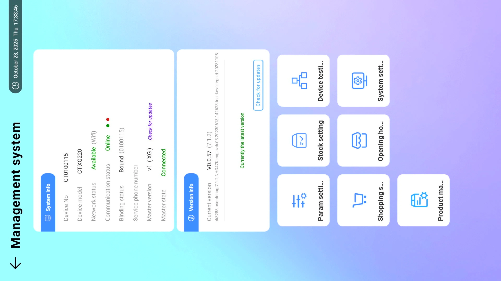
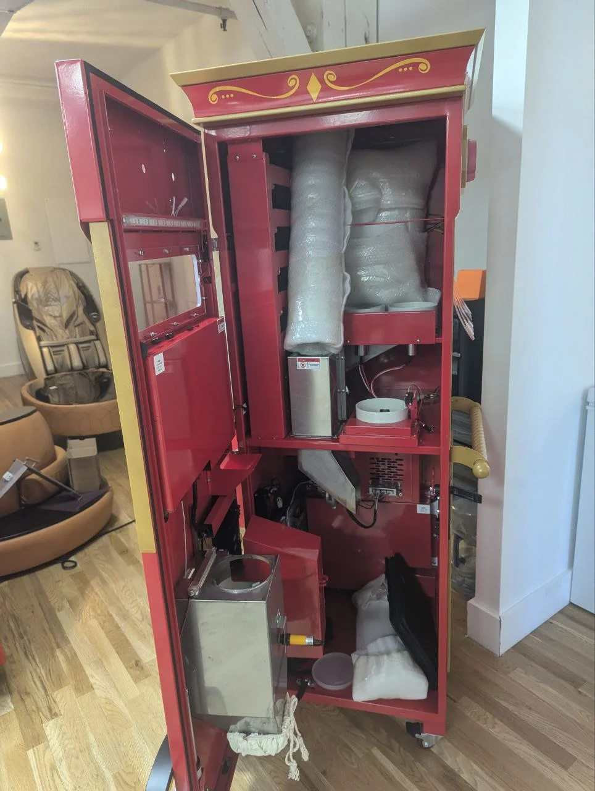

# CSS Refactoring Test Page

This page tests all the refactored CSS classes.

---

## Image Size Tests

### Default Image (50vh)

*Default: No class, should be 50vh max*

### img-small (30vh)

*Small: 30vh max, 300px wide*

### img-medium (50vh)

*Medium: 50vh max, 500px wide*

### img-large (70vh)

*Large: 70vh max, 700px wide*

### img-xl (90vh)

*Extra Large: 90vh max, 900px wide*

---

## Semantic Alias Tests

### img-ui-screenshot

*UI Screenshot: 80vh max, 600px wide*

### img-diagram

*Diagram: 70vh max, 700px wide*

### img-detail-photo

*Detail Photo: 40vh max, 400px wide*

### img-icon

*Icon: 20vh max, 150px wide*

---

## Layout Tests

### Side-by-Side Images

*Side-by-side layout test*

### Three-Column Images

*Three-column layout test*

---

## Conditional Visibility Tests

### Pending Content

This is pending content that needs review. It should show an orange warning banner with "⚠️ PENDING REVIEW".

### Dev-Only Content

This is dev-only content. It should be hidden unless ?dev=true is in the URL.

---

## Component Tests

### Info Box

This is an info box (blue background). Used for helpful information.

### Important Box

**IMPORTANT:** This is an important box (purple background).

### Warning Box

**WARNING:** This is a warning box (pink/red background).

### Caution Box

**CAUTION:** This is a caution box (yellow background).

---

## Deprecated Class Tests

These should still work but will be removed in v2.0:

### setup-image (deprecated)

*Deprecated .setup-image class*

### operation-screenshot (deprecated)

*Deprecated .operation-screenshot class*

---

## Test Results

**To verify:**
1. ✅ All images display correctly
2. ✅ Size differences are visible (small < medium < large < xl)
3. ✅ Semantic aliases work (ui-screenshot, diagram, detail-photo, icon)
4. ✅ Layout containers work (side-by-side, three-column)
5. ✅ Pending box shows orange warning banner
6. ✅ Dev-only content is hidden by default
7. ✅ Callout boxes have correct colors
8. ✅ Deprecated classes still work

**Print testing:**
- Open print preview (Cmd/Ctrl + P)
- Verify images scale appropriately for print
- Verify pending banner is hidden in print
- Verify dimensions match expected percentages

**Dev mode testing:**
- Add `?dev=true` to URL
- Verify dev-only content becomes visible
