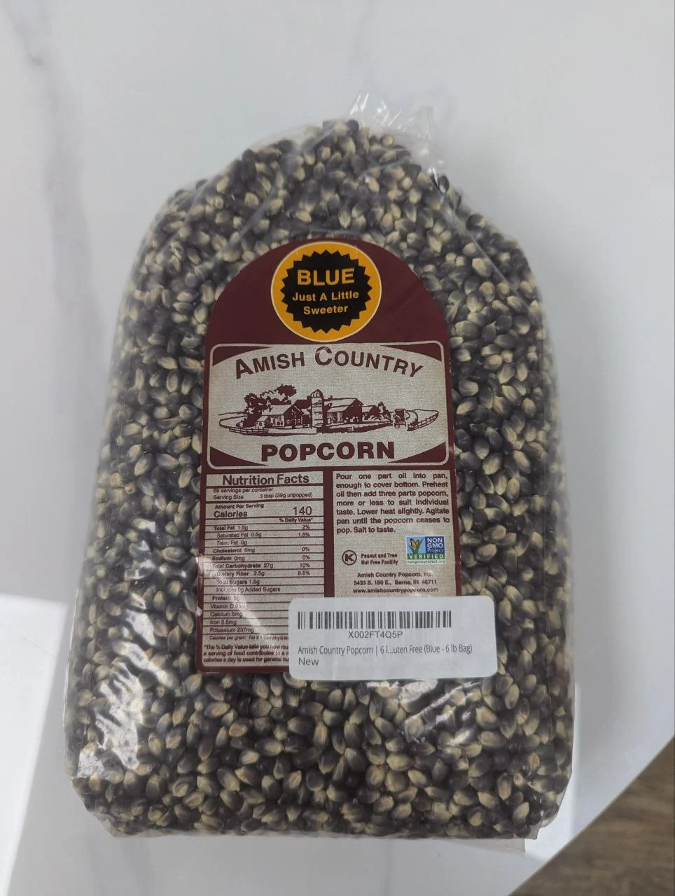

# Maintenance

Proper maintenance ensures optimal performance, longevity, and food safety for your Pop Cart. This section covers cleaning procedures, supply restocking, and preventive maintenance schedules.

<strong>IMPORTANT</strong>

Always disconnect power before performing any internal cleaning or maintenance. Allow heating elements to cool completely (30 minutes minimum) before touching internal components. See <a href="safety.html">Safety & Regulatory Compliance</a> for complete safety procedures.

## Maintenance Schedule

Daily

Exterior wipe-down, touchscreen cleaning, dispensing window cleaning, visual supply check

Weekly

Interior cleaning, deep clean of dispensing chute, restock supplies, empty stray popcorn collector

Monthly

Component inspection, calibration check, deep cleaning of popping chambers, filter cleaning

Quarterly

Professional service inspection, system diagnostics, component replacement if needed

Annually

Comprehensive service, electrical inspection, safety system verification

## Daily Maintenance

**Cleaning:** Wipe touchscreen with microfiber cloth, clean exterior panels with damp cloth and mild detergent, clean dispensing window, dust decorative elements.

**Supplies:** Complete [Supply Checklist](operation.md#supply-checklist) - verify kernel hoppers, seasonings, and cups.

## Weekly Maintenance

<strong>WARNING</strong>: Disconnect power and wait 30 minutes for cooling before interior cleaning.

**Interior Cleaning:** Remove unpopped kernels from both chambers, wipe interior walls with damp cloth and food-safe cleaner (be careful to avoid electronics and water-sensitive components), wipe dispensing chute with damp cloth, clean sensors gently with dry cloth only.

**Stray Popcorn Collector:** Empty and clean the stray popcorn collector. Reinstall in proper position after cleaning.

<strong>WARNING</strong>: Do not clean electronics or allow water near electrical components. Use only damp (not wet) cloths for cleaning. Avoid getting moisture on control boards, sensors, or wiring.

## Supply Restocking

### Popcorn Kernels

<strong>IMPORTANT: Use Only Sweet Robo Popcorn Kernels</strong>

The Pop Cart is calibrated and tested exclusively with Sweet Robo branded popcorn kernels. Our cooking parameters, temperature settings, and timing controls are optimized for these specific kernels to ensure consistent quality and optimal popping performance. Using other brands may result in poor popping results, increased waste, or machine errors.

<em>Use only Sweet Robo branded popcorn kernels - machine settings are optimized for these kernels</em>

<em>6-pound bag size and best-before date label</em>

**Loading Procedure:**

<strong>Check and Fill</strong> 
Verify kernels are within best-before date (typically 18-24 month shelf life). Open top access panel and pour into both hopper openings. Each holds up to 3 kg (6 kg total).

<strong>Verify Level</strong> 
Check fill levels through the viewing window (transparent hopper tubes visible from outside). Maintain minimum 1 kg per cylinder for continuous operation.

<strong>Storage</strong> 
Store unopened bags in cool, dry location. Once opened, use within 60 days. Rotate stock (first in, first out).

### Seasoning Packet Dispensers

<strong>IMPORTANT: Use Only Sweet Robo Branded Seasoning Packets</strong>

The Pop Cart seasoning dispensers are designed exclusively for Sweet Robo branded seasoning packets. Non-approved seasoning packets may have different dimensions and can get stuck in the dispensing mechanism, causing malfunctions and requiring service calls.

The Pop Cart has 5 seasoning dispenser lanes that hold pre-packaged seasoning packets. Each lane can be assigned different flavor varieties based on your inventory configuration.

**Seasoning Packet Loading Procedure:**

<h3>Access Dispenser Lanes</h3>
Open the top service panel to access the 5 seasoning dispenser rows (lanes 1-5).

<h3>Prepare Packets</h3>
Each Sweet Robo seasoning packet has a perforated cut line. Fold the packet at the cut line to create a crease.

<h3>Insert Packets Vertically</h3>
Insert packets into the dispenser rows fold-first, standing vertical. The folded edge should go in first, with the packet standing upright in the lane.

<h3>Fill Dispenser Rows</h3>
Add multiple packets to each lane as needed. Do not overfill - leave space for packets to drop freely during dispensing.

<h3>Test Dispensing</h3>
Use the admin Testing interface to test each lane individually and verify smooth packet delivery.

IMAGE: SEASONING PACKET FOLDING AT CUT LINE

IMAGE: PACKETS INSERTED VERTICALLY IN DISPENSER ROWS

<strong>WARNING</strong>: Using non-Sweet Robo brand seasoning packets will void your warranty and may cause dispenser jams. Only use packets specifically provided or approved by Sweet Robo.

### Popcorn Cups

**Cup Loading Procedure:**

<h3>Open Cup Dispenser</h3>
Access the cup dispenser mechanism through the designated service door.

<h3>Orient Cups Correctly</h3>
Ensure branded popcorn cups are oriented properly for dispensing (opening facing correct direction).

<h3>Load Cup Stack</h3>
Insert cups into the dispenser stack. Do not exceed maximum capacity to prevent jams.

<h3>Test Cup Drop</h3>
Use admin Testing interface to perform a test cup drop and verify smooth operation.

IMAGE: CUP DISPENSER LOADING

IMAGE: CORRECT CUP ORIENTATION

## Monthly Maintenance

### Component Inspection

#### Heating Elements
Inspect for discoloration, damage, or excessive buildup. Clean with soft brush. Replace if damaged.

#### Sensors
Test all sensors (cup detection, temperature probes). Clean sensors gently with dry cloth only - never use liquid cleaners on sensors.

#### Door Seals
Check gaskets and seals for wear, cracks, or gaps. Replace if damaged to maintain proper temperature.

#### Electrical Connections
Visually inspect wiring for wear, loose connections, or damage. Tighten connections as needed.

#### Dispensing Mechanism
Lubricate moving parts per manufacturer specifications. Check for wear or binding.

#### Ventilation
Clean air intake and exhaust filters. Replace filters per schedule or if visibly dirty.

### Calibration Check

Enter operator menu and access diagnostic mode

Run calibration test for portion control

Verify dispensed portions match configured settings

Adjust calibration if portions are under/over target

Document calibration results for tracking

### Deep Cleaning

Perform comprehensive deep cleaning of entire machine:

- Remove and wash all removable components
- Clean behind and under machine (if accessible)
- Detail clean all interior surfaces
- Sanitize food-contact surfaces
- Clean and organize cable management
- Inspect for any pest activity

## Preventive Maintenance

### Recommended Service Intervals

Heating Element Replacement

Every 12-18 months or as needed

Door Seal Replacement

Every 12 months or if damaged

Filter Replacement

Every 3-6 months depending on environment

Sensor Calibration

Every 6 months

Professional Service

Every 3-6 months recommended

Safety Inspection

Annually by certified technician

### Professional Service

Schedule professional service when:

- Machine displays persistent error codes
- Performance degrades despite proper cleaning
- Annual safety inspection is due
- Major component replacement is needed
- You notice unusual sounds, smells, or behavior

<h4>Service Contact</h4>

For professional service scheduling, parts ordering, or technical support, see contact details at the end of this section.

## Food Safety Guidelines

### Handling Consumables

- Store all food products in clean, dry environments
- Check expiration dates regularly and rotate stock
- Never use expired kernels or seasoning packets
- Keep consumables away from chemicals or cleaning supplies
- Handle seasoning packets with clean, dry hands

### Cleaning and Sanitization

<strong>IMPORTANT: Damp Cloth Cleaning Method</strong>

The Pop Cart contains sensitive electronics and components that can be damaged by water. Always use the damp cloth method for cleaning - never spray liquids directly on the machine or submerge components in water.

**Approved Cleaning Products:**

#### ✅ Approved for Pop Cart
• <strong>Food-safe dish soap</strong> (like Dawn) for general cleaning 
• <strong>Multi-Quat Sanitizer</strong> (quaternary ammonium-based, food-safe) 
• <strong>Ecolab Sink & Surface Cleaner Sanitizer</strong> (recommended all-in-one solution) 
• <strong>70% isopropyl alcohol</strong> (touchscreen and external surfaces only) 
• <strong>Warm water</strong> (for dampening cloths - not for direct application) 
• Clean, lint-free microfiber cloths

#### ❌ Never Use
• Spray bottles aimed at machine 
• Bleach or harsh alkaline cleaners 
• Abrasive powders or scouring pads 
• Wet mops or soaking methods 
• Any liquids near electronics

<h4>Recommended: Ecolab Sink & Surface Cleaner Sanitizer</h4>

Sweet Robo recommends Ecolab Sink & Surface Cleaner Sanitizer for Pop Cart maintenance. This EPA-registered, food-contact-safe product combines cleaning and sanitizing in one step, making it ideal for the damp cloth cleaning method required for the Pop Cart. It's effective against bacteria, viruses, and fungi while being safe for food service equipment.

**Damp Cloth Cleaning Procedure:**

<h3>Wash Hands</h3>
Thoroughly wash hands before handling food-contact surfaces or consumables.

<h3>Prepare Cleaning Solution</h3>
Mix food-safe dish soap with warm water in a separate container (not on the machine).

<h3>Dampen Cloth - Not Machine</h3>
Dip clean cloth into cleaning solution, then wring out thoroughly until cloth is only damp (not dripping).

<h3>Wipe Food-Contact Surfaces</h3>
Wipe down food-contact surfaces with damp soapy cloth. Avoid electronics, control boards, sensors, and wiring.

<h3>Rinse Cloth and Wipe Again</h3>
Rinse cloth with clean water, wring out thoroughly, and wipe surfaces again to remove soap residue.

<h3>Apply Sanitizer with Damp Cloth</h3>
Prepare Multi-Quat Sanitizer per manufacturer instructions. Apply to food-contact surfaces using a clean damp cloth.

<h3>Allow to Air Dry Completely</h3>
<strong>DO NOT rinse after sanitizing</strong> - rinsing removes the sanitizer and undoes sanitation. <strong>DO NOT use drying towels</strong> - towels can re-contaminate the sanitized surface. Allow sanitizer to completely air dry (5-10 minutes). The Multi-Quat sanitizer oxidizes and becomes inert as it dries.

<strong>About Multi-Quat Sanitizers:</strong>

Multi-Quat (multi-quaternary ammonium) sanitizers are food-safe antimicrobial solutions specifically designed for food service equipment. They are EPA-registered, approved for food contact surfaces, and effective against bacteria, viruses, and fungi. When used at proper concentrations, they are no-rinse formulations - the sanitizer must air dry completely to be effective.

### Temperature Monitoring

- Verify ambient temperature stays within operating range (15-30°C / 59-86°F)
- Monitor internal component temperatures through diagnostics
- Address any overheating issues immediately
- Ensure adequate ventilation around machine

## Maintenance Log

Keep a maintenance log documenting:

- Date and type of maintenance performed
- Consumables restocked and quantities
- Any issues observed or repairs made
- Component replacements with part numbers
- Professional service visits and findings
- Cleaning schedule completion

Regular documentation helps identify patterns, track component lifespan, and maintain warranty compliance. Many issues can be prevented by consistent maintenance tracking.

### Sample Maintenance Log Format

| Date | Task | Consumables/Parts | Issues Found | Technician | Next Due |
|------|------|-------------------|--------------|------------|----------|
| _ /_ /_ | Daily cleaning | | | _ _ | _ /_ /_ |
| _ /_ /_ | Kernel refill | 6kg kernels | | _ _ | _ /_ /_ |
| _ /_ /_ | Seasoning restock | 20 packets (5 lanes) | | _ _ | _ /_ /_ |
| _ /_ /_ | Cup reload | 50 cups | | _ _ | _ /_ /_ |
| _ /_ /_ | Weekly deep clean | | | _ _ | _ /_ /_ |
| _ /_ /_ | Monthly inspection | | | _ _ | _ /_ /_ |
| _ /_ /_ | Component service | Replaced part #___ | | _ _ | _ /_ /_ |

## Troubleshooting Maintenance Issues

If you encounter problems during maintenance:

- **Difficult to clean buildup**: May indicate operating temperature issues or need for more frequent cleaning
- **Excessive waste**: Check portion calibration and popping temperature settings
- **Unpopped kernels accumulating**: Verify Sweet Robo branded kernels are being used and check popping chamber temperature settings

For persistent issues, refer to the [Troubleshooting](troubleshooting.md) section.

## Next Steps

- **[Troubleshooting](troubleshooting.md)** - Diagnose and resolve operational issues
- **[Parts & Service](parts-service.md)** - Component identification and replacement procedures
- **[Operation Guide](operation.md)** - Return to daily operation procedures

For maintenance support, contact Sweet Robo: [Company Information](shared/content/company-info.md)
