# Operation Guide

This section covers daily operations, customer service procedures, and operator controls for the Pop Cart popcorn vending machine.

## Daily Startup Procedure

Perform these steps at the beginning of each operating day:

**Verify Supply Levels** 
• Check both kernel hoppers are adequately filled 
• Confirm all 5 seasoning dispensers are stocked 
• Verify cup supply is sufficient 
• Check oil/butter reservoir level

**Inspect Machine Condition** 
• Visually inspect exterior for damage or tampering 
• Verify dispensing window is clean and clear 
• Check for any error messages on screen 
• Ensure no obstructions in customer access area

**Power On System** 
• Turn on main power if switched off overnight 
• Allow 30-60 seconds for system boot 
• Verify touchscreen displays welcome screen 
• Check that all LEDs indicate normal operation

**Perform Test Cycle** 
• Run one test transaction (see Test Mode below) 
• Verify popping mechanism operates correctly 
• Confirm dispensing works properly 
• Test payment processing if possible

**Enable Customer Access** 
• Unlock any overnight security features 
• Post operating hours if applicable 
• Ensure area lighting is adequate 
• Mark machine as "In Service"

## Customer Operation Flow

The Pop Cart provides an intuitive touchscreen interface guiding customers through the purchasing process. Understanding this flow helps operators assist customers and troubleshoot issues.

### Step 1: Popcorn Selection

*Customer selects their preferred popcorn variety from the Two Popcorn options*

The customer journey begins with popcorn selection:

**Available Options:**
- **Blue Burst**: Premium blue popcorn variety with slightly sweeter flavor
- **Sunny Crunch**: Classic yellow popcorn with traditional taste

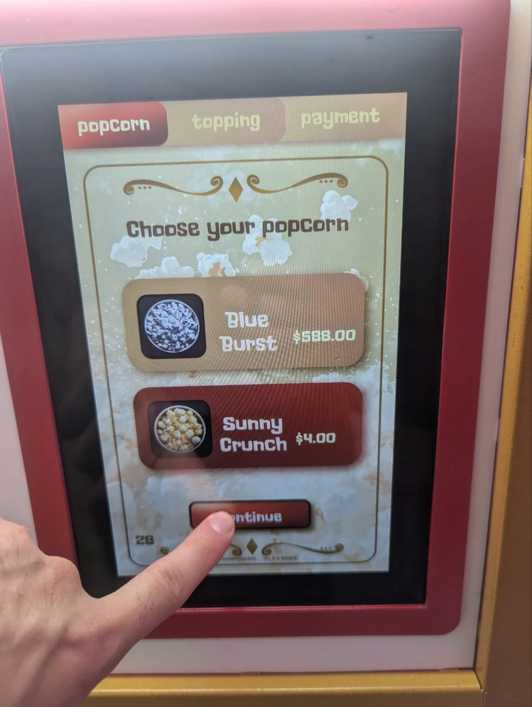
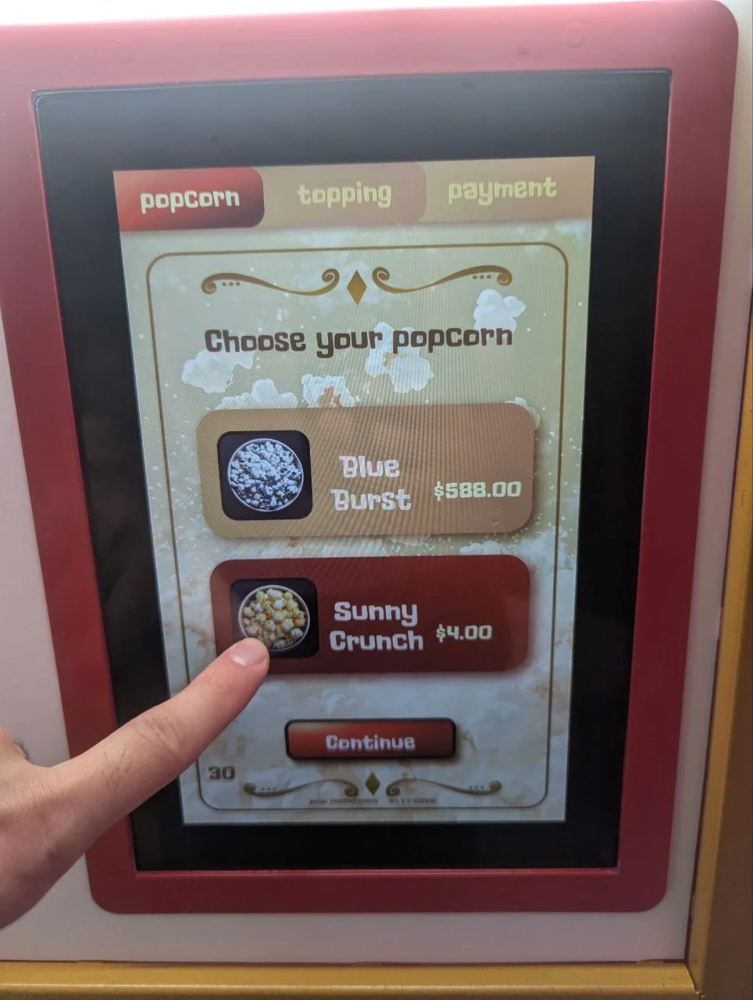

*Customer interaction: selecting Sunny Crunch popcorn variety*

**Customer Actions:**
1. Tap desired popcorn variety on the touchscreen
2. Selection highlights to confirm choice
3. Tap "Continue" button to proceed to toppings

Pricing displays next to each popcorn option. The system can be configured for different pricing tiers based on size or variety through the operator menu.

### Step 2: Topping Selection

*Customer can choose up to 2 flavor toppings with individual pricing*

After selecting popcorn, customers add flavor toppings:

**Available Toppings:**
- **Butter** - Classic butter flavor ($1)
- **Chipotle** - Smoky spice ($2)
- **Garlic** - Savory garlic seasoning ($1)
- **Jalapeño** - Spicy pepper kick ($2)
- **Truffle** - Gourmet truffle essence ($1)

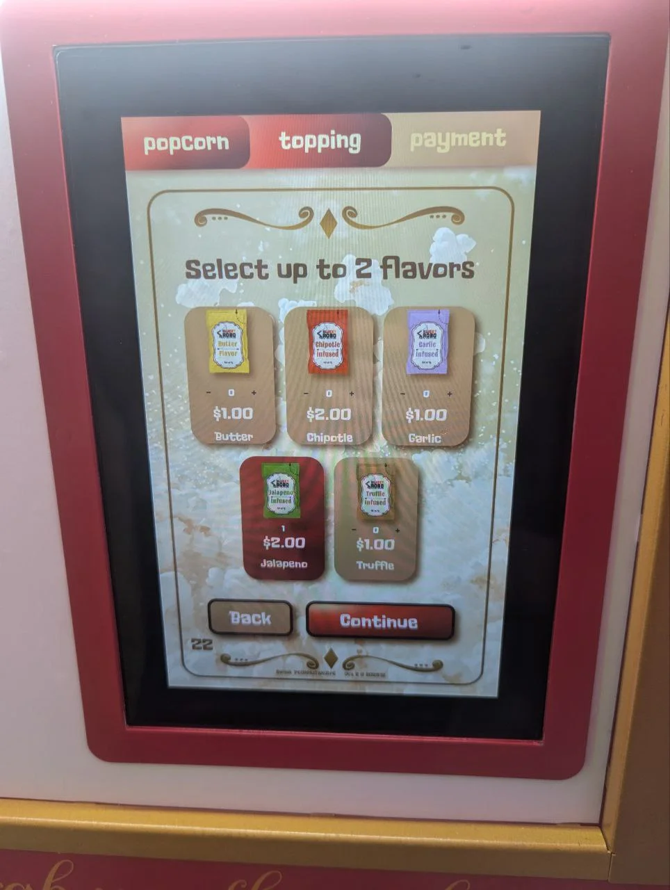
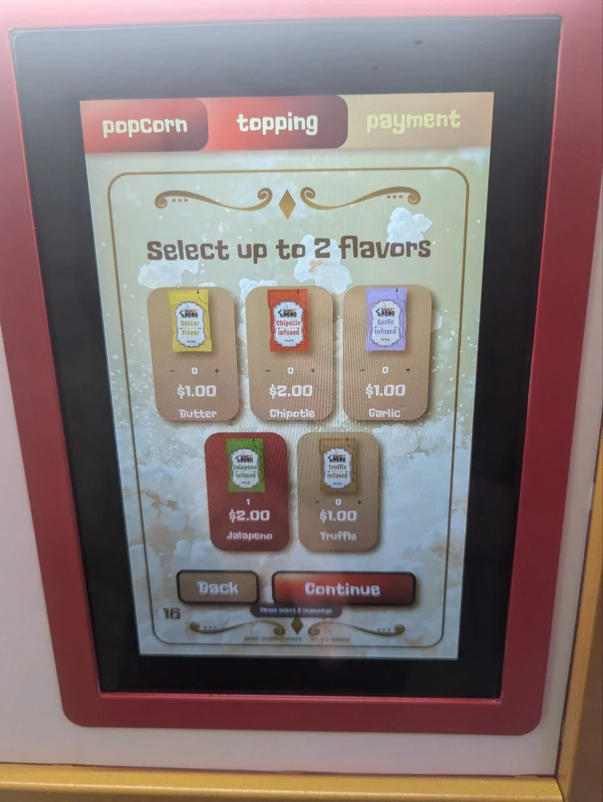

*Topping selection interface and selection confirmation*

**Selection Rules:**
- Customers can select up to 2 different toppings
- Each topping has individual pricing
- Selections are highlighted when chosen
- Tap selected topping again to deselect

Topping prices and availability can be configured in the operator menu. Seasonings must be physically stocked for options to remain active.

### Step 3: Payment

*Complete order summary showing item details, total, and payment method selection*

The payment screen displays the complete order summary:

**Payment Options:**
- **Credit Card**: Contactless or chip reader
- **Cash**: Bills and coins (if cash system installed)
- **Loyalty Credits**: Applied automatically if account detected

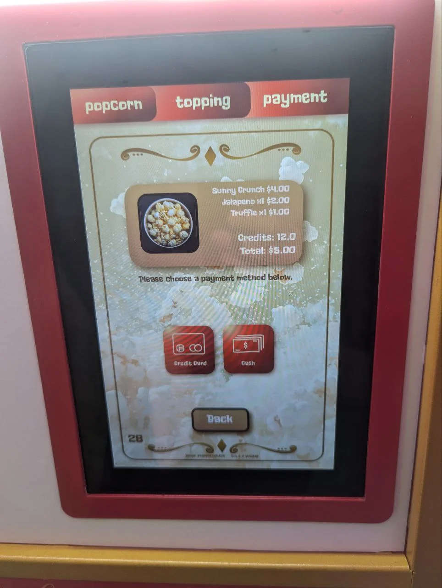
*Loyalty credits automatically reduce the total amount due*

System displays itemized order with total amount

Loyalty credits automatically apply if customer has account

Customer selects payment method

System processes payment securely

Upon successful payment, popcorn production begins

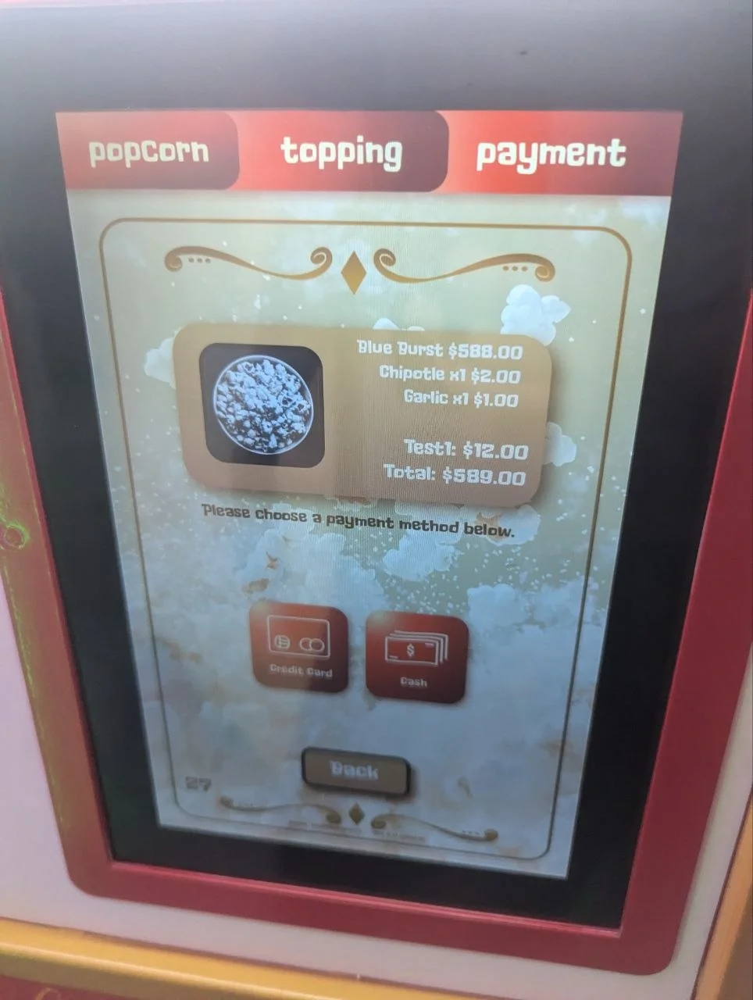
*Detailed order summary showing popcorn selection and toppings*

**Payment Processing**: If payment fails, the order is cancelled and the customer must restart. No product is dispensed until payment is confirmed successful.

### Step 4: Production & Dispensing

Once payment is confirmed, the Pop Cart begins fresh popcorn production:

**Heating Cycle** 
Heating elements warm to optimal popping temperature

**Kernel & Oil Release** 
Precise amounts of kernels and oil dispense into popping chamber

**Popping Process** 
Kernels pop fresh while customer waits (approximately 90-120 seconds)

**Seasoning Application** 
Selected toppings automatically dispense onto fresh popcorn

**Cup Positioning** 
System signals customer to place cup in dispensing window

**Dispensing** 
Fresh, seasoned popcorn fills the cup automatically

*Customer places branded cup in dispensing slot for filling*

**Cup Positioning:**
- Customer places cup in stainless steel dispensing slot
- Sensors detect proper cup placement
- System dispenses measured portion into cup
- Customer retrieves filled cup from window

**CAUTION**: Customers should not reach into the dispensing window until the cycle is complete. Popcorn and internal components may be hot during production.

### Step 5: Order Completion

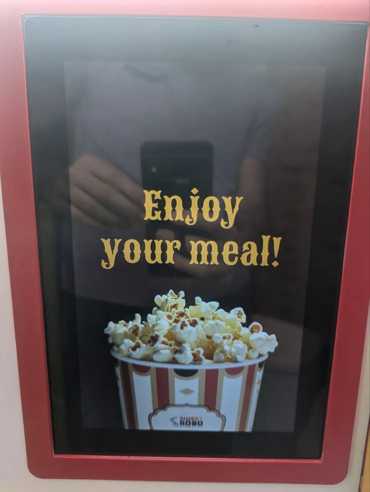
*Completion screen with thank you message*

After successful dispensing:

1. **Completion Message**: "Enjoy your meal!" displays with branding
2. **Receipt** (if configured): Printed or emailed receipt provided
3. **Screen Reset**: System returns to welcome screen for next customer
4. **Cleaning Cycle**: Internal cleaning sequence may run between orders

## Topping Addition Demonstration

For customers adding additional toppings manually (blue popcorn kernels, candies, or other mix-ins):

<h3>Position Topping Cup</h3>
Hold topping cup (blue popcorn kernels, candy pieces, etc.) above the dispensing chamber opening.

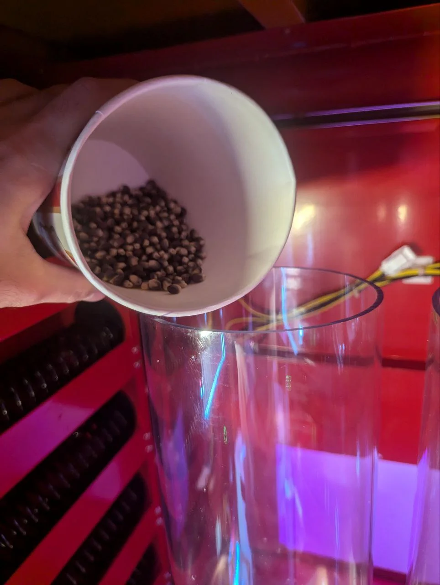

<h3>Begin Pouring</h3>
Slowly pour toppings into the chamber while popcorn is dispensing or after dispensing is complete.

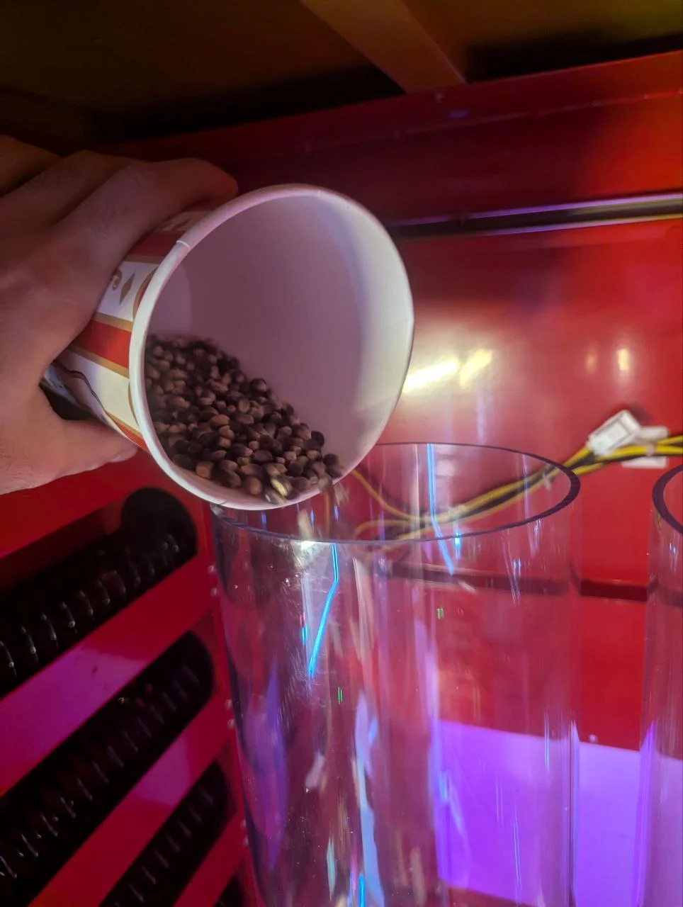

<h3>Mix with Popcorn</h3>
Toppings will mix with popcorn as they fall through the chamber into the cup below.

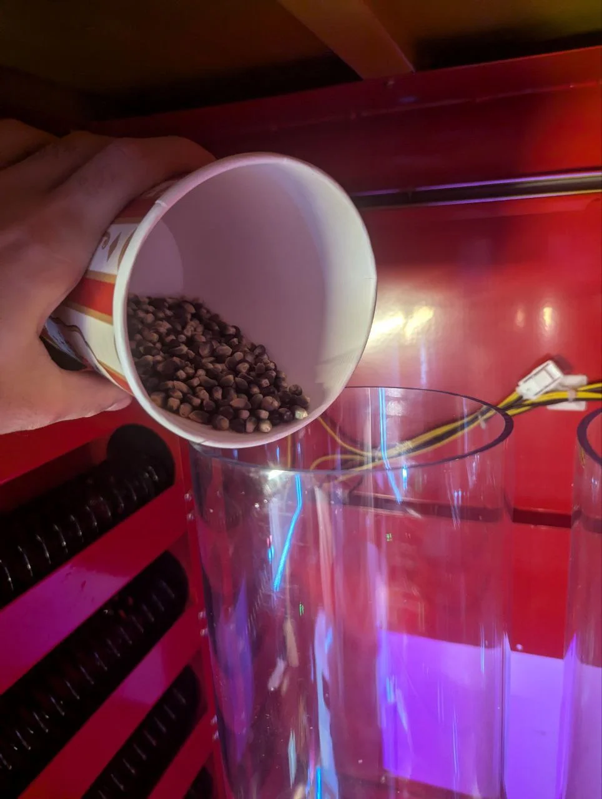

Manual topping additions (like blue popcorn kernels) can be offered as premium add-ons. Configure the system to allow extended dispensing window access time for these customizations.

## User Interface Navigation

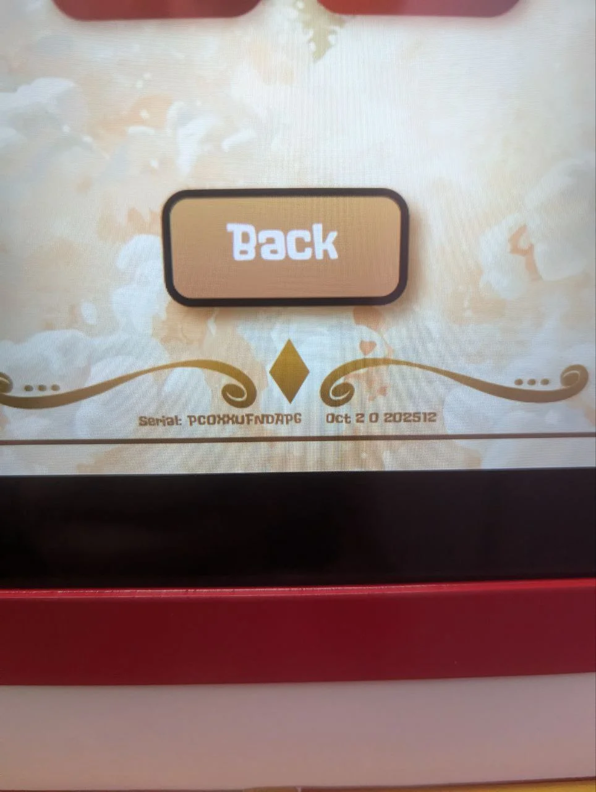
*Navigation controls including Back button for correcting selections*

**Customer Navigation:**
- **Back Button**: Returns to previous screen to change selections
- **Continue Button**: Advances to next step in ordering process
- **Tab Navigation**: Visual indicators show current step (Popcorn → Topping → Payment)
- **Timeout**: Screen resets to welcome if inactive for 60 seconds

**Interface Features:**
- Vintage carnival-themed graphics maintain Pop Cart aesthetic
- Large touch targets for easy selection
- Clear visual feedback for all interactions
- Progress indicators show order flow position

## Operator Menu Access

Operators can access advanced settings and diagnostics through a protected menu:

### Accessing Operator Mode

From the welcome screen, tap the Sweet Robo logo in the corner (hold for 3 seconds)

Enter operator PIN code when prompted (default: check machine documentation or contact support)

Operator menu displays with configuration and diagnostic options

*Admin login screen with password entry for secure access to management system*

The admin interface is built into the machine's app and accessed directly on the touchscreen. WiFi connectivity is required for backend data tracking and reporting, but all management functions are performed locally on the device.

### Management Dashboard

After logging in, operators see the main management dashboard with four primary sections:

*Main dashboard with Device, Testing, Statistics, and Inventory management tiles*

The dashboard provides quick access to:
- **Device**: Machine settings, WiFi configuration, payment methods, popcorn parameters
- **Testing**: Diagnostic tools, sensor testing, dispenser controls
- **Statistics**: Sales tracking, revenue reports, transaction history
- **Inventory**: Stock levels, cup count, popcorn and seasoning management

### Device Settings

*Device configuration including WiFi setup, device ID, I/O board connections, and payment methods*

**Configuration Options:**
- **WiFi Setup**: Connect to network for backend data sync (only setting requiring external configuration)
- **Device ID**: Unique machine identifier for tracking
- **I/O Board**: Hardware interface connections and status
- **Payment Methods**: Enable/disable credit card, cash, or other payment options
- **System Settings**: Temperature units, language, timezone

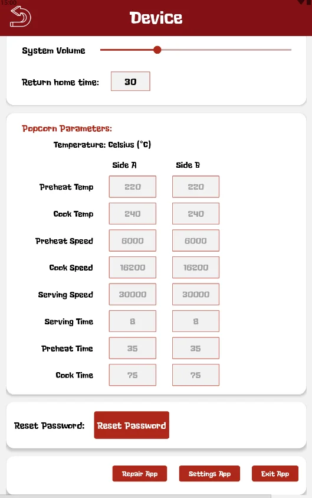
*Dual-side popcorn cooking parameters with temperature, speed, and timing controls*

**Popcorn Parameters:**
- **Temperature Control**: Set optimal popping temperature for each side
- **Popping Speed**: Adjust rotation speed for consistent results
- **Timing**: Configure heating, popping, and dispensing cycles
- **Dual-Side Settings**: Independent parameters for left and right chambers

### Inventory Management

*Cup inventory count and popcorn flavor management with pricing*

**Popcorn & Cups:**
- **Cup Count**: Track remaining cups (shows current count)
- **Popcorn Varieties**: Manage available flavors with individual pricing
- **Stock Levels**: Monitor supply levels and set low-stock alerts
- **Pricing**: Configure per-item pricing for each variety

*Seasoning inventory showing five flavors with pricing, quantities, and lane assignments*

**Seasoning Management:**
- **Five Lanes**: Track individual seasoning dispensers (Lanes 1-5)
- **Flavor Types**: Assign flavors to specific dispenser lanes
- **Quantities**: Monitor remaining seasoning levels per lane
- **Pricing**: Set individual prices for each topping option
- **Lane Assignment**: Configure which physical dispenser contains each flavor

### Statistics & Sales

*Sales tracking dashboard showing total sales count, income, and change metrics*

**Sales Tracking:**
- **Total Sales**: Complete transaction count for reporting period
- **Total Income**: Revenue generated (shown in local currency)
- **Change Given**: Cash transaction tracking (if cash payment enabled)
- **Transaction History**: Detailed logs of individual sales
- **Export Data**: Generate reports for accounting purposes

Backend data tracking syncs sales statistics and inventory levels to web-based reporting when WiFi is connected. This enables remote monitoring and multi-location management.

**IMPORTANT**

Keep operator PIN codes secure and confidential. Unauthorized access to operator settings can disrupt machine operation or compromise payment security.

## Test Mode

Operators can run test cycles and diagnostics without charging customers:

Enter Operator Menu (see above)

Select "Testing" from the management dashboard

Choose component to test (sensors, dispensers, temperature, etc.)

System runs test without customer payment required

Observe results and verify proper operation

Exit Test Mode to return to normal customer operation

### Temperature & Sensor Testing

*Temperature monitoring and sensor testing for dual-side popcorn chambers*

**Testing Features:**
- **Sensor Testing**: Verify all sensors are responding correctly
- **Temperature Monitoring**: Check real-time temperature readings for both sides
- **Speed Controls**: Test chamber rotation speed
- **Dual-Side Testing**: Independent testing for left and right chambers
- **Sensor Status**: Visual indicators show sensor health

### Dispenser & Lane Testing

*Cargo lane testing interface for seasoning dispensers and hopper cleaning*

**Dispenser Controls:**
- **Cargo Lanes 1-5**: Individual testing for each seasoning dispenser
- **Dispense Test**: Trigger manual dispensing to verify mechanism operation
- **Hopper Cleaning**: Run cleaning cycles for both popcorn hoppers
- **Lane Status**: Check if each dispenser is functioning properly
- **Clear Jams**: Manual controls for clearing dispenser blockages

**Recommended Test Schedule:**
- **Daily**: Quick dispense test at startup
- **Weekly**: Complete popping cycle test with both storage containers
- **Monthly**: Full system diagnostic including all sensors and dispensers

## Assisting Customers

### Common Customer Questions

**"How long does it take?"**
- Fresh popcorn takes approximately 90-120 seconds from payment to dispensing
- Customers can watch the popping process through the dispensing window

**"Can I get no toppings?"**
- Yes, customers can skip the topping screen by pressing Continue without selecting

**"What if I selected the wrong thing?"**
- Use the Back button before payment to return and change selections
- After payment, refunds must be processed through operator menu

**"The machine says error - what do I do?"**
- Note the error message displayed
- Contact operator/staff for assistance
- Refer to [Troubleshooting](troubleshooting.md) section

### Handling Issues During Service

#### Payment Declined
Inform customer their payment was not accepted. Suggest trying different card or cash payment. Order will not proceed without successful payment.

#### Dispenser Jam
If popcorn does not dispense properly, enter operator mode and run dispenser diagnostic. May require manual clearing (see Troubleshooting).

#### Out of Supply
If kernel, seasoning, or cup supply is depleted, system alerts operator. Temporarily disable affected options until restocked.

#### Screen Unresponsive
If touchscreen becomes unresponsive, perform soft reset through power cycle. May indicate calibration needed.

## End of Day Procedures

At the close of operations each day:

**Run Sales Report** 
Access operator menu and generate end-of-day sales report. Record transactions and revenue.

**Empty Cash Box** (if applicable) 
Remove and secure cash from payment system following your facility's cash handling procedures.

**Check Supply Levels** 
Note which consumables need restocking for next operating day. Order supplies as needed.

**Perform Basic Cleaning** 
Wipe down touchscreen and exterior surfaces. Clean dispensing window. See Maintenance section for details.

**Enable Overnight Mode** (optional) 
Some operators power down machines overnight or enable energy-saving mode through operator settings.

**Secure Machine** 
Lock service doors, enable security features if available, and secure the area.

## Best Practices

### Maximizing Customer Satisfaction

- **Keep it stocked**: Never run out of popular items during peak hours
- **Stay clean**: Wipe exterior surfaces multiple times per day
- **Test regularly**: Catch and fix small issues before they affect customers
- **Monitor remotely**: Use remote management to track performance in real-time
- **Respond quickly**: Address error alerts promptly to minimize downtime

### Optimizing Performance

- **Track popular items**: Use sales data to stock appropriate ratios of varieties and toppings
- **Peak hour prep**: Ensure full supply levels before busy periods
- **Temperature management**: Maintain proper ambient temperature for consistent popping
- **Regular maintenance**: Follow preventive maintenance schedule (see Maintenance section)
- **Staff training**: Ensure multiple staff members understand operation and basic troubleshooting

## Next Steps

- **[Maintenance](maintenance.md)** - Learn cleaning procedures and supply restocking
- **[Troubleshooting](troubleshooting.md)** - Diagnose and resolve common issues
- **[Parts & Service](parts-service.md)** - Component identification and service contacts

For operational support questions, contact Sweet Robo: [Company Information](../shared/company-info.md)
