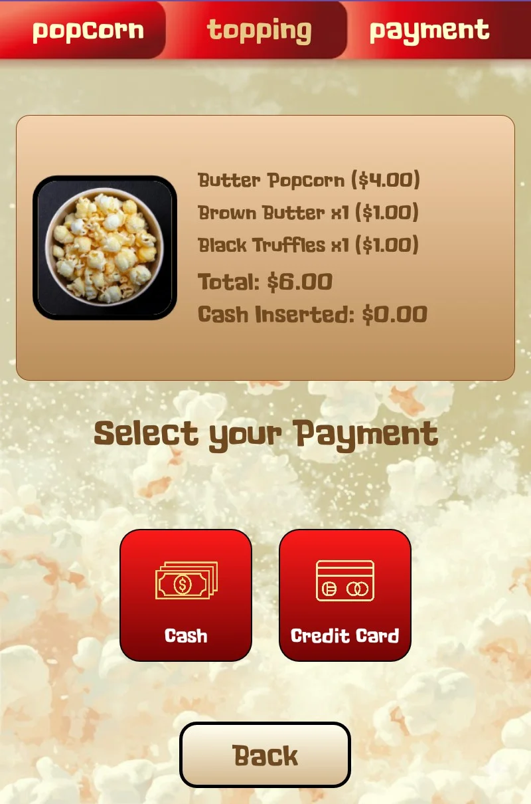
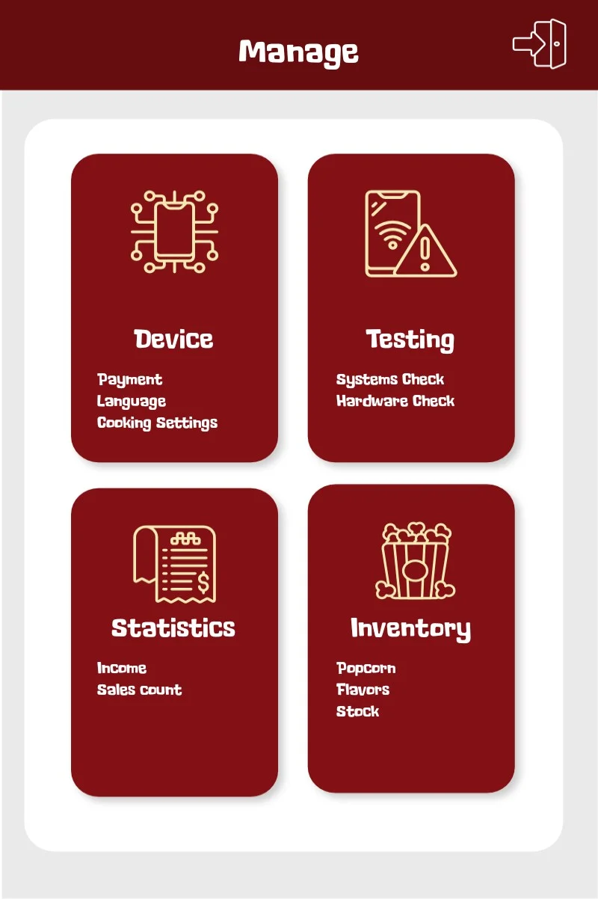
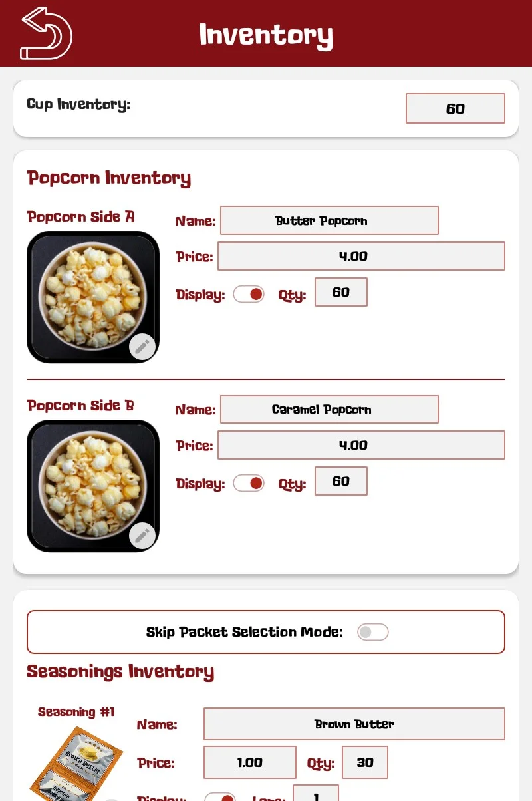
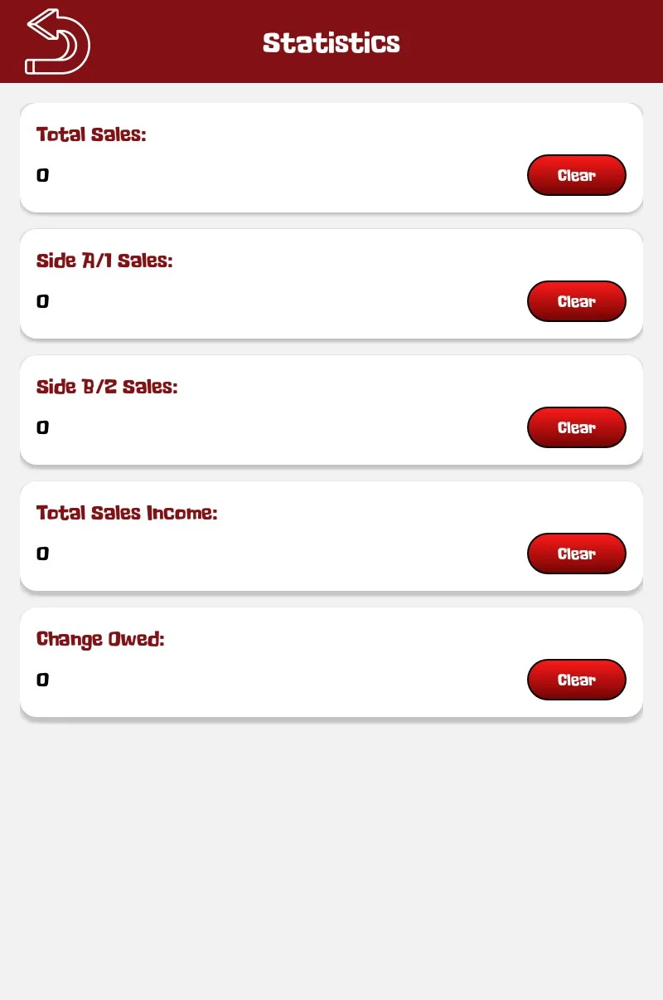
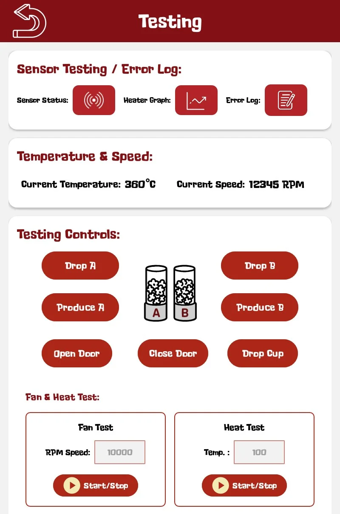

# Operation Guide

This section covers daily operations, customer service procedures, and operator controls for the Pop Cart popcorn vending machine.

## Daily Startup Procedure

Perform these steps at the beginning of each operating day:

**Verify Supply Levels** 
Complete the [Supply Checklist](#supply-checklist) below: kernel hoppers, seasonings, and cups

**Inspect Machine Condition** 
• Visually inspect exterior for damage or tampering 
• Verify dispensing window is clean and clear 
• Check for any error messages on screen 
• Ensure no obstructions in customer access area

**Power On System** 
• Turn on main power if switched off overnight 
• Allow 30-60 seconds for system boot 
• Verify touchscreen displays welcome screen 
• Check that all LEDs indicate normal operation

**Perform Test Cycle (Optional)** 
Run a test transaction to verify proper operation (see Testing & Diagnostics section)

## Supply Checklist

Use this checklist for daily startup, restocking, and troubleshooting supply-related issues.

Kernel Hoppers (both cylinders)

✓ Minimum level: 1 kg per hopper (≈33% full) 
✓ Maximum capacity: 3 kg per hopper 
✓ Refill when below 25% to ensure continuous operation

Seasoning Dispensers (5 lanes)

✓ Verify all active lanes are adequately stocked 
✓ Check dispenser openings are clear and unclogged 
✓ Confirm seasonings match inventory configuration

Cup Supply

✓ Minimum: 20 cups for short operation periods 
✓ Recommended: 50+ cups for full day operation 
✓ Ensure cups are correctly oriented in dispenser

Visual Inspection

✓ Check fill levels visually through transparent hopper windows 
✓ Look for blockages or bridging in hoppers 
✓ Verify seasonings are properly loaded in dispenser lanes

**Quick Reference**: For detailed restocking procedures, see [Supply Restocking](maintenance.md#supply-restocking) in the Maintenance section.

## Customer Operation Flow

The Pop Cart provides an intuitive touchscreen interface guiding customers through the purchasing process. Understanding this flow helps operators assist customers and troubleshoot issues.

### Step 1: Popcorn Selection

Customers select their preferred popcorn variety. Available options are configurable and may vary. Pricing displays next to each option and can be configured through the admin Inventory section.

### Step 2: Topping Selection

Customers choose up to 2 flavor toppings from 5 available lanes. Available topping options may vary (e.g., Butter, Chipotle, Garlic, Jalapeño, Truffle). Pricing and availability are configured in the admin Inventory section and require physical seasoning stock.

### Step 3: Payment

The payment screen shows the complete order summary with itemized selections and total. Customers pay via credit card, cash, or loyalty credits (if available/installed). Payment must complete successfully before production begins; failed payments allow retry.

### Step 4: Production & Dispensing

After payment, the machine begins the automated production cycle (~90-120 seconds):
1. Cup drops into holder
2. Kernels drop into air oven
3. Oven heats and pops the kernels
4. Blower pushes popcorn down the chute into the cup
5. Door opens
6. Seasoning toppings drop onto the side (customer manually applies desired amount)

**CAUTION**: Popcorn and internal components may be hot during production.

**Customer Assistance:**
- Back button allows customers to change selections before payment
- Screen timeout resets to welcome after 60 seconds of inactivity

## Admin Interface

Access the admin interface by tapping 3-5 times in the top left corner of the screen, then entering your operator PIN. All management functions are performed locally on the touchscreen.

### Management Dashboard

The dashboard provides access to **Device** (WiFi, payment methods, popcorn parameters), **Testing** (diagnostics, sensors, dispensers), **Statistics** (sales, revenue, reports), and **Inventory** (stock, pricing).

**Key Configuration Screens:**

- **Device Settings**: WiFi, payment methods, device ID, system settings
- **Popcorn Parameters**: Temperature, speed, and timing controls for both chambers

### Inventory & Pricing

Manage stock levels, configure pricing, and assign seasonings to the 5 dispenser lanes. Track cup count, popcorn varieties, and seasoning quantities. All pricing changes take effect immediately on the customer interface.

### Statistics & Sales

View sales count, total income, and transaction history. Backend syncing (requires WiFi connection) enables remote monitoring and data export through the Sweet Robo tracking system.

**IMPORTANT**

Keep operator PIN codes secure and confidential. Unauthorized access to operator settings can disrupt machine operation or compromise payment security.

## Testing & Diagnostics

Access Testing from the management dashboard to run diagnostics without charging customers. Test sensors, temperature, chamber speed, and all 5 seasoning dispensers individually. Run hopper cleaning cycles and clear jams.

**Test Schedule:** Daily (quick dispense test), Weekly (complete popping cycle), Monthly (full system diagnostic)

## Daily Operations

**Startup:** Complete [Supply Checklist](#supply-checklist), check for errors, run test cycle.

**Customer Assistance:** Process takes 90-120 seconds. Back button allows selection changes before payment. For errors or issues, see [Troubleshooting](troubleshooting.md).

**End of Day:** Run sales report, empty cash box (if applicable), verify [Supply Checklist](#supply-checklist), basic cleaning (see [Maintenance](maintenance.md)), secure machine.

**Best Practices:** Keep supplies stocked for peak hours, clean surfaces regularly, run diagnostics daily, use sales data to optimize inventory.

---

For support, see [Company Information](../shared/content/company-info.md) | Learn more: [Maintenance](maintenance.md) · [Troubleshooting](troubleshooting.md) · [Parts & Service](parts-service.md)
