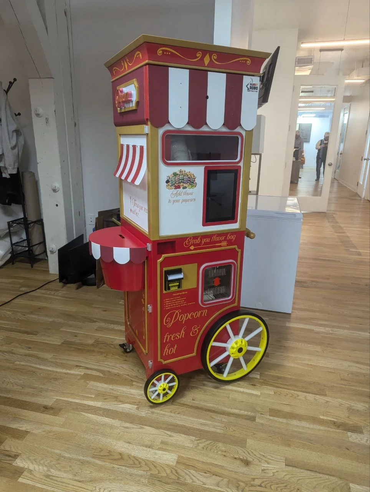
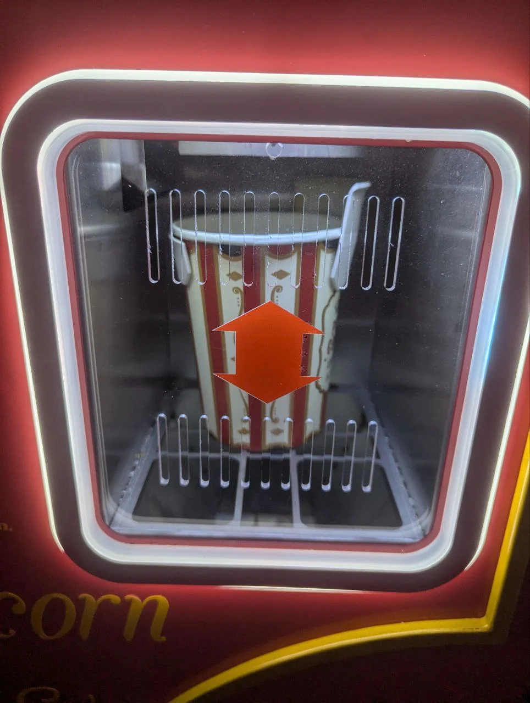
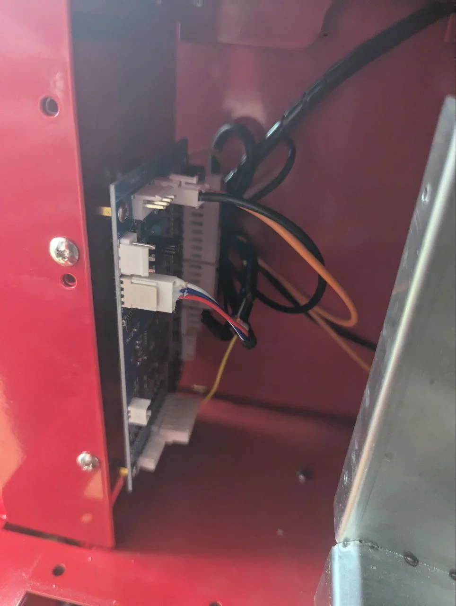
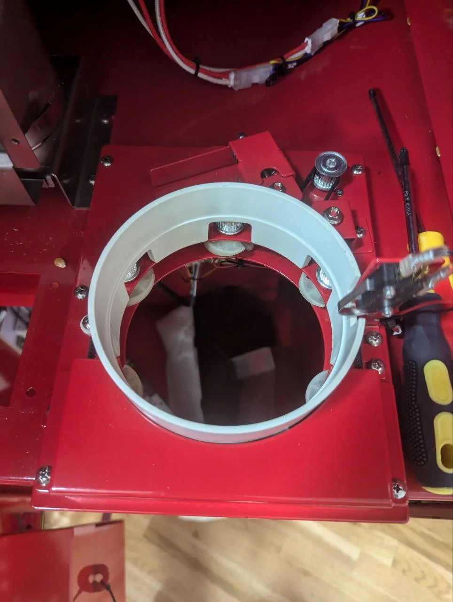
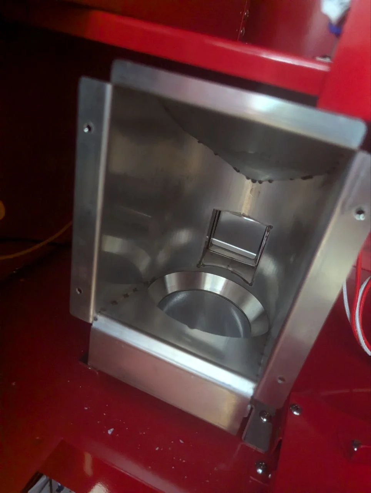
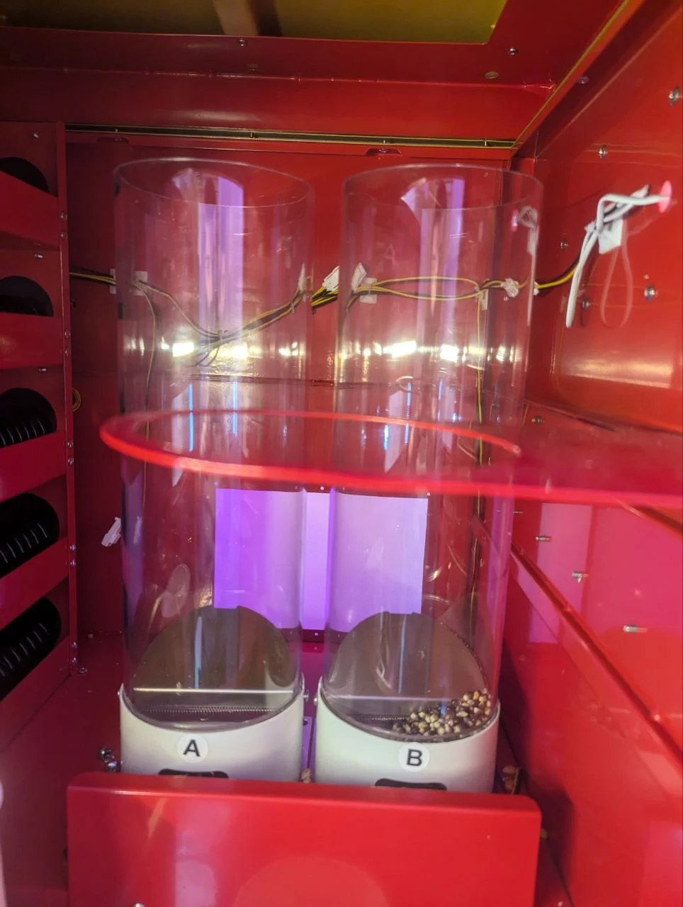

# Overview

<em>Pop Cart - Vintage carnival-style automated popcorn vending machine</em>

## About the Pop Cart

The Pop Cart is Sweet Robo's automated popcorn vending machine that combines nostalgic carnival aesthetics with modern automated technology. Designed to produce fresh, hot popcorn on demand, the Pop Cart delivers a delightful customer experience while maintaining reliable, hands-off operation for venue operators.

This manual provides comprehensive information for operators, maintenance personnel, and technicians to ensure optimal performance and longevity of your Pop Cart system.

## Machine Purpose

The Pop Cart produces fresh popcorn on-demand using fully automated popping, flavoring, and dispensing systems. Customers interact with an intuitive touchscreen interface to select their preferred popcorn variety and toppings, make payment, and receive freshly popped popcorn in branded containers.

### Ideal Venues
- Movie theaters and entertainment centers
- Shopping malls and retail spaces
- Amusement parks and recreational facilities
- Office buildings and corporate campuses
- Educational institutions
- Transportation hubs

## Key Features

#### Fresh Popping System
Advanced dual hopper, single popper mechanism creates fresh popcorn on demand with optimal kernel-to-pop ratios and consistent quality batch after batch.

#### Multiple Flavor Options
Support for various seasoning dispensers allowing diverse flavor combinations including butter, garlic, chipotle, jalapeño, and truffle options.

#### Touchscreen Interface
Intuitive customer-facing touchscreen interface with vintage carnival theming guides users through popcorn selection, topping choices, and payment processing.

#### Automated Dispensing
Precise portion control and automated dispensing ensure consistent servings and minimize waste while maximizing profitability.

#### Payment Flexibility
Integrated payment system supports multiple payment methods for seamless customer transactions (see Technical Specifications).

#### Vintage Aesthetic
Eye-catching carnival cart design with red and white striped awning, decorative wheels, and nostalgic styling attracts customers and enhances venue ambiance.

## Technical Specifications

Machine Name

Pop Cart

Machine Type

Automated Popcorn Vending Machine

Manufacturer

Sweet Robo

Dimensions (W×D×H)

94.7 × 65.4 × 209.7 cm with sign (37.3 × 25.7 × 82.6 in) 94.7 × 65.4 × 172 cm without sign (37.3 × 25.7 × 67.7 in)

Net Weight

140 kg (approx. 309 lbs)

Power Voltage

110V AC (US variant) or 220V AC (International variant)

Power Consumption

800-2200W (20A @ 110V, 10A @ 220V)

Popcorn Capacity

Dual cylinder system (~3 kg per tube, 60-70 servings each)

Kernel Storage

6 kg total capacity (3 kg per cylinder)

Seasoning Options

5 flavor lanes (customizable selection)

User Interface

Touchscreen display with customer-facing operation

Payment Methods

Credit/Debit Card, Cash, Loyalty Credits

Operating Environment

Indoor use, 15-30°C (59-86°F), humidity 20-80% non-condensing

The Pop Cart requires adequate ventilation and climate-controlled indoor environments for optimal performance. Consult the Setup section for detailed site requirements and environmental specifications.

## System Components

### External Features

The Pop Cart features a distinctive vintage carnival cart aesthetic designed to attract customers and complement entertainment venues. The red and white striped canopy, decorative yellow wheels, and classic popcorn branding create an inviting presence.

<em>Front dispensing window showing internal popping chamber with heating elements</em>

**Customer Interaction Points:**
- **Touchscreen Display**: Primary customer interface for selections and payment
- **Dispensing Window**: Collection point for finished popcorn containers
- **Topping/Seasoning Collection Window**: Pick-up point for dispensed seasoning packets
- **Security Lock**: Keyed access for operator maintenance and restocking

### Internal Component Layout

<em>Left: Control board assembly (upper level). Center: Cup holding and positioning mechanism. Right: Dispensing chamber mechanism (lower level)</em>

The Pop Cart interior is organized into distinct functional zones for efficient operation and maintenance:

**Upper Level - Storage & Supply**
- Dual kernel hoppers with top-loading access (Tubes A & B)
- Seasoning packet dispensers (5 positions) - spring-loaded rows that rotate to push packets out
- Packet dispenser IO board (located at front right bottom, visible in images above)
- Transparent hopper design allows visual supply level monitoring

**Middle Level - Production**
- Cup holder/positioning mechanism
- Single popping chamber (oven) with dual hopper feed system
- Heating element arrays
- Temperature monitoring

**Lower Level - Dispensing & Collection**
- Fan blower for air circulation
- Drop chute where popcorn falls into positioned cup
- Electronics protected behind metal shrouds for safety
- Stray popcorn collector
- Service access panels

<em>Dual popcorn dispensing cylinders labeled A and B</em>

### Dual Dispensing System

The Pop Cart features two independent popcorn cylinders (A and B) providing operational flexibility:

- **Independent Operation**: Each cylinder operates separately for reliability and continuous service
- **Storage Capacity**: 3 kg per cylinder (6 kg total)
- **Transparent Design**: Visible kernel display

## Machine Architecture

### 1. Production System
The Pop Cart's production system handles the complete popping process from kernel storage through finished product:

- **Heat Management**: Controlled heating elements maintain ideal popping temperatures
- **Quality Monitoring**: Temperature sensors and precisely timed cooking cycles ensure consistent results

### 2. Dispensing Mechanism
Once popping is complete, the automated dispensing system delivers popcorn to customers:

- **Air-Driven Movement**: Hot air and popping action propel popcorn downward into the chute that goes to the cup
- **Portion Control**: Controlled at the kernel holder level - the drop hole opening size determines the portion amount
- **Cup Positioning**: Sensors detect proper cup placement before dispensing
- **Chute Design**: Stainless steel chute with internally curved edges for easy cleaning and smooth popcorn flow into cups

### 3. Control System
An integrated electronic control system manages all machine functions:

- **Customer Interface**: Android-based touchscreen for intuitive operation
- **Payment Processing**: Secure transaction handling and receipt generation
- **Inventory Tracking**: Monitors kernel and seasoning levels
- **Error Detection**: Real-time monitoring and diagnostic alerts
- **Remote Management**: Optional network connectivity for remote monitoring

### 4. Safety Systems
Multiple safety features protect customers, operators, and the machine:

- **Temperature Limits**: Automatic shutdown prevents overheating
- **Door Interlocks**: Safety switches disable operation when doors open
- **Emergency Stop**: Accessible emergency shutdown capability
- **Component Protection**: Thermal and electrical protection circuits

## Next Steps

Now that you understand the Pop Cart's capabilities and components, proceed to:

- **[Setup & Installation](setup.md)** - Learn how to unpack, position, and configure your Pop Cart
- **[Operation Guide](operation.md)** - Master daily operations and customer service procedures
- **[Maintenance](maintenance.md)** - Establish cleaning schedules and preventive maintenance routines

For immediate assistance or technical support, see [Company Information](shared/content/company-info.md).
