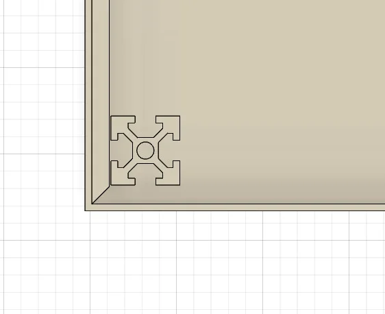
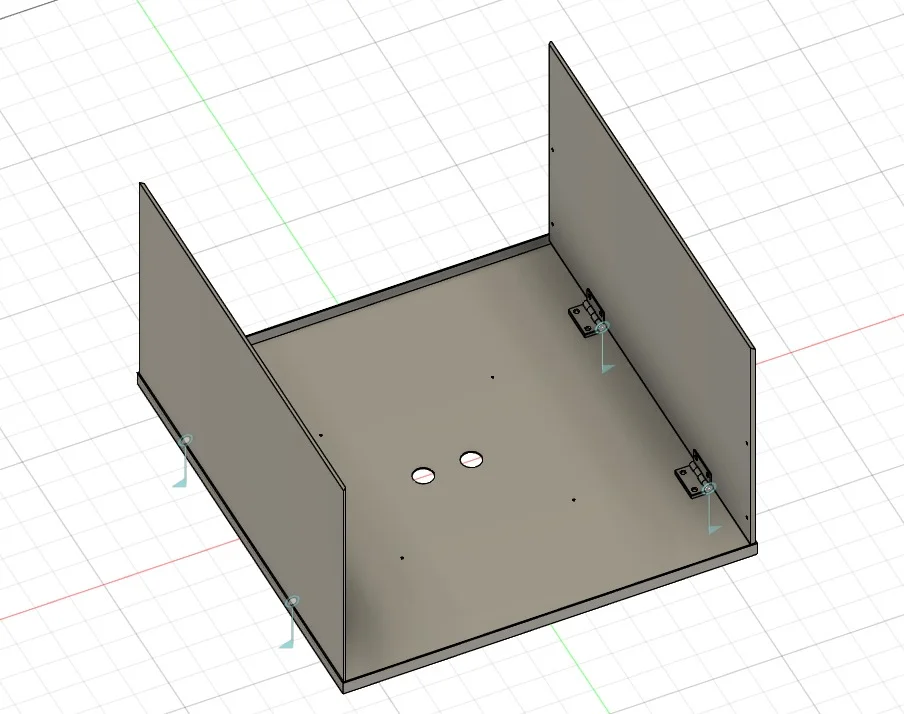
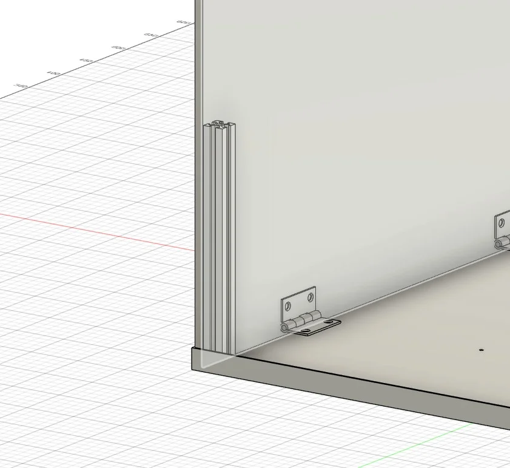
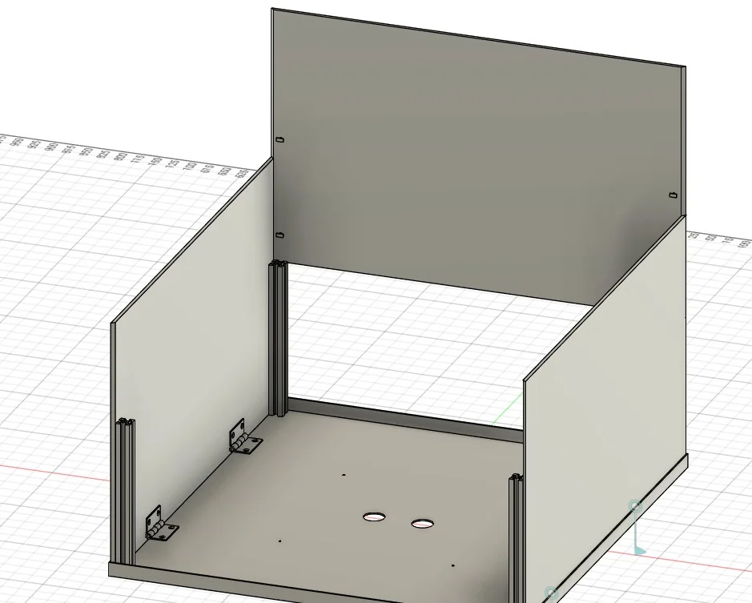
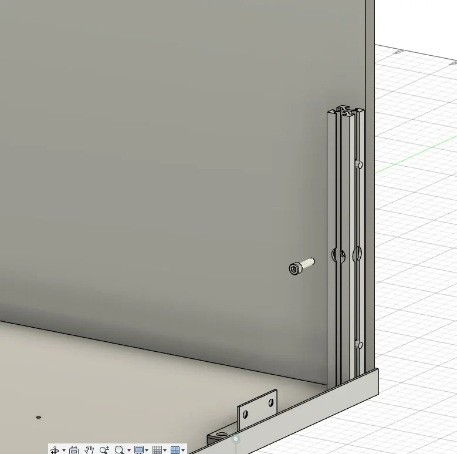
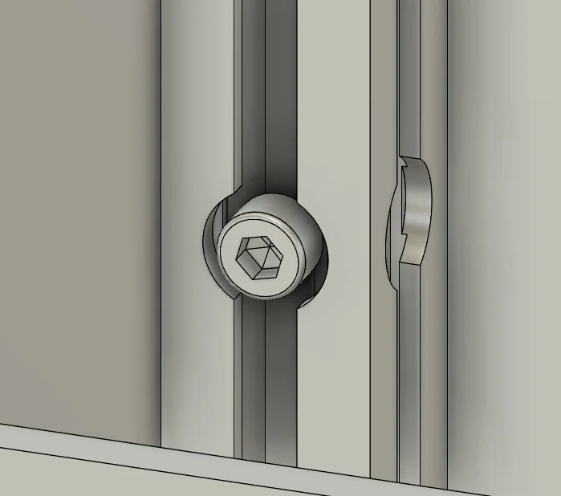
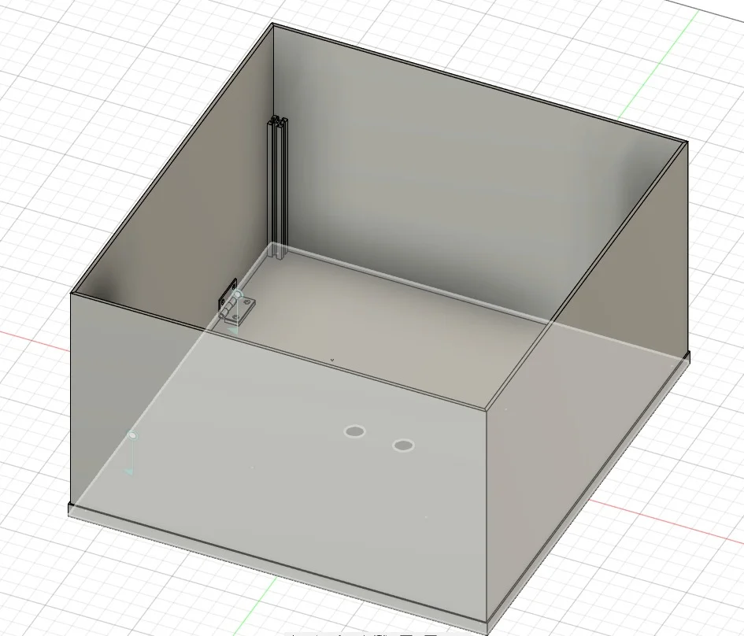
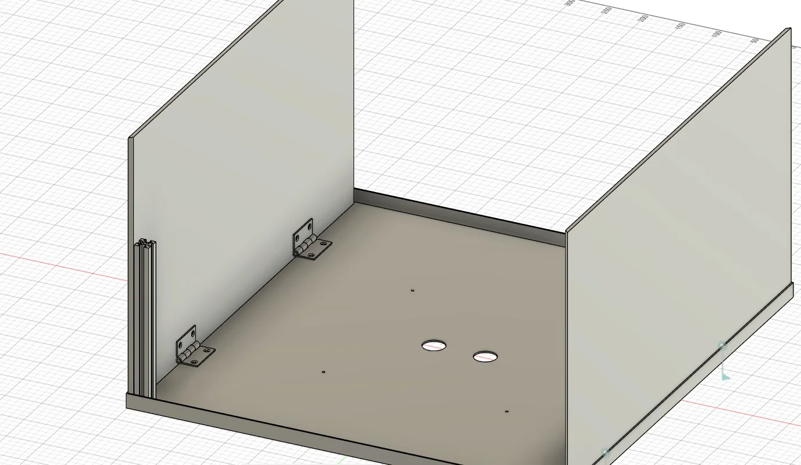

# Setup & Installation

This section guides you through unpacking, positioning, and configuring your Pop Cart for first-time operation.

**IMPORTANT**

Some accessories or consumables may be packaged and stored inside the machine body for secure transit. Before powering on the machine, carefully open the access door and inspect the interior.

***

## Pre-Installation Checklist

Before beginning installation, ensure you have:

* [ ] Verified delivery contents against packing list
* [ ] Inspected exterior for shipping damage
* [ ] Confirmed site meets requirements (see below)
* [ ] Arranged for 2+ people for positioning
* [ ] Verified power requirements match your facility
* [ ] Prepared network connection (if using remote management)

***

## Site Requirements

**Space:** Machine footprint 94.7 × 65.4 cm. Minimum clearances: 60cm service side, 120cm front (customer access), 15cm around ventilation.

**Environment:** Indoor use only, level floor. Operating temperature 15-30°C (59-86°F), humidity 20-80% **non-condensing** (no moisture condensation on surfaces). Adequate air circulation required.

**Power:** 110-125V or 220-240V AC, 50/60Hz, 2200W max. Dedicated circuit recommended. Standard grounded plug for region.

**Network:** WiFi or Ethernet for remote management and backend data sync.

**WARNING**: Do not install in damp, wet, or outdoor environments. Exposure to moisture may cause electrical hazards and equipment damage.

**Non-Condensing Humidity Requirement**

"Non-condensing" means moisture must NOT condense on any surface of the machine. Even if humidity is within the 20-80% range, the environment must prevent condensation. This is critical because:

* **Electronics Protection**: Condensation damages control boards and wiring
* **Food Safety**: Moisture ruins kernels and seasoning packets
* **Corrosion Prevention**: Condensation causes rust on metal components

**Avoid locations with**: High humidity near kitchens/dishwashers, poorly ventilated areas, temperature fluctuations causing condensation, or any environment where surfaces feel damp.

_For complete technical specifications, see_ [_Overview_](overview.md#technical-specifications)

***

## Unpacking Instructions

The Pop Cart ships with protective packaging to prevent damage during transport. Follow these steps to safely unpack your machine.

### 1. Inspect Shipping Container

Visually inspect the exterior packaging for obvious damage (crushed corners, punctures, or water damage).Document any damage with photographs before unpacking.If significant damage is observed, contact the carrier and Sweet Robo support before proceeding.

### 2. Remove Protective Wrapping

_Pop Cart as delivered with shipping protection and labels_

Carefully cut and remove exterior strapping or tape.Peel away bubble wrap protective covering, being careful not to damage the machine exterior or decorative elements.Keep protective materials until installation is complete in case return shipping is needed. 

_Unpacking sequence: fully protected (left) and partially unwrapped (right)_

### 3. Remove Interior Packing Materials

_Interior protective materials that must be removed before operation_

Unlock and open the service access door using the provided key.Remove all interior protective materials including foam inserts, bubble wrap, and cardboard spacers.Verify that internal components move freely and are not obstructed by packing materials.Check for accessory boxes or consumables packed inside the machine (cups, kernel samples, cleaning supplies, etc.).

**CAUTION**: Failure to remove all packing materials before operation may cause equipment malfunction, jamming, or damage. Thoroughly inspect all interior compartments.

***

## Assembly Steps

The Pop Cart requires some assembly upon delivery. These components need to be installed before operation.

### 1. Install Decorative Wheels

The Pop Cart comes with 4 functional wheels pre-installed at the base for mobility. The decorative wheels (big and small) are purely aesthetic elements that complete the vintage cart appearance.

#### Identify Decorative Wheels

Locate the two decorative wheel assemblies - one large and one small. These are for appearance and branding purposes only.

#### Attach Decorative Wheels

Align each decorative wheel with its designated mounting point on the machine exterior. Secure using the provided hardware.

#### Verify Appearance

Ensure both decorative wheels are properly positioned and securely attached for the complete vintage cart aesthetic.IMAGE: DECORATIVE WHEEL ASSEMBLY

### 2. Install Signs and Branding Panels

**IMPORTANT: Cable Routing Before Bolting**

The light signs have electrical cables that must be passed through the dedicated cable hole BEFORE bolting the sign in place. Do not bolt the sign first - you will not be able to route the cable afterward.

#### Route Lighting Cable

Before mounting the light sign, locate the dedicated cable hole. Pass the lighting cable from the sign through this hole so it can reach the internal connection points.

#### Position and Bolt Sign

With the cable already routed through the hole, align the sign with the mounting points on the machine exterior. Secure using the provided screws. Ensure the sign is flush and properly aligned.

#### Connect Sign Wiring

Each light sign has 2 wires with protected endpoints - one male connector and one female connector. Connect each to the corresponding female and male machine cables. Since each sign has one male and one female connector, they naturally match to the machine's corresponding connectors and cannot be switched.

#### Verify Connection

Ensure both wire connections are fully seated and secure. Gently tug each connection to confirm it's properly locked in place.IMAGE: SIGN CABLE ROUTING AND WIRING CONNECTION

### 3. Assemble and Install Roof

**Roof Assembly Instructions**

The roof base comes pre-assembled with 2 walls connected to hinges. You will need to complete the assembly by adding the remaining walls and aluminum frame rails (80/20 extrusion system).

_The aluminum frame rails use a T-slot extrusion system - T-bolts slide into the channels and lock the walls in place_

#### Lift Pre-Assembled Walls

The roof base comes with 2 walls already connected to hinges. Lift these walls to a 90-degree angle (perpendicular to the base).

#### Add T-Bolts to Hinged Walls

Install 4 T-bolts on each of the 2 hinged walls - 2 on the top edge and 2 on the bottom edge of each wall.

#### Install Support Rails

Slide the aluminum frame rails down onto the T-bolts on the hinged walls. Bolt the rails to the roof base from the bottom to secure them in place.

#### Prepare Remaining Walls

Add T-bolts to the other 2 wall panels (4 T-bolts per wall, 2 on each edge).

#### Slide Walls onto Rails

Slide the 2 remaining walls down the aluminum frame rails, aligning the T-bolts with the rail channels.

#### Secure Corner Bolts

Insert a long bolt through each corner, passing through the rail extrusion to connect the loose walls (the 2 walls you just slid on). Use 1 bolt per corner, 4 total. This locks all four walls together with the rail frame.

#### Mount Roof on Machine

Carefully lift the fully assembled roof and position it on top of the machine. Use 4 screws to bolt the roof to the machine mounting brackets. Verify the roof is stable and properly aligned.

**Assembly Visual Reference:**

 

_Initial configuration with both hinged walls lifted to 90° (left), and close-up showing aluminum frame rail ready to be secured (right)_

_Loose wall panel being slid down onto the aluminum T-slot rails between the two standing hinged walls_

 

_Corner bolt installation: External view showing hex head bolt before insertion (left), and internal diagram showing bolt path through aluminum extrusion (right)_

 

_Completed roof assembly with all four walls locked together (left), and interior view showing hinge placement and rail configuration (right)_

### 4. Install Kernel and Cup Holder Tubes

**IMPORTANT: Cup Holder Tube Sensor Alignment**

The cup holder tube has a slot at the bottom that must be aligned with the cup sensor. Be extremely careful when installing or removing this tube - the cup sensor is fragile and can be easily damaged.

#### Install Kernel Tubes A & B

Insert the kernel feed tubes (labeled A and B) into their respective mounting positions. Each tube has a diagonal metal part inside that directs kernels toward the front of the machine. Ensure tubes are fully seated and secure.

#### Verify Drop Hole Position

The diagonal metal part in each kernel tube should be covering the drop hole, which should be positioned at the back when the machine is in standby. The hole rotates during operation to allow kernels to drop through into the popping chamber. This comes preset from the factory at the ideal position and typically does not require adjustment.

#### Verify Drop Hole Sizing with Gauge (Recommended)

The Pop Cart includes a kernel drop hole sizing gauge for accurate setup verification. Use the provided gauge to verify the drop hole is set to the correct size for both kernel tubes A and B. This ensures optimal kernel flow to the popping chamber.

#### Align Cup Holder Tube

Carefully insert the cup holder tube, aligning the bottom slot with the cup sensor. Do not force - the tube should slide into place smoothly.

#### Verify Sensor Alignment

Check that the cup sensor is properly aligned with the tube slot and is not bent or damaged.

**WARNING**: Do not force the cup holder tube into position. If resistance is felt, remove the tube and check for obstructions. Forcing the tube can break the cup sensor, preventing proper operation.

**ADVANCED: Kernel Drop Hole Adjustment (Expert Users Only)**

The kernel drop hole size is factory-preset to the ideal position for optimal popping performance. If adjustment is needed to reduce or expand the amount of kernels that drop into the popping chamber:

1. Access the 2 small adjustment screws from the back of the machine (inside the kernel tube area)
2. Carefully adjust the hole size as needed

**⚠️ CAUTION**: This adjustment requires extreme care and expertise. Changing the drop hole size without adjusting other machine settings can cause serious operational issues. Too many or too few kernels in the popping chamber will result in poor popping quality, excessive waste, or machine errors requiring troubleshooting. Only modify this setting if you have technical training or under guidance from Sweet Robo support.

IMAGE: KERNEL TUBES A & B INSTALLATIONIMAGE: KERNEL DROP HOLE SIZING GAUGEIMAGE: CUP HOLDER TUBE WITH SENSOR ALIGNMENT

***

## Positioning the Machine

**CAUTION: Moving and Positioning**

Two or more people may be required for safely moving and positioning the machine. The Pop Cart weighs approximately 140 kg (309 lbs).

The Pop Cart wheels are designed for short-distance positioning on smooth, level surfaces only. They are NOT suitable for:

* Long-distance transportation
* Moving over bumpy paths, thresholds, or uneven surfaces
* Transporting the machine between facilities

For long-distance moves or transport over uneven surfaces, use proper lifting equipment (pallet jack, forklift, or professional moving equipment). Wheeling the machine long distances or over rough terrain may damage the wheels or internal components.

1\. Move to Final LocationCarefully move the Pop Cart to its final operating location, ensuring it meets all site requirements.Position the machine to allow adequate service access on the door side and customer access on the front.Ensure the machine is not blocking emergency exits, fire equipment, or facility traffic flow.2. Verify Machine StabilityUse a bubble level to check that the machine is level front-to-back and side-to-side on the floor surface.Verify the machine does not rock or wobble when gently pushed.If the floor is uneven, consider using thin shims under the wheels to achieve proper leveling.Engage wheel locks to prevent the machine from rolling during operation.

Proper leveling is critical for accurate popcorn dispensing and prevents uneven wear on internal components. The Pop Cart is equipped with wheels for mobility - ensure the machine is stable and level before operation.

***

## Power Connection

**WARNING: Electrical Shock Hazard.** Ensure your hands are dry and you are not standing in water when connecting the power cord. Have a qualified electrician verify proper grounding before operation. See [Electrical Safety](safety.html#electrical-safety) for complete safety requirements.

Verify that the power outlet voltage and type match the machine requirements printed on the data plate.Confirm the circuit breaker is OFF before plugging in the machine.Fully insert the power plug into a properly grounded outlet.Turn ON the circuit breaker and verify no faults or tripped breakers.

**IMPORTANT**

Use a dedicated circuit for the Pop Cart when possible. Sharing circuits with other high-power equipment may cause voltage fluctuations and affect machine performance.

***

## Network Connection (Optional)

The Pop Cart supports remote management and backend data sync via network connection. **WiFi is the recommended connection method.**

**Network Requirements**

The WiFi network must be:

* Stable with consistent connection
* Does NOT require a sign-in portal (captive portal)
* Standard WPA/WPA2 password-protected network

Public WiFi networks requiring browser-based authentication (like hotel or coffee shop networks) are not compatible.

### WiFi Setup (Recommended)

Access the operator management page on the touchscreen (see [Admin Interface](operation.html#admin-interface) for menu access).Navigate to WiFi Settings. This will open the Android system UI for network configuration.Select your WiFi network from the available networks list.Enter the network password when prompted.Verify the connection shows "Connected" in the Android WiFi settings.Return to the Pop Cart management interface. The machine will now sync with the backend for remote management.

### Ethernet Connection

For Ethernet network connection, please contact Sweet Robo support for configuration assistance:

**Support Contact**: See [Company Information](shared/content/company-info.md)

***

## Initial Configuration

### System Check

After powering on for the first time:

The machine will perform a self-test sequence. Observe for any error messages or unusual sounds.Allow the touchscreen to fully boot (approximately 30-60 seconds).Verify the customer interface displays the welcome screen correctly.Access the operator menu to configure initial settings (see [Admin Interface](operation.html#admin-interface)).

### Load Initial Supplies

Before operation, the machine requires:

**Popcorn Kernels**

Fill kernel hoppers with **Sweet Robo branded popcorn kernels only**. Machine settings are calibrated and tested specifically for Sweet Robo kernels.

**Seasoning Packets**

Stock seasoning dispensers with **Sweet Robo branded seasoning packets only**. Non-approved seasoning packets may get stuck in the dispensing mechanism and cause malfunctions.

**Loading Instructions:** Fold each packet at the perforated cut line, then insert vertically into the dispenser lanes. Each of the 5 lanes can hold different flavor varieties.

**Cups**

Load branded popcorn cups into the cup dispenser mechanism.

Refer to [Supply Restocking](maintenance.md#supply-restocking) for detailed loading procedures and approved consumables. For daily checks, use the [Supply Checklist](operation.md#supply-checklist).

***

## Payment System

### Bill Acceptor (Pre-Installed)

**Cash Payments Ready Out of the Box**

The Pop Cart comes with a **bill acceptor pre-installed and configured**. The machine is ready to accept cash payments immediately after setup and can be used for customer transactions without additional payment hardware.

**Verify Local Currency Compatibility**

Before opening for customer use, verify that the bill acceptor is configured to accept your local currency. The bill acceptor should recognize and accept the bills commonly used in your region.

If the bill acceptor does not accept your local currency or you experience currency recognition issues, contact Sweet Robo support for configuration assistance.

### Credit Card Processing (Optional)

Credit card processing requires additional hardware installation. If you want to accept credit/debit card payments:

Contact Sweet Robo support to arrange installation of a Nayax payment device.The installation includes the Nayax device, MDB Nayax cable, and configuration assistance.Note: The Pop Cart comes with an MDB-RS232 adapter pre-installed to support credit card payment devices.

**Contact Sweet Robo support for credit card payment installation:** See [Company Information](../shared/content/company-info.html)

**Optional Credit Card Processing**

Credit card processing is entirely optional. The machine is fully functional for cash-only operation using the pre-installed bill acceptor. Add credit card capabilities when ready to expand payment options.

***

## First Start Checklist

Before allowing customer use, verify:

* [ ] All packing materials removed from interior
* [ ] Machine is level and stable
* [ ] Power connection is secure and grounded
* [ ] Network connection established (if applicable)
* [ ] **Initial supplies loaded** - complete [Supply Checklist](operation.md#supply-checklist)
* [ ] Customer interface is responsive
* [ ] **Bill acceptor verified** for local currency compatibility (see [Payment System](setup.md#payment-system) above)
* [ ] Credit card processing installed (optional - see [Credit Card Processing](setup.md#credit-card-processing-optional) above)
* [ ] Test transaction completed successfully with cash payment
* [ ] Operator familiar with [Operation Guide](operation.md)
* [ ] Emergency procedures understood (see [Safety - Emergency Procedures](safety.html#emergency-procedures))
* [ ] Support contact information posted

**Test Transaction**

Perform at least one complete test transaction before opening for customer use. This verifies proper operation of the entire system including popcorn selection, seasoning dispensing, product delivery, and bill acceptor functionality. If credit card processing is installed, test card payment processing as well. See [Testing & Diagnostics](operation.html#testing--diagnostics) for test procedures.

***

## Installation Complete

Your Pop Cart is now ready for operation! Proceed to the [Operation Guide](operation.md) to learn daily operation procedures, or refer to [Maintenance](maintenance.md) for cleaning and restocking information.

For setup assistance or questions, contact Sweet Robo support:

**Support Contact**: See [Company Information](shared/content/company-info.md)
