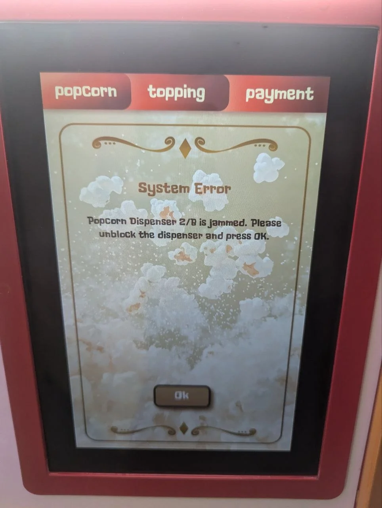

# Troubleshooting

This section helps diagnose and resolve common issues with the Pop Cart. For problems not covered here, see contact information at the end of this section.

**IMPORTANT**

Before troubleshooting, verify the [Supply Checklist](operation.md#supply-checklist) is complete and the machine is powered on and properly connected. Many issues are resolved by checking these basics first.

## Quick Diagnostic Checklist

When experiencing issues, check these items first:

- [ ] Machine is plugged in and power is ON
- [ ] Circuit breaker has not tripped
- [ ] All service doors are properly closed
- [ ] **Supply levels adequate** - see [Supply Checklist](operation.md#supply-checklist)
- [ ] No obstructions in dispensing path
- [ ] Touchscreen is responsive
- [ ] No error messages displayed

## Error Messages

The Pop Cart displays error messages when it detects issues requiring attention.

### Dispenser Jam Error

*Error message indicating popcorn dispenser 2/B is jammed*

**Error**: "Popcorn Dispenser 2/B is jammed"

**Cause**: Popcorn or debris blocking dispensing mechanism in cylinder B

**Solution:**

Press OK to acknowledge error (do not attempt to clear while system is active)

Power off machine and wait 30 minutes for components to cool

Open service access door using provided key

Locate cylinder B dispenser and visually inspect for blockage

Carefully remove any visible popcorn, kernels, or debris obstructing the path

Verify dispensing mechanism moves freely (rotate manually if accessible)

Close service door and power machine back on

Run test cycle through operator menu to verify jam is cleared (see [Testing & Diagnostics](operation.md#testing--diagnostics))

**CAUTION**: Do not force stuck mechanisms. If blockage cannot be easily removed, or if error persists after clearing, see "When to Contact Support" section below.

### Common Error Codes

**ERR-001: Temperature Sensor Fault**

Temperature sensor not reading correctly. Run diagnostics to identify faulty sensor. May require sensor cleaning or replacement. Contact support if issue persists.

**ERR-002: Heating Element Failure**

Heating element not reaching proper temperature. Check power connections and run heating diagnostic. Element may need replacement (~12-18 month lifespan). Contact support for service.

**ERR-003: Cup Detection Error**

Machine cannot detect cup presence. Verify cup is properly positioned and sensor area is clean. Remove and reload cup. See "Cup Detection Errors" section below for detailed troubleshooting.

**ERR-004: Payment System Fault**

Payment processing failure. Restart payment system through [Admin Interface](operation.md#admin-interface). Clean card reader. Verify network connection. Contact payment processor if unresolved.

**ERR-005: Low Kernel Level**

Kernel supply below minimum operating level. Refill both kernel hoppers using [Supply Checklist](operation.md#supply-checklist). Error will clear automatically once levels are adequate.

**ERR-006: Seasoning Dispenser Fault**

Seasoning dispenser clogged or empty. Check seasoning levels and refill if needed. Inspect dispenser opening for clogs. Run dispenser test through [Admin Interface](operation.md#admin-interface).

**ERR-007: Door Interlock Open**

Service door is open or interlock switch malfunctioning. Ensure all doors are fully closed and latched. If error persists with doors closed, interlock switch may need adjustment or replacement.

**ERR-008: Network Connection Lost**

WiFi or ethernet connection interrupted. Check network settings in [Admin Interface](operation.md#admin-interface). Machine will continue operating without network but backend sync will be disabled. See [Setup](setup.md) for network configuration.

## Common Issues and Solutions

### Power and Electrical

#### Machine Won't Power On

**Symptoms**: No lights, screen dark, no response

**Possible Causes**:
- Power cord unplugged or loose
- Circuit breaker tripped
- Electrical outlet not working
- Internal fuse blown

**Solutions**:
1. Verify power cord is securely plugged in
2. Check circuit breaker and reset if tripped
3. Test outlet with another device
4. Contact electrician if outlet is faulty
5. Contact Sweet Robo if internal fuse issue suspected

#### Intermittent Power Loss

**Symptoms**: Machine randomly shuts off or reboots

**Possible Causes**:
- Loose power connection
- Overloaded circuit
- Voltage fluctuations
- Internal electrical fault

**Solutions**:
1. Ensure power plug is fully seated
2. Verify circuit is not shared with high-power equipment
3. Have electrician test voltage stability
4. Contact Sweet Robo for internal diagnostics

### Touchscreen Issues

#### Screen Not Responding

**Symptoms**: Touch inputs ignored, screen frozen

**Possible Causes**:
- Software freeze
- Touchscreen calibration needed
- Hardware malfunction

**Solutions**:
1. Perform soft reset: power off, wait 30 seconds, power on
2. Access operator menu and run touchscreen calibration
3. Clean screen with microfiber cloth (dirt can affect sensitivity)
4. If persistent, contact Sweet Robo for service

#### Display Flickering or Distorted

**Symptoms**: Screen flashes, colors wrong, lines visible

**Possible Causes**:
- Loose display cable
- Graphics hardware issue
- Power supply problem

**Solutions**:
1. Power cycle machine
2. Check for any loose connections (if accessible)
3. Contact Sweet Robo for hardware repair

### Popping and Dispensing

#### No Popcorn Popping

**Symptoms**: Machine accepts payment but no popcorn produced

**Possible Causes**:
- Empty kernel hopper
- Heating element failure
- Kernel metering mechanism jammed
- Temperature sensor fault

**Solutions**:
1. Verify kernel hopper has adequate supply (check through inspection window)
2. Check for error codes related to heating or temperature
3. Run diagnostic test through operator menu
4. Inspect kernel metering mechanism for jams
5. Contact Sweet Robo if heating elements need replacement

#### Insufficient Popping / Many Unpopped Kernels

**Symptoms**: Lots of unpopped kernels in finished product

**Possible Causes**:
- Old or poor quality kernels
- Incorrect popping temperature
- Heating element degraded

**Solutions**:
1. Check kernel expiration date and freshness
2. Run temperature calibration through operator menu
3. Replace with fresh, approved kernels
4. Contact Sweet Robo if heating elements need inspection

#### Popcorn Burns or Smokes

**Symptoms**: Burnt smell, dark popcorn, smoke visible

**Possible Causes**:
- Temperature set too high
- Cycle time too long
- Sensor malfunction

**Solutions**:
1. Immediately stop operation and power off
2. Allow machine to cool completely
3. Access operator menu and reduce temperature settings
4. Run diagnostic to check temperature sensors
5. Contact Sweet Robo if issue persists

#### Dispensing Jams Frequently

**Symptoms**: Popcorn gets stuck, won't dispense smoothly

**Possible Causes**:
- Buildup in chute or cylinder
- Mechanical wear on dispensing mechanism
- Overfilling portions
- Moisture in system

**Solutions**:
1. Perform thorough cleaning of dispensing chute and cylinders
2. Check portion size calibration (may be dispensing too much)
3. Inspect for worn or damaged parts in dispensing mechanism
4. Ensure proper ambient humidity (not too high)
5. Contact Sweet Robo for parts replacement if needed

### Seasoning System

#### Seasonings Not Dispensing

**Symptoms**: Customer selects topping but none applied

**Possible Causes**:
- Empty seasoning container
- Clogged dispenser
- Mechanical failure
- Software configuration issue

**Solutions**:
1. Check seasoning container is adequately filled
2. Inspect dispenser opening for clogs or hardened seasoning
3. Run dispenser test through operator menu
4. Verify seasoning is enabled in system settings
5. Contact Sweet Robo if mechanical repair needed

#### Excessive Seasoning Dispensed

**Symptoms**: Too much seasoning on popcorn, waste

**Possible Causes**:
- Calibration incorrect
- Dispenser mechanism worn
- Software settings wrong

**Solutions**:
1. Access operator menu and adjust seasoning portion sizes
2. Run calibration procedure for affected dispensers
3. Inspect dispenser mechanism for wear
4. Document settings before and after adjustment
5. Contact Sweet Robo if calibration doesn't resolve issue

### Payment System

#### Card Reader Not Working

**Symptoms**: Cards declined, reader unresponsive, errors

**Possible Causes**:
- Reader needs cleaning
- Network connection issue
- Reader hardware malfunction
- Payment processor issue

**Solutions**:
1. Clean card reader slot with approved cleaning card
2. Verify network connection is active
3. Restart payment system through operator menu
4. Test with different card (ensure it's not card-specific issue)
5. Contact payment processor support
6. Contact Sweet Robo for hardware replacement if needed

#### Cash Acceptor Rejects Bills

**Symptoms**: Bills returned, not accepted

**Possible Causes**:
- Bill acceptor needs cleaning
- Bills damaged or counterfeit
- Cash box full
- Acceptor calibration issue

**Solutions**:
1. Clean bill acceptor per manufacturer instructions
2. Empty cash box if full
3. Try crisp, undamaged bills
4. Run cash system diagnostic
5. Contact Sweet Robo for calibration or repair

### Supply and Sensor Issues

#### False "Empty Supply" Warnings

**Symptoms**: Error says empty but supply is adequate

**Possible Causes**:
- Sensor dirty or misaligned
- Supply not properly loaded
- Sensor malfunction

**Solutions**:
1. Remove and reload supply (kernels, cups, etc.)
2. Clean sensors with dry microfiber cloth
3. Check sensor alignment
4. Run sensor diagnostic through operator menu
5. Temporarily disable problematic sensor alerts if necessary
6. Contact Sweet Robo for sensor replacement

#### Cup Detection Errors

**Symptoms**: Machine says no cup when cup is present

**Possible Causes**:
- Cup not properly positioned
- Sensor blocked or dirty
- Wrong cup type or size
- Sensor failure

**Solutions**:
1. Ensure cup is fully inserted in dispensing slot
2. Clean cup detection sensor
3. Verify using approved cup type and size
4. Test sensor in operator diagnostic mode
5. Contact Sweet Robo if sensor needs replacement

## Maintenance-Related Problems

### Performance Degradation

If machine performance gradually declines:

- Review maintenance log to ensure schedule is followed
- Perform deep cleaning of all components
- Check for worn parts requiring replacement
- Verify consumable quality (fresh kernels)
- Run full system diagnostic through operator menu

### Unusual Noises

#### Grinding or Scraping

**Possible Causes**: Worn bearings, foreign object, mechanical binding

**Action**: Stop use immediately, inspect mechanism, remove debris, lubricate as needed, replace worn parts

#### Clicking or Rattling

**Possible Causes**: Loose component, worn motor mount, loose fastener

**Action**: Inspect for loose parts, tighten fasteners, verify all components properly secured

#### Buzzing or Humming

**Possible Causes**: Electrical issue, failing motor, loose electrical connection

**Action**: Check electrical connections, run diagnostic, contact Sweet Robo if electrical problem

#### Excessive Fan Noise

**Possible Causes**: Dirty fan, failing bearing, blocked airflow

**Action**: Clean fan and vents, verify proper ventilation clearance, replace fan if bearing failing

## Diagnostic Mode

Access advanced diagnostics through the operator menu:

Enter operator menu (see [Admin Interface](operation.md#admin-interface) for access instructions)

Navigate to "System Diagnostics" or "Device Testing"

Select component to test (heating, dispensing, sensors, etc.)

Run test and observe results

Document any failures or error codes

**Available Diagnostic Tests:**
- **Heating Elements**: Test heating cycle and temperature sensors
- **Dispensing Mechanism**: Verify smooth operation and alignment
- **Cup Detection**: Test all cup position sensors
- **Seasoning Dispensers**: Individual dispenser function tests
- **Payment System**: Card reader and cash acceptor tests
- **Network**: Connectivity and remote management tests
- **Sensors**: All level, position, and safety sensors

<h4>Error Code Logging</h4>

The system automatically logs all error codes with timestamps. Access error history through operator menu > System Diagnostics > Error Log to review recent issues and patterns.

## When to Contact Support

Contact Sweet Robo support immediately if:

- **Safety concerns**: Smoke, sparks, burning smell, electrical shock risk
- **Repeated failures**: Same error occurs multiple times despite troubleshooting
- **Hardware damage**: Broken components, cracked displays, physical damage
- **Payment issues**: Cannot resolve payment system problems
- **Software errors**: System won't boot, severe software malfunction
- **Professional service needed**: Component replacement, calibration beyond operator capability

**IMPORTANT - Safety First**

Never attempt repairs beyond your skill level. Some repairs require certified technicians to maintain safety and warranty coverage. When in doubt, contact support (details below).

## Support Contact Information

**Sweet Robo Technical Support**

For troubleshooting assistance, see complete contact information including phone, email, and business hours: [Company Information](../shared/company-info.md)

**When Contacting Support, Have Ready:**
- Machine serial number (located on data plate)
- Error codes and messages (take photos if possible)
- Description of problem and when it started
- Recent maintenance performed
- Software version (found in operator menu)

## Preventive Troubleshooting

Avoid problems before they occur:

✅ **Follow Maintenance Schedule** - Regular cleaning prevents 90% of issues

✅ **Use Quality Supplies** - Approved kernels, seasonings, and consumables ensure reliable operation

✅ **Monitor Performance** - Use remote management to track trends and catch issues early

✅ **Train Staff** - Ensure multiple people understand basic troubleshooting

✅ **Document Issues** - Keep log of problems and solutions for pattern identification

✅ **Respond Quickly** - Address small issues before they become major problems

## Next Steps

- **[Maintenance](maintenance.md)** - Return to maintenance procedures
- **[Parts & Service](parts-service.md)** - Component identification and replacement
- **[Operation Guide](operation.md)** - Review proper operation procedures

For technical support, contact Sweet Robo: [Company Information](../shared/company-info.md)
