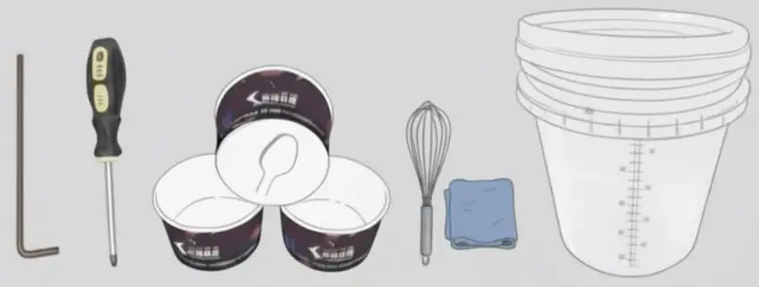

# Before You Begin

## Space Requirements

<h4>🏠 Location</h4>
<ul>
<li><strong>Space:</strong> 137 × 170 × 265 cm minimum</li>
<li><strong>Rear clearance:</strong> 50 cm (20 in)</li>
<li><strong>Side clearance:</strong> 20 cm (8 in) each side</li>
<li><strong>Floor:</strong> Level, stable, hard surface</li>
<li><strong>Environment:</strong> Indoor only, avoid direct sunlight</li>
</ul>

## Power Requirements

<h4>⚡ Electrical</h4>
<ul>
<li><strong>Voltage:</strong> 220V/20A dedicated circuit</li>
<li><strong>Outlet:</strong> NEMA 6-20R required</li>
<li><strong>Installation:</strong> Licensed electrician required</li>
<li><strong>Connectivity:</strong> WiFi or Ethernet internet</li>
</ul>

## What's Included

Your shipment contains:
- **Robo Ice Cream Machine** (F1 or F2 model)
- **Installation tools:** Phillips screwdriver, hex key, spare sensor
- **Spare parts kit:** NSF-approved grease, O-rings, gaskets, tubing
- **Cleaning supplies:** Brushes, whisk, cloths, agitator brush
- **Serving supplies:** Sweet Robo cups with integrated spoons
- **Cup dispenser tubes:** 4 tubes (50 cups each = 200 total)
- **Mixing bucket:** 10L graduated bucket for mix preparation
- **Digital multimeter:** MT87 for electrical diagnostics
- **Power cord** with NEMA 6-20P plug and machine keys

Components included with your machine

## Important Notes

<strong>🚨 Never power on without ice cream mix!</strong> This causes "core board error" and potential damage.

<strong>⚠️ Keep machine upright at all times!</strong> Tilting damages the refrigeration system.

