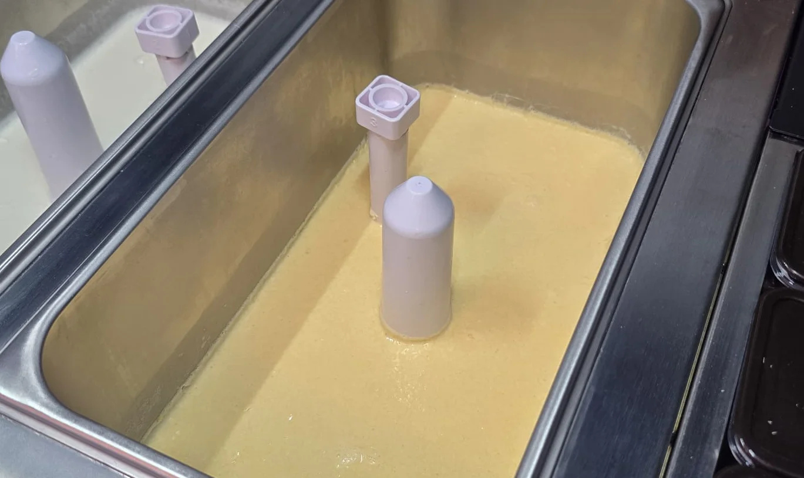
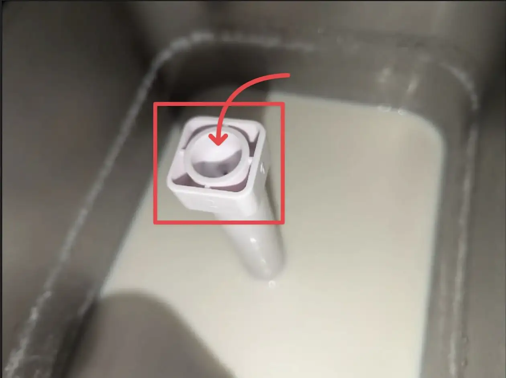
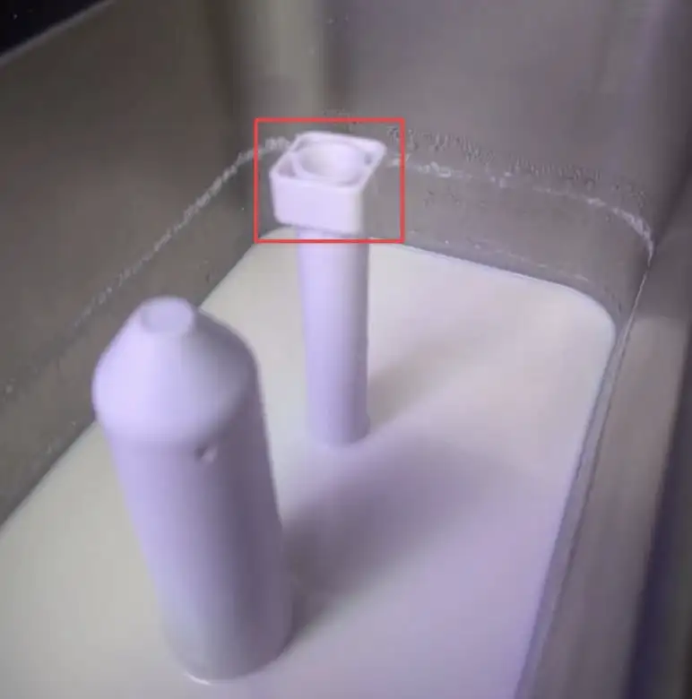

# Maintenance

Proper maintenance is critical for the Robo Ice Cream F2's food safety, functionality, and regulatory compliance. The F2 model features **dual hoppers** that must both be maintained according to the same rigorous schedule.

**IMPORTANT**

Regular cleaning helps prevent failures and extends machine lifespan. Only trained staff should perform internal cleaning. Always shut off ice cream systems using the Main I/O switch before cleaning (certain maintenance tasks may require power). Never leave mix in hoppers longer than 3 days.

**Food Safety Guidelines**

* All cleaning agents must be food-safe and approved for food equipment
* Use only clean water and food-grade cleaning products on components that contact food
* Maintain cleaning logs at all times for regulatory compliance
* Only use food-grade chemicals when cleaning components that come in contact with food

***

## Cleaning Schedule Summary

### Daily Tasks ✅

**External Cleaning**

• Check expiration dates on ice cream mix in both hoppers\
• Wipe down external machine surfaces\
• Inspect cup and topping dispensers for debris/blockages\
• Sanitize touchscreen and customer contact points

**Operational Verification**

• Verify hopper fill levels (both Left and Right hoppers)\
• Check **Left (L:) and Right (R:)** hopper status displays (should show 100% when cooled and ready to serve)\
• Monitor actual temperature (must be below 41°F/5°C)\
• Check hopper temperature sensors - verify no "Mix Needs Replacement" alerts\
• Confirm both hoppers maintaining safe temperature (below 5°C)\
• Check for error messages on display\
• Empty drip tray if needed\
• Inspect viewing window cleanliness

### Every 3 Days ✅

• Discard ice cream mix stored >3 days in either hopper\
• Complete the full [3-Step Cleaning Procedure](maintenance.md#complete-3-step-cleaning-procedure) for both hoppers\
• Update cleaning log with completion time and operator initials\
• Allow sanitizer to fully evaporate before refilling with fresh mix

### Weekly Tasks ✅

• Clean syrup containers - follow [3-Step Cleaning Procedure](maintenance.md#complete-3-step-cleaning-procedure) for tubing\
• Clean topping containers using wash, rinse, and sanitize steps\
• Inspect all food-contact parts for wear/residue/buildup\
• Empty and sanitize drip and waste collection area\
• Test all safety systems and sensors\
• Verify proper drainage for both hopper systems

***

## 3-Day Cleaning Requirements

**WARNING:** Ice cream mix must be discarded after 3 days in hopper. Temperature monitoring will automatically block dispensing if internal temperature exceeds 41°F (5°C) to prevent serving spoiled product.

**Power Requirements During Cleaning**

Different cleaning tasks require different power states:

* **Hopper flushing/cleaning cycles**: Keep power ON
* **Manual cleaning only**: Turn off Main I/O Power Switch
* **Electrical maintenance**: Always disconnect ALL power sources
* **Backend access needed**: Leave Breaker ON

Only turn off power to components not needed for the specific maintenance task.

Pre-Cleaning Preparation

#### Assess Power Needs

• For hopper flushing: Keep power ON\
• For manual cleaning only: Turn off Main I/O Power Switch\
• Leave Breaker ON if backend access needed

#### Document Mix Status

• Record mix expiration dates for both hoppers\
• Note any temperature excursions\
• Log start time of cleaning process

**Next Step:** Proceed to the [Complete 3-Step Cleaning Procedure](maintenance.md#complete-3-step-cleaning-procedure) below for detailed instructions on properly washing, rinsing, and sanitizing both hoppers.

### Complete 3-Step Cleaning Procedure

**IMPORTANT: 3-Step Cleaning Process**

All hopper cleaning must follow this comprehensive 3-step process to ensure proper sanitation and food safety. This procedure applies to both Left and Right hoppers and should be completed every 3 days or when changing flavors.

#### Step 1: Wash - Thorough Cleaning with Soap

IMAGE: DRAINING HOPPERSIMAGE: WASHING WITH SOAPY WATER

**Empty and Prepare:**\
• Manually drain all ice cream mix from both Left and Right hoppers\
• Run **Thaw Fresh** + **Manual Discharge** on each hopper to flush residues\
 

**Wash with Soapy Water:**\
• Use **warm water** (warm to the touch, comfortable for hands - NOT boiling)\
• Add grease-removing dish soap like **Dawn** or similar (safe for hands, good for dishes)\
• Fill both hoppers with warm soapy water\
• **Agitate thoroughly** - scrub all surfaces well to remove buildup\
• Use provided brushes to clean agitator shafts and narrow areas\
• Run **Auto Discharge** to flush soapy water through dispensing lines\
• Clean all dispensing nozzles with soapy water and brushes

#### Step 2: Rinse - Complete Soap Removal

IMAGE: FILLING WITH RINSE WATERIMAGE: WATER RUNNING CLEAR

**First Rinse Cycle:**\
• Fill mixing bucket with **cool or room temperature water**\
• Pour water into both hoppers until filled\
• Place bucket under exit valve\
• Open valve to flush water completely through system\
 

**Second Rinse Cycle (Recommended):**\
• Repeat the rinse process to ensure all soap is removed\
• Run **Auto Discharge** multiple times until water runs completely clear\
• Check that no soap bubbles or residue remain\
• Verify both dispensing lines are thoroughly flushed\
 

**Dry Components:**\
• Allow hoppers to air dry or wipe with clean, dry cloth\
• Ensure all surfaces are dry before sanitizing

#### Step 3: Sanitize - Multi-Quat Sanitizer Application

IMAGE: MIXING SANITIZERIMAGE: APPLYING TO HOPPERS

**Prepare Sanitizer:**\
• Use **Multi-Quat Sanitizer** (quaternary ammonium-based, food-safe)\
• **Follow manufacturer's instructions** for proper dilution ratio\
• Multi-Quat sanitizers are EPA-approved for food contact surfaces\
 

**Apply Sanitizer:**\
• Fill or spray all food contact surfaces with prepared sanitizer solution\
• Ensure complete coverage of hoppers, dispensing lines, and nozzles\
• Run sanitizer through dispensing system if liquid application\
• Contact time varies by product - follow label instructions (typically 30-60 seconds)\
 

**Allow to Air Dry:**\
• **DO NOT rinse after sanitizing** (unless product instructions specify)\
• Allow sanitizer to **completely evaporate** before adding new mix\
• Sanitizer must fully dry to be effective\
• This typically takes 5-10 minutes depending on ventilation

**About Multi-Quat Sanitizers:**

Multi-Quat (multi-quaternary ammonium) sanitizers are food-safe antimicrobial solutions specifically designed for food service equipment. They are:

* EPA-registered and approved for food contact surfaces
* Effective against bacteria, viruses, and fungi
* No-rinse formulations when used at proper concentrations
* Required to meet FDA Food Code standards for ice cream equipment

Common brands include Oasis, Steramine, and other quaternary ammonium compounds labeled for dairy equipment. Always verify your sanitizer is approved for food contact surfaces and follow the manufacturer's dilution instructions.

### Additional Cleaning Tasks

\*\*Daily Cleaning Quick Reference:\*\* 1) Clean all nozzles (ice cream/syrup/topping) with sanitized cloth & brushes 2) Wipe dispensing door & collection area with mild soap 3) Clean cup storage & sensor area 4) Disinfect touch screen with alcohol-free cleaner

#### Clean Dispensing Components

IMAGE: CLEANING NOZZLESIMAGE: USING BRUSH ON NARROW POINTS• Wipe all ice cream nozzles (both hopper lines) with sanitized cloth\
• Clean syrup and topping nozzles thoroughly\
• Use included brushes for narrow dispensing points

#### Dispensing Area Cleaning

IMAGE: CLEANING DISPENSING DOORIMAGE: WIPING COLLECTION AREA• Wipe down dispensing door and collection area with soft cloth\
• Use only mild soap and water - avoid harsh chemicals\
• Ensure all dispensing areas are clean and unobstructed

#### Final Surface Cleaning

IMAGE: CLEANING TOUCHSCREENIMAGE: READY FOR REFILL• Wipe down touchscreen with 70% isopropyl alcohol\
• Clean frame and outer panels with mild soap solution\
• Clean internal collection area thoroughly\
• Verify all surfaces are dry before refilling

***

## Refilling Hoppers with Ice Cream Mix

**IMPORTANT - Hopper Capacity & Fill Level**

Each hopper has a capacity of 2L minimum to 12L maximum. **DO NOT fill above the air valve (airpath)** - this is the component that controls the amount of mix flowing down to the agitator. Overfilling past the air valve can cause:

* Improper mix flow and consistency issues
* Damage to the airpath system
* Mix overflow into mechanical components
* Voiding of warranty

### Proper Hopper Filling Procedure

\*\*Hopper Filling Quick Reference:\*\* 1) Check mix temp <41°F/5°C 2) Inspect clean hopper/air valve 3) Fill 2-12L, 1-2" below air valve 4) Record date/batch

#### Check Mix Temperature

• Ensure ice cream mix is properly chilled (below 41°F/5°C)\
• Never add warm mix to hoppers\
• Pre-chill mix in refrigerator if needed

#### Inspect Hopper Interior

• Locate the air valve (airpath) inside each hopper\
• Check that hopper is clean and dry\
• Ensure agitator is properly positionedIMAGE: HOPPER INTERIOR WITH AIR VALVE

#### Fill to Proper Level

• Pour mix slowly to avoid splashing\
• Fill to maximum 1-2 inches BELOW the air valve\
• Minimum fill: 2 liters (ensures proper operation)\
• Maximum fill: 12 liters (never exceed air valve level)

#### Record Mix Information

• Note date and time of fill\
• Record mix batch/lot number\
• Mark expiration date (3 days from fill)\
• Update cleaning log

***

## Weekly Maintenance Procedures

\*\*Weekly Maintenance Quick Reference:\*\* 1) Temperature sensors: Inspect/clean 2) Syrup lines: Disconnect containers, flush w/Test Syrup 1-3, check nozzles 3) Topping hoppers: Remove/wash/dry completely (270g each) 4) Cup sensor: Manual insert test, verify door auto-close 5) Cup dropper: Run Manual Drop Cup, check jams/alignment 6) Temperature: Test sensors, verify 41°F cutoff, check mix levels

Perform these comprehensive maintenance tasks weekly:

#### 1. Temperature Sensor Inspection

Device testing dashboard showing sensor status indicators

**F1 vs F2 Interface Note:** This screenshot is from an F1 (single hopper) machine. On the F2 model, the device testing interface includes additional controls for dual-hopper operation such as **Cooling (Left/Right)**, **Manual Discharge (L/M/R)**, and **Thaw Fresh (Left/Right)** options for independent hopper management.

• Visually inspect temperature sensors in both hoppers\
• Check for any ice buildup or obstruction around sensors\
• Verify sensor readings match actual mix temperature\
• Clean sensor area gently with food-safe sanitizer\
• Test temperature alert system if accessible in backend

#### 2. Flush Syrup Lines

IMAGE: DISCONNECTING SYRUP CONTAINERIMAGE: FLUSHING WITH WATER• Disconnect syrup containers\
• Flush lines with warm water using **Test Syrup 1-3** functions\
• Inspect nozzles for stickiness or discoloration\
• Reconnect and test dispensing accuracy

#### 3. Clean Topping Hoppers

IMAGE: REMOVING TOPPING HOPPERIMAGE: WASHING WITH SOAP• Remove and empty all topping hoppers (270g capacity each)\
• Wash with mild soap and warm water\
• **Dry completely** before reinstalling to prevent clumping\
• Wipe internal walls and sanitize surfaces\
• Refill with fresh toppings

#### 3. Sensor Test

IMAGE: TESTING CUP SENSORIMAGE: DOOR AUTO-CLOSE• Insert cup manually; confirm door stays open while detected\
• Remove cup; ensure door auto-closes\
• Check for proper sensor alignment

#### 4. Cup Dropper Test

IMAGE: BACKEND CUP TESTIMAGE: CHECKING ALIGNMENT• Run **Manual Drop Cup** from backend\
• Check for jams or misalignment\
• Verify smooth operation of cup dispenser\
• Inspect cup tubes for blockages

#### 5. Temperature System Verification

IMAGE: CHECKING TEMPERATURE DISPLAY

Backend temperature monitoring interface showing tank temperature readings (F1 interface shown)

**Note:** The screenshot shows an F1 (single hopper) interface. On your F2 model, the device testing dashboard displays dual-hopper temperature monitoring with separate readings for Left and Right hoppers, allowing independent verification of both cooling systems.

• Test temperature sensors in both hoppers\
• Verify automatic cutoff at 41°F (5°C)\
• Check mix level sensors for accuracy\
• Confirm refrigeration performance

***

## Approved Cleaning Products

**✅ Approved Products**

• **Step 1 - Wash:** Dawn or similar grease-removing dish soap\
• **Step 2 - Rinse:** Cool or room temperature clean water\
• **Step 3 - Sanitize:** Multi-Quat sanitizer (quaternary ammonium-based)\
• 70% isopropyl alcohol (touchscreen and outer surfaces only)\
• Warm water (comfortable to touch, not boiling) for washing\
• **Note:** Other products may be used ONLY when directed by Sweet Robo support

**❌ Prohibited Products**

• Paint thinner or volatile oils\
• Bleach or alkaline cleaners\
• Abrasive powders or scouring pads\
• Acetone or solvent-based chemicals\
• Strong alkaline detergents\
• Any chemicals that corrode or crack paint and plastic

**WARNING:** Follow the [3-Step Cleaning Procedure](maintenance.md#complete-3-step-cleaning-procedure) exactly. Never skip the rinse step before sanitizing. Always allow sanitizer to fully evaporate before adding new mix.

## Cleaning Safety Guidelines

**Cross-Contamination Prevention**

• Use separate tools for food-contact areas and waste zones\
• Clean Left and Right hopper systems separately to prevent flavor mixing\
• **Always sanitize all equipment between flavor changes**\
• Use designated cleaning tools for each hopper system\
• Label cleaning supplies to maintain separation\
• Flush hoppers thoroughly when changing flavors

**Personal Safety**

• Never use expired cleaning solutions\
• Wear appropriate protective equipment\
• Ensure proper ventilation during cleaning\
• Allow warm components to cool before cleaning\
• Avoid loose clothing/jewelry near moving parts

***

## Electrical Safety During Maintenance

**WARNING: Electrical Shock Hazard.** Only personnel with appropriate electrical knowledge should service electrical components. Improper handling can cause serious injury or death.

### Power Management Guidelines

#### Before Any Maintenance

• Determine if power is needed for the specific task\
• For hopper flushing/cleaning cycles: Keep power ON\
• For electrical work: Always disconnect ALL power sources\
• Never unplug while machine is powered on

#### Proper Shutdown Procedure

• Access backend (tap and hold top-right corner for 3-5 seconds, enter default password)\
• Use backend software shutdown button to power down internal PC first\
• See [Backend Management](operation.html#operator-interface-and-backend-management) for detailed instructions\
• Wait for PC to fully shut down (screen will go black)\
• Turn off Main I/O Power Switch\
• Use Breaker Switch to safely isolate system\
• Disconnect power cord only after breaker is OFF

#### Safety Precautions

• **ESD Protection Required**: Be mindful of Electrostatic Discharge when near electronics\
• Static electricity can permanently damage sensitive components\
• Consider using an **ESD wrist strap** when servicing internal electronics\
• Touch a grounded metal surface before handling electronic parts\
• Allow any warm components (IO boards, motors) to cool before touching\
• Never touch IO boards without contacting support first\
• Avoid loose clothing, jewelry, or long hair near moving parts

**IMPORTANT:** Inform Sweet Robo technician of any electrical issues before attempting repairs. Unauthorized modifications may void warranty.

***

## Maintenance Logs and Compliance

#### Required Documentation

Operators must maintain visible cleaning logs onsite including:

* **Task performed** (specify which hopper when applicable)
* **Date and time** of completion
* **Operator initials** and signature
* **Mix expiration dates** for both hoppers
* **Cleaning agent used** and concentration

#### Regulatory Compliance

* Logs support **NAMA (National Automatic Merchandising Association)** compliance requirements
* Documentation must be available for health inspections at all times
* Track upcoming cleaning due dates systematically
* Maintain records for **minimum 90 days** or as required by local regulations
* Temperature logs must demonstrate continuous monitoring below 41°F (5°C)

#### Digital Tracking

* Record each cleaning and refill of ice cream mix (both hoppers)
* Log syrup container maintenance
* Document topping container cleaning
* Track cup dispenser performance and refill cycles

### Sample Cleaning Log Format

| Task           | Frequency | Date       | Time    | Initials | Next Due   | Notes |
| -------------- | --------- | ---------- | ------- | -------- | ---------- | ----- |
| External Clean | Daily     | \_ /\_ /\_ | \_ : \_ | \_ \_    | \_ /\_ /\_ |       |
| Mix Check      | Daily     | \_ /\_ /\_ | \_ : \_ | \_ \_    | \_ /\_ /\_ |       |
| Hopper Clean   | 3 days    | \_ /\_ /\_ | \_ : \_ | \_ \_    | \_ /\_ /\_ |       |
| Syrup Flush    | Weekly    | \_ /\_ /\_ | \_ : \_ | \_ \_    | \_ /\_ /\_ |       |
| Topping Clean  | Weekly    | \_ /\_ /\_ | \_ : \_ | \_ \_    | \_ /\_ /\_ |       |
| System Test    | Weekly    | \_ /\_ /\_ | \_ : \_ | \_ \_    | \_ /\_ /\_ |       |

**Additional Tracking Requirements:**

* Which hopper was cleaned (A, B, or both)
* Cleaning agent used and concentration
* Any issues discovered during cleaning
* Corrective actions taken

## Mix Management (Dual Hopper System)

#### F2 Dual Hopper Requirements

* **Shelf life**: 3-4 days maximum after mixing (both hoppers)
* **Storage**: Keep unmixed powder bags in cool, dry place
* **Mixing ratio**: Always 3-3.5L water to 1 bag (1.5kg) of powder for each hopper
* **Temperature**: Use room temperature water for mixing
* **Capacity**: Each hopper serves 100 cups (200 total capacity)

**Water Ratio Effects on Consistency**

**3L water (minimum)**: Produces thicker, richer ice cream with more intense flavor and creamier texture. May dispense slightly slower.

**3.5L water (maximum)**: Creates lighter consistency that's easier to dispense, with milder flavor. Yields more servings per bag.

_Adjust within this range based on your customer preferences and local climate conditions._

#### Expiration Management

* **3-day rule**: Mix must be discarded after 3 days in either hopper
* **Temperature monitoring**: Automatic shutoff at 41°F (5°C) for both hoppers
* **Visual inspection**: Check for any discoloration or separation in both hoppers
* **Cross-contamination prevention**: Never mix expired product with fresh mix

### Ice Cream Mix Preparation Steps

10L measuring bucket

IMAGE: Measure 3L water

Step 1: Measure 3L water

IMAGE: ADD GELATO PACKET

Step 2: Add gelato packet

Step 3: Mix thoroughly

### Adding Flavors to Ice Cream Mix

**Flavor Enhancement Options**

To create flavored ice cream varieties, you can add specialized flavor concentrates to your base mix:

IMAGE: X-FLAVORS BELGIAN CHOCOLATE

X-flavors Belgian Chocolate concentrate

IMAGE: ADDING FLAVOR TO MIX

Adding flavor to prepared mix

#### Flavor Mix Instructions

• Prepare standard ice cream mix (3-3.5L water + 1 bag (1.5kg) of powder)\
• Add **2.5 oz (75ml)** of flavor concentrate per batch\
• Mix thoroughly before adding to hopper\
• Shake flavor bottle well before use

#### Important Notes

• Use only food-grade flavor concentrates approved for ice cream\
• Store flavor bottles under 40°F as indicated on label\
• Mix one Aussieblends mix bag before adding flavor\
• Different flavors can be used in Left and Right hoppers

**CAUTION:** Always verify flavor concentrates are gluten-free and meet dietary requirements if serving customers with allergies.

### Cleaning Supplies

IMAGE: Cleaning Supplies

Essential cleaning supplies: bottle brush, whisk, and cleaning cloths for maintenance

### Airpath System Maintenance

**IMPORTANT:** The airpath component (refill tube/air valve) controls mix flow into the freezing chamber. The top opening must never be covered or blocked for proper operation. When adjusting this component, you must BOTH physically turn it to the desired position AND update the "L/R Gear Position" backend setting to match (see [Parameter Settings](operation.html#parameter-settings---f2-dual-hopper-controls)). The software setting ensures accurate temperature control and mix level tracking.

Top view - Keep this opening clear

Proper installation in hopper

Default position: 2nd notch

#### Check Airpath Position

Verify the airpath is physically set to the 2nd notch (default position) AND that the "L/R Gear Position" backend setting is set to 2 to match (see [Parameter Settings](operation.html#parameter-settings---f2-dual-hopper-controls)).

#### Clean Agitator Shaft

Use the blue spiral brush to thoroughly clean the agitator shaft during maintenance.

#### Maintain Clear Airflow

Ensure the top opening of the airpath remains unobstructed at all times.

***

## Installation and Transport Safety

**WARNING: Refrigerant System** - This machine contains refrigerant. Machine MUST remain upright at all times. Never tilt or turn machine on its side as this will cause serious damage to the refrigeration system.

Initial Setup Safety

#### Inspect Upon Delivery

• Check machine body, glass, and wheels for damage\
• Verify machine remained upright during transport\
• Document any shipping damage immediately

#### Transport and Settling Requirements

• **CRITICAL:** Keep machine upright at all times\
• Allow 2+ hours to settle before connecting power\
• This allows refrigerant to stabilize after transport

#### Professional Installation

• Due to machine weight and steel construction, use qualified personnel\
• Machine wheels are NOT designed for long-distance pushing\
• Special lifting equipment required for wheel replacement

#### Level Surface Required

• Maximum 5% inclination (2°) on all sides\
• Use adjustable feet to level machine\
• Proper leveling ensures refrigeration efficiency

**Refrigeration System Details:**

* Cooling Type: Direct-contact evaporator plate
* Refrigerant: Contains refrigerant
* Insulation: High-density polyurethane foam
* Rated Cooling Output: \~500W combined for dual hoppers

**Environmental Requirements**

• **Moisture protection**: Prevent electrical shorts and circuit board damage\
• **Ventilation clearance**: 40cm rear clearance, 20cm between multiple machines\
• **Door clearance**: Ensure 135° opening for loading access\
• **Temperature control**: Avoid direct heat sources for optimal refrigeration

**Electrical Safety**

• **Grounded power**: 220V mains with proper grounding (resistance <4Ω)\
• **Accessible disconnect**: Power socket in easily accessible location\
• **Cord inspection**: Replace damaged power cords immediately through qualified service\
• **Emergency procedures**: Know location of emergency power disconnect

**Dual Hopper Considerations**

• Ensure both hopper systems have adequate power supply\
• Verify temperature monitoring for both chambers\
• Test emergency shutoff procedures for both hoppers\
• Confirm proper drainage for both systems

**Safety Verification**

• Check all safety interlocks function properly\
• Verify emergency stop accessibility\
• Test ground fault protection\
• Confirm proper signage placement

***

## Preventive Maintenance

**Monthly Tasks**

• Check refrigeration system performance for both hoppers\
• Inspect door alignment and seals\
• Test all payment systems\
• Check for software updates\
• Monitor cup dispenser mechanism\
• Verify proper ventilation and cooling

**Quarterly Tasks**

• Professional deep cleaning recommended for dual hopper system\
• Refrigeration system service for both chambers\
• Calibrate portion controls for each hopper\
• Replace worn components\
• Comprehensive dual hopper performance testing

## Parts Replacement

Common wear items for F2 dual hopper system:

* Door seals
* Dispensing nozzles (both hopper lines)
* Cup sensor components
* Dual hopper temperature sensors
* Agitator shaft seals
* O-rings and gaskets

***

## Common Maintenance Issues & Solutions

For a comprehensive list of common issues, error codes, and their solutions, please refer to the [Troubleshooting section](troubleshooting.html#common-issues--solutions).

### When to Contact Support

**Contact Sweet Robo Support immediately for:**

* Suspected internal electrical failure or broken hardware
* Error codes persist after rebooting
* Sensors, motors, dispensers not responding
* Erratic or inconsistent behavior
* When above troubleshooting steps are unsuccessful

**Always include:** Model (F2), serial number, and brief issue description

* Email: support@sweetrobo.com
* Phone: +1-844-793-3872

***

## Cleaning Tips

* **Always follow the 3-Step Process:** Wash → Rinse → Sanitize (see [Complete Procedure](maintenance.md#complete-3-step-cleaning-procedure))
* **Proper water temperatures:** Warm (not hot) for washing, cool for rinsing
* **Thorough agitation:** Scrub all surfaces well during wash step
* **Complete rinsing:** Run at least 2 rinse cycles to remove all soap
* **Multi-Quat sanitizer:** Follow manufacturer's dilution instructions exactly
* **Allow evaporation:** Let sanitizer completely dry before adding new mix
* **Documentation:** Keep detailed cleaning logs for compliance
* Clean both hoppers simultaneously to maintain consistency

_After completing the 3-Step Cleaning Procedure and allowing sanitizer to evaporate, refill both hoppers using the proper mix preparation process outlined in the Operation section._
