# Operation Guide

The Robo Ice Cream F2 features **dual hoppers** enabling customers to enjoy two distinct flavors simultaneously or create exciting swirl combinations. This guide covers customer operation, operator management, and the unique dual-flavor capabilities of the F2 system.

## F2 Dual-Flavor System Overview

#### Left Hopper
Primary flavor (chocolate, vanilla, etc.) with independent temperature control.

#### Right Hopper
Secondary flavor (strawberry, mint, etc.) with independent temperature control.

#### Swirl Mode
Combines both flavors for unique taste experiences with precision timing.

#### Temperature Control
Each hopper maintains optimal serving temperature independently.

## Daily Startup Procedure

<h3>Check Machine Status</h3>
• Verify power is on 
• Check <strong>Left (L:) and Right (R:)</strong> hopper status displays (should show 100% when ready) 
• Ensure both hoppers are at serving temperature 
• Verify hopper temperature sensors show below 5°C (41°F) 
• Check for any "Mix Needs Replacement" alerts 
• Verify all doors are closed properly

<h3>Verify Dual-Hopper Supplies</h3>
• Check ice cream mix levels in <strong>both hoppers</strong> (minimum 2L per hopper) 
• Ensure different flavors are properly loaded in Left and Right hoppers 
• Check cup inventory in all 4 tubes 
• Verify syrup levels for flavor enhancement 
• Check topping levels for complete customization

<h3>Backend Access and System Check</h3>
• Access backend: Tap and hold top-right corner for 3-5 seconds, enter password 
• Check system status for both hoppers 
• Verify no alerts for either Left or Right systems 
• For full backend details, see <a href="#operator-interface-and-backend-management">Backend Management</a> below

## Customer Operation - F2 Dual-Flavor Experience

The F2 provides customers with exciting flavor options through its dual-hopper system:

### Flavor Selection Process

<h3>Primary Selection Screen</h3>
Customer approaches the intuitive touchscreen interface. Machine displays available flavor combinations: 
 
• <strong>Left Flavor Only</strong>: Single flavor from left hopper 
• <strong>Right Flavor Only</strong>: Single flavor from right hopper 
• <strong>Swirl Combination</strong>: Both flavors blended together

<h3>Enhanced Customization</h3>
• Customer selects preferred size 
• Choose from multiple syrup options (1-3 available) 
• Add dry toppings for additional texture (1-3 available) 
• Preview final product combination

<h3>Payment and Dispensing</h3>
Customer completes payment via cash, coin, or card. F2 automatically executes the dual-flavor process: 
 
• Drops cup into position 
• Dispenses ice cream from selected hopper(s) 
• <strong>Swirl Mode</strong>: Alternates between left and right hoppers 
• Adds selected syrups in sequence 
• Applies chosen toppings 
• Opens collection door for pickup

### Customer Interface - Visual Walkthrough

The following screens guide customers through the complete ordering process:

<h3>Welcome Screen</h3>
The vibrant splash screen welcomes customers with eye-catching Robo Ice Cream branding and colorful ice cream visuals. This idle screen attracts attention and invites customers to begin their order.

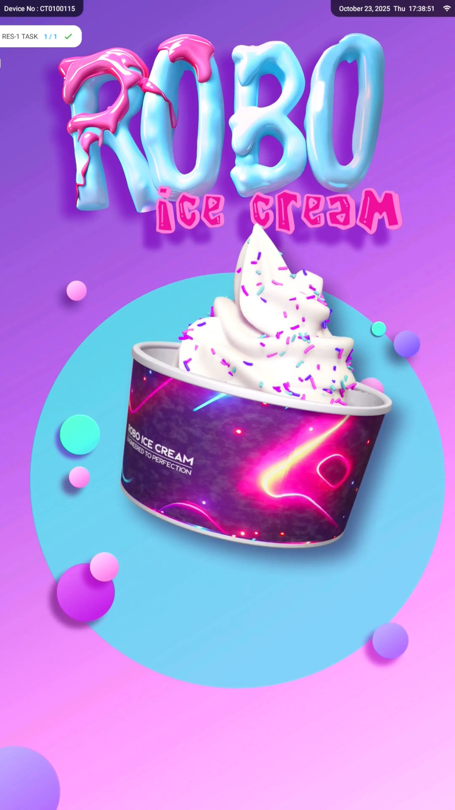

<h3>Flavor Selection</h3>
Customers select their desired ice cream flavor and toppings from an intuitive grid display. Each option shows product images and pricing with clear NEXT and BACK navigation buttons.

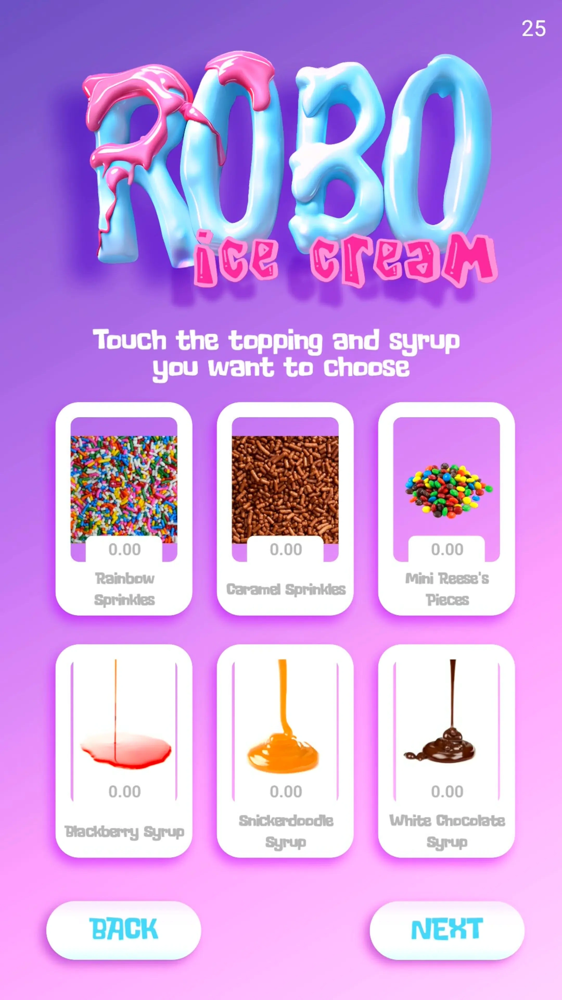

<h3>Glaze & Topping Customization</h3>
The "Pick a Glaze" screen allows customers to add syrups and additional toppings. Touch any option to add it to the order, with navigation buttons for easy browsing through available choices.

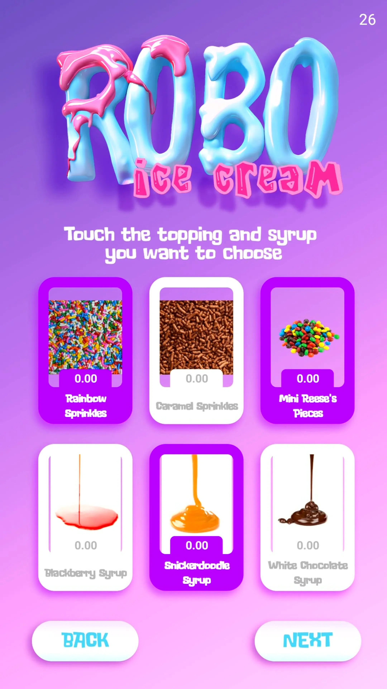

<h3>Order Summary</h3>
Before payment, customers review their complete order showing the selected base flavor and all chosen toppings in a clear grid layout. The PREV and BACK buttons allow easy modifications.

<h3>Payment Selection</h3>
After reviewing their order, customers select their payment method. The machine accepts cash, coins, and card payments with clear visual prompts for each option.

<h3>Mixing Process</h3>
During preparation, customers see an engaging animation of the "Tiny Robot Chefs" mixing their ice cream with toppings. The progress indicator shows real-time status with playful messaging.

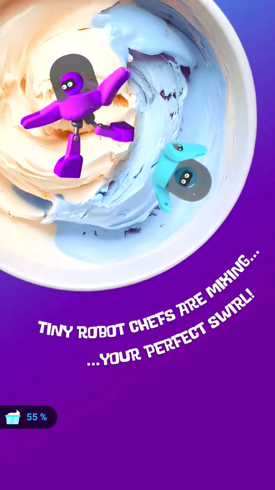

<h3>Order Complete</h3>
When the countdown reaches 00:00, the order is ready for pickup. The CONTINUE button resets the machine for the next customer while displaying the completed ice cream with all customizations.

## Operator Interface and Backend Management

### Accessing Backend Settings

To access the comprehensive operator interface:

<h3>Initiating Login</h3>
• Tap and hold the <strong>top-right corner</strong> of the touchscreen for 3-5 seconds 
• Enter operator password when prompted 
• Default password: '123456' (should be changed for security)

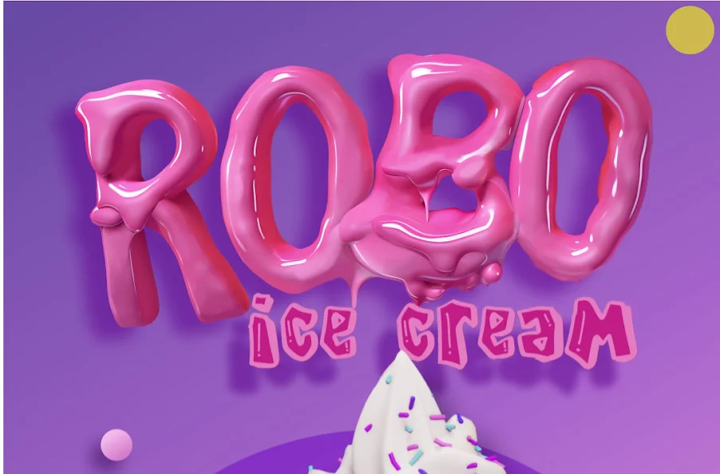

Left: Tap and hold top-right corner | Right: Enter default password 123456

**SECURITY WARNING:** For security reasons, change the default password under Device Settings

### Management Interface Overview

Main management screen showing device information and system controls

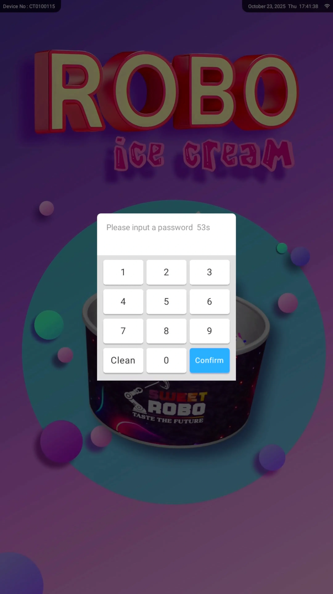

Numeric password entry dialog for backend access

The management screen provides access to six key sections:

| Section | Purpose |
|---------|---------|
| Parameter Settings | Control temperature, timing, and dispense parameters |
| Stock Settings | Monitor and update inventory for cups, mix, syrups, and toppings |
| Device Testing | Manually test components and perform cleaning functions |
| Opening Hours | Schedule vending availability based on business hours |
| System Settings | Configure system behavior (volume, voice, network, etc.) |
| Shopping Settings | Configure payment methods, timeout behavior, and alerts |

### Parameter Settings - F2 Dual-Hopper Controls

Critical settings for optimal F2 operation:

**Hopper-Specific Parameters:**

| **Parameter** | **Default** | **Description** |
|:-----:|:-----:|:-----:|
| L/R Gear Position | 2 | Software setting for air valve position - must match physical setting. Start at 2. For high volume, increase both physical & software to 3-4. Ensures accurate temperature control & mix tracking. See [physical adjustment](setup.md#54-adjust-refill-tube) |
| L/R Discharge Time | 1.3s | Individual dispense timing per hopper |
| L/R Pre-cooling Temp | 4°C | Maintains optimal temperature per hopper |
| L/R Discharge Threshold (%) | 70% | Minimum mix % required per hopper |

**Dual-Flavor Timing:**

| **Function** | **Default** | **Description** |
|:-----:|:-----:|:-----:|
| Swirl Alternation Time | 500ms | Time between hopper switches in swirl mode |
| Syrup Dispense Time | 1500ms | Time per syrup application |
| Sprinkle Time | 2000ms | Time per dry topping |

### Stock Settings - Dual-Hopper Management

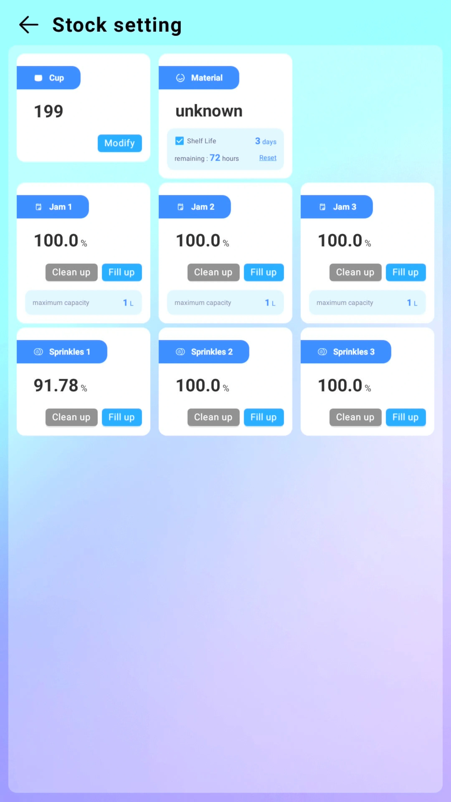

Stock management interface showing inventory levels across all compartments

Monitor and manage inventory for both hoppers independently:

- **Cup Count**: Manually update remaining cups across all 4 tubes
- **Ice Cream Mix (Left)**: Status: Adequate / Low / Empty for left hopper
- **Ice Cream Mix (Right)**: Status: Adequate / Low / Empty for right hopper  
- **Syrups 1–3**: Update or clear individual syrup stock levels
- **Toppings 1–3**: Update or clear individual dry topping stock levels

**Important:** Use "Fill Up" to mark an item as fully restocked 
Use "Clean Up" to clear stock status and remove from customer selection

Expired mix warning alert requiring operator attention

### Product Management

Configure and manage product inventory, including toppings, syrups, and customization options:

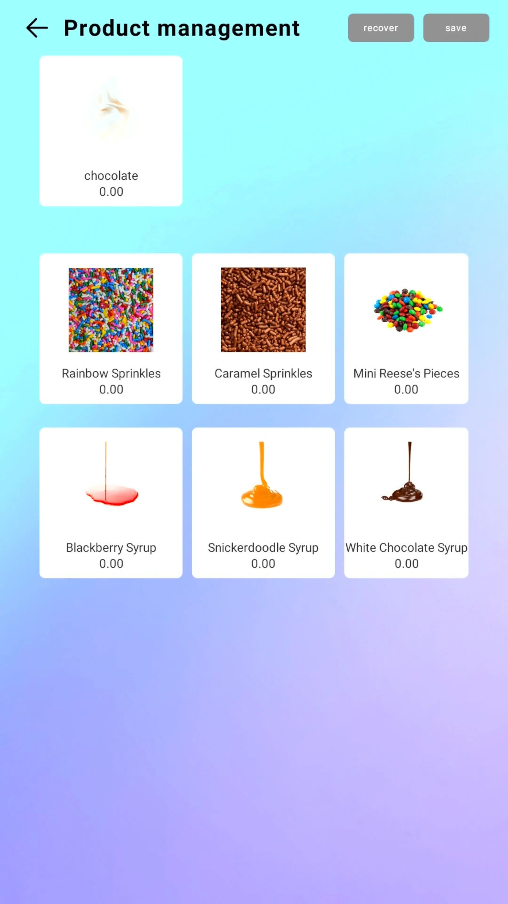

Product management interface displaying topping and syrup inventory

<h3>Edit Product Details</h3>
Tap any product to open the edit dialog where you can modify names, prices, and availability. The virtual keyboard allows easy text input for product customization.

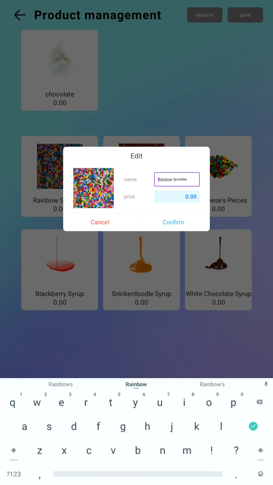

<h3>Ingredient Confirmation</h3>
When adding or modifying ingredients, confirm selections with specific quantity inputs. This ensures accurate inventory tracking and pricing calculations.

<h3>Save Changes</h3>
After making modifications, the system prompts to save all changes. Click Confirm to apply updates or Cancel to discard modifications.

<h3>Revert Options</h3>
If you need to undo changes before saving, use the "Revert all changes" option to restore the previous configuration without losing your working state.

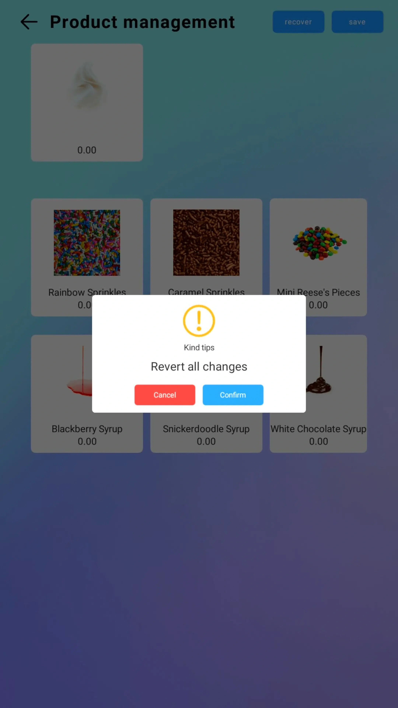

<h3>Product Pagination</h3>
Navigate through multiple pages of products using the pagination counter. The interface shows your current position and allows easy browsing of extensive product catalogs.

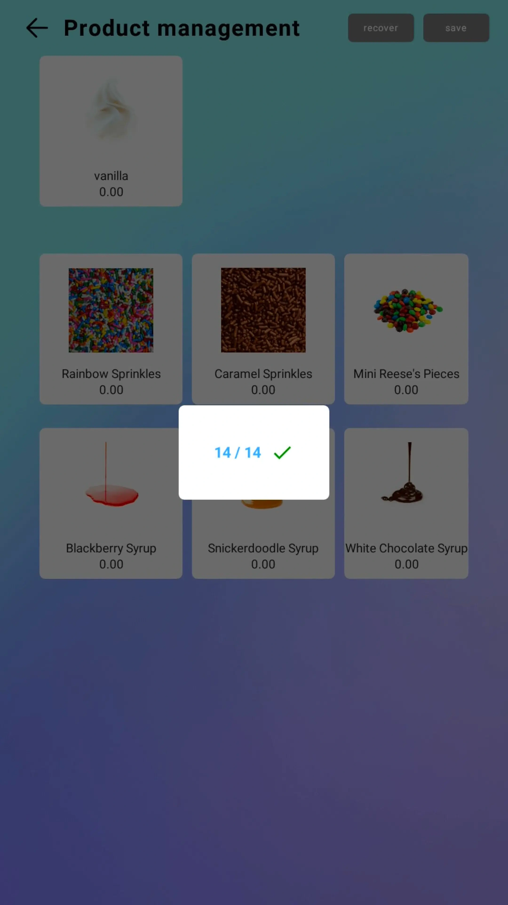

### Device Testing - Component Control

The F2 provides comprehensive testing capabilities for dual-hopper operation:

#### Cooling System Controls
• **Cooling (Left / Right)**: Activates cooling compressor for selected hopper 
• **Thaw Fresh (Left / Right)**: Warms freezing chamber for cleaning (see <a href="./maintenance.html#complete-3-step-cleaning-procedure">3-Step Cleaning Procedure</a>) 
• **Keep Fresh (Left / Right)**: Maintains mix freshness without freezing

#### Ice Cream Dispensing
• **Manual Discharge (L / M / R)**: Manual control for Left, Middle (swirl), or Right 
• **Auto Discharge**: Automatic dispensing with preset timing 
• **Close Controls**: Individual close functions per dispenser

#### Additional Testing
• **Cup Holder**: Reset and manual cup drop functions 
• **Syrup Testing**: Test individual syrup lines (1-3) 
• **Topping Testing**: Test individual topping dispensers (1-3)

#### System Controls
• **Door Controls**: Lock/unlock and raise/lower collection door 
• **System Reset**: Full system restart options

Comprehensive device testing dashboard with controls for all machine components

Advanced cup holder position correction and calibration interface

## Ice Cream Mix Preparation - F2 Dual-Hopper System

<strong>🎥 Video Tutorial Available</strong> 
Scan the QR code to watch a detailed video tutorial on preparing ice cream mix.

### Preparing Powder-Based Mix

For optimal F2 operation, prepare mix for each hopper independently:

**Required Tools:**
- Mixing bucket (at least 5L capacity)
- Food-safe electric mixer or whisk
- Clean stirring rod
- Fresh drinking-grade water

Mixing bucket for ice cream preparation

Preparation Instructions:

<strong>Prepare Water Base</strong> 
• Pour <strong>4 liters of fresh water</strong> into clean mixing bucket 
• Ensure bucket has been properly cleaned using the <a href="./maintenance.html#complete-3-step-cleaning-procedure">3-Step Cleaning Procedure</a>

<strong>Add Ice Cream Powder</strong> 
• Slowly pour <strong>one full 1.5 kg bag</strong> of powder into water 
• Allow brief settling time for initial dissolution

<strong>Mix Thoroughly</strong> 
• Use mixer to stir solution for <strong>2–3 minutes</strong> 
• Ensure slurry is smooth and clump-free 
• Avoid over-mixing to prevent excess foaming

<strong>Transfer to Hopper</strong> 
• Slowly pour mixed slurry into designated hopper (Left or Right) 
• Avoid splashing or overfilling 
• Keep hopper lids closed after refilling

<strong>Quality Check</strong> 
• Light foam layer above liquid is normal 
• Gently stir with clean rod if excess foam develops 
• Verify proper consistency before operation

not print ready, incorrect images TODO

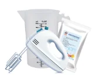

Left: Adding powder to water | Right: Proper mixing technique

not print ready, incorrect images TODO

Premium gelato powder mix used for ice cream preparation

IMAGE: TRANSFER PROCESS

Transferring prepared mix to hopper

### F2 Dual-Hopper Fill Guidelines

**Initial Setup:**
- For new startups or after full cleaning, add **at least 2 full bags per hopper** (6 kg total powder to 16 L water)
- This ensures both hoppers are properly primed for dual-flavor operation
- Adjust air valve (refill tube) based on serving volume - requires BOTH physical adjustment (see [Refill Tube Adjustment](setup.md#54-adjust-refill-tube)) AND matching backend setting (see [Parameter Settings](#parameter-settings---f2-dual-hopper-controls))

**Ongoing Refills:**
- Maintain minimum 2L in each hopper (see [Critical Requirements](overview.md#critical-operating-requirements))
- Stir remaining mix before refilling to prevent settling
- Alternate hopper refills to maintain continuous dual-flavor availability

**Flavor Management:**
- Use different flavors in each hopper for maximum customer choice
- Popular combinations: Vanilla (Left) + Chocolate (Right)
- Consider seasonal flavors: Vanilla (Left) + Strawberry (Right)

**WARNING:** Always follow the <a href="./maintenance.html#complete-3-step-cleaning-procedure">3-Step Cleaning Procedure</a> between flavor changes to prevent cross-contamination

## Temperature Monitoring - Dual-Hopper System

The F2's dual display system shows individual hopper status:

- **L: 100%** = Left hopper at optimal serving temperature
- **R: 100%** = Right hopper at optimal serving temperature  
- **Lower percentages** = Cooling in progress for that hopper
- **Alert conditions** = Temperature issues requiring attention

**Temperature Sensor Monitoring:**
- Each hopper has a dedicated temperature sensor that continuously monitors mix temperature
- Optimal temperature: Below 5°C (41°F). When exceeds 5°C, marked as "needs replacement"

**Mix Replacement Required Alert**

When the hopper temperature sensor detects mix temperature above 5°C (41°F):
- The affected hopper will display "Mix Needs Replacement"
- Machine will NOT dispense from that hopper
- Replace the mix immediately to ensure food safety
- After replacement, allow time for mix to cool below 5°C before serving

Both hoppers must reach 100% and maintain temperature below 5°C for full dual-flavor operation. Single-hopper operation possible if one hopper is offline or requires mix replacement.

## Managing Dual Flavors During Operation

### Flavor Rotation Strategy

To maximize customer satisfaction and manage inventory:

#### Popular Combinations
• Vanilla + Chocolate (classic appeal) 
• Vanilla + Strawberry (fruit combination) 
• Chocolate + Mint (premium experience)

#### Seasonal Considerations
• Summer: Light flavors (vanilla, strawberry) 
• Winter: Rich flavors (chocolate, caramel) 
• Holidays: Themed combinations

#### Inventory Management
• Monitor consumption rates per hopper 
• Adjust mix preparation based on customer preferences 
• Track swirl vs. single-flavor selections

#### Customer Analytics
• Track most popular flavor combinations 
• Identify peak usage times per flavor 
• Optimize mix preparation schedules

### Refilling During Operation

<!-- Print condensed version -->

<strong>Ice Cream Mix - Dual-Hopper Process:</strong> 1) Check which hopper needs refilling (Left/Right display) 2) Prepare mix per instructions 3) Open specific hopper lid carefully 4) Add mix without disturbing other hopper 5) Verify 2L minimum in both hoppers 6) Close lid, verify temperature recovery.

<!-- Full version for screen -->

Ice Cream Mix - Dual-Hopper Process:

Check which hopper requires refilling (Left or Right display)

Prepare mix according to instructions above

Open specific hopper lid carefully

Add prepared mix without disturbing other hopper

Verify minimum 2L level maintained in both hoppers

Close lid securely and verify temperature recovery

**Coordinated Refilling:**
- Plan refills during low-traffic periods
- Never refill both hoppers simultaneously
- Maintain at least one hopper operational during refills

Orange Sweet Robo branded ice cream serving cups used by the F2 machine

### Syrups & Toppings for F2

The F2's enhanced customization options include:
- **3 Syrup Options**: Chocolate, strawberry, caramel (typical)
- **3 Topping Options**: Sprinkles, nuts, chocolate chips (typical)
- **Flavor Pairing**: Certain syrups complement specific hopper flavors

Approved chocolate syrup and specialized serving spoons for toppings

Replace syrup bags and refill topping containers as needed, using only approved products that complement the dual-flavor system.

## Settings and Configuration

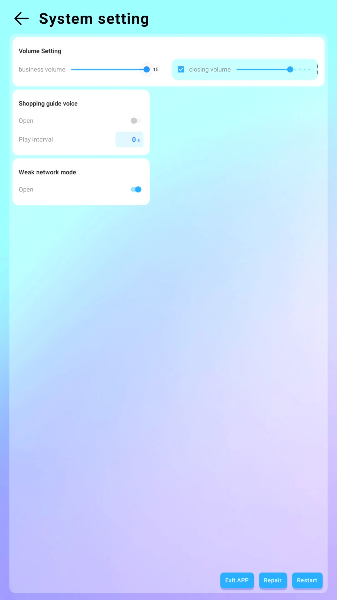

System settings with volume controls and network configuration options

#### Opening Hours Management
• Set daily operational hours (24-hour format) 
• Machine automatically powers down outside scheduled hours 
• Coordinate with dual-hopper cooling cycles for energy efficiency

#### System Settings
• **Volume Control**: Adjust for different time periods 
• **Network Configuration**: Maintain connection for sales reporting 
• **Error Logging**: Monitor dual-hopper system performance

<!-- • **Voice Prompts**: Enable promotional guidance for dual-flavor options  -->

#### Shopping Settings
Configure customer experience for dual-flavor purchasing: 
• **Payment Methods**: Enable cash, coin, and card acceptance 
• **Timeout Settings**: Manage customer interaction time 
• **Change Management**: Configure coin dispenser operation

#### Advanced Configuration
• **Language Selection**: Multiple language support 
• **Currency Settings**: Local currency configuration 
• **Receipt Options**: Digital or printed receipts 
• **Promotional Settings**: Special offers and discounts

Shopping settings for payment method configuration and change management

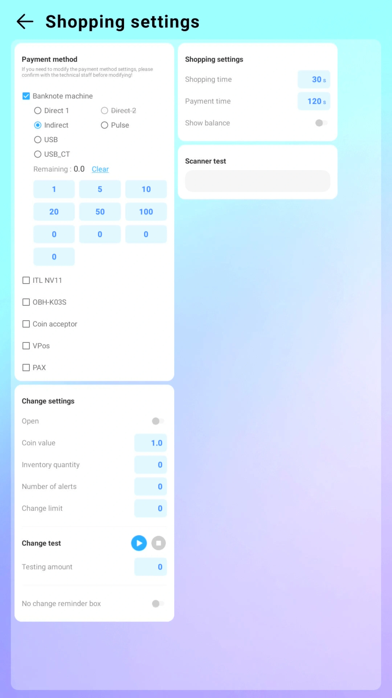

Detailed payment configuration including banknote machine and coin acceptor settings

## Daily Shutdown - F2 Protocol

**Daily Shutdown - F2 Quick Reference:** 1) Record sales data & track swirl preferences 2) Check/record mix levels, plan next flavors 3) Wipe exterior, secure hoppers, close doors 4) Leave powered for overnight cooling

Record Sales Data

• Note final sales figures for both flavors 
• Track swirl vs. single-flavor preferences 
• Monitor individual hopper performance

Inventory Assessment

• Check and record mix levels in both hoppers 
• Note consumption rates per flavor 
• Plan next day's flavor selection

System Maintenance

• Wipe down exterior surfaces 
• Ensure both hopper lids are secured 
• Verify collection door is properly closed

Overnight Operation

• Leave power on for temperature maintenance 
• Both hoppers maintain optimal overnight cooling

## Important F2 Operating Notes

### Dual-Hopper Best Practices
- **Never turn off hopper switches** during operation
- **Maintain minimum 2L mix** in each hopper (see [Critical Requirements](overview.md#critical-operating-requirements))  
- **Monitor both Left and Right hopper status** continuously
- **Plan flavor combinations** based on customer preferences

### Safety Considerations
- **Independent cooling systems** allow single-hopper operation if needed
- **Regular cleaning** required every 3 days using <a href="./maintenance.html#complete-3-step-cleaning-procedure">3-Step Cleaning Procedure</a>
- **Temperature alarms** alert operators to hopper-specific issues

### Quality Assurance
- **Monitor expiration dates** on mix for both hoppers
- **Track flavor popularity** to optimize inventory
- **Regular taste testing** ensures quality from both hoppers
- **Customer feedback** helps refine dual-flavor offerings

The F2's dual-hopper system represents the pinnacle of automated ice cream vending, providing customers with unprecedented flavor variety while maintaining the reliability and ease of operation that Sweet Robo is known for.

