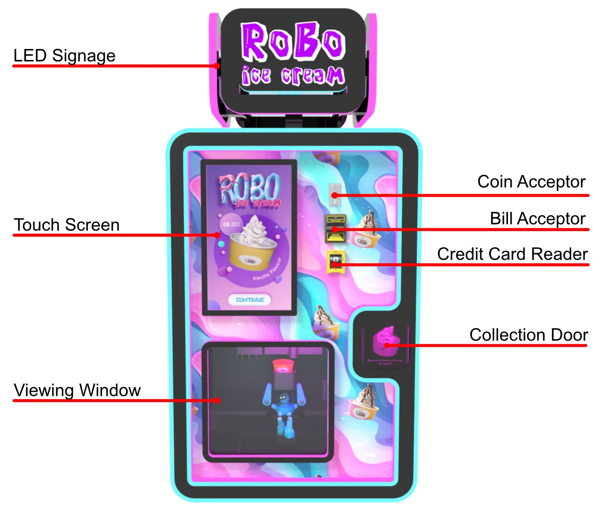
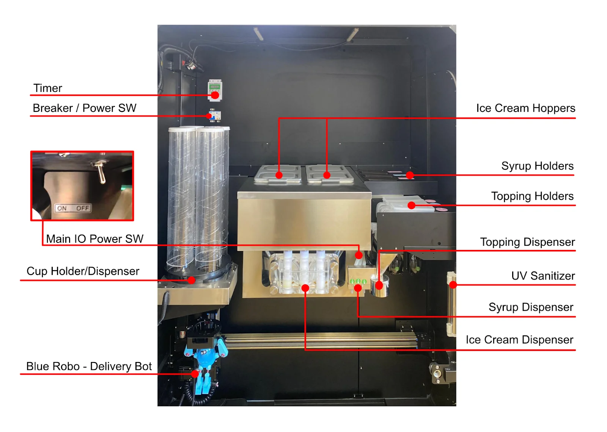

# Robo Ice Cream F2 Overview

## Robo Ice Cream F2 Manual

**Manufacturer:** Sweet Robo  
**Model:** Robo Ice Cream F2  
**Document Version:** 2  
**Last Updated:** August 2025

### Manual Contents

1. [Overview](overview.md) - Machine description and specifications
2. [Setup & Installation](setup.md) - Initial setup and configuration
3. [Operation Guide](operation.md) - Daily operation procedures
4. [Maintenance](maintenance.md) - Scheduled maintenance and cleaning
5. [Troubleshooting](troubleshooting.md) - Common issues and solutions
6. [Parts & Service](parts-service.md) - Parts list and service information
7. [Safety](safety.md) - Safety procedures and warnings

### Quick Links

- [Emergency Shutdown Procedure](./safety.md#emergency-shutdown)
- [Avoiding Core Board Error](./setup.md#critical-first-start---avoiding-core-board-error)
- [Daily Cleaning Schedule](./maintenance.md#cleaning-schedule)
- [Common Error Solutions](./troubleshooting.md#common-issues-and-solutions)

### Key F2 Features

- **Dual Flavor System**: 2 × 12L hoppers
- **220V Power Requirement**: Dedicated circuit needed
- **Cup Capacity**: 200 cups (4 tubes × 50 cups)
- **Android-Based System**: WiFi enabled

### Support

**Quick Support:** support@sweetrobo.com | +1-844-SWEETRB

For complete contact information, business hours, and additional resources, see [Company Information](../shared/company-info.md).

### Important Reminders

**Critical**: Always fill hoppers with mix BEFORE first power-on to avoid core board error  

**Minimum Mix**: Maintain at least 2L per hopper at all times  

**Mix Life**: Replace ice cream mix every 3-4 days

### Document Status

- [x] Overview - needs review
- [x] Setup & Installation - needs review  
- [x] Operation Guide - needs review
- [x] Maintenance - needs review
- [x] Troubleshooting - needs review
- [x] Parts & Service - needs review
- [x] Safety - needs review

 <!-- End print-hide -->

## Welcome to Robo Ice Cream

Congratulations on your new Robo Ice Cream F2 automated vending machine! This state-of-the-art machine is designed to provide a fun and engaging experience for customers while offering a reliable and efficient vending solution for your business. With its user-friendly touchscreen interface, the Robo Ice Cream F2 is sure to be a hit.

This manual will guide you through the setup, operation, and maintenance of your Robo Ice Cream F2. Please read it thoroughly to ensure safe and optimal performance.

### Why This Manual Matters

Reading this manual before operating your machine is crucial for:

- **Safety**: Understanding proper handling procedures and safety precautions to prevent accidents
- **Proper Usage**: Detailed instructions for setup, operation, maintenance, and troubleshooting
- **Optimal Performance**: Getting the most out of your machine's capabilities and features
- **Avoiding Damage**: Preventing costly repairs through proper maintenance and care
- **Warranty Protection**: Following manufacturer guidelines to maintain warranty coverage
- **Troubleshooting**: Self-diagnosing and resolving common issues without technical support

## System Overview

### What Is the Robo Ice Cream F2?

The Sweet Robo - **Robo Ice Cream Machine F2** is a fully automated soft-serve vending system designed for unmanned operation in retail environments. It handles everything from order selection and payment to cup dispensing, flavor mixing, and serving — all while maintaining food safety and hygiene standards.

Sweet Robo machines combine **refrigeration**, **mechanical robotics**, and **touchscreen controls** into a compact, user-friendly unit that requires minimal daily oversight.

The F2 model features **2 ice cream hoppers** allowing customers to choose between:
- First Flavor
- Second Flavor  
- Mixed Swirl (combination of both flavors)

### Key Features

#### Simple-Touch Operation
User-friendly interface with intuitive controls. With just a single touch, users can initiate the soft serve making process, eliminating the need for complex manual adjustments.

#### Easy Cleaning
Detachable parts designed for easy cleaning and maintenance. This feature ensures that the machine can be kept in optimal working condition with minimal effort.

#### Safety Features
Automatic door window with hand sensor. The Robo Ice Cream prioritizes user safety with comprehensive protection systems.

#### Food Safety
Automatic pasteurization settings to ensure no bacteria is present. The Robo Ice Cream includes settings for automatically pasteurizing ice cream mix.

#### Dual Flavor System
Two 12L hoppers for serving two distinct flavors plus swirl combination - the key differentiator of the F2 model.

#### Large Capacity
Holds 200 cups (4 tubes × 50 cups each) compared to F1's 100 cups.

### What It Does

- Dispenses soft-serve ice cream from liquid mix
- Handles cup selection, filling, syrup, and topping application
- Accepts multiple payment methods (bills, coins, card terminals)
- Provides audio/video feedback for customers
- Maintains optimal food-safe temperatures via built-in sensors
- Operates unattended with scheduled hours and stock tracking

### Use Cases

- Indoor shopping malls
- School campuses
- Airports and transportation hubs
- Movie theaters and event venues
- Gyms and recreational centers
- Micro markets and break rooms

### System Design Philosophy

Sweet Robo machines are engineered for:
- **Hygienic food handling** (NSF-style contact zones)
- **Efficient unattended service**
- **Consistent operator experience** between models
- **Expandable components** (coin dispenser, flavor count, etc.)
- **Self-diagnosing behavior** for common faults

## Technical Specifications

### Electrical & Power Requirements
- **Power Supply**: 220V only (no 110V option available)
- **Rated Current**: 13A typical @ 220V
- **Max Power Consumption**: 2,860W
- **Required Breaker**: 20A minimum (15A is too close for power spikes)
- **Outlet Type**: NEMA 6-20R (to match included 6-20P plug)
- **Cooling Output**: ~500W combined for dual hoppers

**Critical**: The F2 requires a dedicated 220V circuit with a 20A breaker. A 15A breaker is insufficient due to potential power spikes. Ensure proper electrical installation by a licensed electrician before delivery.

### Physical Specifications
- **Width**: 120 cm (47.2 in / 3.94 ft)
- **Depth**: 86.5 cm (34.1 in / 2.84 ft)
- **Height**: 245 cm (96.5 in / 8.04 ft)
- **Weight (Empty)**: 380 kg
- **Operational Temperature Range**: 10°C – 35°C (50°F – 95°F)
- **Relative Humidity Tolerance**: < 80% RH (non-condensing)

### Capacity
- **Ice Cream Hoppers**: 2 × 12L (dual flavor capability) - Never fill above the air valve (airpath)
- **Minimum Mix per Hopper**: 2L
- **Cup Storage**: 200 cups (50 × 4 holders)
- **Syrup Dispensers**: 3 (liquid syrups only)
- **Topping Dispensers**: 3 × 270g each (dry toppings only)

### Performance
- **Production Speed**: ~35 seconds per ice cream
- **Temperature Sensor Accuracy**: ±1°F (±0.5°C)
- **Automatic Cutoff**: Blocks dispensing if mix temperature exceeds 41°F (5°C)

### Core System Modules

Each F2 machine includes the following subsystems:

| Subsystem | Purpose |
|-----------|----------|
| Ice Cream Hoppers (2) | Holds chilled mix and feeds it into freezing chamber - F2 has dual hoppers for two flavors |
| Dispensing System | Delivers ice cream to cup with topping and syrup options using rotary auger for mix churn and extrusion |
| Payment System | Accepts coins, bills, and card payments through multiple integrated payment methods |
| Operator Backend | Settings panel for timing, stock, hours, and testing with secured access |
| Audio/Visual Output | Plays videos and provides status feedback through integrated touchscreen and speakers |
| Safety Controls | Prevents operation if doors open or errors occur - includes automatic door mechanisms |
| Cup Dispenser | 4-tube system, 50 cups per tube = 200 total capacity. Automatic tube switching - when one tube empties, system automatically switches to next available tube without operator intervention |
| Blue Robo Delivery Bot | Automated system that gathers ingredients, prepares treats, and serves ice cream |

<!-- | Refrigeration System | Maintains safe holding and freezing temperatures with compressor-based cooling | -->

## Hardware Components

### External Components (Customer-Facing)

External view of Robo Ice Cream F2 showing customer interface components

These components are designed for direct use by customers, including children, without needing assistance or supervision:

| Component | Description |
|-----------|-------------|
| Touchscreen | Customer interface for selecting flavors, toppings, and completing payment |
| Cup Dispenser | Dispenses one cup per order using sensor-guided motor control |
| Collection Door | **Automatic Safety System**: Opens only when ice cream is ready. Built-in sensors detect cup presence - door remains open while cup is inside and automatically closes 3-5 seconds after cup removal. Safety feature prevents closing on hands or objects. If sensor malfunction occurs, see [Troubleshooting](troubleshooting.md#door-sensor-error) |
| Speaker | Plays audio feedback and video content during the ordering and vending process |
| LED Signage | Displays advertisements, preparation animations, and system messages |

### Internal Components (F2 Dual-Hopper System)

Internal view of the Robo Ice Cream F2 showing dual ice cream hoppers and internal systems

#### Hopper Temperature Monitoring System

HOPPER TEMPERATURE SENSOR LOCATION - IMAGE PENDING

**Critical Food Safety Feature: Temperature Sensor**

Each hopper is equipped with a precision temperature sensor that continuously monitors the ice cream mix. This sensor ensures food safety by:
- Real-time temperature monitoring of mix in both hoppers
- Automatic mix status updates when temperature exceeds 5°C (41°F)
- Prevention of dispensing when mix is marked as "needs replacement"
- Alert notifications on the operator interface
- Required mix replacement before resuming operations

TEMPERATURE SENSOR CLOSE-UP - IMAGE PENDING

#### Power and Control Systems

| Component | Description |
|-----------|-------------|
| Timer | Hardware timer that controls power to the entire machine. Operates independently of software and cuts all power when activated |
| Breaker/Power Switch | Primary power cutoff that completely disconnects the machine from power |
| Main I/O Power Switch | Controls power to internal refrigeration system and ice cream dispensing mechanism while leaving touchscreen active |

#### F2 Dual-Flavor System

| Component | F2 Specifications |
|-----------|------------------|
| Ice Cream Hoppers | **2 hoppers** (Left & Right) - 2L minimum, 12L maximum capacity each **Important:** Never fill above the air valve (airpath) inside each hopper |
| Cup Holder/Dispenser | 4 cup tubes, 50 cups per tube = **200 cups total capacity** |
| Syrup Holders | **3 types** of liquid syrup (chocolate, strawberry, caramel, etc.) |
| Dry Topping Containers | **3 types** of solid toppings, **270g per hopper** (sprinkles, crushed cookies, chopped nuts) |

#### Processing Components

| Component | Description |
|-----------|-------------|
| Blue Robo Delivery Bot | Automated delivery system that gathers all ingredients, prepares treats, and serves delicious ice cream |
| Topping Dispenser | Dispenses dry toppings directly onto ice cream as the final step before serving |
| Syrup Dispenser | Draws liquid syrup from holders and applies it to ice cream per customer selection |
| Ice Cream Dispenser | Where Blue Robo collects freshly dispensed ice cream synchronized with temperature and mix level sensors |
| Hopper Temperature Sensor | Monitors ice cream mix temperature continuously - automatically marks mix as "needs replacement" and prevents dispensing if temperature exceeds 5°C (41°F) |

## Installation Requirements

<!-- Print condensed version - would not help reduce the spaceing so not adding it -->

#### Space Requirements
- Minimum clearance: 30cm on all sides
- Door swing clearance: 120cm front
- Level, stable surface required
- Indoor installation recommended

#### Electrical Requirements
- Dedicated 220V circuit
- 20A circuit breaker minimum
- Proper grounding required
- Surge protection recommended

#### Environmental Requirements
- Temperature: 10°C – 35°C (50°F – 95°F)
- Humidity: < 80% RH
- Protected from direct sunlight
- Adequate ventilation

## Critical Operating Requirements

**Essential Operating Guidelines - F2 Dual-Hopper System**

These requirements must be followed at all times to ensure safe operation and prevent damage:

- **Never run hoppers empty** - Maintain minimum 2L of mix in each hopper
- **Replace mix every 3 days** - Mix expires and must be discarded after 3 days maximum
- **Temperature monitoring** - Mix must stay below 5°C (41°F) or machine will block dispensing
- **220V power required** - F2 operates on 220V only with 20A dedicated circuit
- **Fill before power-on** - Always add mix to hoppers BEFORE first power-on (see [Core Board Error](troubleshooting.md#core-board-error))
- **Never fill above air valve** - Maximum 12L per hopper, keep below airpath opening
- **Liquid syrups only** - No solids, chunks, or thick sauces in syrup containers
- **Dry toppings only** - No liquids, wet, or sticky items in topping dispensers
- **Regular cleaning** - Follow 3-Step Cleaning Procedure every 3 days

## Important Safety Notes

**Power Requirements**: F2 requires a 220V power supply and is **not directly compatible with 110V circuits**. Can be connected using a properly rated transformer and a dedicated power line capable of supporting the required amperage.

**Grounding**: Machines must be connected to a grounded outlet. Do not share power with other equipment.

**Mix Management**: Never run the machine with empty hoppers. Always check mix level before startup to prevent spoilage or bacterial growth.

**Maintenance Access**: Internal components are accessed by trained staff via secured cabinet panels and should never be exposed to untrained users.

