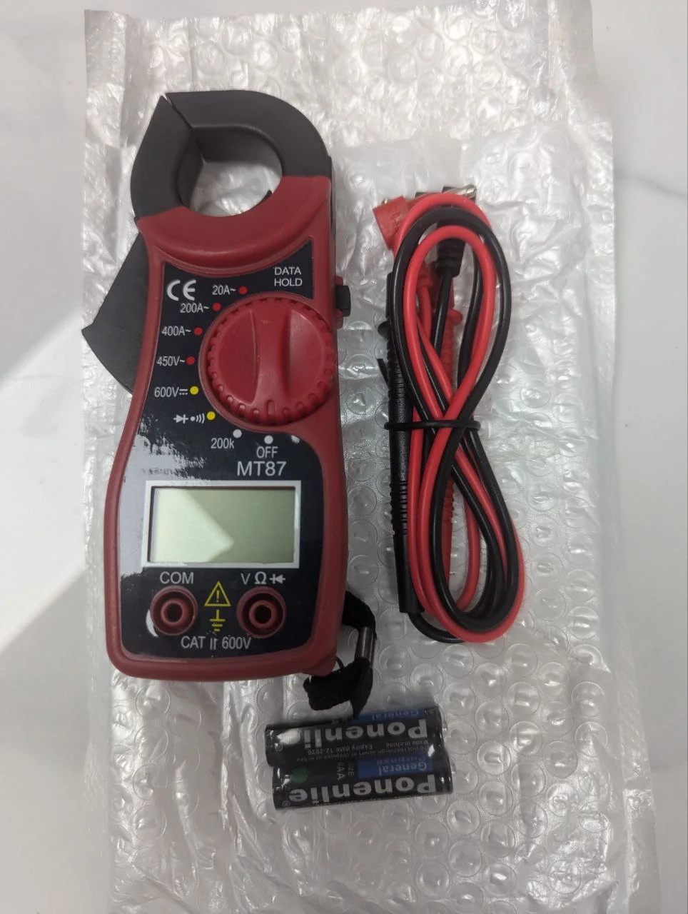
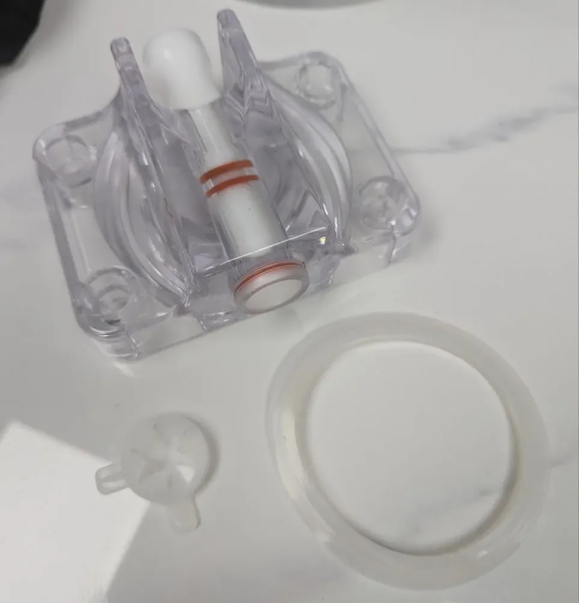

# Parts & Service

## Common Replacement Parts

**Consumables**

• Ice cream mix packets (Sweet Robo brand recommended)\
• Cups (50 per tube, 200 total capacity)\
• Syrup bags (liquid only)\
• Dry toppings (270g max per container)\
• Cleaning supplies (food-grade sanitizer)

**Electrical Components**

• Control Board: F2-CB-001\
• Touch Screen: F2-TS-001\
• Temperature Sensors: F2-TEMP-001\
• Payment Module: F2-PAY-001

### Wear Parts

| Part               | Part Number | Replacement Interval |
| ------------------ | ----------- | -------------------- |
| Door Seals         | F2-SEAL-001 | 2 years              |
| Dispensing Nozzles | F2-NOZ-001  | As needed            |
| Cup Drop Sensor    | F2-SENS-001 | As needed            |
| Hopper Gaskets     | F2-GASX-002 | 2 years              |

## Service Tools & Equipment

**Digital Multimeter**

Essential for electrical diagnostics. Measures voltage, current, and resistance. Can test up to 600V AC.

**Installation Tool Kit**

Includes Phillips screwdriver, hex keys, spare sensors, and Sweet Robo branded tool bag.

**Comprehensive Spare Parts Kit**

Food-grade MP grease (NSF approved), O-rings, gaskets, tubing, cleaning brush, and technical diagrams.

**Dispenser Seal Kit**

Complete seal replacement kit with clear housing, white shaft, orange O-rings, and gaskets. 

Dispenser seal kit shown from multiple angles for proper assembly

## Ordering Parts

How to OrderWebsite (preferred): sweetrobo.shopEmail: supplies@sweetrobo.comPhone: +1 (844) 793-3872Include:\
• Machine model (F2)\
• Serial number\
• Part number or description\
• Quantity needed

#### Expedited Shipping

* Standard: 5-7 business days
* Express: 2-3 business days
* Overnight available for critical parts

## Service Support

**Technical Support**

• **Email**: support@sweetrobo.com\
• **Phone**: +1-844-SWEETRB (844-793-3872)\
• **Response Time**: Typically within 24 hours\
• For business hours and additional contacts, see [Company Information](/broken/pages/jDBSxZ4rJs3KQVFOLwO8)

**Remote Support**

Many issues can be resolved remotely:\
• Software updates\
• Configuration changes\
• Diagnostic checks\
• Price adjustments

**Required for remote support**:

* Machine ID (found in backend settings)
* Internet connection
* Current issue description

On-Site ServiceContact support for initial diagnosisSchedule service appointmentPrepare machine area for technician accessHave purchase/warranty information ready

## Warranty Service

**What's Covered**

• Manufacturing defects\
• Component failures under normal use\
• Parts and labor (first year)

**What's Not Covered**

• Damage from misuse\
• Consumable items\
• Shipping damage\
• Unauthorized modifications

Warranty ClaimsContact support with issue descriptionProvide serial number and purchase dateFollow troubleshooting stepsReceive RMA if needed

**Biannual Service**

• Deep cleaning\
• Seal inspection\
• Mechanical adjustments\
• Performance optimization

## Emergency Service

For urgent issues:Call emergency line: +1-844-SWEETRB (844-793-3872)Have ready:\
• Machine serial number\
• Description of issue\
• Any error messages\
• Impact on operation

**Common Emergency Issues**:

* Refrigeration failure
* Complete power loss
* Payment system down
* Safety concerns

## Documentation

Keep these documents accessible:

* Purchase receipt
* Warranty certificate
* Service history
* This manual
