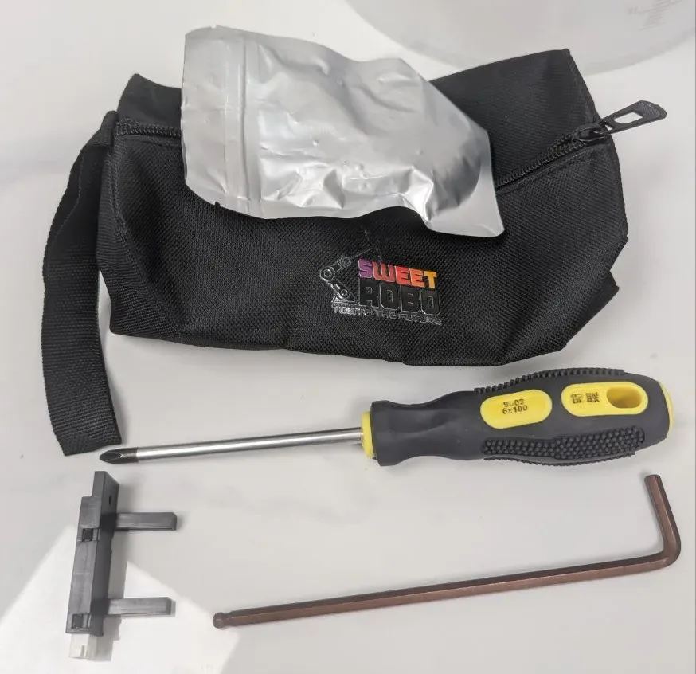
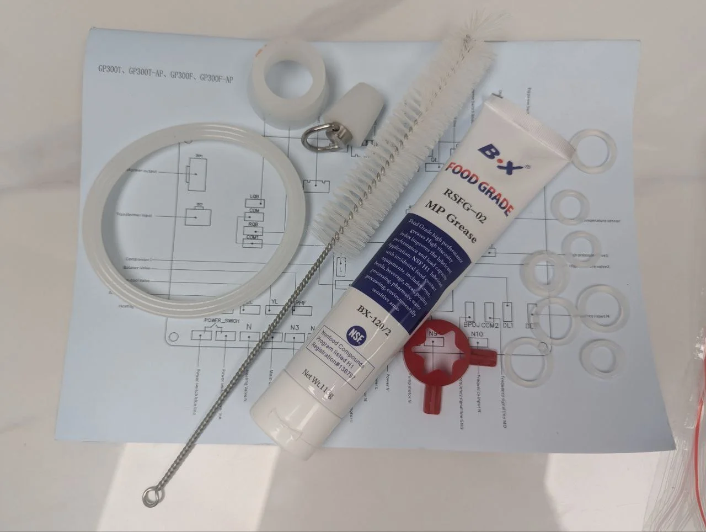
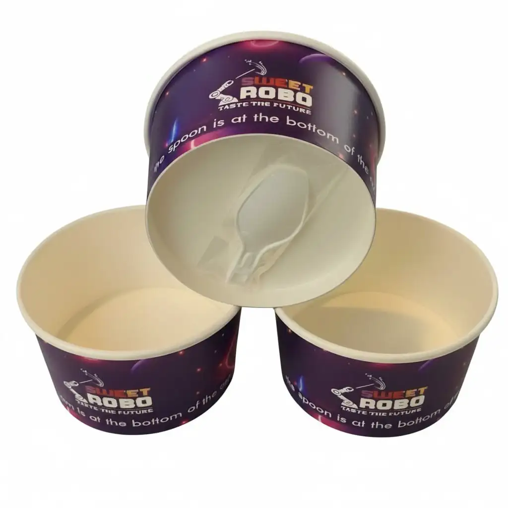
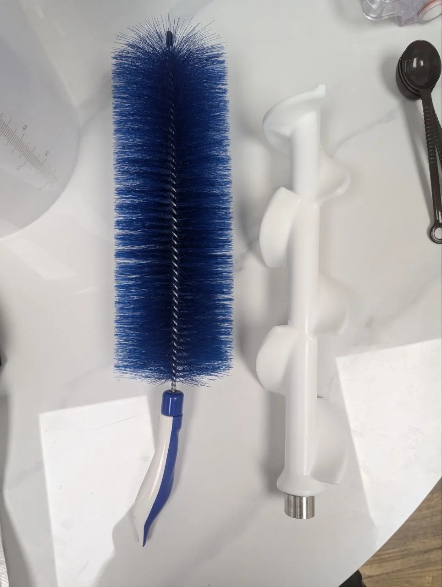
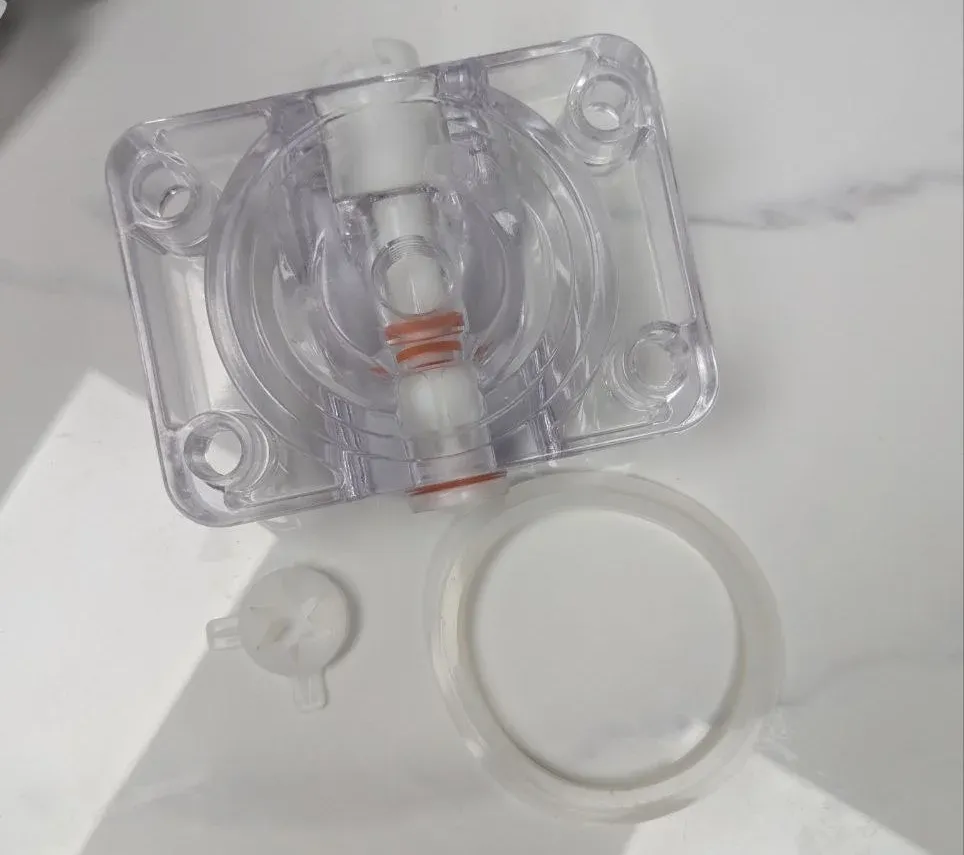
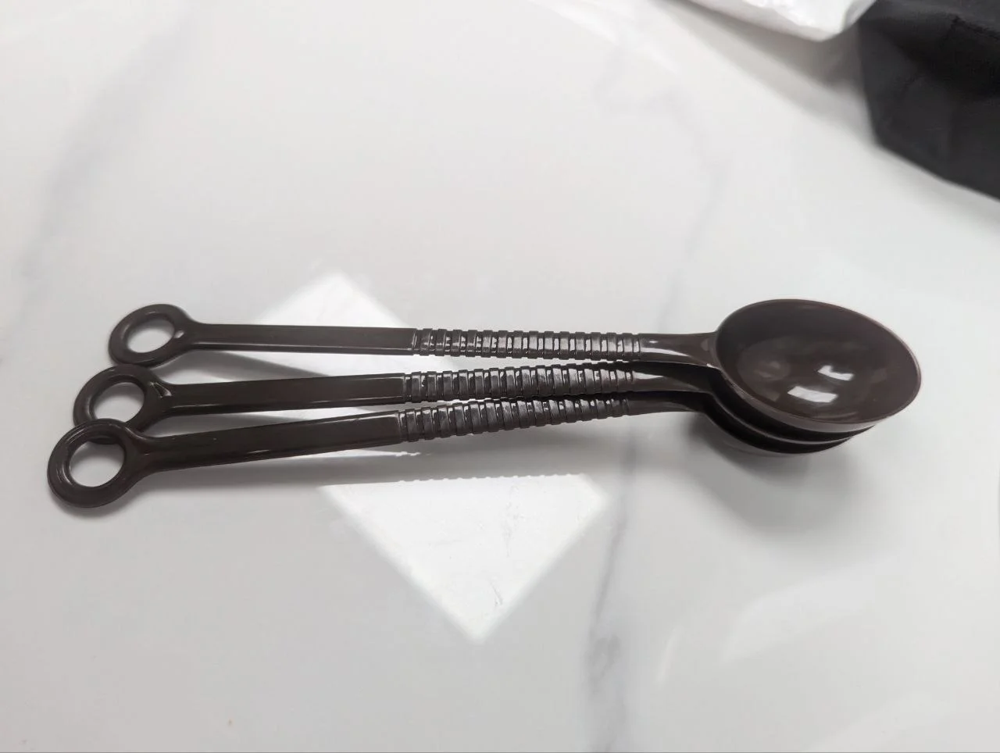
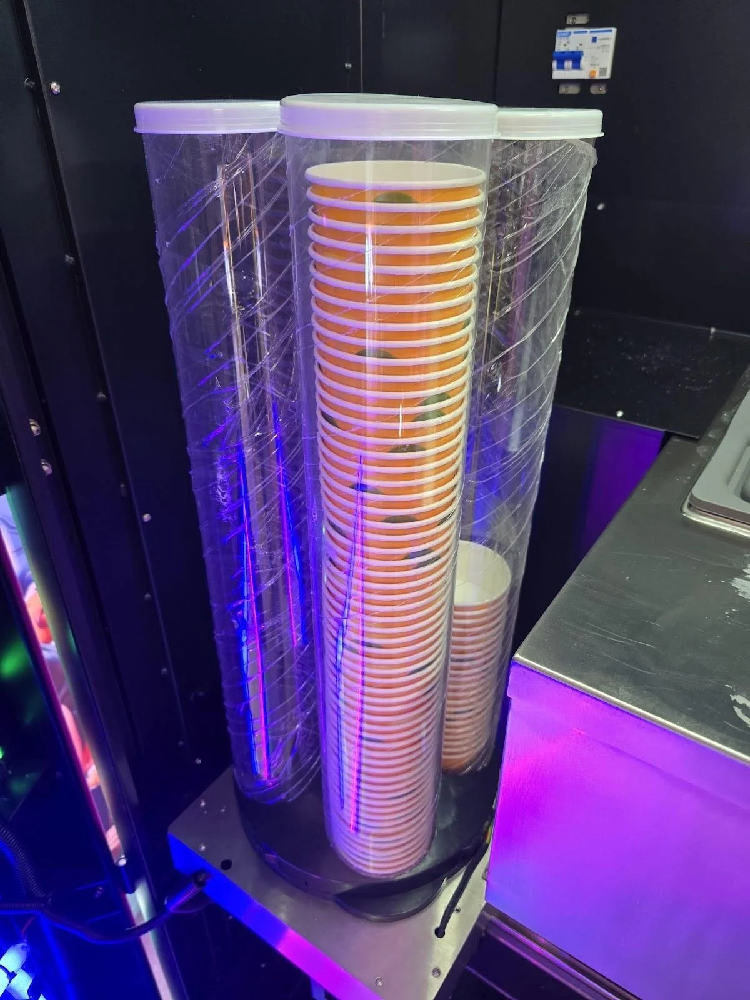
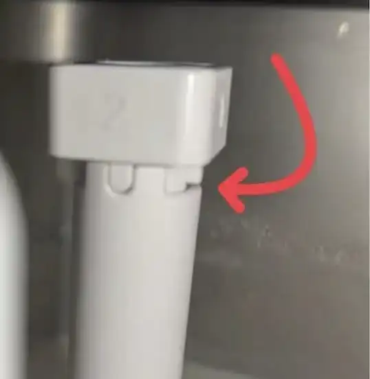
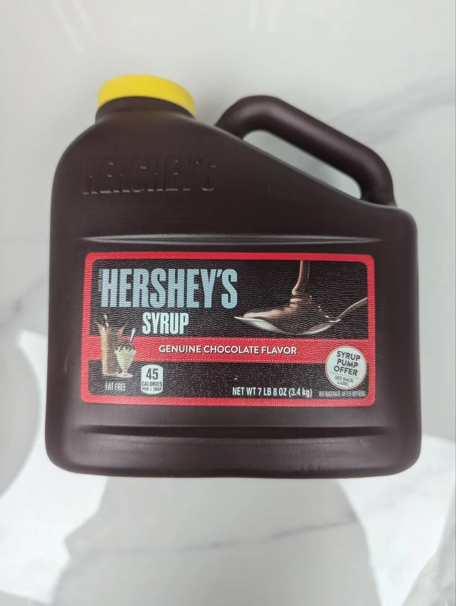
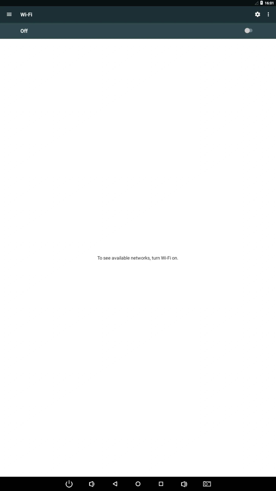

# Setup & Installation

**Machine Model:** Robo Ice Cream F2

For complete technical specifications including dimensions, weight, power requirements, and capacities, see [Technical Specifications](overview.md#technical-specifications) in the Overview section.

## Pre-Installation Requirements

<!-- Print condensed version - would not help reduce the spaceing so not adding it -->

#### Space & Clearances
- **Minimum Space**: 137 × 170 × 265 cm
- **Rear wall**: 50 cm (20 in) minimum
- **Side-to-side**: 20 cm (8 in) minimum
- **Front door**: Must open to 135°+
- **Ventilation**: Keep grilles unobstructed

#### Floor & Environment
- Flat, level, stable hard surface
- Must support machine weight + mix
- No soft mats or carpet
- Indoor installation only
- Avoid direct sunlight/heat/humidity

#### Power & Connectivity
- **⚠️ 220V/20A** dedicated circuit
- **NEMA 6-20R** outlet required
- Licensed electrician installation
- Internet connectivity (WiFi/Ethernet)

**⚠️ CRITICAL:** F2 requires 220V/20A dedicated circuit with NEMA 6-20R outlet

For complete electrical specifications and requirements, see [Electrical & Power Requirements](overview.md#electrical--power-requirements)

**Important:** Ensure proper electrical installation by a licensed electrician before delivery.

## What's Included

Installation tool kit with screwdriver, hex key, and spare sensor

Spare parts kit with NSF-approved grease and technical manual

Sweet Robo branded cups with integrated spoons

Cleaning brush, whisk for mixing, and cleaning cloths

10L graduated mixing bucket for ice cream preparation

Specialized agitator cleaning brush with spiral bristles

Dispenser seal replacement kit with O-rings and gaskets

MT87 digital multimeter for electrical diagnostics

Long-handled slotted spoons for syrup and topping service

Your F2 shipment includes:
- Robo Ice Cream F2 Machine
- Installation tool kit: Phillips screwdriver, hex key/allen wrench, spare sensor, Sweet Robo branded tool bag
- Spare parts kit: Food-grade MP grease (NSF approved), O-rings, gaskets, tubing, cleaning brush, technical diagram
- Cup dispenser tubes: 4 tubes (50 cups each)
- Starter pack: Sweet Robo cups with integrated spoons
- Power cord with NEMA 6-20P plug and keys (attached to power cord)
- Cleaning and mixing supplies: Mixing bucket (10L), whisk, cleaning cloths, agitator brush
- This operator's manual

## Critical Transport and Handling Requirements

**CRITICAL: Refrigerant System Warning**

This machine contains refrigerant in the cooling system. The machine **MUST remain upright at all times** during transport and installation. 

**Never tilt, tip, or lay the machine on its side** as this will:
- Cause serious damage to the refrigeration compressor
- Allow refrigerant oil to flow into cooling lines
- Result in expensive repairs not covered by warranty
- Create potential safety hazards

If the machine was tilted during transport, **wait at least 24 hours** before powering on to allow refrigerant to settle.

## Step 1: Delivery and Inspection

<!-- Print condensed version -->

<strong>Delivery Check:</strong> Confirm with delivery personnel that machine remained upright during entire transport (critical for refrigerant system). Check outer packaging for visible damage and note any issues on delivery receipt before carrier leaves. Verify Model, Serial Number, and Delivery Date match your order documentation. If damage suspected, photograph machine before unboxing for insurance claims. Contact Sweet Robo support immediately if damage or missing parts discovered.

<!-- Full version for screen -->
<!-- 
 -->

<h3>Verify Upright Transport</h3>
Confirm with delivery personnel that machine remained upright during entire transport. 
<!-- TODO: Check tilt indicators if present and if so, show the text: Check tilt indicators if present. -->

<h3>Inspect Packaging</h3>
Check outer packaging for visible damage. Note any damage on delivery receipt before carrier leaves.

<h3>Verify Delivery</h3>
Confirm Model, Serial Number, and Delivery Date match your order.

<h3>Document Damage</h3>
If damage suspected, photograph machine before unboxing for insurance claims.

<h3>Contact Support</h3>
If damage or missing parts discovered, contact Sweet Robo support immediately.

<!-- 
 -->

## Step 2: Positioning the Machine

<!-- Print condensed version -->

<strong>Position Machine:</strong> Two or more people required for moving (use pallet jack for long distances - wheels are for minor adjustments only). Keep machine upright at all times - never tilt or rock due to refrigerant system. Carefully move to final operating location using appropriate equipment. Ensure all four feet are firmly on ground and machine is level. Adjust feet as needed, then lock in place with locking collars. Verify required clearances: rear wall 50cm (20in), side-to-side 20cm (8in), front door opens to 135°+.

<!-- Full version for screen -->

**CAUTION:** Two or more people required for moving. For long distances, use a pallet jack - the wheels are designed for minor position adjustments only, not extended transport.

**Remember:** Keep machine upright at all times. Do not tilt or rock the machine during positioning due to the refrigerant system.

<h3>Move to Location</h3>
Carefully move machine to final operating location using appropriate equipment.

<h3>Level the Machine</h3>
Ensure all four feet are firmly on ground and machine is level.

<h3>Lock Feet</h3>
Adjust feet as needed, then lock in place with locking collars.

<h3>Verify Clearances</h3>
Confirm all required clearances are met (see requirements above).

IMAGE: Proper machine positioning with clearance measurements

## Step 3: Interior Inspection

<!-- Print condensed version -->

<strong>Interior Check:</strong> WARNING: Do NOT power on until inspection complete and ice cream mix loaded. Unlock and open service door using keys attached to power cord. Inspect for loose wires, plugs, pipes, or components shifted during transit. Remove ALL internal packaging materials including foam and zip ties (except those securing permanent wires). Check delivery bot area and all compartments. Locate accessory kit stored inside. Ensure all cables and connectors are properly seated and secure.

<!-- Full version for screen -->

**WARNING:** Do NOT power on until this inspection is complete and ice cream mix is loaded.

<h3>Open Service Door</h3>
Unlock and open the service door using keys attached to power cord.

<h3>Check Components</h3>
Inspect for loose wires, plugs, pipes, or components shifted during transit.

<h3>Remove Packaging</h3>
• Remove ALL internal packaging materials 
• Clear foam, zip ties (unless securing permanent wires) 
• Check delivery bot area and all compartments 
• Locate accessory kit stored inside

<h3>Verify Connections</h3>
Ensure all cables and connectors are properly seated and secure.

IMAGE: Interior inspection points and packaging removal

## Step 4: Hardware Installation

<!-- Print condensed version -->

<strong>LED Panels (Optional):</strong> Choose to install 0-4 LED roof panels for visibility. Use Phillips screwdriver and screws from tool kit to attach panels to top of machine. Connect panel wires to corresponding machine wires. Ensure all connections secure.
  
<strong>Cup Tubes:</strong> Open service door to access dispenser. Install all 4 cup tubes into dispenser assembly. Load 50 approved cups per tube (rim up) for 200 total capacity. Stack neatly to prevent jams from crushing or misalignment. Close tube lids to prevent dust and maintain hygiene. Close service door securely.

<!-- Full version for screen -->

### 4.1 Install LED Roof Panels (Optional)

**Customization Option:** The F2 comes with 4 LED panels that can be installed on top. You can choose to install 1, 2, 3, or all 4 panels based on your preference and visibility needs.

Decide how many LED panels to install (0-4 panels).

Use screws and Phillips screwdriver from tool kit to attach chosen panels to top of machine.

Connect wires from each panel to corresponding wires from machine.

Ensure all connections are secure and properly connected.

### 4.2 Install Cup Tubes

IMAGE: Loading cups into tubes

Open service door to access cup dispenser mechanism.

Install all 4 cup tubes into dispenser assembly.

Load approved cups (rim up) into each tube - 50 cups per tube = 200 total capacity.

Stack neatly to avoid crushing or misalignment that causes jams.

Close tube lids securely and service door (closing lids is recommended to prevent dust accumulation and maintain hygiene standards).

## Step 5: Initial System Preparation

### 5.1 Flush and Sanitize Hoppers

<!-- Print condensed version -->

<strong>Sanitize Hoppers:</strong> F2 has dual hoppers (Left & Right) for two flavors. Pour ~2L warm water into each hopper. Wipe interior with food-grade sanitizing solution. Rinse thoroughly with clean warm water. Access backend system to open chambers and discharge water. Wipe dry with clean, food-safe cloth and leave open to air dry before adding mix.

<!-- Full version for screen -->

**F2 Feature:** The F2 model includes dual hoppers (Left & Right) allowing you to offer two different flavors simultaneously.

Pour approximately 2 liters of warm water into each hopper.

Wipe interior with food-grade sanitizing solution.

Rinse thoroughly with clean warm water.

Access backend system to open chambers and discharge water (see <a href="./operation.html#device-testing---component-control">operation section</a> for more info).

Wipe dry with clean, food-safe cloth and leave open to air dry.

IMAGE: Hopper cleaning process

### 5.2 Prepare Ice Cream Mix

**CRITICAL:** Never power on without mix - this causes "core board error" and potential damage!

**First Fill Requirements:**
- Each batch: 1 bag (1.5kg) + ~3.5L water
- Mix one batch at a time
- Prepare mix for both hoppers before powering on

For detailed mix preparation instructions, see [Ice Cream Mix Preparation](operation.md#ice-cream-mix-preparation---f2-dual-hopper-system) in the Operation Guide.

### 5.3 Load Ice Cream Mix

<!-- Print condensed version -->

<strong>Load Mix:</strong> Open both hopper lids (Left and Right). Pour prepared mix slowly to avoid splashing. Minimum fill: 2 liters per hopper (must fill both hoppers). Maximum capacity: 12 liters per hopper. Keep mix level below the square openings on white plastic tubes - these provide air flow for proper mix circulation to freezing chamber below. Close lids securely after filling.

<!-- Full version for screen -->

Open both hopper lids (Left and Right).

Pour prepared mix slowly to avoid splashing.

Minimum fill: 2 liters per hopper (fill both hoppers).

Maximum capacity: 12 liters per hopper. Keep mix level below the square openings on the white plastic tubes - these provide air flow for proper mix circulation to the freezing chamber below.

Close lid(s) securely.

### 5.4 Adjust Refill Tube

The refill tube (air valve) controls how much mix flows into the freezing chamber after each serving. When a cup of ice cream is served, space is created in the freezing chamber, and this valve determines how quickly new mix enters.

**IMPORTANT:** When adjusting this setting, you must:
1. Physically turn the air valve to the desired notch position (default is 2)
2. Update the "L/R Gear Position" in the backend system to match your physical setting

Both adjustments are required - the physical position controls actual flow, while the software setting ensures accurate temperature control and mix level tracking. See [Parameter Settings](operation.md#parameter-settings---f2-dual-hopper-controls) for backend configuration.

For high-volume service, you can experimentally increase both settings to 3 or 4. Always use the minimum viable setting to avoid overfilling.

| Setting | Opening Size | Use Case |
|---------|-------------|----------|
| 0 | Closed | No flow |
| 1 | Smallest opening | Very small portions / low volume |
| 2 | Medium | Standard servings (default/recommended) |
| 3 | Larger opening | High volume service |
| 4 | Fully open | Maximum throughput (use carefully) |

QR CODE: Refill tube adjustment video

### 5.5 Add Syrups

<!-- Print condensed version -->

<strong>Add Syrups:</strong> Locate the 3 syrup containers in the machine. Open each container lid and pour in liquid syrup (liquid syrups only - no thick or chunky syrups). Close lids securely after filling. Note which syrup is in each position (1, 2, 3) for backend configuration later. See Critical Requirements for approved syrup types.

<!-- Full version for screen -->

Locate the 3 syrup containers in the machine.

Open each container lid and pour in liquid syrup.

Close lids securely after filling.

Note which syrup is in each position (1, 2, 3) - you'll need to configure this in the backend system later.

**Requirements:** Liquid syrups only (see [Critical Requirements](overview.md#critical-operating-requirements))

### 5.6 Add Toppings

<!-- Print condensed version -->

<strong>Add Toppings:</strong> Open the 3 topping container lids. Pour dry toppings into containers (max 270g each). Ensure toppings flow freely with no clumping (dry toppings only - no wet, sticky, or fresh items). Close lids securely. See Critical Requirements for approved topping types.

<!-- Full version for screen -->

Open the 3 topping container lids.

Pour dry toppings into containers (max 270g each).

Ensure toppings flow freely - no clumping.

Close lids securely.

**Requirements:** Dry toppings only (see [Critical Requirements](overview.md#critical-operating-requirements))

## Step 6: Power Connection and Startup

### 6.1 Connect Power

<!-- Print condensed version -->

<strong>Connect Power:</strong> ELECTRICAL SAFETY: Ensure hands are dry and not standing in water. Verify Main Breaker is OFF (located behind cups area). Connect the 6-20P power cord to your 6-20R outlet (220V with 20A breaker). Verify outlet is properly grounded and on a dedicated 20A+ breaker. Machine must be OFF before connecting power.

<!-- Full version for screen -->

**ELECTRICAL SAFETY:** Ensure hands are dry and you're not standing in water. Verify machine is OFF before connecting.

Verify Main Breaker is OFF (located behind cups area).

Connect the 6-20P power cord to your 6-20R outlet (220V with 20A breaker).

Verify the outlet is properly grounded and on a dedicated 20A+ breaker.

### 6.2 Power On Sequence

<!-- Print condensed version -->

<strong>Power On:</strong> (1) Turn ON Main Breaker - located behind cups area, right side access door. (2) Turn ON Main I/O Switch - controls refrigeration and dispensing systems. (3) System Initialization - touchscreen illuminates, startup sequence begins, listen for normal operation sounds (no grinding). (4) Temperature Optimization - machine requires 2-8 minutes to reach optimal freezing temperature. If "Core Board Error" appears with grinding noise, immediately turn OFF and verify hoppers have mix. If error continues, shut off power and contact support.

<!-- Full version for screen -->

<h3>Turn ON Main Breaker</h3>
Located behind cups area, right side access door.

IMAGE: Main breaker location and position

<h3>Turn ON Main I/O Switch</h3>
Controls refrigeration and dispensing systems.

IMAGE: Main I/O switch location and position

<h3>System Initialization</h3>
• Touchscreen illuminates 
• Startup sequence begins 
• Listen for normal operation sounds 
• No grinding noises should occur

<h3>Temperature Optimization</h3>
Machine requires 2-8 minutes to reach optimal freezing temperature.

**Note:** If "Core Board Error" appears with grinding noise, immediately turn OFF and verify hoppers have mix. If error continues after verification, shut off power and contact support.

#### Startup Screens

During the boot process, you'll see the following screens in sequence:

Left: Android OS boot screen | Right: Machine initialization "loading..." screen

Creamy Core Module installation screen showing progress indicator

## Step 7: Network Setup (WiFi/Ethernet)

**Network connectivity enables:**
- Remote support and diagnostics
- Software updates
- Sales data reporting
- Remote configuration changes

### 7.1 WiFi Setup

<!-- Print condensed version -->

<strong>WiFi Setup:</strong> From backend menu, navigate to System Settings. Select "Exit App" to access Android system. Navigate to Android WiFi settings, select your network, enter password, verify connection. Return to home screen, relaunch Robo Ice Cream application. Verify network status shows connected in backend. Network enables remote support, software updates, sales reporting, and remote configuration.

<!-- Full version for screen -->

<h3>Access System Settings</h3>
From the backend menu, navigate to `System Settings`

<h3>Exit to Android Settings</h3>
Select `Exit App` to access the underlying Android system

<h3>Connect to WiFi</h3>
• Navigate to Android WiFi settings 
• Select your network from available networks 
• Enter WiFi password 
• Verify connection established

<h3>Return to Application</h3>
• Navigate back to the home screen 
• Relaunch the Robo Ice Cream application 
• Verify network status shows connected in backend

Android WiFi settings screen - turn WiFi on to see available networks

### 7.2 Ethernet Setup

<!-- Print condensed version -->

<strong>Ethernet Setup:</strong> If using wired connection: Connect Ethernet cable to machine's network port. Connection should establish automatically. Verify in System Settings that LAN status shows connected. Once connected to internet, machine can be accessed remotely by Sweet Robo support. Machine ID will be visible in System Settings - provide this ID to support for remote assistance. Support can remotely adjust settings, view diagnostics, and update software.

<!-- Full version for screen -->

If using wired connection:
1. Connect Ethernet cable to machine's network port
2. Connection should establish automatically
3. Verify in `System Settings` that LAN status shows connected

**Remote Support Access**

Once connected to the internet, your machine can be accessed remotely by Sweet Robo support:
- Machine ID will be visible in System Settings
- Provide this ID to support for remote assistance
- Support can remotely adjust settings, view diagnostics, and update software

## Step 8: Backend Configuration

### 8.1 Access Backend

<!-- Print condensed version -->

<strong>Access Backend:</strong> Tap and hold top-right corner for 3-5 seconds, enter default password (123456). For complete backend navigation, settings descriptions, and management interface overview, see Operator Interface and Backend Management in the Operation Guide.

<!-- Full version for screen -->

**Quick Access:** Tap and hold top-right corner for 3-5 seconds, enter default password

For complete backend navigation, settings descriptions, and management interface overview, see [Operator Interface and Backend Management](operation.md#operator-interface-and-backend-management) in the Operation Guide.

### 8.2 Test Functions

<!-- Print condensed version -->

<strong>Test Functions:</strong> Navigate to Device Testing to verify: Cup drop test (clear one tube to verify it auto turns to use the next tube), Syrup flow test (prime all 3 lines), Topping dispense test (all 3 containers), Door open/close operation.

<!-- Full version for screen -->

Device testing screen showing available test tasks

Navigate to `Device Testing` to verify:
- Cup drop test (clear one tube to verify it auto turns to use the next tube)
- Syrup flow test (prime all 3 lines)
- Topping dispense test (all 3 containers)
- Door open/close operation

### 8.3 Configure Payment Settings

<!-- Print condensed version -->

<strong>Configure Payment Settings:</strong> In Shopping Settings, configure payment methods: Enable/disable bill acceptor, Enable/disable coin acceptor, Enable/disable VPOS (credit card reader), Set change dispenser options, Configure timeout settings. Other settings like product prices, portion sizes, syrup/topping names, and operating hours can be configured later. See Operation Guide for detailed configuration instructions.

<!-- Full version for screen -->

IMAGE: Shopping Settings screen showing payment configuration options

In `Shopping Settings`, configure payment methods:
- Enable/disable bill acceptor
- Enable/disable coin acceptor
- Enable/disable VPOS (credit card reader)
- Set change dispenser options
- Configure timeout settings

**Note:** Other settings like product prices, portion sizes, syrup/topping names, and operating hours can be configured later through their respective menu sections. See the <a href="./operation.html#operator-interface-and-backend-management">Operation Guide</a> for detailed configuration instructions.

## Setup Complete Checklist

### Pre-Power Checklist
- [ ] Machine positioned with proper clearances
- [ ] Level surface, all feet locked
- [ ] Interior packaging removed
- [ ] All connections verified
- [ ] Hoppers cleaned and sanitized
- [ ] Mix prepared and loaded (minimum 2L per hopper)
- [ ] Cups loaded (200 capacity)
- [ ] Syrups installed (liquid only)
- [ ] Toppings loaded (dry only)
- [ ] Power requirements verified

### Post-Power Checklist
- [ ] No core board error
- [ ] Normal operation sounds
- [ ] Touchscreen functional
- [ ] Backend access successful
- [ ] All tests passed
- [ ] Temperature reached (2-8 minutes)
- [ ] Settings configured
- [ ] Test ice cream made successfully

## Important Reminders

**Daily Operations:**
See [Critical Operating Requirements](overview.md#critical-operating-requirements) for essential guidelines including:
- Minimum mix levels, expiration timing
- Syrup and topping restrictions
- Cleaning schedule requirements

## Support Information

For installation assistance or questions:

<h4>Sweet Robo Support</h4>

**Email:** support@sweetrobo.com  
**Phone:** +1-844-SWEETRB (844-793-3872)

For complete contact information and business hours, see [Company Information](../shared/company-info.md)

## Next Steps

1. Review the [Operation Guide](operation.md) for daily use
2. Set up your [Maintenance Schedule](maintenance.md)
3. Train all staff on proper procedures
4. Keep this manual accessible

Your Robo Ice Cream machine is now ready for operation!