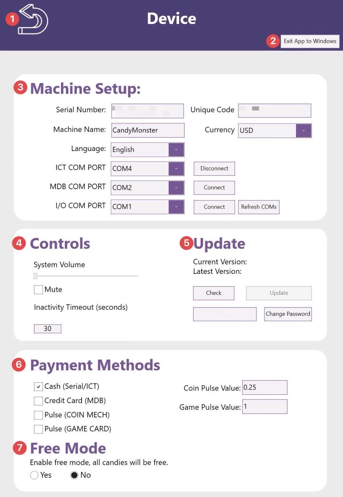
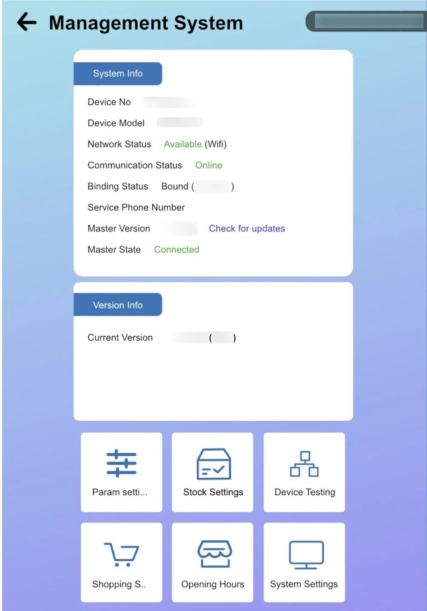

# Sweet Robo Styling Components Demo

This page demonstrates all the official styling components extracted from the Sweet Robo PDF manual design.

---

## Title Page Layout

Sweet Robo - User Manual - Robo Ice Cream

<h1>Robo Ice Cream</h1>
<h2>User Manual</h2>

Revision & Date:

Rev 1. 05.2025

---

## Callout Boxes

### Warning Box (Pink Background)

**WARNING: Electrical Shock Hazard.** Ensure your hands are dry and you are not standing in water when connecting the power cord. Can cause serious injury or death.

### Caution Box (Yellow Background)

**CAUTION:** Two or more people may be required for safely moving and positioning the machine. Use appropriate lifting equipment if necessary.

### Info Box (Purple Background)

**Machine Capabilities**

The machine supports remote management requiring an internet connection. Ensure a stable Wi-Fi signal or an accessible Ethernet port is available near the machine.

### Important Box (Light Blue Background)

**IMPORTANT**

Some accessories or consumables may be packaged and stored inside the machine body for secure transit. Before powering on the machine, carefully open all access doors and inspect the interior.

---

## Numbered Steps with Blue Circles

### Basic Numbered Steps

Power on the machine using the main breaker switch located on the side panel.

Wait 5-10 minutes for the system to boot and reach operating temperature.

Check the display shows "L: 100%" and "R: 100%" indicating both hoppers are ready.

Access the backend interface by tapping and holding the top-right corner for 3-5 seconds.

Enter the default password 123456 to access operator settings.

### Steps with Headers

<h3>Prepare the Machine</h3>
• Turn on the main power breaker 
• Verify all doors are closed 
• Check that hoppers contain at least 2L of mix

<h3>Initial System Check</h3>
• Monitor temperature displays 
• Listen for unusual noises 
• Verify UV sanitizer activates

<h3>Ready for Operation</h3>
• Confirm both hoppers show 100% 
• Test dispense functions 
• Enable customer interface

---

## Sidebar Highlights

<h4>Proper Usage</h4>

Manuals provide detailed instructions and information on setup, operation, and maintenance. Following these instructions ensures that the equipment works efficiently.

<h4>Optimal Performance</h4>

The manual often includes insights into how to get the best understanding how to use the equipment for optimal results, whether that's producing high-quality ice cream or maintaining efficiency.

<h4>Safety First</h4>

Always follow safety guidelines outlined in the manual. These guidelines are designed to protect operators from injury and prevent damage to the equipment. Never bypass safety features or ignore warning labels.

<h4>Regular Maintenance</h4>

Consistent maintenance according to the manual's schedule helps extend equipment life, prevent breakdowns, and ensure food safety compliance. Document all maintenance activities for regulatory purposes.

---

## Feature Grids

### Default Auto-Fit Grid (Responsive Columns)

By default, feature grids automatically adjust columns based on content width (minmax 200px):

#### Quick Setup
Fast installation process

#### Easy Clean
Simple maintenance routine

#### Safe Operation
Built-in safety features

#### 24/7 Support
Round-the-clock assistance

#### Remote Access
Cloud-based monitoring

#### Energy Efficient
Low power consumption

### Two-Column Layout (grid-2)

Use `grid-2` class when you need exactly 2 columns for longer content or visual balance:

#### User-Friendly Interface
An intuitive touchscreen interface allows operators to easily manage machine settings and monitor performance in real-time. The system provides clear visual feedback and step-by-step guidance.

#### Dual-Flavor System
Advanced dispensing system supports two different ice cream flavors with precise portion control and swirl capabilities. Each hopper operates independently with its own temperature control.

#### Easy Maintenance
Designed for straightforward access to hoppers, dispensers, and cleaning components with color-coded service points. All critical parts are easily accessible without special tools.

#### Robust Construction
Built for durability and reliable operation in various commercial environments with stainless steel components. Engineered to withstand heavy daily use while maintaining consistent performance.

### Three-Column Layout (grid-3)

Use `grid-3` for content that works well in three columns:

#### Chocolate
Classic favorite syrup for enhanced flavor

#### Toppings
Premium dry toppings and dispensing tools

#### Tools Kit
Complete installation and maintenance toolkit

### Four-Column Layout (grid-4)

Use `grid-4` for brief items that fit in four columns:

#### E01
Temperature

#### E02
Door Sensor

#### E03
Cup Jam

#### E04
Empty Hopper

### Centered Text Variant

Add `text-center` class to center all text within feature grid items:

#### Step 1
Position Machine

#### Step 2
Install Signage

#### Step 3
Check Systems

---

## Tables

### Standard Table in Info Box

**Machine Specifications**

| Parameter | Value | Notes |
|:-----:|:-----:|:-----:|
| Dimensions | 120 × 86.5 × 245 cm | Width × Depth × Height |
| Weight | 380 kg | Approximately 838 lbs |
| Power | 220V, 15A | Dedicated circuit required |
| Capacity | 200 cups | 4 tubes × 50 cups each |

### Specifications Table (Key-Value Pairs)

Machine Name

Robo Ice Cream F2

Model Number

F2-2025-DUAL

Manufacturing Year

2025

Warranty Period

1 Year Parts & Labor

---

## Image Layouts

### Single Image

Overview of Sweet Robo machines including the F2 model

### Side-by-Side Images

Left: Hopper setup process | Right: Cup dispenser installation

### Three-Column Images

Essential tools and resources for machine maintenance

### Image Placeholder

IMAGE EXAMPLE UNLOCKED

---

## Combined Examples

### Warning with Numbered Steps

**Core Board Error Prevention**

To avoid the dreaded core board error, always follow these steps:

Fill both hoppers with at least 2L of prepared ice cream mix

Turn on the hopper switches located at the bottom of each hopper

Only then power on the main machine using the breaker

### Feature Grid with Different Content Types

#### Daily Tasks
• Clean touchscreen 
• Check mix levels 
• Verify cup inventory 
• Empty drip tray

#### Weekly Tasks
• Deep clean hoppers 
• Test all dispensers 
• Check UV lamp 
• Update cleaning log

#### Error Codes
• E01: Temperature fault 
• E02: Door sensor error 
• E03: Cup jam detected 
• E04: Hopper empty

#### Support Contacts
• Phone: +1-844-793-3872 
• Email: support@sweetrobo.com 
• Hours: 24/7 Available 
• Response: Within 24 hours

### Multi-Level Information

**System Requirements**

The F2 machine requires the following for optimal operation:

#### Environmental
• Temperature: 15-30°C 
• Humidity: < 85% 
• Ventilation: 40cm rear clearance 
• Level surface: Max 2° inclination

#### Electrical
• Voltage: 220-240V AC 
• Current: 15A dedicated circuit 
• Grounding: < 4Ω resistance 
• Protection: GFCI required

Never operate the machine in environments exceeding these specifications as it may cause equipment failure or safety hazards.

---

## Section Divider

## Typography Examples

### Headers with Blue Accent

All headers automatically use the primary blue color (#2c5282) from the official Sweet Robo brand.

### Lists with Blue Arrows

Standard unordered lists automatically get blue arrow bullets:

- This is a standard list item with automatic blue arrow
- Another item showing the consistent styling
- Lists are great for organizing information
  - Nested items also get the blue arrow
  - Consistent throughout the document

### Inline Styling

You can use **bold text** for emphasis and *italic text* for notes. The `inline code` appears with a light background.

---

## Chapter Headers

<h1>Chapter 1: Getting Started</h1>

This is how chapter headers appear with the official blue background and white text.

---

## Image-Text Layouts

### Two-Column Layout with Image and Text

### Key Features
The Robo Ice Cream F2 represents the pinnacle of automated ice cream vending technology. With dual hoppers and advanced temperature control, it delivers consistent quality every time.

Features include:
- Dual flavor dispensing
- 200 cup capacity
- UV sanitization
- Touch-free operation

### Text Block with Side Line (Blue)

### Important Note
This styling is perfect for highlighting important information or creating sidebars. The blue line on the left draws attention while maintaining a clean, professional appearance.

You can include multiple paragraphs, lists, or any other content within these blocks.

### Highlight Block with Purple Header

### Pro Tip
This purple highlight block is perfect for tips, best practices, or special notes. The purple header and matching left border create a distinctive visual element.

Key benefits:
- Draws attention to important information
- Visually distinct from other content
- Perfect for tips and recommendations

---

## Responsive Design

All components automatically adapt to different screen sizes:

- **Desktop**: Full layouts with side-by-side elements
- **Tablet**: Adjusted grids and image sizes
- **Mobile**: Single column layout for easy reading
- **Print/PDF**: Optimized formatting with proper page breaks

---

## Color Palette

The official Sweet Robo colors used throughout:

Primary Blue

#2c5282

Warning Pink

#fed7d7

Caution Orange

#fed7aa

Info Purple

#e9d8fd

Important Blue

#e6f3ff

---

## Customer Operation Flow with Images

### F2 Dual-Flavor Experience

The F2 provides customers with exciting flavor options through its dual-hopper system:

<h3>Primary Selection Screen</h3>
Customer approaches the intuitive touchscreen interface. Machine displays available flavor combinations: 
 
• <strong>Left Flavor Only</strong>: Single flavor from left hopper 
• <strong>Right Flavor Only</strong>: Single flavor from right hopper 
• <strong>Swirl Combination</strong>: Both flavors blended together

<h3>Enhanced Customization</h3>
• Customer selects preferred size 
• Choose from multiple syrup options (1-3 available) 
• Add dry toppings for additional texture (1-3 available) 
• Preview final product combination

<h3>Payment and Dispensing</h3>
Customer completes payment via cash, coin, or card. F2 automatically executes the dual-flavor process: 
 
• Drops cup into position 
• Dispenses ice cream from selected hopper(s) 
• <strong>Swirl Mode</strong>: Alternates between left and right hoppers 
• Adds selected syrups in sequence 
• Applies chosen toppings 
• Opens collection door for pickup

---

This styling system provides a professional, consistent appearance that matches the official Sweet Robo brand guidelines while ensuring excellent readability across all devices and formats.