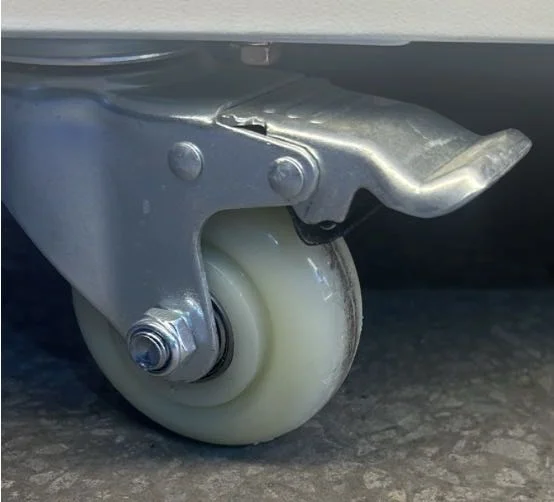

# Sweet Robo Manual Styling Guide

This page demonstrates how to use all official styling components for creating Sweet Robo machine manuals. Each section shows the HTML/Markdown structure needed to achieve the desired styling, along with explanations of when and how to use each component.

---

## Title Page Layout

**Usage:** Create a professional cover page for your manual. The title page includes a header with logo, main content area with machine name and image, and a footer with revision information.

**HTML Structure:**
```html
<div class="title-page">
  <div class="title-page-header">
    <div class="title">Manual Title Here</div>
    
  </div>
  <div class="title-page-main">
    <h1>Machine Name</h1>
    <h2>Document Type</h2>
    
  </div>
  <div class="title-page-footer">
    <p>Revision & Date:</p>
    <p>Rev X. MM.YYYY</p>
  </div>
</div>
```

**Live Example:**

<div class="title-page">

<div class="title-page-header">
<div class="title">Sweet Robo - User Manual - Robo Ice Cream</div>

</div>

<div class="title-page-main">
<h1>Robo Ice Cream</h1>
<h2>User Manual</h2>

</div>

<div class="title-page-footer">
<p>Revision & Date:</p>
<p>Rev 1. 05.2025</p>
</div>

</div>

---

## Callout Boxes

**Usage:** Callout boxes highlight critical information with color-coded backgrounds. Use them to draw attention to warnings, cautions, important notes, and general information.

### Warning Box (Pink Background)

**When to Use:** For serious safety hazards that could result in injury or death. Always start with **WARNING:** in bold.

**HTML Structure:**
```html
<div class="warning-box">

**WARNING: Hazard Type.** Detailed warning message here.

</div>
```

**Live Example:**

<div class="warning-box">

**WARNING: Electrical Shock Hazard.** This warning box uses a pink background (#fed7d7) to indicate serious safety hazards. The bold "WARNING:" prefix immediately identifies the severity. Use this style for electrical, mechanical, or other dangers that could cause injury.

</div>

### Caution Box (Yellow Background)

**When to Use:** For situations that could damage equipment or cause minor injury. Start with **CAUTION:** in bold.

**HTML Structure:**
```html
<div class="caution-box">

**CAUTION:** Caution message here.

</div>
```

**Live Example:**

<div class="caution-box">

**CAUTION:** This caution box uses a yellow/orange background (#fed7aa) to indicate potential equipment damage or minor injury risks. Use for heavy lifting requirements, temperature warnings, or procedural cautions that don't pose immediate danger but require careful attention.

</div>

### Info Box (Purple Background)

**When to Use:** For general information, tips, or feature highlights that enhance understanding.

**HTML Structure:**
```html
<div class="info-box">

**Optional Title**

Information content here.

</div>
```

**Live Example:**

<div class="info-box">

**How Info Boxes Work**

This info box uses a light purple background (#e9d8fd) to present helpful information without urgency. Perfect for explaining features, providing context, or sharing tips. You can include an optional bold title at the top. Tables, lists, and other markdown elements work inside these boxes.

</div>

### Important Box (Light Blue Background)

**When to Use:** For critical operational information that users must not miss.

**HTML Structure:**
```html
<div class="important-box">

**IMPORTANT**

Important message here.

</div>
```

**Live Example:**

<div class="important-box">

**IMPORTANT**

This important box uses a light blue background (#e6f3ff) to highlight essential information that isn't a safety warning but is crucial for proper operation. Use this for pre-operation checks, critical setup steps, or key operational requirements that users must understand.

</div>

---

## Numbered Steps with Blue Circles

**Usage:** Creates automatically numbered steps with blue circle indicators. Each step gets a sequential number (1, 2, 3...) in a blue circle.

### Basic Numbered Steps

**When to Use:** For sequential instructions where order matters.

**HTML Structure:**
```html
<div class="numbered-steps">
  <div>
    <div>Step 1 content here</div>
  </div>
  <div>
    <div>Step 2 content here</div>
  </div>
  <div>
    <div>Step 3 content here</div>
  </div>
</div>
```

**Live Example (showing 5 steps):**

<div class="numbered-steps">

<div>
<div>
This is the first step. Notice the blue circle with "1" appears automatically. You don't need to manually number anything - the CSS handles it.
</div>
</div>

<div>
<div>
This is the second step. The numbering continues automatically. Each step maintains consistent spacing and alignment.
</div>
</div>

<div>
<div>
Third step here. You can include any content within steps including **bold text**, *italics*, or even `inline code`.
</div>
</div>

<div>
<div>
Fourth step. The blue circles (#2c5282 background) with white numbers provide clear visual progression through procedures.
</div>
</div>

<div>
<div>
Fifth and final step in this example. The system supports unlimited steps and maintains consistent styling throughout.
</div>
</div>

</div>

### Steps with Headers

**When to Use:** For grouped instructions where each step contains multiple sub-tasks.

**HTML Structure:**
```html
<div class="numbered-steps">
  <div>
    <div>
      <h3>Step Header</h3>
      • Sub-task one<br>
      • Sub-task two<br>
      • Sub-task three
    </div>
  </div>
</div>
```

**Live Example:**

<div class="numbered-steps">

<div>
<div>
<h3>Understanding Step Headers</h3>
When you add an <code>&lt;h3&gt;</code> tag inside a numbered step, the CSS automatically adjusts the layout. The blue number circle aligns with the header, and content below maintains proper indentation. This is perfect for complex procedures with multiple actions per step.
</div>
</div>

<div>
<div>
<h3>Using Bullet Points</h3>
• Use <code>&lt;br&gt;</code> tags between bullet points for proper spacing<br>
• Start each line with a bullet character (•)<br>
• Maintain consistent formatting throughout<br>
• The bullets align nicely under the header
</div>
</div>

<div>
<div>
<h3>Combining Content Types</h3>
You can mix different content types within a single step:
<br><br>
• Bullet points for lists<br>
• Regular paragraphs for descriptions<br>
• **Bold** and *italic* text for emphasis<br>
• Even small tables or other HTML elements
</div>
</div>

</div>

---

## Sidebar Highlights

**Usage:** Creates emphasized content blocks with a blue vertical line and styled header. Perfect for tips, best practices, or supplementary information.

**HTML Structure:**
```html
<div class="sidebar-highlight">

<h4>Header Text</h4>

Content paragraph here.

</div>
```

**Live Examples (showing different use cases):**

<div class="sidebar-highlight">

<h4>How Sidebar Highlights Work</h4>

The sidebar highlight component features a 4px blue vertical line on the left (#2c5282) with light gray background (#f8f9fa). The `<h4>` header appears in blue and bold. Use these for information that supplements the main content but deserves special attention.

</div>

<div class="sidebar-highlight">

<h4>Best Practices</h4>

Keep sidebar highlights concise and focused. They work best for tips, reminders, or additional context that enhances understanding without interrupting the main flow. You can include multiple paragraphs, lists, or other markdown elements within these blocks.

</div>

<div class="sidebar-highlight">

<h4>Visual Hierarchy</h4>

Sidebar highlights create visual breaks in long content sections. The blue accent color ties them to the Sweet Robo brand while the gray background ensures they don't compete with primary content. Use sparingly for maximum impact.

</div>

<div class="sidebar-highlight">

<h4>Responsive Design</h4>

These components adapt to all screen sizes. On mobile devices, they maintain readability with appropriate padding and font sizes. In print/PDF output, they appear with clear borders and proper spacing.

</div>

---

## Feature Grids

**Usage:** Feature grids organize related content in responsive columns. Each item gets a card-style appearance with consistent spacing.

### Default Auto-Fit Grid (Responsive Columns)

**When to Use:** For 3-6 items that should flow naturally. Columns auto-adjust based on available space (200px minimum width per column).

**HTML Structure:**
```html
<div class="feature-grid">
  <div class="feature-item">
    <h4>Title</h4>
    Description text
  </div>
  <!-- More items... -->
</div>
```

**Live Example (6 items auto-flowing):**

<div class="feature-grid">

<div class="feature-item">

#### Auto-Responsive
This grid automatically adjusts columns based on screen width. No need to specify column count.

</div>

<div class="feature-item">

#### Minimum Width
Each column maintains a 200px minimum width, preventing content from becoming too narrow.

</div>

<div class="feature-item">

#### Card Styling
Each item appears in a subtle card with padding and border for visual separation.

</div>

<div class="feature-item">

#### Flexible Content
Supports headings, paragraphs, lists, images, and any other HTML/Markdown content.

</div>

<div class="feature-item">

#### Consistent Spacing
10px gaps between items maintain visual rhythm without feeling cramped.

</div>

<div class="feature-item">

#### Mobile Friendly
Automatically stacks to single column on small screens for optimal readability.

</div>

</div>

### Two-Column Layout (grid-2)

**When to Use:** Force exactly 2 columns when you have 4 items (2x2 layout) or need wider columns for longer content.

**HTML Structure:**
```html
<div class="feature-grid grid-2">
  <div class="feature-item">Content 1</div>
  <div class="feature-item">Content 2</div>
  <div class="feature-item">Content 3</div>
  <div class="feature-item">Content 4</div>
</div>
```

**Live Example with Images:**

<div class="feature-grid grid-2">

<div class="feature-item">


#### Including Images
Feature items can include images. The image will scale to fit the column width while maintaining aspect ratio. This two-column layout ensures images don't get too large.

</div>

<div class="feature-item">


#### Longer Descriptions
The grid-2 class forces exactly two columns, giving more horizontal space for detailed descriptions. This is ideal when your content needs room to breathe.

</div>

<div class="feature-item">


#### Consistent Layout
With grid-2, you get a predictable 2x2 layout for 4 items, or 2x3 for 6 items. The layout remains two columns until the mobile breakpoint.

</div>

<div class="feature-item">


#### Visual Balance
Two-column layouts create strong visual balance, especially when items have similar content lengths. Perfect for before/after comparisons or paired information.

</div>

</div>

### Three-Column Layout (grid-3)

**When to Use:** Perfect for triplets of information, product features, or step sequences.

**HTML Structure:**
```html
<div class="feature-grid grid-3">
  <div class="feature-item">Item 1</div>
  <div class="feature-item">Item 2</div>
  <div class="feature-item">Item 3</div>
</div>
```

**Live Example:**

<div class="feature-grid grid-3">

<div class="feature-item">


#### First Column
The grid-3 class creates exactly three columns. This layout is ideal for showcasing related items or comparing three options.

</div>

<div class="feature-item">


#### Second Column
Three columns provide a nice balance between content density and readability. Common uses include product features or service tiers.

</div>

<div class="feature-item">


#### Third Column
On tablets and smaller screens, this automatically adjusts to 2 columns, then 1 column on mobile for optimal viewing.

</div>

</div>

### Four-Column Layout (grid-4)

**When to Use:** Best for brief items like error codes, status indicators, or quick reference lists.

**HTML Structure:**
```html
<div class="feature-grid grid-4">
  <div class="feature-item">Brief item</div>
  <!-- 3 more items... -->
</div>
```

**Live Example (Error Codes):**

<div class="feature-grid grid-4">

<div class="feature-item">

#### Grid-4 Usage
Four narrow columns for brief content

</div>

<div class="feature-item">

#### Compact Display
Maximizes horizontal space usage

</div>

<div class="feature-item">

#### Quick Reference
Perfect for lookup tables or codes

</div>

<div class="feature-item">

#### Responsive
Adjusts to fewer columns on smaller screens

</div>

</div>

### Centered Text Variant

**When to Use:** Add `text-center` class along with any grid class to center all text within items. Perfect for image-focused layouts or step sequences.

**HTML Structure:**
```html
<div class="feature-grid grid-3 text-center">
  <div class="feature-item">
    
    <h4>Centered Title</h4>
    Centered description
  </div>
</div>
```

**Live Example:**

<div class="feature-grid grid-3 text-center">

<div class="feature-item">



#### Centered Headers
All text within text-center grids aligns to center

</div>

<div class="feature-item">


#### Visual Focus
Centering works well with images above text

</div>

<div class="feature-item">


#### Clean Appearance
Creates a polished, professional look

</div>

</div>

---

## Tables

**Usage:** Tables display structured data in rows and columns. They can be standalone or placed within callout boxes.

### Standard Markdown Table

**Markdown Structure:**
```markdown
| Column 1 | Column 2 | Column 3 |
|:---------|:--------:|----------:|
| Left align | Center | Right align |
| Data | Data | Data |
```

**Live Example in Info Box:**

<div class="info-box">

**How Tables Work in Callout Boxes**

Tables inherit styling from their container. In info boxes, they get the purple background. Use alignment markers (`:`) in the separator row to control text alignment.

| Alignment | Markdown | Result |
|:----------|:--------:|-------:|
| Left | `:---` | Text aligns left |
| Center | `:---:` | Text centers |
| Right | `---:` | Text aligns right |
| Default | `---` | Left aligned |

</div>

### Specifications Table (Key-Value Pairs)

**When to Use:** For displaying specifications, settings, or any key-value data with consistent formatting.

**HTML Structure:**
```html
<div class="specs-table">
  <div class="spec-row">
    <div class="spec-label">Label</div>
    <div class="spec-value">Value</div>
  </div>
  <!-- More rows... -->
</div>
```

**Live Example:**

<div class="specs-table">

<div class="spec-row">
<div class="spec-label">Component Type</div>
<div class="spec-value">Specifications Table</div>
</div>

<div class="spec-row">
<div class="spec-label">Label Width</div>
<div class="spec-value">40% of container</div>
</div>

<div class="spec-row">
<div class="spec-label">Value Width</div>
<div class="spec-value">60% of container</div>
</div>

<div class="spec-row">
<div class="spec-label">Border Style</div>
<div class="spec-value">Bottom border on each row</div>
</div>

<div class="spec-row">
<div class="spec-label">Best For</div>
<div class="spec-value">Technical specifications, settings, or any structured key-value data</div>
</div>

</div>

---

## Image Layouts

**Usage:** Various layouts for displaying images with proper responsive behavior.

### Single Image (Default)

**When to Use:** For standalone images that should be centered and responsive.

**HTML Structure:**
```html

```

**Adding Captions:**
```html

<p style="text-align: center; font-style: italic; margin-top: -10px;">Caption text here</p>
```

**Live Example:**


<p style="text-align: center; font-style: italic; margin-top: -10px;">Images are automatically centered with rounded corners and subtle shadows. Maximum height is 50vh to prevent oversized images.</p>

### Side-by-Side Images (2 Columns)

**When to Use:** For comparing two images or showing before/after states.

**HTML Structure:**
```html
<div class="side-by-side-images">
  
  
</div>
```

**Live Example:**

<div class="side-by-side-images">


</div>
<p style="text-align: center; font-style: italic; margin-top: -10px;">Two images display side-by-side on desktop, stack vertically on mobile. Each image takes 48% width with a 4% gap between.</p>

### Three-Column Images

**When to Use:** For displaying multiple related items like "What's Included" or tool sets.

**HTML Structure:**
```html
<div class="three-column-images">
  
  
  
</div>
```

**Live Example:**

<div class="three-column-images">


</div>
<p style="text-align: center; font-style: italic; margin-top: -10px;">Three columns on desktop, two on tablet, one on mobile. In print, images are limited to ~30% page height for better pagination.</p>

### Image Placeholder

**When to Use:** As temporary placeholders while waiting for actual images.

**HTML Structure:**
```html
<div class="image-placeholder">PLACEHOLDER TEXT</div>
```

**Live Example:**

<div class="image-placeholder">IMAGE EXAMPLE UNLOCKED</div>

**Note:** These placeholders maintain consistent height (200px) and use a dashed border to clearly indicate missing content.

---

## Combined Examples

**Usage:** These examples show how to combine different styling components for complex layouts.

### Warning with Numbered Steps

**When to Use:** For critical procedures where both warning emphasis and step-by-step clarity are needed.

**Structure:** Place the warning box first to grab attention, then follow with numbered steps.

<div class="warning-box">

**Example: Combining Components**

This demonstrates how warning boxes and numbered steps work together. The warning provides context and urgency, while the steps provide clear instructions.

</div>

<div class="numbered-steps">

<div>
<div>
First, display the warning to ensure users understand the importance
</div>
</div>

<div>
<div>
Then provide clear, numbered steps that are easy to follow
</div>
</div>

<div>
<div>
The visual separation between warning and steps maintains clarity while showing their relationship
</div>
</div>

</div>

### Feature Grid with Mixed Content

**When to Use:** Feature grids can contain any type of content - lists, paragraphs, images, or combinations.

**Example showing content variety:**

<div class="feature-grid grid-2">

<div class="feature-item">

#### Lists in Grids
You can use bullet points:
• Use <code>&lt;br&gt;</code> tags between items<br>
• Maintains consistent spacing<br>
• Works with any list length<br>
• Looks professional

</div>

<div class="feature-item">

#### Paragraphs in Grids
Regular paragraph text flows naturally within feature items. You can include multiple paragraphs, emphasize text with **bold** or *italics*, and even add `inline code`.

The grid maintains consistent padding and spacing regardless of content type.

</div>

<div class="feature-item">

#### Mixed Content
Combine different elements:

**Subheading**
A paragraph of explanation.

• Point one<br>
• Point two<br>
• Point three

</div>

<div class="feature-item">

#### Tables in Grids

| Item | Value |
|------|-------|
| Width | Auto |
| Height | Auto |
| Padding | 15px |
| Border | 1px solid #e2e8f0 |

</div>

</div>

### Multi-Level Information Architecture

**When to Use:** For complex information that needs multiple levels of emphasis and organization.

**Example showing layered information:**

<div class="info-box">

**Building Complex Layouts**

You can combine multiple components to create sophisticated information hierarchies. Start with a callout box to introduce the topic.

</div>

<div class="feature-grid">

<div class="feature-item">

#### Layer 1: Context
Use info boxes to provide overview and context. They set the stage for detailed information that follows.

</div>

<div class="feature-item">

#### Layer 2: Details
Feature grids organize related information into digestible chunks. Each item focuses on one aspect.

</div>

</div>

<div class="caution-box">

**Layer 3: Emphasis** - End with warnings or cautions to reinforce critical points. The color coding (yellow for caution) ensures important information isn't missed.

</div>

---

## Section Divider

**Usage:** Creates a styled horizontal rule to separate major sections.

**HTML:** `<hr class="section-divider">`

<hr class="section-divider">

## Typography & Text Styling

### Headers (Automatic Blue Styling)

**How it Works:** All headers (h1-h6) automatically use Sweet Robo blue (#2c5282). No special classes needed.

```markdown
# H1 Header - Largest, blue
## H2 Header - Large, blue
### H3 Header - Medium, blue
#### H4 Header - Small, blue
```

### Lists with Blue Arrow Bullets

**How it Works:** All unordered lists automatically get blue arrow bullets (▶) instead of standard bullets.

**Markdown creates:**
- First level items get blue arrows automatically
- No special markup required
- Just use standard markdown lists
  - Nested items also get blue arrows
  - Maintains visual consistency
  - Works at any nesting level

### Inline Text Formatting

**Available Styles:**
- **Bold text** using `**text**` for strong emphasis
- *Italic text* using `*text*` for subtle emphasis  
- `Inline code` using backticks for technical terms
- ***Bold italic*** using `***text***` for maximum emphasis
- ~~Strikethrough~~ using `~~text~~` for deprecated content

---

## Chapter Headers

**Usage:** Creates prominent section headers with blue background and white text.

**HTML Structure:**
```html
<div class="chapter-header">
<h1>Chapter Title Here</h1>
</div>
```

**Live Example:**

<div class="chapter-header">
<h1>Chapter Headers Explained</h1>
</div>

Chapter headers use Sweet Robo blue background (#2c5282) with white text for maximum contrast. They span the full width and provide clear visual breaks between major sections. Use for top-level divisions in your manual.

---

## Image-Text Layouts

### Two-Column Layout with Image and Text

**When to Use:** For featuring content with supporting imagery.

**HTML Structure:**
```html
<div class="image-text-layout">
  <div>
    
  </div>
  <div class="text-with-line">
    <!-- Text content with blue line accent -->
  </div>
</div>
```

**Live Example:**

<div class="image-text-layout">
<div>

</div>
<div class="text-with-line">

### How This Layout Works
The image-text-layout creates a 50/50 split on desktop. The image appears on the left, while text appears on the right with a blue accent line.

On mobile devices, this stacks vertically with the image on top. The blue line accent (4px wide, #2c5282) adds visual interest and brand consistency.

</div>
</div>

### Text Block with Side Line (Blue)

**When to Use:** For emphasizing text blocks without using callout boxes.

**HTML Structure:**
```html
<div class="text-with-line">
  Content here gets a blue left border
</div>
```

**Live Example:**

<div class="text-with-line">

### Understanding Text-with-Line
This component adds a 4px blue border on the left side of any content. It's lighter weight than callout boxes but still provides visual emphasis.

Use cases include:
- Highlighting key paragraphs
- Creating visual breaks
- Emphasizing quotes or testimonials
- Setting apart supplementary information

</div>

### Highlight Block with Purple Header

**When to Use:** For pro tips, best practices, or special insights.

**HTML Structure:**
```html
<div class="highlight-block">
  <h3>Title (appears in purple)</h3>
  Content here
</div>
```

**Live Example:**

<div class="highlight-block">

### How Highlight Blocks Work
The highlight-block class creates a light gray background (#f8f9fa) with a purple left border (#9f7aea). Headers within the block automatically turn purple.

This creates a distinctive visual element that's perfect for:
- Pro tips and expert advice
- Best practices
- Time-saving shortcuts
- Special recommendations

</div>

---

## Responsive Design

**How It Works:** All styling components include responsive breakpoints for optimal viewing on any device.

### Breakpoint Behavior

<div class="specs-table">

<div class="spec-row">
<div class="spec-label">Desktop (>1024px)</div>
<div class="spec-value">Full multi-column layouts, side-by-side images, maximum features</div>
</div>

<div class="spec-row">
<div class="spec-label">Tablet (768-1024px)</div>
<div class="spec-value">Reduced columns, adjusted font sizes, optimized spacing</div>
</div>

<div class="spec-row">
<div class="spec-label">Mobile (<768px)</div>
<div class="spec-value">Single column, stacked layouts, touch-friendly sizing</div>
</div>

<div class="spec-row">
<div class="spec-label">Print/PDF</div>
<div class="spec-value">Page break control, adjusted margins, print-optimized colors</div>
</div>

</div>

---

## Color Palette

**Usage:** These are the official Sweet Robo brand colors. They're automatically applied through the CSS classes - you don't need to specify colors manually.

<div class="specs-table">

<div class="spec-row">
<div class="spec-label">Primary Blue (#2c5282)</div>
<div class="spec-value">Headers, links, numbered step circles, accent lines</div>
</div>

<div class="spec-row">
<div class="spec-label">Warning Pink (#fed7d7)</div>
<div class="spec-value">Warning box backgrounds for safety hazards</div>
</div>

<div class="spec-row">
<div class="spec-label">Caution Orange (#fed7aa)</div>
<div class="spec-value">Caution box backgrounds for equipment warnings</div>
</div>

<div class="spec-row">
<div class="spec-label">Info Purple (#e9d8fd)</div>
<div class="spec-value">Info box backgrounds for helpful information</div>
</div>

<div class="spec-row">
<div class="spec-label">Important Blue (#e6f3ff)</div>
<div class="spec-value">Important box backgrounds for critical notes</div>
</div>

<div class="spec-row">
<div class="spec-label">Highlight Purple (#9f7aea)</div>
<div class="spec-value">Highlight block borders and headers</div>
</div>

<div class="spec-row">
<div class="spec-label">Light Gray (#f8f9fa)</div>
<div class="spec-value">Sidebar highlights, feature items, subtle backgrounds</div>
</div>

</div>

---

## Numbered Steps with Images

### Visual Step-by-Step Instructions

**When to Use:** For procedures that benefit from visual aids alongside text instructions.

**HTML Structure:**
```html
<div class="numbered-steps-with-images">
  <div class="step-with-image">
    <div class="step-content">
      <h3>Step Title</h3>
      Step description and details
    </div>
    <div class="step-image">
      
    </div>
  </div>
  <!-- More steps... -->
</div>
```

**Key Features:**
- **Desktop**: 60% text on left, 40% image on right
- **Mobile**: Stacks with text above image
- **Automatic numbering**: Blue circles with white numbers
- **Background cards**: Light gray for visual separation

**Live Example:**

<div class="numbered-steps-with-images">

<div class="step-with-image">
<div class="step-content">
<h3>How These Steps Work</h3>
Each step combines text instructions with a supporting image. The layout automatically numbers steps with blue circles matching the brand color. On desktop, text and images appear side-by-side for easy reference.
</div>
<div class="step-image">
<div class="image-placeholder">DEVICE SETTINGS INTERFACE</div>
</div>
</div>

<div class="step-with-image">
<div class="step-content">
<h3>Responsive Behavior</h3>
On mobile devices, the layout stacks vertically with text above the image. This ensures readability on all screen sizes. The numbered circles remain prominent regardless of screen size.
</div>
<div class="step-image">
<div class="image-placeholder">MANAGEMENT INTERFACE</div>
</div>
</div>

<div class="step-with-image">
<div class="step-content">
<h3>Content Flexibility</h3>
Include any content in the step-content div:<br>
<br>
• Bullet points with <code>&lt;br&gt;</code> tags<br>
• Regular paragraphs<br>
• **Bold** and *italic* text<br>
• Even small tables or code blocks<br>
<br>
The image automatically scales to fit the available space while maintaining aspect ratio.
</div>
<div class="step-image">

</div>
</div>

</div>

---

## Best Practices

<div class="sidebar-highlight">

<h4>Component Selection Guide</h4>

Choose components based on content purpose:
- **Safety/Risk**: Use warning (pink) or caution (yellow) boxes
- **Key Information**: Use important (blue) or info (purple) boxes  
- **Step-by-Step**: Use numbered steps with or without images
- **Feature Lists**: Use feature grids with appropriate column count
- **Technical Data**: Use specs tables or markdown tables
- **Visual Content**: Choose appropriate image layout (single, 2-column, 3-column)

</div>

<div class="sidebar-highlight">

<h4>Consistency Tips</h4>

Maintain consistency throughout your manual:
- Use the same component for similar content types
- Keep language style consistent (imperative for steps, descriptive for features)
- Apply image treatments uniformly (all WebP format, consistent alt text style)
- Use callout boxes sparingly for maximum impact

</div>

---

This comprehensive styling guide demonstrates every component available for Sweet Robo manuals. Each element has been designed to match the official brand guidelines while ensuring excellent readability across all devices and formats. Use these components consistently to create professional, user-friendly documentation.