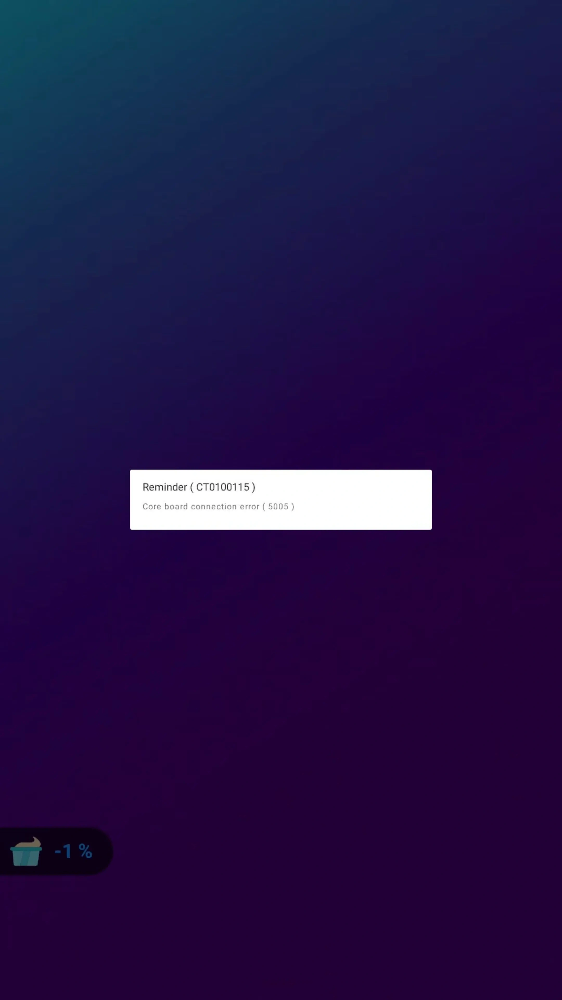
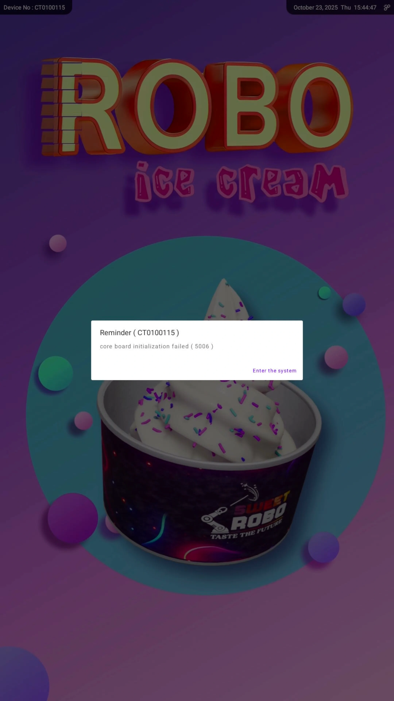
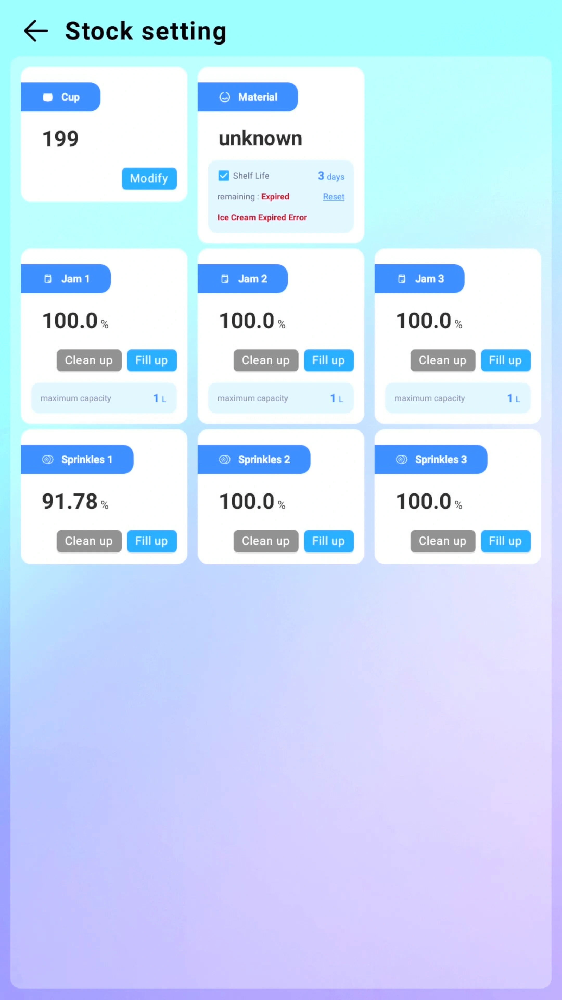
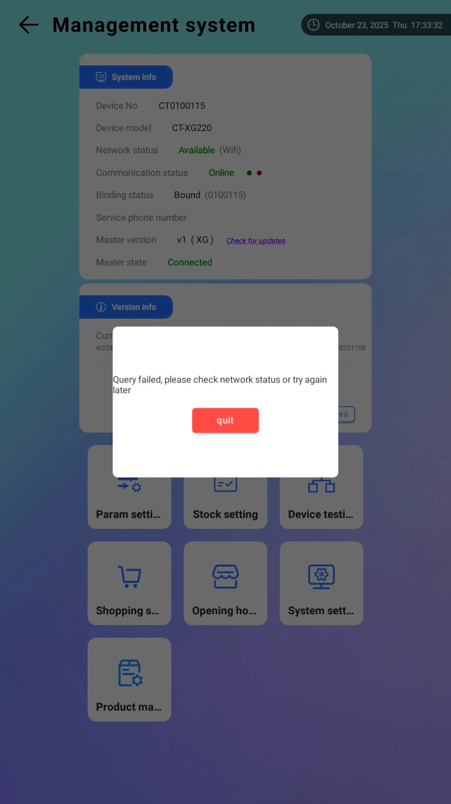
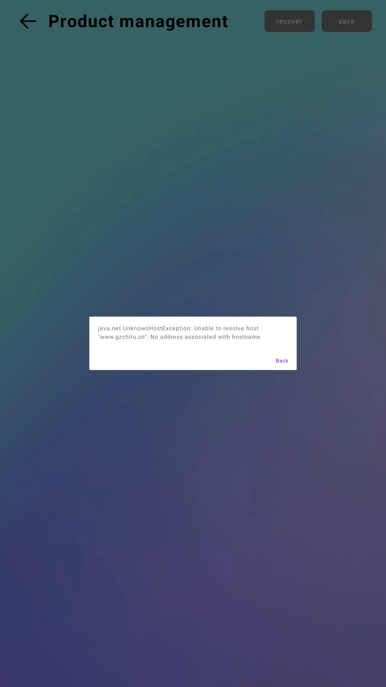
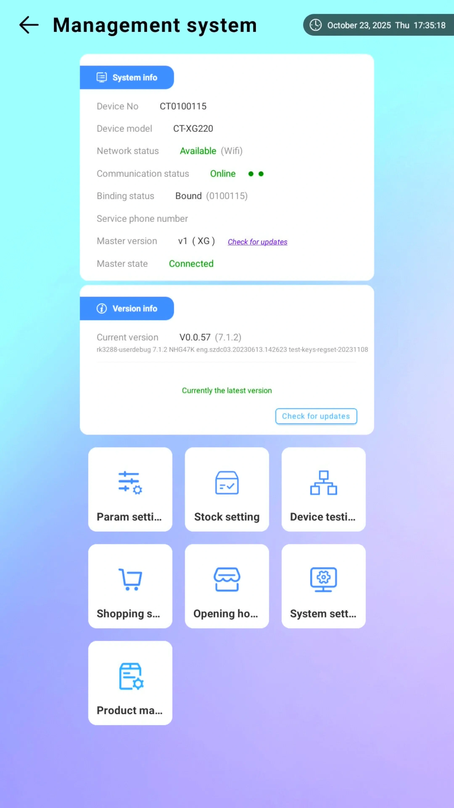

# Troubleshooting

This section provides step-by-step guidance for identifying and resolving common issues with your Robo Ice Cream F2 machine. For any unresolved problems, please contact Sweet Robo Support.

***

## Immediate Action Guidelines

**Safety First**

* **Always power down the machine** using the backend shutdown button and breaker before inspecting internal components.
* **Record the issue** and any unusual behavior or error codes to assist with support or warranty claims.

***

## Common Issues & Solutions

|                  **Issue**                 |               **Possible Cause**              |                                                           **Action Steps**                                                           |
| :----------------------------------------: | :-------------------------------------------: | :----------------------------------------------------------------------------------------------------------------------------------: |
|          Machine does not power on         |    Breaker off or timer is set incorrectly    |                                        Check breaker is ON and hardware timer is set properly                                        |
|       Screen is blank but power is on      |             Internal PC not booted            |                  Open service panel and press PC power button. If this keeps happening, contact Sweet Robo Support.                  |
|          Ice cream not dispensing          |       Hopper is empty or mix is too cold      |                                                 Check hopper level and run thaw cycle                                                |
|        "Mix Needs Replacement" alert       |      Mix temperature exceeded 5°C (41°F)      |                                Replace mix immediately, allow new mix to cool below 5°C before serving                               |
| Machine won't dispense despite mix present |  Temperature sensor detected unsafe mix temp  |                                          Check hopper temperature, replace mix if above 5°C                                          |
|              Cup not dropping              |          Cup tube is empty or jammed          |                                              Refill cup tubes, run test drop in backend                                              |
|        Dispensing door does not open       |         Sensor blocked or door jammed         |                                          Clear obstructions, restart door motor via backend                                          |
|              Topping not added             |      Empty container or blocked dispenser     | Refill and clean topping container (see [Cleaning Procedure](maintenance.html#complete-3-step-cleaning-procedure)), test via backend |
|            Syrup not dispensing            |          Tubing clogged or bag empty          |       Clean tubing (see [Cleaning Procedure](maintenance.html#complete-3-step-cleaning-procedure)), replace syrup bag, run test      |
|      Machine freezing or unresponsive      | Overloaded system or background process stuck |                                            Perform full restart via backend, then breaker                                            |

### Machine Won't Make Ice Cream After Power On

**Symptom:** Machine is on but not producing ice cream\
\
**Cause:** Machine needs time to reach operating temperature

**Solution:** • After turning on power and refrigeration switch, wait 5-10 minutes • Check hopper status on screen (Left: 100% or Right: 100% indicates ready) • Machine will only dispense once internal temperature is cold enough

**Solution:** Wait 5-10 minutes after power on. Check hopper status (L/R: 100% = ready). Machine must reach operating temp.

### Core Board Error

 

Left: Core board connection error (5005) | Right: Core board initialization error (5006)

\*\*Core Board Error - EMERGENCY:\*\* Turn OFF immediately → Fill hoppers 2L+ → Switch on hoppers → Restart machine

**Symptom:** "Core board error" message on screen, loud grinding noise\
\
**Cause:** Hopper turned on without liquid, causing metal-on-metal contact

Solution:**Immediately turn off the machine**Fill each hopper with at least 2 liters of prepared mix (3L water + 1 gelato mix packet)Turn on the hopper switch (located on bottom of hopper)Turn on the machineError should clear once liquid is detected**Solution:** 1) Turn OFF immediately 2) Fill hoppers with 2L+ mix 3) Turn on hopper switches 4) Turn on machine 5) Error clears when liquid detected

**Prevention:** Always fill hoppers before turning on machine

### Mix Temperature Alert - "Mix Needs Replacement"

Stock setting screen showing expired mix error requiring immediate attention

**Symptom:** Display shows "Mix Needs Replacement" and machine won't dispense\
\
**Cause:** Hopper temperature sensor detected mix temperature above 5°C (41°F)

Immediate Actions:Stop operation immediately - do NOT attempt to overrideCheck which hopper(s) are affected (Left or Right display)Dispose of affected mix following food safety guidelinesClean and sanitize the affected hopper using the [3-Step Cleaning Procedure](maintenance.html#complete-3-step-cleaning-procedure)Refill with fresh, properly chilled mixAllow mix to cool below 5°C before resuming operationMonitor temperature display until it shows normal operation**Actions:** 1) Stop immediately 2) Check affected hoppers 3) Dispose mix safely 4) Clean/sanitize 5) Refill with chilled mix 6) Cool <5°C 7) Monitor temp

**Prevention:**

* Monitor hopper temperatures regularly during operation
* Ensure refrigeration system is functioning properly
* Never leave mix at room temperature
* Check door seals for proper closure
* Verify ventilation is adequate around the machine

### Cup Dispenser Issues

**Symptom:** Cup doesn't drop when customer orders

Solution:Access backend: Tap and hold top-right corner for 3-5 seconds, enter default password\
(See [Backend Management](operation.html#operator-interface-and-backend-management) for details)Navigate to Device TestingTry these functions:\
• "Cup Out" - dispenses one cup\
• "Reset Cup Holder" - realigns the systemCheck that cups are:\
• Loaded correctly in tubes\
• Properly aligned\
• Not jammed or stuck together

### Syrup Not Dispensing

**Symptom:** Syrup pumps activate but no syrup comes out

Solution:Access backend (see [Backend Management](operation.html#operator-interface-and-backend-management))Go to Stock Settings menuVerify stock levels are set correctlyNavigate to Parameter SettingsFind Syrup 1, 2, 3 optionsPlace a cup under syrup tipPress play/test for each syrupRun multiple times until syrup flows (air bubbles may need clearing)

**Alternative test:**

* Go to Device Testing → Jams/Sprinkles Test
* Test each syrup dispenser manually

### Toppings Not Dispensing

**Symptom:** Topping dispensers activate but nothing comes out

**Solution:** • Check Stock Settings for correct levels • Ensure using only dry, solid toppings (no chunks or thick sauces) • Test via Device Testing → Jams/Sprinkles Test • Check for clogs in dispenser mechanism

**Solution:** Check stock levels, use only dry toppings, test via Device Testing, check for clogs.

### Hopper Readiness Display

**What "L: 100%" or "R: 100%" means:**

* L = Left hopper readiness status
* R = Right hopper readiness status
* 100% = Mix at optimal serving temperature, ready to dispense
* Lower percentages = Mix still cooling to target temperature

### Machine Not Accepting Payment

Nayax Reader Issues:

**Nayax Reader Issues:** • Ensure Nayax is properly installed behind cash box • Check COM2 connection to machine • Verify marshal cover is in place • Complete Nayax registration if not done • Contact Nayax support if error persists

**Nayax Issues:** Check installation, COM2 connection, marshal cover, registration. Contact Nayax support if needed.

### Device Idle and Diagnostic States

Understanding different screen states helps with troubleshooting:

 

Left: Device idle state with task buttons | Right: Task selection interface for diagnostics

**Idle Screen State:**

* Black screen with "RES TASK" buttons indicates device is in diagnostic mode
* This is normal during testing or troubleshooting
* Exit diagnostic mode by restarting the application

**Task Selection Screen:**

* Shows available diagnostic tasks (TASK 1, 2, 3)
* Used for component-level testing
* Access via backend Device Testing menu

### WiFi Connection Problems

 

Left: Network query failure error | Right: Hostname resolution error (UnknownHostException)

Solution:Access backend (see [Backend Management](operation.html#operator-interface-and-backend-management))Go to System SettingsLook at bottom right corner (buttons may be hard to see)Press "Exit App" to access Android settingsConnect to WiFi through Android WiFi settingsReturn to the app

Android WiFi settings screen accessed via "Exit App" button

### Mix Not Freezing Properly

**Possible Causes:**

* Insufficient mix in hopper (needs minimum 2L)
* Cooling not activated in settings
* Mix ratio incorrect (should be 3L water to 1 packet)

Solution:Verify at least 2L of mix in each hopperAccess Parameter SettingsFind ice cream options: "Clean", "Cool", "Thaw"Select "Cooling" optionAllow 5-10 minutes for proper cooling**Solution:** 1) Verify 2L+ mix 2) Access Parameter Settings 3) Select "Cooling" 4) Wait 5-10 minutes

### Emergency Shutdown

Proper shutdown procedure:

**Procedure:** • Switch off main power to ice cream machine • Use breaker switch to cut power • **Never unplug machine while running**

**Shutdown:** 1) Switch off main power 2) Use breaker switch 3) Never unplug while running

***

## Error Codes

The F2 system displays specific error codes for various conditions. Below are common error codes and their resolutions:

### System Error Codes

| **Error Code**               | **Description**                   | **Cause**                                          | **Resolution**                                                                                                                                                                                       |
| ---------------------------- | --------------------------------- | -------------------------------------------------- | ---------------------------------------------------------------------------------------------------------------------------------------------------------------------------------------------------- |
| **Core Board Error**         | Grinding noise with error display | No mix in hoppers or hopper switches not activated | 
1. Turn OFF immediately 2. Verify both hoppers have mix 3. Check hopper switches are pressed 4. Restart machine
                                                                      |
| **Low Voltage Alarm**        | Voltage below 195V detected       | Inadequate power supply                            | 
1. Check building power supply 2. Verify breaker rating (20A minimum) 3. Contact electrician if persistent
                                                                              |
| **High Voltage Alarm**       | Voltage above 255V detected       | Excessive voltage supply                           | 
1. Disconnect power immediately 2. Contact electrician 3. Do not operate until resolved
                                                                                                 |
| **Mix Needs Replacement**    | Temperature above 41°F (5°C)      | Mix temperature exceeded safe limit                | 
1. Discard affected mix 2. Follow <a href="maintenance.html#complete-3-step-cleaning-procedure">3-Step Cleaning Procedure</a> 3. Refill with fresh mix 4. Wait for cooling below 5°C
 |
| **Temperature Sensor Error** | Sensor reading failure            | Faulty temperature sensor                          | 
1. Check sensor connections 2. Clean sensor area per <a href="maintenance.html#complete-3-step-cleaning-procedure">Cleaning Procedure</a> 3. Contact support if persistent
              |
| **Door Sensor Error**        | Door not responding               | Blocked or misaligned sensor                       | 
1. Clear any obstructions 2. Check door alignment 3. Test manual door operation in backend
                                                                                              |
| **Cup Tube Empty**           | No cups in active tube            | Cup supply depleted                                | 
1. Refill cup tubes 2. Run manual drop test 3. Verify auto-switching to next tube
                                                                                                       |

### Backend Error Log Access

Management system menu showing navigation to System Settings

#### Access Error History

Access backend and navigate to System Settings → Error Log Viewer\
(See [Backend Management](operation.html#operator-interface-and-backend-management) for access instructions)

#### Record Error Details

Note the error code, timestamp, and frequency

#### Clear Non-Critical Errors

Use "Repair" button to clear cache and restart program if needed

#### Export for Support

If errors persist, export log for Sweet Robo support team

System settings screen showing Repair button for clearing cache and restarting

***

## When to Contact Support

Contact Sweet Robo Support if you experience any of the following:

* You suspect internal electrical failure or broken hardware
* Error codes persist after rebooting
* Sensors, motors, or dispensers are not responding
* The machine behaves erratically or inconsistently
* You've attempted the above troubleshooting steps without resolution
* Unusual noises continue after filling hoppers
* Refrigeration system not cooling after 30 minutes
* Physical damage to components

Always include the machine **model** (F2), **serial number**, and a **brief description** of the issue when contacting support.

***

## Support Contact Information

We provide 24/7 assistance with any technical issues you may be experiencing. Our team is available to provide you with the support you need to ensure a smooth and seamless product experience.

If you're experiencing any difficulties or have questions about our product, please don't hesitate to reach out. We're here to help and will do our best to resolve your issue as quickly as possible.

**Sweet Robo Customer Support**

• **Email:** [support@sweetrobo.com](mailto:support@sweetrobo.com)\
• **Phone:** +1-844-793-3872\
• **Hours:** 24/7 support available

**Have your machine information ready**

• Machine model: F2\
• Serial number (found in backend settings)\
• Software version\
• Description of the issue

***

## Manual Feedback

For feedback or suggestions about this manual, see [Company Information](../shared/company-info.md#manual-feedback).

**Access Online Manual:**\
https://manuals.sweetrobo.com/robo-ice-cream/Online Manual

***

## Error Prevention Tips

**Prevention Tips:** • **Always fill hoppers before starting** - Prevents core board error • **Use correct mix ratio** - 3L water to 1 gelato bag (check package) • **Maintain minimum levels** - At least 2L per hopper • **Follow cleaning schedule** - Complete [3-Step Cleaning Procedure](maintenance.html#complete-3-step-cleaning-procedure) every 3 days • **Check expiration dates** - Both on packets and in system • **Regular testing** - Use Device Testing weekly to ensure all systems work • **Proper shutdown procedures** - Use backend shutdown and breaker switch • **Record issues** - Keep a log of any problems for warranty claims

**Prevention:** Fill hoppers before starting • 3L:1 mix ratio • 2L+ per hopper • Clean every 3 days • Check expiration dates • Weekly testing • Proper shutdown • Log issues
